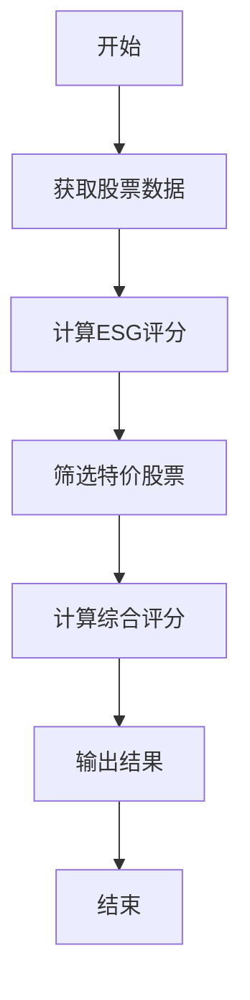
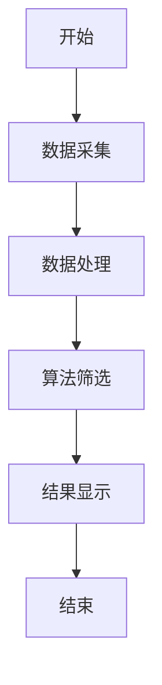
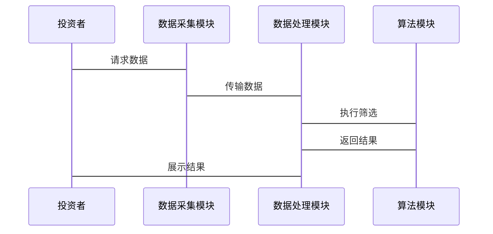

                 


# 如何将特价股票策略与ESG投资理念结合

## 关键词
特价股票策略, ESG投资理念, 可持续投资, 价值投资, 量化分析, 人工智能

## 摘要
本文详细探讨了如何将特价股票策略与ESG投资理念相结合，以实现长期价值投资与可持续投资的目标。通过分析特价股票策略与ESG投资的核心概念、算法原理、系统架构及项目实战，为投资者提供了一套结合价值与可持续性的投资策略。

---

# 第一部分：特价股票策略与ESG投资理念结合的背景与意义

## 第1章：特价股票策略与ESG投资概述

### 1.1 特价股票策略的基本概念
#### 1.1.1 特价股票的定义与特征
- **定义**：特价股票指市场价格低于其内在价值的股票，通常被认为具有长期增值潜力。
- **特征**：
  - 低估值：市盈率、市净率等估值指标低于行业平均水平。
  - 高分红：股息收益率较高，适合价值投资者。
  - 逆周期性：在市场低迷时表现相对稳定。

#### 1.1.2 特价股票策略的核心思想
- **核心思想**：寻找市场低估的优质企业，长期持有，等待价值回归。
- **策略优势**：
  - 低买高卖：在市场低估时买入，市场高估时卖出。
  - 风险较低：通常选择基本面稳健的企业，抗跌性强。

#### 1.1.3 特价股票策略在投资中的地位
- **地位**：价值投资的重要策略之一，尤其适合长期投资者。

### 1.2 ESG投资理念的内涵
#### 1.2.1 ESG概念的定义与内涵
- **定义**：ESG指环境、社会和治理三个维度的综合评估，衡量企业社会责任和可持续发展能力。
- **内涵**：
  - 环境（E）：关注企业的碳排放、资源利用效率等。
  - 社会（S）：关注企业的员工权益、社区贡献等。
  - 治理（G）：关注企业的公司治理结构、透明度等。

#### 1.2.2 ESG投资的核心要素
- **核心要素**：
  - 环境：清洁能源使用、环保措施。
  - 社会：员工福利、社会责任。
  - 治理：董事会结构、高管薪酬。

#### 1.2.3 ESG投资与传统投资的区别
- **区别**：
  - 传统投资：主要关注财务指标和市场表现。
  - ESG投资：综合考虑环境、社会和治理因素，注重长期可持续发展。

### 1.3 特价股票与ESG投资的结合意义
#### 1.3.1 结合的背景与必要性
- **背景**：全球气候变化、社会不平等和公司治理问题日益突出，投资者关注企业社会责任。
- **必要性**：通过结合ESG因素，优化特价股票策略，提升投资的可持续性和长期价值。

#### 1.3.2 结合的理论基础
- **理论基础**：价值投资与可持续投资的结合，实现长期稳健回报。

#### 1.3.3 结合的实际应用价值
- **实际应用价值**：筛选出具有长期价值和可持续性的特价股票，提升投资组合的抗风险能力。

---

## 第2章：特价股票策略与ESG投资的核心概念与联系

### 2.1 特价股票策略的核心概念
#### 2.1.1 特价股票的筛选标准
- **筛选标准**：
  - 市盈率（P/E）低于行业平均水平。
  - 市净率（P/B）低于行业平均水平。
  - 高股息收益率。

#### 2.1.2 特价股票的估值方法
- **估值方法**：
  - 市盈率法：P/E < 行业平均水平。
  - 市净率法：P/B < 行业平均水平。
  - 内在价值法：DCF模型估算。

#### 2.1.3 特价股票策略的风险与收益分析
- **风险**：
  - 价值陷阱：企业基本面恶化，股价长期低迷。
  - 市场波动：短期内股价可能继续下跌。
- **收益**：
  - 长期价值回归：股价回升带来的收益。
  - 高股息收益：稳定的股息收入。

### 2.2 ESG投资的核心概念
#### 2.2.1 ESG评分体系
- **评分体系**：
  - 环境：碳排放、资源利用效率。
  - 社会：员工权益、社区贡献。
  - 治理：公司治理结构、高管薪酬。

#### 2.2.2 ESG投资的筛选标准
- **筛选标准**：
  - ESG评分高于行业平均水平。
  - 环境表现优秀：低碳排放、环保措施。
  - 社会责任强：员工福利、社区贡献。
  - 治理透明：董事会结构合理、高管薪酬透明。

#### 2.2.3 ESG投资的风险与收益分析
- **风险**：
  - 短期表现不佳：ESG评分高的企业可能短期股价表现平平。
  - ESG评分变化：企业ESG表现可能因政策或管理变化而波动。
- **收益**：
  - 长期可持续发展：ESG表现优秀的企业具有更强的抗风险能力。
  - 社会责任投资回报：长期来看，ESG表现优秀的企业可能有更高的股价表现。

### 2.3 特价股票与ESG投资的联系
#### 2.3.1 特价股票与ESG评分的关联
- **关联**：ESG评分高的企业可能因为市场低估而成为特价股票。

#### 2.3.2 ESG因素对股票价值的影响
- **影响**：ESG因素可能影响企业的长期价值，进而影响股价。

#### 2.3.3 ESG投资如何优化特价股票策略
- **优化**：
  - 通过ESG评分筛选出具有长期价值的特价股票。
  - 避免价值陷阱：选择ESG表现良好的企业。

---

## 第3章：特价股票与ESG投资结合的核心概念对比与ER实体关系图

### 3.1 特价股票与ESG投资的核心概念对比
#### 3.1.1 概念对比表格
| 对比维度 | 特价股票策略 | ESG投资理念 |
|----------|--------------|-------------|
| 定义     | 价格低于内在价值的股票 | 环境、社会、治理因素综合评估 |
| 核心要素 | 市盈率、市净率、股息率 | ESG评分、碳排放、员工权益 |
| 目标     | 寻找低估股票 | 寻找可持续发展企业 |
| 风险     | 价值陷阱、市场波动 | ESG评分变化、短期表现不佳 |
| 收益     | 长期价值回归、股息收益 | 长期可持续发展、社会责任回报 |

#### 3.1.2 属性特征对比
- **属性特征**：
  - 特价股票策略：关注价格与价值的匹配。
  - ESG投资理念：关注企业社会责任和可持续发展。

#### 3.1.3 核心要素对比
- **核心要素**：
  - 特价股票策略：市盈率、市净率、股息率。
  - ESG投资理念：E、S、G评分。

### 3.2 ER实体关系图
```mermaid
er
  投资者
  特价股票
  ESG评分
  估值模型
  relation1: 投资者 -> 特价股票
  relation2: 投资者 -> ESG评分
  relation3: 特价股票 -> 估值模型
  relation4: ESG评分 -> 估值模型
```

---

## 第4章：特价股票与ESG投资结合的算法原理

### 4.1 算法原理概述
#### 4.1.1 算法目标
- **目标**：筛选出符合特价股票策略且ESG评分高的股票。

#### 4.1.2 算法输入
- **输入**：
  - 股票数据：包括市盈率、市净率、股息率等。
  - ESG评分：包括环境、社会、治理评分。

#### 4.1.3 算法输出
- **输出**：符合特价股票策略且ESG评分高的股票列表。

### 4.2 算法流程


### 4.3 算法数学模型与公式
#### 4.3.1 综合评分公式
$$
\text{综合评分} = \alpha \times \text{市盈率} + \beta \times \text{ESG评分}
$$
其中，$\alpha$ 和 $\beta$ 是权重系数，根据实际情况调整。

#### 4.3.2 特价股票筛选公式
$$
\text{市盈率} < \text{行业平均市盈率} \quad \text{且} \quad \text{ESG评分} > \text{行业平均ESG评分}
$$

---

## 第5章：系统分析与架构设计方案

### 5.1 项目介绍
- **项目目标**：构建一个结合特价股票策略与ESG投资的系统，帮助投资者筛选出符合两者条件的股票。

### 5.2 系统功能设计
#### 5.2.1 功能模块
- **数据采集模块**：采集股票数据和ESG评分。
- **数据处理模块**：计算市盈率、市净率、ESG评分等。
- **算法模块**：筛选符合特价股票策略且ESG评分高的股票。
- **结果显示模块**：展示筛选结果。

#### 5.2.2 功能流程图


### 5.3 系统架构设计
#### 5.3.1 架构图


### 5.4 系统接口设计
#### 5.4.1 接口描述
- **输入接口**：股票数据和ESG评分。
- **输出接口**：筛选结果。

#### 5.4.2 接口流程图


---

## 第6章：项目实战

### 6.1 环境安装
- **工具**：Python、Pandas、NumPy、Matplotlib。
- **数据来源**：Yahoo Finance API、ESG评分数据。

### 6.2 系统核心实现源代码
```python
import pandas as pd
import numpy as np

# 数据采集模块
def get_stock_data(tickers):
    # 从Yahoo Finance获取数据
    pass

# 数据处理模块
def calculate_esg_score(data):
    # 计算ESG评分
    pass

# 算法模块
def screen_stocks(data, esg_scores):
    # 筛选符合特价股票策略且ESG评分高的股票
    pass

# 结果显示模块
def display_results(results):
    # 展示筛选结果
    pass
```

### 6.3 代码应用解读与分析
- **解读**：
  - 数据采集模块：从Yahoo Finance获取股票数据。
  - 数据处理模块：计算市盈率、市净率、ESG评分。
  - 算法模块：筛选符合特价股票策略且ESG评分高的股票。
  - 结果显示模块：展示筛选结果。

### 6.4 实际案例分析
#### 6.4.1 案例背景
- **案例**：假设当前市场环境下，寻找市盈率低于行业平均水平且ESG评分高于行业平均水平的股票。

#### 6.4.2 数据分析与计算
- **数据分析**：
  - 计算行业平均市盈率和平均ESG评分。
  - 筛选出市盈率低于行业平均且ESG评分高于行业平均的股票。

#### 6.4.3 结果展示
- **结果展示**：输出符合条件的股票列表。

### 6.5 项目小结
- **小结**：通过实际案例分析，验证了算法的有效性，筛选出的股票既符合特价股票策略，又具有较高的ESG评分。

---

## 第7章：最佳实践、小结、注意事项、拓展阅读

### 7.1 最佳实践
- **最佳实践**：
  - 定期更新数据，确保筛选结果的准确性。
  - 结合市场变化，动态调整筛选条件。
  - 多因素分析，综合考虑其他因素（如行业趋势、宏观经济指标）。

### 7.2 小结
- **小结**：通过本文的探讨，投资者可以将特价股票策略与ESG投资理念结合，筛选出具有长期价值和可持续性的股票，实现稳健的投资回报。

### 7.3 注意事项
- **注意事项**：
  - 数据准确性：确保数据来源可靠。
  - 模型局限性：算法可能无法覆盖所有因素，需结合实际情况调整。
  - 风险控制：制定合理的风险控制策略，避免过度集中投资。

### 7.4 拓展阅读
- **拓展阅读**：
  - 阅读更多关于价值投资和可持续投资的书籍和文献。
  - 关注ESG投资的相关研究和实践案例。

---

通过以上目录结构，我们可以系统地探讨如何将特价股票策略与ESG投资理念结合，从理论到实践，为投资者提供一套科学、合理的投资策略。

