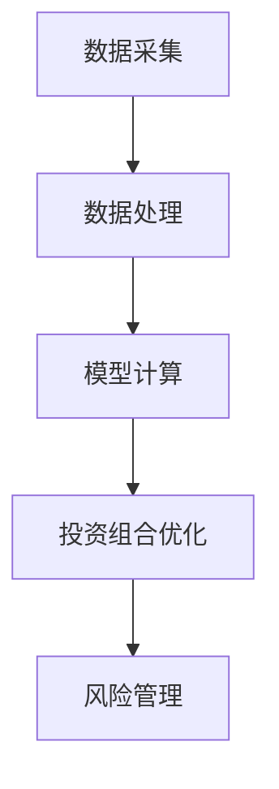

                 


# 如何将特价股票策略与价值成长投资相结合

> 关键词：特价股票策略、价值成长投资、投资策略、风险管理、数学模型、系统架构

> 摘要：本文系统地探讨了如何将特价股票策略与价值成长投资相结合，从背景介绍、核心概念、结合策略、数学模型、系统架构到项目实战，全面分析了两者结合的可行性、方法和优势。通过详细的理论分析和实际案例，本文为投资者提供了科学的投资策略和系统化的解决方案。

---

# 第一部分: 特价股票策略与价值成长投资的背景介绍

## 第1章: 特价股票策略与价值成长投资的背景介绍

### 1.1 特价股票策略的基本概念
#### 1.1.1 特价股票的定义
特价股票是指市场价格低于其内在价值的股票，通常具有较高的安全边际，适合长期投资者。

#### 1.1.2 特价股票的特点
- 价格被市场低估
- 具备良好的基本面
- 投资风险相对较低

#### 1.1.3 特价股票与普通股票的区别
| 属性 | 特价股票 | 普通股票 |
|------|----------|----------|
| 价格 | 低于内在价值 | 可能高于或低于内在价值 |
| 风险 | 较低 | 较高 |
| 收益 | 较高 | 较不稳定 |

### 1.2 价值成长投资的基本概念
#### 1.2.1 价值投资的定义
价值投资是一种以低于内在价值的价格买入优质股票的投资策略，注重公司基本面和长期价值。

#### 1.2.2 成长投资的定义
成长投资是指投资于具有持续增长潜力的公司，注重公司的成长性和未来收益。

#### 1.2.3 价值投资与成长投资的对比
| 属性 | 价值投资 | 成长投资 |
|------|----------|----------|
| 投资目标 | 买入低于价值的股票 | 投资高成长性公司 |
| 风险 | 较低 | 较高 |
| 持股时间 | 长期 | 中长期 |

### 1.3 特价股票策略与价值成长投资的结合意义
#### 1.3.1 结合的必要性
- 利用特价股票的低估值优势
- 结合成长投资的长期收益潜力

#### 1.3.2 结合的优势
- 降低投资风险
- 提高投资收益

#### 1.3.3 结合的潜在风险
- 市场波动风险
- 公司基本面变化风险

### 1.4 本章小结
通过本章的介绍，我们了解了特价股票策略和价值成长投资的基本概念及其结合的意义。

---

# 第二部分: 特价股票策略的核心概念与分析

## 第2章: 特价股票策略的核心概念与分析

### 2.1 特价股票的分类与特征
#### 2.1.1 市盈率（P/E）分析
市盈率是衡量股票价值的重要指标，P/E < 市场平均值时，股票可能被低估。

#### 2.1.2 市净率（P/B）分析
市净率是股价与每股净资产的比率，P/B < 1时，股票可能被低估。

#### 2.1.3 市销率（P/S）分析
市销率是股价与每股销售收入的比率，P/S < 行业平均值时，股票可能被低估。

### 2.2 特价股票的筛选方法
#### 2.2.1 基本面分析法
分析公司的财务报表，寻找基本面良好、估值低的公司。

#### 2.2.2 技术分析法
通过技术指标如RSI、MACD等判断股票的买卖信号。

#### 2.2.3 综合分析法
结合基本面和技术分析，综合判断股票的投资价值。

### 2.3 特价股票策略的风险管理
#### 2.3.1 风险的定义与分类
- 系统性风险：市场波动等
- 非系统性风险：公司-specific风险

#### 2.3.2 风险的量化方法
- 使用波动率指标（Volatility）
- 通过历史数据分析风险

#### 2.3.3 风险控制策略
- 设置止损点
- 分散投资

### 2.4 本章小结
本章详细分析了特价股票的分类、筛选方法及风险管理策略。

---

# 第三部分: 价值成长投资的核心概念与分析

## 第3章: 价值成长投资的核心概念与分析

### 3.1 价值投资的核心要素
#### 3.1.1 公司基本面分析
分析公司的收入、利润、资产负债等财务指标。

#### 3.1.2 行业地位分析
分析公司在行业中的竞争地位。

#### 3.1.3 财务状况分析
分析公司的财务健康状况，如现金流、负债率等。

### 3.2 成长投资的核心要素
#### 3.2.1 公司成长性分析
分析公司的收入和利润增长率。

#### 3.2.2 行业发展趋势分析
分析行业的发展前景。

#### 3.2.3 市场前景分析
分析市场需求和市场容量。

### 3.3 价值与成长投资的结合点
#### 3.3.1 高成长低估值的公司
寻找具有高成长潜力但估值低的公司。

#### 3.3.2 高质量成长公司的识别
分析公司的ROE、ROA等指标。

#### 3.3.3 价值陷阱与成长陷阱的区分
- 价值陷阱：基本面差但估值低的公司
- 成长陷阱：高成长但估值过高的公司

### 3.4 本章小结
本章探讨了价值与成长投资的结合点及如何避免投资陷阱。

---

# 第四部分: 特价股票策略与价值成长投资的结合策略

## 第4章: 特价股票策略与价值成长投资的结合策略

### 4.1 结合策略的制定原则
#### 4.1.1 风险与收益的平衡
在追求收益的同时控制风险。

#### 4.1.2 长期与短期目标的结合
结合短期投资和长期投资目标。

#### 4.1.3 灵活性与纪律性的统一
根据市场变化灵活调整策略，但保持纪律性。

### 4.2 结合策略的具体实施方法
#### 4.2.1 基于价值的成长投资策略
选择基本面良好、估值低且具有成长潜力的公司。

#### 4.2.2 基于成长的价值投资策略
选择成长性好且估值合理的公司。

#### 4.2.3 组合投资策略
将价值和成长投资策略结合起来，分散投资风险。

### 4.3 结合策略的优化与调整
#### 4.3.1 定期评估与调整
定期评估投资组合的表现并进行调整。

#### 4.3.2 根据市场变化调整策略
根据市场环境变化调整投资策略。

#### 4.3.3 根据公司变化调整策略
根据公司基本面变化调整持仓。

### 4.4 本章小结
本章提出了将特价股票策略与价值成长投资相结合的具体策略，并强调了策略的灵活性和纪律性。

---

# 第五部分: 数学模型与系统架构

## 第5章: 数学模型与系统架构

### 5.1 特价股票与价值成长投资的数学模型
#### 5.1.1 特价股票筛选模型
使用P/E、P/B等指标构建多因子筛选模型。

#### 5.1.2 成长潜力评估模型
使用收入增长率、净利润增长率等指标评估公司成长潜力。

#### 5.1.3 组合优化模型
使用现代投资组合理论（MPT）优化投资组合。

### 5.2 系统架构设计
#### 5.2.1 系统功能设计
- 数据采集与处理模块
- 模型计算模块
- 投资组合优化模块
- 风险管理模块

#### 5.2.2 系统架构图


### 5.3 本章小结
本章介绍了数学模型和系统架构在投资策略中的应用。

---

# 第六部分: 项目实战与总结

## 第6章: 项目实战与总结

### 6.1 项目实战
#### 6.1.1 环境安装
安装Python、Pandas、NumPy等工具。

#### 6.1.2 核心代码实现
```python
import pandas as pd
import numpy as np

# 示例代码：筛选特价股票
def screen_cheap_stocks(data, threshold):
    return data[(data['P/E'] < threshold) & (data['P/B'] < threshold)]

# 示例代码：评估成长潜力
def assess_growth(data):
    return data[data['收入增长率'] > 10]
```

#### 6.1.3 案例分析
分析某行业的公司，筛选出符合策略的股票。

### 6.2 总结
#### 6.2.1 本章小结
通过实战案例，验证了策略的有效性。

#### 6.2.2 投资注意事项
- 定期复盘和调整
- 保持长期视角
- 风险控制

#### 6.2.3 未来拓展
进一步优化模型，结合更多因子。

### 6.3 本章小结
通过项目实战，我们验证了策略的有效性，并总结了投资经验。

---

# 第七部分: 风险管理与未来展望

## 第7章: 风险管理与未来展望

### 7.1 风险管理
#### 7.1.1 风险来源
- 市场风险
- 公司风险
- 操作风险

#### 7.1.2 风险控制措施
- 设置止损点
- 分散投资
- 定期评估投资组合

### 7.2 未来展望
#### 7.2.1 技术进步
- 大数据和人工智能在投资中的应用
- 自动化交易的发展

#### 7.2.2 市场变化
- 全球化带来的投资机会
- 新兴行业的发展

#### 7.2.3 投资者教育
- 提高投资者的金融素养
- 推广科学的投资方法

### 7.3 本章小结
本章探讨了投资中的风险管理及未来的发展趋势。

---

# 第八部分: 总结

## 第8章: 总结

### 8.1 本书总结
通过本书的学习，读者可以掌握如何将特价股票策略与价值成长投资相结合，实现稳健的投资收益。

### 8.2 投资理念
坚持价值投资，注重长期成长，灵活应对市场变化。

### 8.3 展望未来
随着技术和市场的进步，投资策略将不断创新，为投资者提供更多机会。

### 8.4 本章小结
总结全书内容，强调投资策略的科学性和实践性。

---

# 结语

通过系统的分析和实战案例，我们展示了如何将特价股票策略与价值成长投资相结合，为投资者提供了科学的投资方法和系统化的解决方案。希望本书能为投资者在复杂多变的市场中提供有益的指导。

