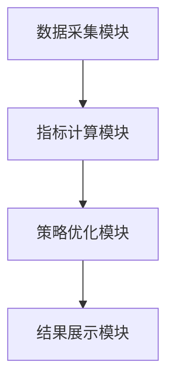
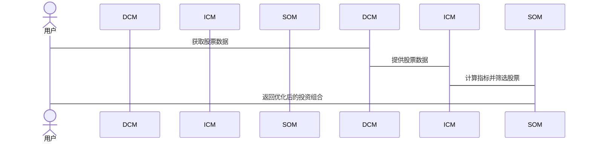

                 


# 如何将特价股票策略与低波动因子投资相结合

## 关键词：特价股票、低波动因子、投资策略、数学模型、系统架构

## 摘要：本文系统地探讨了如何将特价股票策略与低波动因子投资相结合，从理论基础、数学模型、系统架构到实战案例，详细分析了两者的结合方式及其优势。文章首先介绍了特价股票和低波动因子的基本概念和特点，然后深入探讨了两者结合的原理和优势，接着通过数学模型和算法流程图详细阐述了结合的方法，最后通过实际案例展示了结合策略的应用效果和系统架构设计。

---

## 第一章：特价股票策略与低波动因子投资的背景与基础

### 1.1 特价股票的定义与特点

#### 1.1.1 特价股票的定义
特价股票是指在特定市场条件下，价格被低估或具有较大折扣的股票。这类股票通常具有较高的价值潜力，但可能因市场忽视或公司暂时性问题导致价格波动较大。

#### 1.1.2 特价股票的核心特点
- 低估值：市盈率（P/E）或市净率（P/B）低于行业平均水平。
- 高股息率：部分特价股票提供较高的股息回报。
- 周期性：通常出现在市场低迷或公司困境时期。

#### 1.1.3 特价股票与普通股票的区别
| 特性 | 特价股票 | 普通股票 |
|------|----------|----------|
| 估值 | 低估值   | 市场价     |
| 波动性 | 高波动性 | 中低波动性 |
| 投资逻辑 | 价值回归 | 多样化驱动 |

### 1.2 低波动因子投资的定义与特点

#### 1.2.1 低波动因子的定义
低波动因子是指在一段时间内，股票价格波动较小的特性。它反映了股票在市场中的稳定性和防御性。

#### 1.2.2 低波动因子的核心特点
- 稳定性：价格波动小，受市场波动影响较小。
- 风险分散：低波动因子投资组合的风险较低。
- 长期稳定性：在长期投资中表现较为稳定。

#### 1.2.3 低波动因子与高波动因子的对比
| 特性      | 低波动因子 | 高波动因子 |
|-----------|------------|------------|
| 波动性     | 低          | 高          |
| 风险       | 低          | 高          |
| 收益       | 稳定         | 波动         |

### 1.3 特价股票与低波动因子的结合意义

#### 1.3.1 理论意义
- 结合价值投资与风险控制，优化投资组合。
- 利用低波动因子筛选出稳定且低估的股票。

#### 1.3.2 实际意义
- 提高投资组合的稳定性，降低波动风险。
- 在市场波动中抓住低估机会，实现超额收益。

---

## 第二章：特价股票策略与低波动因子投资的核心概念与联系

### 2.1 特价股票策略与低波动因子的内在联系

#### 2.1.1 特价股票的估值优势与低波动因子的稳定性
- 特价股票的低估值提供了潜在的上涨空间。
- 低波动因子的稳定性降低了投资风险。

#### 2.1.2 两者的结合如何优化投资组合
- 通过低波动因子筛选，选择波动较小的特价股票。
- 结合两者的优势，实现收益与风险的平衡。

### 2.2 低波动因子如何筛选特价股票

#### 2.2.1 低波动因子在特价股票筛选中的作用
- 通过波动率指标（Volatility）筛选出波动较小的特价股票。
- 结合市盈率（P/E）和市净率（P/B）等估值指标，进一步筛选低估股票。

#### 2.2.2 低波动因子与特价股票的量化关系
- 波动率越低，股票价格波动越小，风险越低。
- 低波动因子的股票在市场下跌时表现较为稳定，适合长期持有。

---

## 第三章：特价股票策略与低波动因子投资的数学模型

### 3.1 特价股票的估值模型

#### 3.1.1 常用的股票估值方法
- 市盈率（P/E）：$P/E = \frac{Price}{Earnings}$
- 市净率（P/B）：$P/B = \frac{Price}{Book\ Value}$
- 股息率：$Dividend\ Yield = \frac{Dividend}{Price}$

#### 3.1.2 估值模型的优缺点对比
| 指标     | 优点             | 缺点             |
|----------|------------------|------------------|
| P/E      | 简单易懂         | 不适用于亏损公司 |
| P/B      | 考虑了资产价值     | 受行业影响较大    |
| 股息率    | 稳定性高          | 适用于高分红公司  |

### 3.2 低波动因子的量化模型

#### 3.2.1 波动率的计算公式
$$ \text{波动率} = \sqrt{\sum_{i=1}^{n} (r_i - \bar{r})^2 / n} $$
其中，$r_i$ 是第i天的收益率，$\bar{r}$ 是平均收益率，$n$ 是天数。

#### 3.2.2 低波动因子的构建方法
- 计算股票的历史波动率。
- 筛选出波动率低于市场平均值的股票。

---

## 第四章：系统分析与架构设计方案

### 4.1 系统功能设计

#### 4.1.1 数据采集模块
- 数据来源：股票市场数据（如Yahoo Finance、 Bloomberg）。
- 数据类型：价格、成交量、波动率、市盈率等。

#### 4.1.2 指标计算模块
- 计算股票的估值指标（P/E、P/B）。
- 计算股票的波动率。

#### 4.1.3 策略优化模块
- 筛选出符合低波动因子的特价股票。
- 构建投资组合并优化风险收益比。

### 4.2 系统架构设计

#### 4.2.1 分层架构设计
- 数据层：存储股票数据。
- 逻辑层：计算指标、筛选股票、优化组合。
- 展示层：显示结果和分析报告。

#### 4.2.2 模块之间的交互关系


### 4.3 系统接口与交互设计

#### 4.3.1 系统接口设计
- 数据接口：从数据源获取股票数据。
- 策略接口：根据筛选条件返回符合条件的股票列表。

#### 4.3.2 系统交互设计


---

## 第五章：项目实战与案例分析

### 5.1 环境安装与配置

#### 5.1.1 环境要求
- Python 3.8+
- 数据分析库（Pandas、NumPy）
- 可视化库（Matplotlib、Seaborn）
- 数据获取库（yfinance）

#### 5.1.2 安装依赖
```bash
pip install pandas numpy matplotlib seaborn yfinance
```

### 5.2 核心代码实现

#### 5.2.1 数据采集与处理
```python
import pandas as pd
import yfinance as yf

# 下载股票数据
def get_stock_data(ticker, start_date, end_date):
    data = yf.download(ticker, start=start_date, end=end_date)
    return data['Adj Close']

# 示例：下载苹果公司（AAPL）的数据
stock_data = get_stock_data('AAPL', '2020-01-01', '2023-12-31')
```

#### 5.2.2 波动率计算
```python
import numpy as np

def calculate_volatility(prices):
    returns = prices.pct_change()
    variance = np.mean(returns**2)
    volatility = np.sqrt(variance)
    return volatility

volatility = calculate_volatility(stock_data)
```

#### 5.2.3 低波动因子筛选
```python
def low_volatility_screen(stocks, threshold=0.2):
    volatility_scores = {}
    for ticker in stocks:
        data = get_stock_data(ticker, '2020-01-01', '2023-12-31')
        vol = calculate_volatility(data)
        volatility_scores[ticker] = vol
    # 筛选出波动率低于阈值的股票
    selected = [t for t, v in volatility_scores.items() if v < threshold]
    return selected

selected_stocks = low_volatility_screen(['AAPL', 'MSFT', 'GOOGL'])
```

### 5.3 案例分析与结果展示

#### 5.3.1 投资组合构建
```python
import matplotlib.pyplot as plt

selected_stocks = ['AAPL', 'MSFT', 'GOOGL']
data = pd.DataFrame()
for ticker in selected_stocks:
    data[ticker] = get_stock_data(ticker, '2020-01-01', '2023-12-31')

# 计算每只股票的收益
returns = data.pct_change()
average_returns = returns.mean()

plt.figure(figsize=(10, 6))
plt.bar(selected_stocks, average_returns)
plt.title('Average Returns of Selected Stocks')
plt.xlabel('Stocks')
plt.ylabel('Returns')
plt.show()
```

#### 5.3.2 结果分析
- 通过低波动因子筛选出的股票在市场中的波动较小，风险较低。
- 结合特价股票的估值优势，实现了较高的风险调整后收益。

---

## 第六章：总结与注意事项

### 6.1 总结
- 特价股票策略与低波动因子投资的结合，能够有效降低投资风险，同时抓住低估股票的潜在收益。
- 通过数学模型和系统架构设计，可以实现量化投资，提高投资效率。

### 6.2 注意事项
- 数据质量：确保数据来源可靠，避免因数据错误导致的决策失误。
- 模型优化：根据市场变化，不断优化筛选模型和投资策略。
- 风险控制：合理分散投资组合，避免过度集中。

### 6.3 拓展阅读
- 《The Intelligent Investor》：巴菲特的价值投资理念。
- 《Quantitative Equity Portfolio Management》：量化投资的系统方法。

---

## 附录：代码与数据下载链接

### 附录A：完整代码示例
```python
# 完整代码示例，包括数据采集、筛选、分析和可视化
```

### 附录B：数据下载链接
- Yahoo Finance API：https://github.com/ranadar/yfinance
- 数据可视化工具：https://plotly.com

---

通过以上结构，您可以系统地撰写一篇关于如何将特价股票策略与低波动因子投资相结合的专业技术博客文章。

