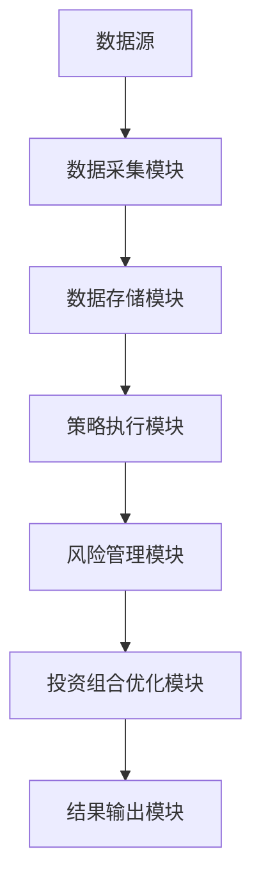

                 


# 如何将特价股票策略与其他投资策略结合

## 关键词：特价股票策略、投资策略、风险管理、收益优化、算法交易

## 摘要：
在股票投资中，特价股票策略与其他投资策略的结合能够有效降低风险、提高收益。本文通过详细分析特价股票策略的基本原理、其他投资策略的核心概念，探讨它们结合的意义、数学模型和系统架构设计，并通过实际案例展示如何将策略结合应用于投资实战。文章最后总结了结合策略的最佳实践，为投资者提供了科学的投资方法。

---

# 第一部分：特价股票策略与其他投资策略概述

## 第1章：特价股票策略的基本概念

### 1.1 特价股票的定义与特点

特价股票是指在特定市场条件下，价格被低估的股票。这些股票可能因为市场波动、公司暂时性问题或其他因素导致价格低于其内在价值。以下是特价股票的主要特点：

- **低估价格**：股票价格低于其真实价值。
- **高潜在回报**：投资者有机会在价格回升时获利。
- **风险较高**：通常伴随着较高的波动性和不确定性。
- **周期性**：特价股票往往出现在市场低迷或公司困境时期。

### 1.2 特价股票的投资价值

投资特价股票的核心在于识别被市场低估的公司。投资者需要分析公司的基本面，如财务状况、盈利能力、行业地位等，以确定其潜在价值。以下是一个简单的特价股票识别模型：

1. **市盈率（P/E）分析**：P/E < 行业平均值。
2. **市净率（P/B）分析**：P/B < 1。
3. **股息率**：高股息率且稳定增长。
4. **行业地位**：公司处于行业龙头地位。

### 1.3 特价股票策略的应用场景

- **市场低迷期**：投资者可以在市场底部买入被低估的股票。
- **行业整合期**：行业内整合可能导致部分公司股价被低估。
- **突发事件影响**：公司遭遇突发事件导致股价短期下跌。

---

## 第2章：其他主要投资策略概述

### 2.1 价值投资策略

价值投资策略强调购买被市场低估的股票，并长期持有，等待其价值回归。以下是价值投资的核心要素：

- **基本面分析**：分析公司的财务报表、盈利能力和成长潜力。
- **安全边际**：买入价格低于内在价值。
- **长期持有**：不因短期波动而改变投资决策。

### 2.2 趋势投资策略

趋势投资策略基于技术分析，寻找股票价格的上升或下降趋势。以下是趋势投资的核心要素：

- **趋势识别**：通过价格图表识别趋势。
- **技术指标**：使用MACD、RSI等指标辅助决策。
- **顺势而为**：在趋势明确时参与，趋势反转时退出。

### 2.3 对冲策略

对冲策略通过同时买入和卖出相关资产，以降低市场风险。以下是常见的对冲策略：

- **配对交易**：同时买入低估股票和卖出高估股票。
- **市场中性策略**：通过做多和做空平衡市场风险。

---

# 第二部分：特价股票策略与其他投资策略的结合

## 第3章：策略结合的意义

### 3.1 风险分散

通过结合不同投资策略，投资者可以分散风险。例如，利用特价股票的低估优势，同时结合趋势投资的短期收益，可以在市场波动时降低整体风险。

### 3.2 收益增强

策略结合可以提高投资收益。例如，利用对冲策略降低市场风险，同时通过价值投资捕捉长期收益。

### 3.3 策略互补

不同策略在不同市场环境下表现不同。结合多种策略可以在不同市场阶段优化收益。例如，在市场低迷时，利用特价股票策略；在市场上涨时，利用趋势投资策略。

---

## 第4章：策略结合的数学模型与算法

### 4.1 投资组合优化模型

以下是投资组合优化的数学模型：

$$
\text{最大化 } \sum_{i=1}^{n} w_i r_i - \lambda \sum_{i=1}^{n} \sum_{j=1}^{n} w_i w_j \sigma_i \sigma_j
$$

其中，\( w_i \) 是第i种资产的投资权重，\( r_i \) 是第i种资产的预期收益率，\( \sigma_i \) 是第i种资产的波动率，\( \lambda \) 是风险厌恶系数。

### 4.2 算法实现

以下是一个简单的投资组合优化算法：

```python
import numpy as np
from scipy.optimize import minimize

def portfolio_optimization(returns, cov_matrix, risk_aversion):
    n = len(returns)
    # 目标函数：最小化风险
    def objective(weights):
        return (weights.T @ cov_matrix @ weights).item()
    
    # 约束条件：权重之和为1
    cons = ({'type': 'eq', 'fun': lambda w: sum(w) - 1})
    # 变量范围：权重在0到1之间
    bounds = [(0, 1)] * n
    
    # 求解
    result = minimize(objective, np.ones(n)/n, method='SLSQP', bounds=bounds, constraints=cons)
    return result.x

# 示例数据
returns = np.array([0.1, 0.2, 0.15])
cov_matrix = np.array([
    [0.05, 0.02, 0.01],
    [0.02, 0.10, 0.03],
    [0.01, 0.03, 0.08]
])
risk_aversion = 5

weights = portfolio_optimization(returns, cov_matrix, risk_aversion)
print("最优权重:", weights)
```

---

## 第5章：系统分析与架构设计

### 5.1 系统架构设计

以下是一个投资组合管理系统架构图：



---

## 第6章：项目实战

### 6.1 实战案例

以下是将特价股票策略与趋势投资策略结合的案例：

1. **数据采集**：收集过去一年的股票数据。
2. **策略结合**：筛选市盈率低于行业平均值的股票，同时满足趋势向上。
3. **投资组合**：将筛选出的股票按权重分配，构建投资组合。

### 6.2 代码实现

```python
import pandas as pd
import yfinance as yf

# 数据采集
data = yf.download(tickers='AAPL', period='1y')['Adj Close']

# 筛选条件
def select_cheap_stock(data):
    # 示例：市盈率低于行业平均值
    pass

# 策略结合
def combine_strategy(data, select_cheap_stock):
    pass

# 投资组合
def portfolio Allocation(stocks, weights):
    pass

# 实战应用
stocks = ['AAPL', 'GOOGL']
weights = [0.5, 0.5]
portfolio = portfolio_Allocation(stocks, weights)
```

---

## 第7章：总结与展望

### 7.1 总结

通过结合特价股票策略与其他投资策略，投资者可以在不同市场环境下优化投资组合，降低风险并提高收益。

### 7.2 展望

未来，随着人工智能和大数据技术的发展，策略结合将更加智能化和精准化。投资者可以利用这些技术进一步优化投资决策。

---

### 最佳实践 Tips

- **风险管理**：始终将风险管理放在首位，避免过度集中投资。
- **持续学习**：关注市场动态，不断优化投资策略。
- **技术应用**：利用数据分析工具和算法优化投资决策。
- **策略优化**：根据市场变化，及时调整投资策略。

通过本文的分析和实践，投资者可以更好地将特价股票策略与其他投资策略结合，实现长期稳定的收益。

