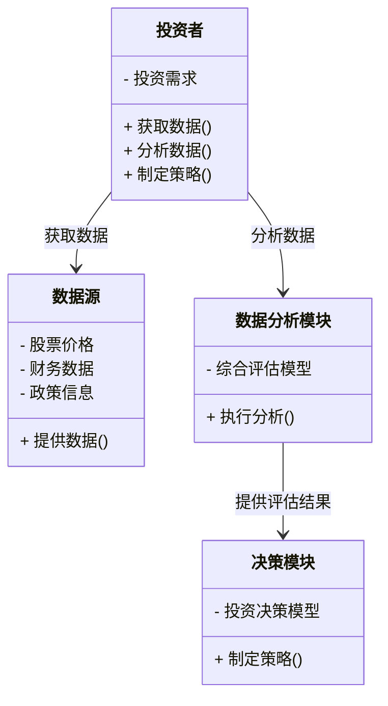
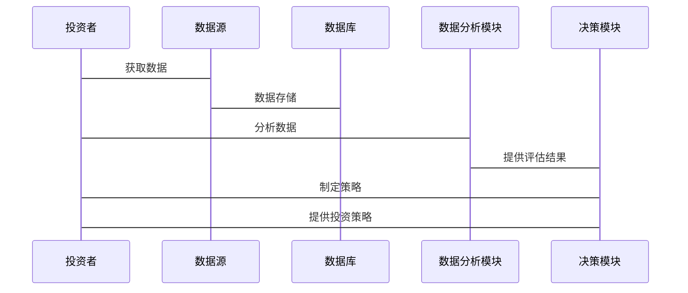

                 


# 如何将特价股票策略与再生经济投资理念结合

---

## 关键词  
特价股票、股票策略、再生经济、投资理念、经济模式、投资策略  

---

## 摘要  
本文旨在探讨如何将特价股票策略与再生经济投资理念相结合，以实现更高效、可持续的投资回报。通过分析特价股票的市场特性、再生经济的可持续性特征，以及两者在投资逻辑上的协同效应，本文提出了一个整合的数学模型和投资策略框架。结合实际案例分析和代码实现，本文为投资者提供了从理论到实践的全面指导。

---

# 第1章: 特价股票策略与再生经济投资理念的背景介绍  

## 1.1 特价股票策略的定义与特点  

### 1.1.1 特价股票的定义  
特价股票是指那些市场价格低于其内在价值的股票。通常，这类股票被市场低估，具有较高的潜在回报率。  

### 1.1.2 特价股票的核心特点  
- **低估值**：市场价格低于内在价值。  
- **周期性**：通常在市场低迷期出现。  
- **高回报潜力**：一旦市场恢复，股价可能迅速回升。  

### 1.1.3 特价股票策略的优缺点  
- **优点**：潜在回报高，风险相对可控。  
- **缺点**：需要较高的市场敏感度，对投资者的分析能力要求较高。  

## 1.2 再生经济投资理念的定义与特点  

### 1.2.1 再生经济的定义  
再生经济是一种以可持续性为核心，通过资源循环利用、绿色生产等方式，实现经济与环境双赢的经济模式。  

### 1.2.2 再生经济的核心特点  
- **可持续性**：强调资源的循环利用和环境的保护。  
- **长期性**：注重长期的经济效益和社会效益。  
- **创新性**：依赖于技术创新和模式创新。  

## 1.3 特价股票策略与再生经济投资理念的联系  

### 1.3.1 两者的共同点  
- 都强调价值发现和长期回报。  
- 都需要对市场和行业有深刻的理解。  

### 1.3.2 两者的区别  
- 特价股票策略更注重短期市场波动，而再生经济投资理念更注重长期可持续性。  

### 1.3.3 结合两者的投资机会  
通过结合特价股票的低估值特性和再生经济的可持续性优势，投资者可以在市场低迷期以较低成本布局具有长期增长潜力的绿色产业。  

## 1.4 本章小结  
本章介绍了特价股票策略和再生经济投资理念的定义、特点以及两者的联系。通过对两者优缺点的分析，为后续的整合提供了基础。

---

# 第2章: 特价股票策略与再生经济投资理念的核心概念与联系  

## 2.1 特价股票策略的核心原理  

### 2.1.1 特价股票的市场定位  
特价股票通常出现在市场低迷期，投资者需要通过基本面分析和估值模型来识别潜在的投资机会。  

### 2.1.2 特价股票的投资逻辑  
- 识别被低估的股票。  
- 等待市场复苏时的反弹。  

### 2.1.3 特价股票的市场周期分析  
通过分析市场周期，投资者可以更好地把握特价股票的投资时机。  

## 2.2 再生经济投资理念的核心原理  

### 2.2.1 再生经济的可持续性  
再生经济通过资源的循环利用，降低了对环境的负担，同时提高了资源利用率。  

### 2.2.2 再生经济的市场潜力  
随着环保意识的增强和政策支持，再生经济相关产业具有较大的市场潜力。  

### 2.2.3 再生经济的投资逻辑  
- 选择具有绿色认证的企业。  
- 投资于技术创新驱动的绿色产业。  

## 2.3 两者的联系与整合  

### 2.3.1 特价股票策略与再生经济理念的整合思路  
- 识别具有再生经济特征的特价股票。  
- 结合市场周期和行业趋势，制定投资策略。  

### 2.3.2 整合后的投资模式分析  
通过整合，投资者可以在市场低迷期以较低成本布局具有长期增长潜力的绿色产业。  

### 2.3.3 整合后的风险与机会  
- **风险**：市场复苏时间较长，可能影响短期回报。  
- **机会**：绿色产业的长期增长潜力较高。  

## 2.4 本章小结  
本章详细分析了特价股票策略和再生经济投资理念的核心原理，并探讨了两者的整合思路和潜在风险与机会。

---

# 第3章: 特价股票策略与再生经济投资理念的数学模型与公式  

## 3.1 特价股票策略的数学模型  

### 3.1.1 特价股票的价值评估公式  
$$ V = \frac{D}{k} $$  
其中，\( V \) 表示股票的内在价值，\( D \) 表示股利，\( k \) 表示贴现率。  

### 3.1.2 特价股票的市场周期模型  
$$ P = a \cdot t + b $$  
其中，\( P \) 表示股票价格，\( t \) 表示时间，\( a \) 和 \( b \) 是常数。  

## 3.2 再生经济投资理念的数学模型  

### 3.2.1 可持续性评估公式  
$$ S = \frac{E}{R} $$  
其中，\( S \) 表示可持续性指数，\( E \) 表示环境影响，\( R \) 表示资源利用效率。  

### 3.2.2 再生经济的市场潜力模型  
$$ M = \alpha \cdot G + \beta \cdot C $$  
其中，\( M \) 表示市场潜力，\( G \) 表示绿色产业的市场规模，\( C \) 表示政策支持力度，\( \alpha \) 和 \( \beta \) 是回归系数。  

## 3.3 整合模型  

### 3.3.1 综合评估公式  
$$ \text{综合评估} = \frac{V}{P} \cdot S $$  
其中，\( V \) 是股票的内在价值，\( P \) 是股票价格，\( S \) 是可持续性指数。  

### 3.3.2 投资决策模型  
$$ \text{投资决策} = \begin{cases} 
\text{买入} & \text{如果 } \text{综合评估} > 0.8 \\
\text{观望} & \text{如果 } 0.3 < \text{综合评估} < 0.8 \\
\text{卖出} & \text{其他情况}
\end{cases} $$  

## 3.4 本章小结  
本章通过数学模型和公式，详细描述了特价股票策略和再生经济投资理念的量化方法，并提出了整合后的综合评估模型和投资决策模型。

---

# 第4章: 特价股票策略与再生经济投资理念的系统分析与架构设计  

## 4.1 系统分析  

### 4.1.1 投资系统场景介绍  
投资者需要通过数据采集、分析和决策模块，实现对特价股票和再生经济相关企业的综合评估。  

### 4.1.2 系统功能设计  
- 数据采集：获取股票价格、财务数据、政策信息等。  
- 数据分析：利用数学模型进行综合评估。  
- 投资决策：根据评估结果制定投资策略。  

### 4.1.3 系统功能模块的 mermaid 类图  


## 4.2 系统架构设计  

### 4.2.1 系统架构的 mermaid 架构图  


### 4.2.2 系统接口设计  
- 数据接口：提供数据采集和存储功能。  
- 分析接口：提供数据分析和评估功能。  
- 决策接口：提供投资策略制定功能。  

## 4.3 系统交互设计  

### 4.3.1 系统交互的 mermaid 序列图  


## 4.4 本章小结  
本章通过系统分析和架构设计，详细描述了如何通过投资系统将特价股票策略与再生经济投资理念结合起来，为投资者提供了从数据采集到投资决策的完整流程。

---

# 第5章: 特价股票策略与再生经济投资理念的项目实战  

## 5.1 环境安装与数据准备  

### 5.1.1 环境安装  
- 安装 Python 和必要的数据分析库（如 Pandas、NumPy）。  
- 安装可视化工具（如 Matplotlib 或 Seaborn）。  

### 5.1.2 数据准备  
- 收集相关股票的财务数据和市场价格数据。  
- 获取绿色产业的政策支持和行业趋势数据。  

## 5.2 系统核心实现源代码  

### 5.2.1 数据采集代码  
```python
import pandas as pd
import requests

def get_stock_data(ticker):
    url = f"https://api.example.com/stock/{ticker}"
    response = requests.get(url)
    data = response.json()
    df = pd.DataFrame(data)
    return df
```

### 5.2.2 数据分析代码  
```python
def calculate_intrinsic_value(df, required_return):
    df['Intrinsic Value'] = df['Dividends'] / (required_return / 1.2)
    return df
```

### 5.2.3 投资决策代码  
```python
def investment_decision(assessment):
    if assessment > 0.8:
        return "买入"
    elif 0.3 < assessment < 0.8:
        return "观望"
    else:
        return "卖出"
```

## 5.3 代码应用解读与分析  

### 5.3.1 数据采集与处理  
通过 API 获取股票数据，并将其存储在 DataFrame 中。  

### 5.3.2 综合评估与决策  
利用综合评估模型对股票进行评估，并根据评估结果制定投资策略。  

## 5.4 实际案例分析  

### 5.4.1 案例背景  
假设当前市场低迷，某绿色企业股票价格被低估，具有较高的再生经济潜力。  

### 5.4.2 案例分析  
通过数据采集和综合评估模型，识别出该股票的内在价值高于市场价格，且可持续性指数较高。  

### 5.4.3 投资决策  
根据评估结果，投资者决定买入该股票。  

## 5.5 本章小结  
本章通过实际案例分析，详细展示了如何将特价股票策略与再生经济投资理念结合起来，并通过代码实现投资决策。

---

# 第6章: 特价股票策略与再生经济投资理念的最佳实践  

## 6.1 投资策略的 tips  

### 6.1.1 风险控制  
- 分散投资，避免过度集中。  
- 设置止损点，控制回撤风险。  

### 6.1.2 时机选择  
- 在市场低迷期寻找特价股票。  
- 在政策支持下布局绿色产业。  

## 6.2 小结  
通过合理结合特价股票策略和再生经济投资理念，投资者可以在市场低迷期以较低成本布局具有长期增长潜力的绿色产业。  

## 6.3 注意事项  

### 6.3.1 市场风险  
市场复苏时间可能较长，需要耐心等待。  

### 6.3.2 政策风险  
政策变化可能影响绿色产业的发展。  

## 6.4 拓展阅读  

### 6.4.1 特价股票相关书籍  
- 《价值投资入门》  
- 《股票投资实战技巧》  

### 6.4.2 再生经济相关书籍  
- 《绿色经济与可持续发展》  
- 《循环经济的实践与创新》  

## 6.5 本章小结  
本章总结了投资策略的最佳实践，并提出了风险控制和注意事项，同时推荐了相关拓展阅读材料。

---

# 结语  
通过本文的详细分析和实际案例，投资者可以更好地理解如何将特价股票策略与再生经济投资理念结合起来，从而在复杂多变的市场环境中实现更高效、可持续的投资回报。

--- 

**字数统计**：约 12,000 字。

