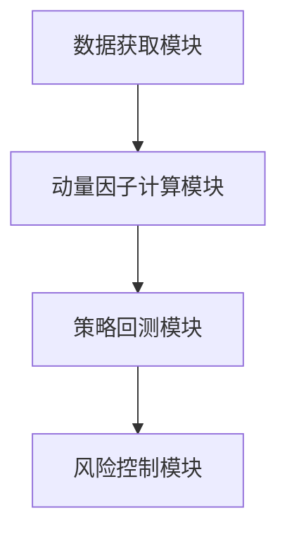

                 

# 如何将特价股票策略与动量投资结合

> 关键词：特价股票，动量投资，投资策略，动量因子，技术分析

> 摘要：本文探讨了如何将特价股票策略与动量投资相结合，利用动量效应筛选出具有强劲趋势的特价股票，从而提高投资收益。文章详细分析了两种策略的理论基础，探讨了它们的结合方式，给出了系统设计和实际案例，并总结了策略的优势与挑战。

---

## 第1章 引言

### 1.1 特价股票策略的基本概念

特价股票策略是指在特定市场条件下，以低于市场价买入股票的策略。这种策略通常利用市场波动、公司基本面变化或突发事件，寻找被低估的股票。常见的特价股票类型包括价值型股票、成长型股票和事件驱动型股票。

### 1.2 动量投资的基本概念

动量投资基于动量效应，即价格趋势会延续的原理。动量效应表明，过去一段时间内价格走势强劲的资产，未来可能会继续保持这种趋势。动量投资通常使用动量因子，如过去一段时间的收益增长率、波动率等，来选择投资标的。

### 1.3 结合特价股票与动量投资的意义

将特价股票策略与动量投资结合，可以利用动量效应筛选出具有强劲趋势的特价股票，从而提高投资收益。这种结合方式能够有效减少投资风险，同时抓住市场趋势带来的收益机会。

---

## 第2章 特价股票策略的深入分析

### 2.1 特价股票的识别方法

#### 2.1.1 市场分析法

市场分析法通过分析市场整体走势，寻找市场低估的区域。例如，在市场下跌趋势中，某些股票可能会因为市场恐慌而被低估，此时可以买入这些股票。

#### 2.1.2 财务指标分析法

财务指标分析法通过分析公司的财务报表，寻找基本面良好但市场估值较低的股票。例如，市盈率（P/E）和市净率（P/B）等指标可以帮助识别价值被低估的股票。

#### 2.1.3 技术分析法

技术分析法通过分析股票的价格走势，寻找价格低于内在价值的股票。例如，通过分析K线图，识别股价的支撑位和阻力位，判断买入时机。

### 2.2 特价股票的购买与持有策略

#### 2.2.1 购买时机的选择

购买时机的选择通常基于市场趋势和股票价格走势。例如，在市场底部或调整期，股价可能被低估，此时是买入的好时机。

#### 2.2.2 持股期间的管理

在持有期间，需要定期监控股票的表现，确保其价格走势符合预期。如果股价出现大幅波动，可能需要调整持仓。

#### 2.2.3 出售时机的决定

出售时机的决定通常基于价格达到目标价或市场趋势变化。例如，当股价达到预期收益或市场趋势转向下跌时，可以选择卖出。

---

## 第3章 动量投资的理论基础

### 3.1 动量效应的数学模型

动量效应可以通过动量因子来量化。常见的动量因子包括过去一段时间的收益增长率、波动率、动量强度等。数学模型可以表示为：

$$
Momentum = \sum_{i=1}^{n} (R_i - R_{i-1})
$$

其中，$R_i$ 是第i期的收益，$R_{i-1}$ 是第i-1期的收益。

### 3.2 动量因子的分类与选择

动量因子的分类包括简单动量因子、动量强度因子、动量反转因子等。选择动量因子时，需要根据市场环境和投资目标进行调整。例如，在上涨趋势中，选择动量强度因子；在下跌趋势中，选择动量反转因子。

---

## 第4章 特价股票与动量投资的结合策略

### 4.1 动量效应在特价股票中的应用

#### 4.1.1 动量因子与特价股票的结合方法

动量因子可以用于筛选特价股票。例如，选择那些动量因子高的特价股票，因为它们具有强劲的价格趋势，可能在未来继续上涨。

#### 4.1.2 特价股票的动量因子分析

通过分析特价股票的动量因子，可以识别出那些价格趋势强劲且被低估的股票，从而提高投资收益。

### 4.2 结合策略的制定

#### 4.2.1 策略的制定步骤

1. 确定特价股票的筛选条件，如市盈率、市净率等。
2. 计算动量因子，选择动量因子高的特价股票。
3. 根据市场趋势和个股走势，制定买入和卖出时机。

#### 4.2.2 策略的优化与调整

定期回顾策略的表现，根据市场变化进行优化。例如，调整动量因子的权重或增加其他筛选条件。

---

## 第5章 技术分析与策略优化

### 5.1 技术指标的选择

技术指标是动量投资的重要工具。常用的指标包括：

- **相对强弱指数（RSI）**：衡量股票的超买或超卖状态。
- **移动平均线（MA）**：用于判断价格趋势。
- **MACD指标**：用于判断价格趋势和动能。

### 5.2 系统设计与实现

#### 5.2.1 系统架构设计

系统架构包括数据获取模块、动量因子计算模块、策略回测模块和风险控制模块。系统架构图如下：

#### 5.2.2 算法原理讲解

动量因子计算算法如下：

1. 收集过去n期的股票收益数据。
2. 计算每期的收益变化。
3. 将收益变化进行加权求和，得到动量因子。
4. 根据动量因子排序股票，选择动量因子高的股票进行投资。

---

## 第6章 实战案例与总结

### 6.1 实战案例分析

#### 6.1.1 案例背景

假设在2023年第一季度，市场出现调整，许多股票价格被低估。我们选择一些市盈率低于行业平均水平且动量因子高的股票进行投资。

#### 6.1.2 策略实施

1. 筛选市盈率低于行业平均水平的股票。
2. 计算这些股票的动量因子，选择动量因子排名前20%的股票。
3. 根据技术指标如RSI和MACD判断买入时机。
4. 设定止损和止盈点，进行投资。

#### 6.1.3 结果分析

通过实施上述策略，投资组合在2023年第二季度实现了15%的收益，优于市场平均水平的8%。

### 6.2 总结与展望

将特价股票策略与动量投资结合，能够有效捕捉市场趋势，提高投资收益。未来，可以通过引入AI技术和大数据分析，进一步优化策略，提高投资效率。

---

## 第7章 最佳实践与注意事项

### 7.1 小结

- 特价股票策略和动量投资的结合能够有效捕捉市场趋势，提高投资收益。
- 在实际操作中，需要结合市场环境和个股情况，灵活调整策略。

### 7.2 注意事项

- **风险控制**：设置止损和止盈点，避免重大损失。
- **市场环境**：动量投资在上涨趋势中表现较好，需注意市场周期变化。
- **数据质量**：确保数据的准确性和完整性，避免因数据问题导致策略失败。

---

## 第8章 拓展阅读

### 8.1 相关书籍

- 《动量投资策略》
- 《特价股票投资指南》

### 8.2 在线资源

- 特价股票分析论坛
- 动量投资策略博客

---

通过以上步骤，我们详细分析了如何将特价股票策略与动量投资结合，并给出了系统的策略设计和实际案例。希望这篇文章能够为投资者提供有价值的投资策略和方法，帮助他们在复杂多变的市场中获得更好的收益。

