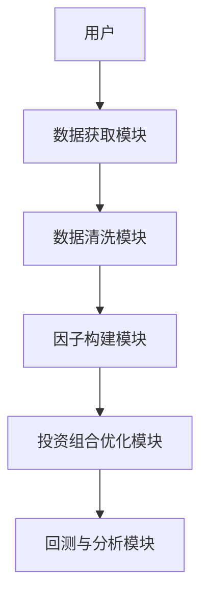

                 


# 如何将特价股票策略与另类数据因子策略相结合

> **关键词**: 特价股票策略、另类数据因子、量化投资、数据驱动、投资组合优化

> **摘要**: 本文详细探讨了如何将特价股票策略与另类数据因子策略相结合，以优化投资组合并提升投资收益。通过分析两种策略的核心原理、数学模型和实际应用场景，本文提供了具体的实施步骤和案例分析，帮助读者理解如何利用数据驱动的方法在股票投资中实现更高的收益和风险控制。

---

## 第一部分: 特价股票策略与另类数据因子策略概述

### 第1章: 特价股票策略的背景与特点

#### 1.1 特价股票策略的定义与背景

**1.1.1 特价股票的定义**  
特价股票通常指的是价格被市场低估的股票，这些股票可能因为市场波动、公司暂时的困境或其他因素而导致其市场价格低于其内在价值。特价股票的核心在于识别这些被市场忽视或低估的股票，从而在长期投资中获得超额收益。

**1.1.2 特价股票策略的背景与发展趋势**  
随着金融市场的发展，投资者逐渐意识到，仅仅依赖市场趋势或短期波动进行投资的风险较高。特价股票策略作为一种价值投资的手段，逐渐受到投资者的关注。近年来，量化技术的进步使得投资者能够更高效地筛选和分析特价股票，从而推动了特价股票策略的进一步发展。

**1.1.3 特价股票策略的核心目标与特点**  
特价股票策略的核心目标是通过识别市场价格低于内在价值的股票，从而在长期持有中获得收益。其特点包括：  
1. **价值导向**：基于股票的内在价值进行投资决策。  
2. **长期持有**：通常采用长期投资策略，等待市场价值回归。  
3. **低风险高回报**：通过精选低估股票，降低投资风险并追求高回报。

#### 1.2 特价股票策略的优势与挑战

**1.2.1 特价股票策略的优势**  
1. **低估值风险**：通过筛选低估股票，降低投资风险。  
2. **长期收益潜力**：优质低估股票在市场回归时往往能够带来超额收益。  
3. **分散投资风险**：通过多样化投资，降低单一股票风险。

**1.2.2 特价股票策略的主要挑战**  
1. **数据获取难度**：高质量的另类数据获取成本较高。  
2. **市场有效性**：市场可能存在套利机会，导致低估股票难以长期持有。  
3. **策略优化难度**：如何在不同市场环境下优化策略是关键挑战。

**1.2.3 特价股票策略的适用场景与边界**  
特价股票策略适用于市场波动较大、存在短期市场低估现象的环境。其边界在于市场有效性较高或市场参与者过于理性的情况下，低估股票可能难以找到。

### 第2章: 另类数据因子策略的背景与特点

#### 2.1 另类数据因子的定义与来源

**2.1.1 另类数据的定义**  
另类数据是指传统金融数据之外的非结构化数据，例如社交媒体数据、新闻数据、卫星图像等。这些数据能够提供市场参与者的实时情绪、行业动态和潜在市场趋势等信息。

**2.1.2 另类数据的主要来源**  
1. **社交媒体数据**：如Twitter、Facebook等平台上的用户评论和互动数据。  
2. **新闻数据**：包括财经新闻、行业报告等。  
3. **卫星图像**：用于分析物流、供应链等信息。  
4. **专利数据**：用于评估公司的创新能力。  
5. **政府公开数据**：如经济指标、政策变化等。

**2.1.3 另类数据在金融领域的应用**  
另类数据能够提供传统金融数据无法捕捉的市场信息，帮助投资者发现潜在的投资机会和风险。

#### 2.2 另类数据因子策略的核心原理

**2.2.1 另类数据因子的构建逻辑**  
通过分析另类数据，构建能够反映市场情绪、行业趋势和公司基本面的因子。例如，可以通过社交媒体数据计算市场情绪指数，作为投资决策的参考。

**2.2.2 另类数据因子的特征分析**  
1. **实时性**：能够反映市场短期动态。  
2. **多样性**：涵盖多种类型的数据，提供多维度的信息支持。  
3. **预测性**：能够预测市场趋势，帮助投资者提前布局。

**2.2.3 另类数据因子在投资决策中的作用**  
通过结合另类数据因子，投资者能够更全面地评估股票的价值，从而优化投资决策。

### 第3章: 特价股票策略与另类数据因子策略的结合思路

#### 3.1 两种策略的核心联系

**3.1.1 特价股票策略与另类数据因子的共同点**  
1. **价值导向**：两者都关注股票的内在价值。  
2. **数据驱动**：均依赖于大量数据进行分析和决策。  
3. **风险控制**：通过数据筛选降低投资风险。

**3.1.2 两种策略在投资决策中的协同作用**  
通过结合特价股票策略和另类数据因子策略，投资者能够更精准地识别低估股票，并利用另类数据提供的市场信息进一步优化投资组合。

#### 3.2 结合策略的理论基础

**3.2.1 投资学基础理论**  
基于现代投资组合理论（MPT），通过结合不同策略和因子，优化投资组合的风险收益比。

**3.2.2 数据驱动投资的理论框架**  
通过大数据分析和机器学习技术，构建能够捕捉市场机会的量化投资模型。

**3.2.3 特价股票与另类数据因子的结合模型**  
通过构建综合因子，将特价股票的低估值特征与另类数据的市场情绪、行业趋势等因素结合起来，形成更全面的投资决策依据。

#### 3.3 结合策略的实际应用价值

**3.3.1 提升投资决策的科学性**  
通过结合两种策略，投资者能够更科学地评估股票的价值，避免仅依赖单一策略的局限性。

**3.3.2 增强策略的稳定性和可持续性**  
通过多元化数据源和分析方法，提高策略的稳定性和长期收益潜力。

**3.3.3 降低投资风险的潜力**  
通过结合策略，投资者能够更全面地识别和评估风险，从而降低投资组合的整体风险。

---

## 第二部分: 特价股票策略与另类数据因子策略的核心概念与联系

### 第4章: 特价股票策略的核心概念与数学模型

#### 4.1 特价股票策略的核心概念

**4.1.1 特价股票的识别标准**  
1. **市盈率（P/E）**：市场价格与每股收益的比率。  
2. **市净率（P/B）**：市场价格与每股净资产的比率。  
3. **股息率**：股票的股息与市场价格的比率。

**4.1.2 特价股票的估值方法**  
1. **相对估值法**：通过比较股票与行业平均水平的估值指标，识别低估股票。  
2. **绝对估值法**：通过现金流折现法（DCF）等方法估算股票的内在价值。

**4.1.3 特价股票投资的风险管理**  
1. **分散投资**：通过投资多只低估股票降低风险。  
2. **风险管理模型**：利用VaR等方法评估和管理投资风险。

#### 4.2 特价股票策略的数学模型

**4.2.1 市盈率（P/E）模型**  
$$ \text{P/E} = \frac{\text{市场价格}}{\text{每股收益}} $$  
当P/E低于行业平均水平时，股票可能被低估。

**4.2.2 市净率（P/B）模型**  
$$ \text{P/B} = \frac{\text{市场价格}}{\text{每股净资产}} $$  
当P/B低于行业平均水平时，股票可能被低估。

### 4.3 另类数据因子策略的核心概念与数学模型

#### 4.3.1 另类数据因子的构建逻辑  
通过分析社交媒体数据、新闻数据等另类数据，构建反映市场情绪、行业趋势的因子。

#### 4.3.2 另类数据因子的特征分析  
1. **社交媒体情绪指数**：通过分析社交媒体上的用户评论，计算市场情绪指数。  
2. **新闻情绪指数**：通过自然语言处理技术分析新闻文本，计算市场情绪指数。

#### 4.3.3 另类数据因子的数学模型  
$$ \text{市场情绪指数} = \alpha \cdot \text{社交媒体情绪} + \beta \cdot \text{新闻情绪} $$  
其中，$\alpha$ 和 $\beta$ 是权重系数，用于调整不同数据源的影响力。

---

## 第三部分: 特价股票策略与另类数据因子策略的结合

### 第5章: 结合策略的算法实现

#### 5.1 结合策略的算法流程

**5.1.1 数据获取与预处理**  
1. 获取特价股票筛选所需的财务数据。  
2. 获取另类数据，如社交媒体数据和新闻数据。  

**5.1.2 另类数据因子的构建**  
1. 通过自然语言处理技术分析社交媒体和新闻数据，提取关键词和情感倾向。  
2. 构建市场情绪指数和其他另类数据因子。  

**5.1.3 特价股票与另类数据因子的结合**  
1. 通过多因子模型，将特价股票的估值因子与另类数据因子结合起来，构建综合投资因子。  
2. 对综合投资因子进行排序和筛选，选出符合条件的股票组合。  

**5.1.4 回测与优化**  
1. 对策略进行历史数据回测，评估策略的收益和风险表现。  
2. 根据回测结果优化策略参数，提高策略的有效性。

#### 5.2 算法实现的代码示例

```python
import pandas as pd
import numpy as np
from sklearn.linear_model import LinearRegression

# 假设我们已经获取了特价股票筛选数据和另类数据因子
# financial_data: 包含P/E、P/B等财务指标的DataFrame
# alternative_factors: 包含市场情绪指数等另类数据因子的DataFrame

# 构建综合因子
combined_factors = pd.concat([financial_data[['P/E', 'P/B']], alternative_factors[['market_sentiment']]], axis=1)

# 使用线性回归模型进行因子分析
model = LinearRegression()
model.fit(combined_factors, financial_data['target_return'])

# 预测因子得分
predicted_scores = model.predict(combined_factors)

# 筛选得分最高的股票
top_stocks = combined_factors.index[np.argsort(predicted_scores)[-5:]]
```

---

## 第四部分: 系统分析与架构设计

### 第6章: 系统架构设计

#### 6.1 系统功能设计

**6.1.1 数据获取模块**  
1. 获取财务数据和另类数据。  
2. 数据清洗与预处理。

**6.1.2 因子构建模块**  
1. 构建特价股票筛选因子。  
2. 构建另类数据因子。  
3. 综合因子构建。

**6.1.3 投资组合优化模块**  
1. 根据综合因子筛选股票。  
2. 优化投资组合。  
3. 风险管理。

#### 6.2 系统架构设计

**6.2.1 系统架构图**  


**6.2.2 系统接口设计**  
1. 数据获取模块接口：提供数据获取和清洗功能。  
2. 因子构建模块接口：提供因子计算和综合因子构建功能。  
3. 投资组合优化模块接口：提供组合优化和风险管理功能。  

---

## 第五部分: 项目实战

### 第7章: 项目实战与案例分析

#### 7.1 项目背景与目标

**7.1.1 项目背景**  
通过结合特价股票策略和另类数据因子策略，构建一个能够稳定获取超额收益的投资组合。

**7.1.2 项目目标**  
1. 筛选出符合特价股票条件的股票。  
2. 结合另类数据因子，优化投资组合。  
3. 实现策略的回测与分析。

#### 7.2 核心代码实现

```python
import pandas as pd
import numpy as np
from sklearn.linear_model import LinearRegression
from sklearn.metrics import mean_squared_error

# 数据获取与预处理
financial_data = pd.read_csv('financial_data.csv')
alternative_factors = pd.read_csv('alternative_factors.csv')

# 构建综合因子
combined_factors = pd.concat([financial_data[['P/E', 'P/B']], alternative_factors[['market_sentiment']]], axis=1)

# 线性回归模型训练
model = LinearRegression()
model.fit(combined_factors, financial_data['target_return'])

# 预测因子得分
predicted_scores = model.predict(combined_factors)

# 筛选得分最高的股票
top_stocks = combined_factors.index[np.argsort(predicted_scores)[-5:]]

# 回测与分析
portfolio_returns = financial_data.loc[top_stocks]['return'].mean()
market_returns = financial_data['return'].mean()

print(f"投资组合平均收益：{portfolio_returns}")
print(f"市场平均收益：{market_returns}")
```

#### 7.3 案例分析与解读

**7.3.1 数据获取与预处理**  
从数据源获取财务数据和另类数据，进行清洗和预处理，确保数据的完整性和准确性。

**7.3.2 因子构建与综合因子分析**  
通过分析财务数据和另类数据，构建综合因子，评估股票的综合投资价值。

**7.3.3 投资组合优化与回测**  
根据综合因子筛选股票，构建投资组合，并进行回测分析，评估策略的有效性和稳定性。

---

## 第六部分: 最佳实践与总结

### 第8章: 最佳实践与小结

#### 8.1 最佳实践

**8.1.1 数据质量的重要性**  
确保数据的准确性和完整性，是策略成功的关键。  
**8.1.2 策略优化的必要性**  
根据市场环境和回测结果，不断优化策略参数，提高策略的有效性。

#### 8.2 小结

通过将特价股票策略与另类数据因子策略相结合，投资者能够更全面地评估股票的价值，优化投资组合，并在不同市场环境下实现稳定的收益和风险控制。

#### 8.3 注意事项

1. **数据隐私与合规性**：确保数据的获取和使用符合相关法律法规。  
2. **策略的适用性**：根据市场环境和投资者需求，选择合适的策略组合。  
3. **持续优化**：定期评估和优化策略，适应市场变化。

#### 8.4 拓展阅读

1. 《量化投资入门》  
2. 《大数据在金融中的应用》  
3. 《另类数据驱动的投资策略》  

---

通过以上步骤，您可以系统地将特价股票策略与另类数据因子策略相结合，构建一个高效的投资策略，并在实际投资中实现收益与风险的优化管理。

