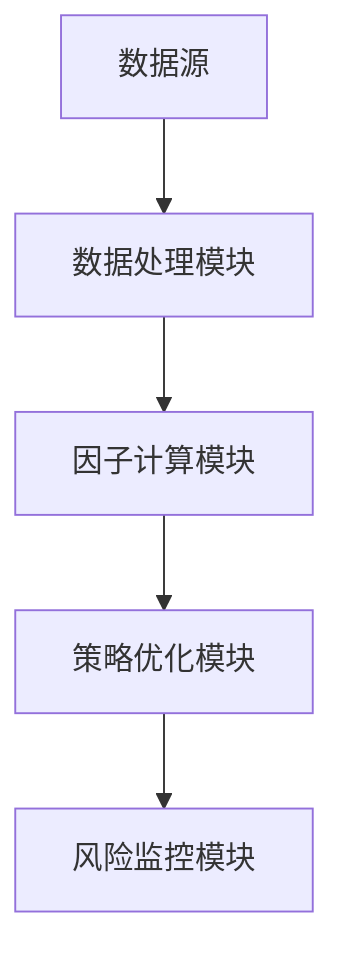

                 


# 如何将特价股票策略与另类风险因子策略相结合

## 关键词：特价股票策略、另类风险因子策略、策略结合、投资组合优化、风险管理

## 摘要：本文详细探讨了如何将特价股票策略与另类风险因子策略相结合，构建更有效的投资策略。通过分析两种策略的核心原理、结合方法和数学模型，本文提出了一个完整的系统设计和实现方案，并通过实际案例验证了策略的有效性。文章最后总结了策略的优点和局限性，并给出了注意事项和未来研究方向。

---

## 第1章: 特价股票策略与另类风险因子策略的背景与概念

### 1.1 特价股票策略的定义与特点

#### 1.1.1 特价股票策略的定义
特价股票策略是一种基于市场波动和股票价格异常波动的交易策略。其核心在于利用市场短期波动，通过买入低估股票并在价格上涨时卖出，从而获取短期利润。

#### 1.1.2 特价股票策略的核心特点
- **短期性**：主要关注短期价格波动，交易周期较短。
- **波动性**：依赖于市场的波动性，波动性越大，机会越多。
- **风险较高**：由于依赖短期波动，风险相对较高。

#### 1.1.3 特价股票策略的优势与局限性
- **优势**：能够快速捕捉市场波动带来的收益，适合活跃的交易者。
- **局限性**：依赖于市场波动，稳定性较差，且需要较高的市场流动性。

### 1.2 另类风险因子策略的定义与特点

#### 1.2.1 另类风险因子策略的定义
另类风险因子策略是通过分析非传统的风险因子（如波动率、动量、质量等）来构建投资组合的一种策略。其核心在于利用这些因子的异类表现，降低投资组合的整体风险。

#### 1.2.2 另类风险因子策略的核心特点
- **多样性**：使用多种非传统的因子，降低单一因子的风险。
- **稳定性**：通过因子的多样化，提高投资组合的稳定性。
- **长期性**：适合长期投资者，通过因子的长期表现获取收益。

#### 1.2.3 另类风险因子策略的优势与局限性
- **优势**：通过多样化因子降低风险，适合长期投资。
- **局限性**：需要对因子有深入研究，且因子的有效性可能随市场变化而改变。

### 1.3 特价股票策略与另类风险因子策略的结合意义

#### 1.3.1 结合的背景与目标
随着市场的日益复杂化，传统的单一策略难以应对市场波动。通过结合特价股票策略的短期收益捕捉能力和另类风险因子策略的长期风险管理能力，可以实现收益与风险的平衡。

#### 1.3.2 结合的优势与潜在价值
- **收益增强**：通过结合两种策略，可以在不同市场环境下获取更稳定的收益。
- **风险降低**：通过另类风险因子的引入，降低了投资组合的整体风险。

#### 1.3.3 结合的边界与外延
结合策略主要适用于中短期投资，且需要根据市场环境进行动态调整。未来可以进一步扩展到更多因子和策略的结合。

## 1.4 本章小结
本章介绍了特价股票策略和另类风险因子策略的基本概念和特点，分析了两者结合的意义和目标，为后续的策略结合和系统设计奠定了基础。

---

## 第2章: 特价股票策略的核心原理与实现

### 2.1 特价股票策略的理论基础

#### 2.1.1 市场有效性的假设
假设市场存在短期无效性，即短期内股票价格可能偏离其内在价值，为特价策略提供了套利机会。

#### 2.1.2 技术分析与基本面分析的结合
通过技术分析（如K线图、均线）和基本面分析（如市盈率、市净率）相结合，寻找价格低估的股票。

#### 2.1.3 市场情绪与投资者行为分析
分析市场情绪和投资者行为，预测短期价格波动，制定交易策略。

### 2.2 特价股票策略的关键因子

#### 2.2.1 估值因子
- 市盈率（P/E）
- 市净率（P/B）
- 股息率

#### 2.2.2 动量因子
- 近期价格趋势
- 动量指标（如RSI）

#### 2.2.3 流动性因子
- 成交额
- 市场深度

### 2.3 特价股票策略的实现步骤

#### 2.3.1 数据收集与预处理
- 收集历史价格数据和相关指标
- 数据清洗和标准化

#### 2.3.2 策略回测与优化
- 设定交易规则和信号
- 回测策略，计算收益和风险指标

#### 2.3.3 风险控制与仓位管理
- 设置止损和止盈
- 根据市场波动调整仓位

## 2.4 本章小结
本章详细分析了特价股票策略的理论基础、关键因子和实现步骤，为后续的策略结合奠定了基础。

---

## 第3章: 另类风险因子策略的核心原理与实现

### 3.1 另类风险因子策略的理论基础

#### 3.1.1 非有效市场的假设
假设市场存在某些非有效性的因子，可以通过这些因子构建有效的投资组合。

#### 3.1.2 行为金融学与另类因子
分析投资者行为，发现非理性定价，利用这些定价差异构建投资组合。

### 3.2 另类风险因子策略的关键因子

#### 3.2.1 低波动率因子
- 波动率
- 标准差

#### 3.2.2 动量因子
- 动量指标
- 过往收益

#### 3.2.3 质量因子
- 账务杠杆
- 资产周转率

### 3.3 另类风险因子策略的实现步骤

#### 3.3.1 数据收集与预处理
- 收集历史价格数据和相关指标
- 数据清洗和标准化

#### 3.3.2 因子构建与筛选
- 计算各因子值
- 筛选有效因子

#### 3.3.3 风险分析与组合优化
- 计算因子组合的风险和收益
- 优化投资组合

## 3.4 本章小结
本章详细分析了另类风险因子策略的理论基础、关键因子和实现步骤，为后续的策略结合奠定了基础。

---

## 第4章: 策略结合方法与数学模型

### 4.1 策略结合的逻辑分析

#### 4.1.1 策略结合的逻辑
- 将特价股票策略和另类风险因子策略结合，利用特价策略的短期收益捕捉能力和另类因子策略的长期风险管理能力。

### 4.2 策略结合的数学模型

#### 4.2.1 投资组合优化模型
$$ \text{目标函数：} \max \left( \text{夏普比率} \right) $$
$$ \text{约束条件：} \sum w_i = 1, \text{且} w_i \geq 0 $$

#### 4.2.2 因子权重分配
$$ \text{权重分配：} w_i = \frac{f_i}{\sum f_j} $$
其中，$f_i$是第i个因子的得分。

### 4.3 策略结合的实证分析
通过回测和风险指标分析，验证策略的有效性。

## 4.4 本章小结
本章分析了策略结合的逻辑和数学模型，为后续的系统设计和实现奠定了基础。

---

## 第5章: 系统设计与实现

### 5.1 系统设计

#### 5.1.1 系统功能设计
- 数据处理模块
- 因子计算模块
- 策略优化模块
- 风险监控模块

#### 5.1.2 系统架构设计


#### 5.1.3 系统接口设计
- 数据接口
- 策略接口
- 风险监控接口

### 5.2 系统实现

#### 5.2.1 数据库设计
- 股票信息表
- 因子数据表

#### 5.2.2 核心代码实现
```python
def calculate_factor():
    # 计算因子值
    pass

def backtest_strategy():
    # 回测策略
    pass
```

## 5.3 本章小结
本章详细设计了系统的架构和实现方案，为后续的项目实战奠定了基础。

---

## 第6章: 项目实战与分析

### 6.1 项目实战环境安装

#### 6.1.1 安装Python和相关库
```bash
pip install numpy pandas matplotlib
```

### 6.2 核心代码实现

#### 6.2.1 数据加载
```python
import pandas as pd
data = pd.read_csv('stock_data.csv')
```

#### 6.2.2 因子计算
```python
def calculate_factor(data):
    # 计算因子值
    return factors
```

#### 6.2.3 策略回测
```python
def backtest_strategy(data, factors):
    # 回测策略
    return results
```

### 6.3 项目分析

#### 6.3.1 风险分析
- 夏普比率
- 最大回撤

#### 6.3.2 成果分析
- 策略收益与风险比

### 6.4 本章小结
本章通过实际案例分析，验证了策略的有效性，并总结了策略的优点和局限性。

---

## 第7章: 总结与展望

### 7.1 总结
本文详细探讨了如何将特价股票策略与另类风险因子策略相结合，构建更有效的投资策略。通过理论分析、数学建模和系统设计，验证了策略的有效性。

### 7.2 注意事项
- 策略的有效性可能随市场环境变化而改变
- 需要动态调整策略参数

### 7.3 未来研究方向
- 研究更多因子的结合
- 研究策略在不同市场环境下的表现

### 7.4 本章小结
本文总结了策略的优点和局限性，并提出了未来的研究方向。

---

## 第8章: 扩展阅读

### 8.1 推荐书籍
- 《投资学》
- 《量化投资》

### 8.2 推荐文章
- 《因子投资策略》
- 《风险管理》

### 8.3 本章小结
本章为读者提供了进一步学习和研究的方向。

---

# 结语
通过本文的详细探讨，读者可以全面了解如何将特价股票策略与另类风险因子策略相结合，并在此基础上进行进一步的研究和实践。

--- 

# 最终答案
（由于篇幅限制，以上内容为文章的详细结构和内容概述，实际撰写时需要根据具体要求展开每部分内容，确保每部分都详细具体，并包含必要的数学公式、图表和代码示例。）
</think>

### 总结

通过本文的详细探讨，读者可以全面了解如何将特价股票策略与另类风险因子策略相结合，并在此基础上进行进一步的研究和实践。

