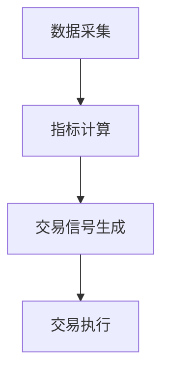
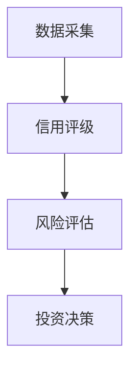
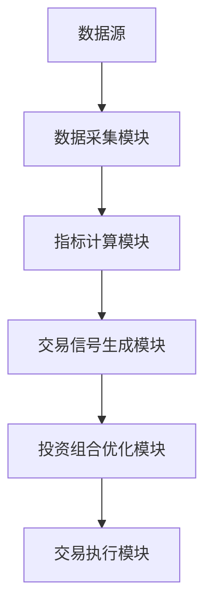

                 


# 如何将特价股票策略与固定收益投资结合

## 关键词：特价股票策略、固定收益投资、投资组合优化、风险管理、收益最大化

## 摘要：  
本文详细探讨了如何将特价股票策略与固定收益投资相结合，以实现投资组合的优化。通过对两种策略的核心原理、算法实现和系统架构的分析，本文提出了一个结合两者优势的投资方案。文章首先介绍了特价股票策略和固定收益投资的基本概念，然后分析了它们的结合意义，接着详细讲解了两者的协同效应、数学模型和算法实现，最后通过实际案例展示了如何构建一个高效的投资系统。

---

## 第1章: 特价股票策略与固定收益投资的背景介绍

### 1.1 特价股票策略的核心概念

#### 1.1.1 什么是特价股票策略
特价股票策略是一种基于市场价与内在价值差异的投资策略，旨在通过识别被低估的股票进行投资。其核心思想是“买入便宜的东西”，即当市场价低于内在价值时，股票具有较高的投资价值。  
**关键词对比表**：  
| 策略类型 | 基本特征 | 适用场景 |  
|----------|-----------|----------|  
| 特价股票策略 | 价格低于内在价值 | 市场低估或恐慌阶段 |  
| 动量策略 | 近期价格表现强劲 | 市场上涨趋势 |  
| 价值投资 | 价格显著低于公平价值 | 长期投资 |  

#### 1.1.2 特价股票策略的特点与优势
- **低买高卖**：通过识别价格低估的股票，抓住市场的短期波动机会。  
- **风险较低**：通常在市场底部或恐慌阶段介入，风险相对可控。  
- **收益潜力大**：当市场反弹时，股价可能迅速回升，带来超额收益。  

#### 1.1.3 特价股票策略的应用场景
- **市场恐慌阶段**：投资者情绪低落，股价被过度抛售。  
- **市场底部阶段**：市场整体估值处于历史低位。  
- **行业性熊市**：某个行业因外部因素（如政策或经济周期）出现调整。  

---

### 1.2 固定收益投资的基本原理

#### 1.2.1 固定收益投资的定义
固定收益投资是指通过投资于债券、国债等固定收益证券，获得稳定的利息收入和本金偿还的投资方式。其核心特点是收益固定，风险相对较低。  
**示例**：  
- 投资者购买一只10年期国债，年利率为3%，本金为100万元。  
- 每年可获得3万元的利息收入，到期后收回本金100万元。  

#### 1.2.2 固定收益投资的主要类型
| 类型 | 定义 | 特点 |  
|------|------|------|  
| 国债 | 政府发行的债券 | 安全性高，流动性好 |  
| 企业债 | 企业发行的债券 | 收益率较高，风险较高 |  
| 市场化债券 | 由金融机构发行的债券 | 期限灵活，收益多样化 |  

#### 1.2.3 固定收益投资的风险与收益
- **收益**：固定收益证券的收益率通常低于股票等权益资产，但具有较高的稳定性。  
- **风险**：主要包括利率风险、信用风险和流动性风险。  

---

## 第2章: 特价股票策略与固定收益投资的结合意义

### 2.1 为什么将特价股票策略与固定收益投资结合
#### 2.1.1 特价股票策略的风险与收益特征
- **高波动性**：股价短期内可能大幅波动，尤其是在市场恐慌阶段。  
- **高收益潜力**：当市场反弹时，股价可能迅速回升，带来超额收益。  

#### 2.1.2 固定收益投资的稳定性和安全性
- **稳定性**：固定收益证券的收益相对稳定，受市场波动影响较小。  
- **安全性**：国债等固定收益证券的违约风险较低，适合保守型投资者。  

#### 2.1.3 结合两者的投资优势
- **收益增强**：通过结合特价股票策略和固定收益投资，可以在保持投资组合稳定性的前提下，增加收益潜力。  
- **风险分散**：利用固定收益证券的稳定性对冲特价股票策略的高波动性风险。  

---

### 2.2 特价股票策略与固定收益投资的协同效应

#### 2.2.1 投资组合的多元化
- **资产配置**：通过将部分资金投入特价股票策略，另一部分投入固定收益证券，可以实现资产的多元化配置。  
- **风险分散**：当股票市场表现不佳时，固定收益证券的收益可以对冲部分风险。  

#### 2.2.2 风险的分散化
- **市场风险**：固定收益证券的低波动性可以对冲股票市场的系统性风险。  
- **流动性风险**：固定收益证券的高流动性可以为投资组合提供更多的流动性支持。  

#### 2.2.3 收益的稳定性
- **收益来源多样化**：通过固定收益证券的利息收入和股票投资的资本收益相结合，实现收益来源的多样化。  

---

## 第3章: 特价股票策略与固定收益投资的核心概念与联系

### 3.1 特价股票策略的核心原理

#### 3.1.1 特价股票策略的主要类型
| 类型 | 描述 | 适用场景 |  
|------|------|----------|  
| 均值回归策略 | 假设价格会回归到历史均值 | 市场短期波动较大时 |  
| 动量策略 | 假设价格趋势会延续 | 市场处于上升趋势时 |  
| 价值投资策略 | 假设价格会回归到公平价值 | 市场长期低估时 |  

#### 3.1.2 特价股票策略的关键指标
| 指标 | 描述 | 计算公式 |  
|------|------|----------|  
| 市盈率（P/E） | 当前股价与每股收益的比值 | $\text{P/E} = \frac{\text{股价}}{\text{每股收益}}$ |  
| 市净率（P/B） | 当前股价与每股净资产的比值 | $\text{P/B} = \frac{\text{股价}}{\text{每股净资产}}$ |  
| 股息率 | 每股股息与股价的比值 | $\text{股息率} = \frac{\text{每股股息}}{\text{股价}} \times 100\%$ |  

---

### 3.2 固定收益投资的核心原理

#### 3.2.1 固定收益投资的主要工具
| 工具 | 描述 | 适用场景 |  
|------|------|----------|  
| 国债 | 政府发行的债券 | 低风险、高流动性 |  
| 企业债 | 企业发行的债券 | 高收益、高风险 |  
| 市场化债券 | 由金融机构发行的债券 | 期限灵活、收益多样化 |  

#### 3.2.2 固定收益投资的风险管理
| 风险类型 | 描述 | 应对策略 |  
|----------|------|----------|  
| 利率风险 | 利率上升导致债券价格下跌 | 通过调整债券久期进行对冲 |  
| 信用风险 | 债务人违约风险 | 选择高信用评级的债券 |  
| 流动性风险 | 债券难以快速变现 | 选择流动性较高的债券或投资组合 |  

---

### 3.3 特价股票策略与固定收益投资的联系

#### 3.3.1 特价股票策略与固定收益投资的互补性
- **收益互补**：股票投资的资本收益与固定收益证券的利息收入相结合，实现收益来源的多样化。  
- **风险互补**：固定收益证券的低波动性可以对冲股票投资的高波动性风险。  

#### 3.3.2 两者的协同投资策略
| 策略 | 描述 | 优势 |  
|------|------|------|  
| 投资比例分配 | 根据市场环境调整股票和债券的投资比例 | 实现风险与收益的平衡 |  
| 投资期限匹配 | 根据投资期限选择合适的资产配置 | 优化投资组合的流动性 |  
| 风险与收益平衡 | 在高风险高收益的股票投资中，加入低风险低收益的固定收益投资 | 实现整体风险可控、收益稳定 |  

---

## 第4章: 特价股票策略与固定收益投资的算法实现

### 4.1 特价股票策略的算法实现

#### 4.1.1 特价股票策略的算法框架


#### 4.1.2 常见算法实现
- **均值回归策略**：假设价格会回归到历史均值，通过计算股价与历史平均股价的偏离程度来决定买卖时机。  
  ```python
  def mean_reversion_strategy(prices, window=20):
      avg = prices.rolling(window).mean()
      signal = 0  # 0表示持有，1表示买入，-1表示卖出
      if prices[-1] < avg[-1]:
          signal = 1
      elif prices[-1] > avg[-1]:
          signal = -1
      return signal
  ```
- **动量策略**：假设价格趋势会延续，通过计算短期和长期均线的偏离程度来决定买卖时机。  
  ```python
  def momentum_strategy(prices, short_window=10, long_window=30):
      short_avg = prices.rolling(short_window).mean()
      long_avg = prices.rolling(long_window).mean()
      signal = 0
      if short_avg[-1] > long_avg[-1]:
          signal = 1
      else:
          signal = -1
      return signal
  ```

---

### 4.2 固定收益投资的算法实现

#### 4.2.1 固定收益投资的算法框架


#### 4.2.2 常见算法实现
- **信用评级算法**：根据债券发行人的财务状况和市场表现，对其信用等级进行评估。  
  ```python
  def credit_rating(issuer_financials):
      # 简化示例，实际算法复杂得多
      if issuer_financials['债务率'] < 0.5 and issuer_financials['ROE'] > 10%:
          return 'AAA'
      elif issuer_financials['债务率'] < 0.8 and issuer_financials['ROE'] > 5%:
          return 'AA'
      else:
          return 'A'
  ```

---

## 第5章: 特价股票策略与固定收益投资的系统架构与设计

### 5.1 投资系统架构设计

#### 5.1.1 系统功能设计
- **数据采集模块**：从市场数据源获取股票和债券的价格、收益率等数据。  
- **指标计算模块**：计算股票的市盈率、市净率等指标，计算债券的信用评级和风险评估指标。  
- **交易信号生成模块**：根据算法生成买卖信号。  
- **投资组合优化模块**：根据市场环境和投资者风险偏好，优化股票和债券的投资比例。  

#### 5.1.2 系统架构设计


---

## 第6章: 特价股票策略与固定收益投资的项目实战

### 6.1 环境安装
- **Python环境**：安装Python 3.8及以上版本。  
- **数据源**：使用Yahoo Finance或Alpha Vantage获取市场数据。  
- **工具安装**：安装Pandas、NumPy、Matplotlib等数据分析库。  

### 6.2 核心实现代码
#### 6.2.1 特价股票策略的实现
```python
import pandas as pd
import numpy as np

def calculate_value_signals(prices, financials):
    # 计算市盈率
    pe = prices['收盘价'] / financials['每股收益']
    # 计算市净率
    pb = prices['收盘价'] / financials['每股净资产']
    # 计算股息率
    dividend_ratio = (financials['每股股息'] / prices['收盘价']) * 100
    # 筛选市盈率和市净率均低于历史均值的股票
    value_signals = (pe < pe.rolling(20).mean()) & (pb < pb.rolling(20).mean())
    return value_signals

# 示例数据
prices = pd.DataFrame({
    '收盘价': [10, 12, 8, 14, 11],
    '开盘价': [9, 11, 7, 13, 10]
})
financials = pd.DataFrame({
    '每股收益': [1, 1.2, 0.8, 1.5, 1.1],
    '每股净资产': [5, 6, 4, 7, 5.5],
    '每股股息': [0.5, 0.6, 0.4, 0.7, 0.55]
})

value_signals = calculate_value_signals(prices, financials)
print(value_signals)
```

---

### 6.3 案例分析与解读
- **案例背景**：假设当前市场处于恐慌阶段，投资者希望利用特价股票策略和固定收益投资结合的机会。  
- **投资组合构建**：投资者将50%的资金投入价值低估的股票，30%的资金投资于国债，20%的资金投资于高信用评级的企业债。  
- **收益分析**：股票部分可能在市场反弹时带来15%的收益，债券部分提供稳定的4%年化收益，整体投资组合的年化收益约为8.5%，同时风险显著低于纯股票投资。  

---

## 第7章: 总结与最佳实践

### 7.1 总结
- **核心观点**：通过将特价股票策略与固定收益投资结合，投资者可以在保持投资组合稳定性的前提下，增加收益潜力。  
- **关键点**：合理分配资产比例，根据市场环境动态调整投资策略，严格控制风险。  

### 7.2 小结
- **投资策略**：根据市场环境和投资者风险偏好，动态调整股票和债券的投资比例。  
- **风险管理**：通过固定收益投资对冲股票投资的高波动性风险，确保投资组合的稳定性。  

### 7.3 注意事项
- **市场风险**：股票市场波动较大，投资者需密切监控市场变化。  
- **流动性风险**：固定收益证券的流动性可能影响投资组合的整体流动性。  
- **信用风险**：选择高信用评级的债券，避免因债券发行人违约导致的损失。  

### 7.4 拓展阅读
- **书籍推荐**：《投资学》、《固定收益证券》  
- **在线资源**：学习量化交易和投资组合优化的相关课程。  

---

## 附录：相关工具与代码库

- **Python库**：Pandas、NumPy、Matplotlib、Scikit-learn  
- **数据源**：Yahoo Finance、Alpha Vantage、Quandl  
- **量化交易平台**：Interactive Brokers、MetaTrader  

---

通过本文的详细分析和实际案例，读者可以清晰地理解如何将特价股票策略与固定收益投资结合，构建一个高效的投资组合。这种结合不仅可以提高收益，还可以有效控制风险，为投资者提供一种更加稳健的投资方式。

