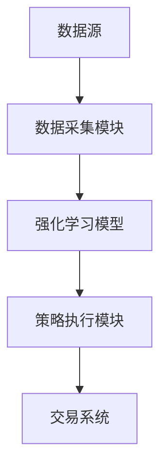
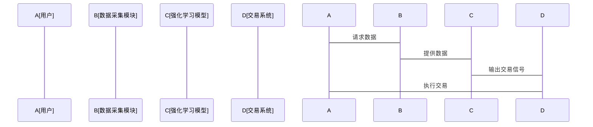

                 

<think>
好的，我将按照您的要求撰写一篇关于《如何将特价股票策略与强化学习交易策略相结合》的详细技术博客文章。让我们先从文章标题和关键词开始。

# 如何将特价股票策略与强化学习交易策略相结合

## 关键词
- 特价股票策略
- 强化学习
- 交易策略
- 人工智能
- 算法优化

## 摘要
本文详细探讨了如何将特价股票策略与强化学习交易策略相结合，通过分析特价股票策略的特点和强化学习的核心原理，提出了一种基于强化学习的股票交易优化方案。文章从背景介绍、核心概念、算法原理、系统设计、实战案例到最佳实践，全面解析了这一结合方式，并通过具体的数学公式和代码实现，展示了如何在实际应用中提升股票交易的效率和收益。

---

## 第一部分: 特价股票策略与强化学习交易策略概述

### 第1章: 特价股票策略的核心概念

#### 1.1 特价股票策略的定义与特点
特价股票策略是指在特定市场条件下，利用价格波动、市场情绪等因素，寻找具有价格优势的股票进行买入或卖出的策略。其核心目标是通过低价买入高价卖出，实现短期收益最大化。

##### 1.1.1 特价股票的定义
特价股票通常指那些价格低于市场平均水平，但具有潜在上涨空间的股票。这些股票可能因为市场波动、公司短期问题或其他因素导致价格被低估。

##### 1.1.2 特价股票策略的核心特点
- **短期性**：特价股票策略通常关注短期价格波动，适合短线交易者。
- **高风险**：由于依赖价格波动，策略的成功率受市场不确定性影响较大。
- **数据驱动**：需要依赖实时市场数据和历史数据分析。

##### 1.1.3 特价股票策略的应用场景
- **市场波动剧烈**：如股市大跌后的反弹阶段。
- **特定行业周期**：如能源股在油价下跌时可能被低估。
- **突发事件影响**：如公司公告、政策变化等。

---

#### 1.2 强化学习交易策略的核心原理
强化学习是一种通过智能体与环境交互，逐步优化决策策略的机器学习方法。在股票交易中，强化学习可以通过模拟市场环境，训练智能体做出买卖决策。

##### 1.2.1 强化学习的定义
强化学习是一种基于奖励机制的机器学习方法，智能体通过与环境交互，学习如何在特定环境下采取最优行动，以最大化累计奖励。

##### 1.2.2 强化学习的核心要素
- **状态（State）**：环境中的当前情况，如股票价格、市场情绪等。
- **动作（Action）**：智能体根据当前状态采取的行为，如买入、卖出或持有。
- **奖励（Reward）**：智能体采取行动后获得的反馈，用于指导优化策略。
- **策略（Policy）**：智能体在不同状态下采取行动的概率分布。

##### 1.2.3 强化学习与传统交易策略的区别
传统的交易策略通常基于历史数据分析和统计套利，而强化学习通过与市场的实时互动，动态调整策略，具有更强的适应性和灵活性。

---

#### 1.3 特价股票策略与强化学习的结合点
##### 1.3.1 特价股票策略的优化需求
- 特价股票策略的执行依赖于对市场环境的实时感知和快速反应，传统的人工或半自动化策略在面对复杂市场时表现有限。
- 强化学习可以通过模拟市场环境，帮助策略在不同场景下做出最优决策。

##### 1.3.2 强化学习在策略优化中的优势
- **自适应性**：强化学习能够根据市场变化自动调整策略。
- **高效性**：通过模拟训练，强化学习可以在短时间内找到最优策略。
- **数据驱动**：强化学习能够利用大量历史数据和实时数据优化策略。

##### 1.3.3 结合点的分析与总结
通过结合强化学习，特价股票策略能够更高效地识别市场机会，降低交易风险，同时提高交易效率。

---

## 第二部分: 强化学习交易策略的算法原理

### 第2章: Q-learning算法

#### 2.1 Q-learning的基本原理
Q-learning是一种经典的强化学习算法，通过维护一个Q表，记录状态-动作对的期望奖励，逐步优化策略。

##### 2.1.1 Q-learning的数学模型
状态转移概率可以用马尔可夫链描述，Q值更新公式为：
$$ Q(s, a) = Q(s, a) + \alpha [r + \gamma \max Q(s', a') - Q(s, a)] $$
其中，$\alpha$是学习率，$\gamma$是折扣因子。

##### 2.1.2 Q-learning的实现步骤
1. 初始化Q表，所有状态-动作对的初始值为0。
2. 在每一步中，根据当前状态选择动作。
3. 执行动作，观察新的状态和获得的奖励。
4. 更新Q表中的对应值。
5. 重复上述步骤，直到收敛。

##### 2.1.3 Q-learning的优缺点
- 优点：简单易实现，适合离散动作空间。
- 缺点：在连续状态空间中表现有限，需要大量训练数据。

---

### 第3章: 深度强化学习算法

#### 3.1 深度Q网络（DQN）
DQN通过使用深度神经网络近似Q值函数，扩展了Q-learning的应用范围。

##### 3.1.1 DQN的基本原理
DQN使用两个网络：主网络和目标网络。主网络负责选择动作，目标网络负责评估目标值，两者通过一定频率同步。

##### 3.1.2 DQN的网络结构
- 输入层：接收市场状态信息（如股票价格、成交量等）。
- 隐藏层：提取特征。
- 输出层：输出每个动作的Q值。

##### 3.1.3 DQN的训练流程
1. 从经验回放中随机采样一批样本。
2. 使用目标网络计算目标Q值。
3. 使用主网络计算当前Q值。
4. 计算损失函数，更新主网络权重。
5. 定期同步主网络和目标网络权重。

---

### 第4章: 强化学习算法的数学模型与公式

#### 4.1 Q-learning的数学模型
- 状态空间：$S$
- 动作空间：$A$
- 奖励函数：$r(s, a)$
- 转移概率：$P(s' | s, a)$

#### 4.2 DQN的数学模型
- 状态值函数：$Q(s, a)$
- 动作选择策略：$\epsilon$-贪心策略
- 损失函数：均方误差
$$ \text{损失} = \frac{1}{N} \sum_{i=1}^{N} (y_i - Q(s_i, a_i))^2 $$

---

## 第三部分: 特价股票策略与强化学习结合的系统设计

### 第5章: 系统架构设计

#### 5.1 系统功能模块划分
- 数据采集模块：获取实时股票数据。
- 策略执行模块：根据强化学习模型做出买卖决策。
- 模型训练模块：优化强化学习算法。

#### 5.2 系统架构图

---

### 第6章: 系统接口设计

#### 6.1 数据接口
- 数据输入接口：接收实时股票数据和历史数据。
- 数据输出接口：输出交易信号（买入、卖出或持有）。

#### 6.2 模型接口
- 模型训练接口：提供训练数据和参数。
- 模型预测接口：根据当前市场状态，输出最优动作。

---

### 第7章: 系统交互设计

#### 7.1 系统交互流程

---

## 第四部分: 实战与优化

### 第8章: 实战案例

#### 8.1 环境模拟
模拟一个包含多只股票的市场环境，训练强化学习模型识别特价股票。

#### 8.2 策略实现
使用Python编写强化学习模型，训练策略网络，优化Q值函数。

#### 8.3 回测分析
通过回测验证策略的有效性，分析策略的收益、风险比和稳定性。

---

## 第五部分: 最佳实践与总结

### 第9章: 最佳实践

#### 9.1 注意事项
- 数据质量对策略性能影响重大，需确保数据来源可靠。
- 强化学习模型需要大量训练数据，需合理设置训练参数。

#### 9.2 小结
通过将特价股票策略与强化学习结合，可以显著提升交易效率和收益，但需要在实际应用中不断优化和调整策略。

---

## 结语

本文详细探讨了如何将特价股票策略与强化学习交易策略相结合，通过理论分析、算法实现和系统设计，展示了这一结合方式的优势和实际应用价值。未来，随着人工智能技术的不断发展，这一领域将有更广阔的发展空间。

---

感谢您的耐心阅读，希望这篇文章对您有所帮助！

