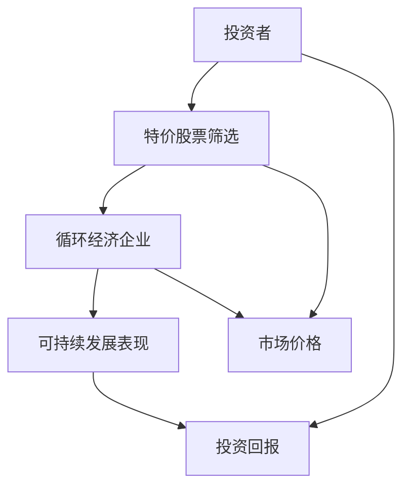

                 

# 如何将特价股票策略与循环经济投资理念结合

## 关键词：
特价股票策略，循环经济投资，投资理念结合，可持续发展，股票筛选算法，价值投资，风险管理

## 摘要：
本文探讨如何将特价股票策略与循环经济投资理念相结合，通过分析两者的核心概念、算法原理和实际案例，展示其在投资中的潜力与优势。文章从背景介绍、核心概念对比、算法设计、系统架构到项目实战，详细阐述了如何在投资中实现经济回报与可持续发展的双重目标。

---

## 第一部分: 特价股票策略与循环经济投资理念结合的背景与概念

### 第1章: 特价股票策略与循环经济投资概述

#### 1.1 特价股票策略的背景与意义
##### 1.1.1 什么是特价股票策略
特价股票策略是一种基于价值投资的股票筛选方法，旨在通过寻找市场价格低于其内在价值的股票，实现超额收益。这种方法的核心在于识别市场低估的标的，通常关注市盈率、市净率等估值指标。

##### 1.1.2 特价股票策略的历史发展
价值投资的理念起源于本杰明·格雷厄姆，他提出通过分析企业的基本面，寻找市场价格低于其清算价值的股票。这一策略在20世纪被广泛应用于股票投资，尤其是在市场波动较大的时期表现突出。

##### 1.1.3 特价股票策略在现代投资中的地位
在现代投资组合理论中，特价股票策略被视为一种有效的分散化工具，尤其在市场下跌期间能够提供稳定性。然而，随着市场效率的提高，传统价值投资的边际效应逐渐减弱，需要结合其他因素（如可持续发展）来提升收益。

#### 1.2 循环经济投资理念的提出
##### 1.2.1 循环经济的基本概念
循环经济是一种以资源高效利用和循环利用为核心的发展模式，强调减少资源消耗和环境污染，通过废弃物资源化和产品生命周期管理实现可持续发展。

##### 1.2.2 循环经济与投资的关系
循环经济投资关注企业在资源节约、环境保护和可持续发展方面的表现，通常涉及绿色产业、循环经济企业等。这种投资不仅追求财务回报，还注重社会和环境效益。

##### 1.2.3 循环经济投资的现状与趋势
随着全球对可持续发展的关注增加，循环经济投资逐渐成为主流。投资者 increasingly incorporate environmental, social, and governance (ESG) factors into their investment decisions, particularly in sectors like renewable energy, waste management, and sustainable manufacturing.

#### 1.3 特价股票策略与循环经济投资的结合
##### 1.3.1 结合的必要性与可行性
特价股票策略关注价格与价值的匹配，而循环经济投资关注企业的可持续性。两者的结合可以同时满足财务回报与社会责任，尤其在当前ESG投资趋势下具有重要意义。

##### 1.3.2 结合的目标与意义
通过结合特价股票策略与循环经济投资，投资者可以在寻找低价股票的同时，筛选出具有可持续发展潜力的企业，实现长期稳健的回报。

##### 1.3.3 结合的边界与外延
这种结合的边界在于企业自身的可持续发展能力，以及市场价格与内在价值的匹配程度。外延则包括更多行业和投资策略的创新。

---

### 第2章: 特价股票策略与循环经济投资的核心概念与联系

#### 2.1 特价股票策略的核心原理
##### 2.1.1 市场有效性的假设
特价股票策略基于市场有效性的不足，认为部分股票被市场低估，存在价值回归的潜力。

##### 2.1.2 价值投资与成长投资的对比
价值投资关注低估值股票，而成长投资关注高增长企业。两者在选股标准上有显著差异，但可以结合使用。

##### 2.1.3 特价股票的筛选标准
常见的筛选标准包括低市盈率（P/E）、低市净率（P/B）、高股息率等指标。

#### 2.2 循环经济投资的核心原理
##### 2.2.1 循环经济的三重效益
循环经济追求经济、社会和环境的三重效益，强调资源的高效利用和循环利用。

##### 2.2.2 循环经济与企业可持续发展的关系
企业通过采用循环经济模式，可以降低成本、减少风险，并提升品牌形象。

##### 2.2.3 循环经济投资的评价体系
常见的评价指标包括资源消耗率、废弃物排放量、单位产品能耗等。

#### 2.3 特价股票策略与循环经济投资的联系
##### 2.3.1 战略目标的协同性
两者都追求长期稳定的回报，但循环经济投资更注重企业的可持续发展能力。

##### 2.3.2 投资逻辑的互补性
特价股票策略关注价格与价值的匹配，而循环经济投资关注企业的社会责任和可持续发展能力，两者可以互补。

##### 2.3.3 风险管理的协同效应
通过结合两者，投资者可以分散行业风险，同时降低环境和社会风险。

---

#### 2.4 对比分析表格
表2-1: 特价股票策略与循环经济投资的核心概念对比

| 对比维度               | 特价股票策略                              | 循环经济投资理念                          |
|------------------------|------------------------------------------|-------------------------------------------|
| 核心目标               | 寻找价格低估的股票                        | 投资于可持续发展的企业                    |
| 关注指标               | 估值指标（P/E, P/B,股息率）             | 资源效率、废弃物排放、社会影响            |
| 投资逻辑               | 价值回归                                | 可持续发展与社会责任                      |
| 风险管理               | 价格波动风险                            | 环境和社会风险                            |

---

#### 2.5 实体关系图
图2-1: 特价股票策略与循环经济投资的实体关系图（Mermaid）

---

## 第三部分: 特价股票策略与循环经济投资的算法原理

### 第3章: 特

---

（由于篇幅限制，后续章节内容将在后续部分继续展开。）

