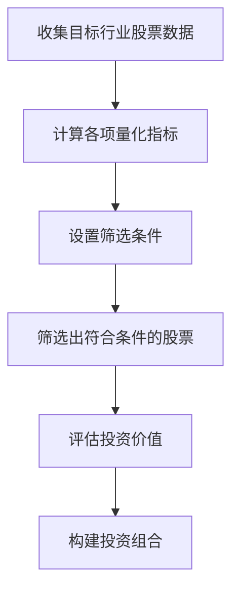
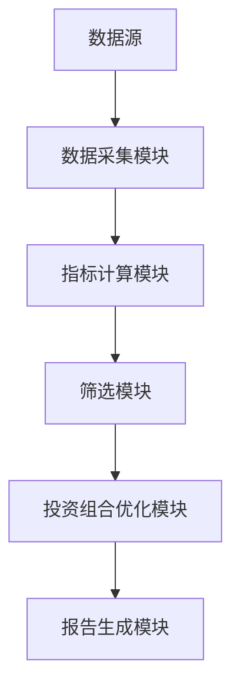
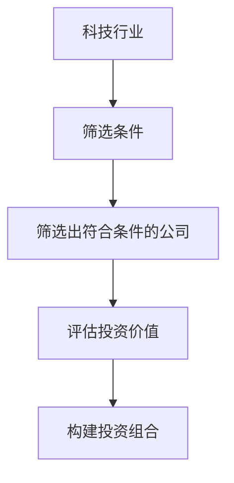

                 


# 如何将特价股票策略与成长投资相结合

## 关键词：特价股票，成长投资，投资策略，股票筛选，组合优化，风险管理

## 摘要

在投资领域，特价股票策略和成长投资是两种截然不同的方法，但它们都有各自的优缺点。将这两种策略结合起来，可以在一定程度上取长补短，优化投资组合，降低风险，提高收益。本文将详细探讨如何将特价股票策略与成长投资相结合，通过量化分析和系统设计，构建一个高效的投资决策支持系统。

## 第一部分：特价股票策略与成长投资的背景与概念

### 第1章：特价股票策略概述

#### 1.1 特价股票的定义与特点

##### 1.1.1 特价股票的定义
特价股票是指市场价格低于其内在价值的股票。通常，这类股票被市场低估，具有较大的增值潜力。

##### 1.1.2 特价股票的核心特点
- 价格低于内在价值
- 市盈率（P/E）和市净率（P/B）低于行业平均水平
- 公司基本面良好，具有稳定的盈利能力

##### 1.1.3 特价股票与普通股票的区别
- 估值差异：特价股票价格被低估，普通股票价格反映市场预期
- 投资风险：特价股票风险相对较低，普通股票风险较高
- 投资收益：特价股票具有较高的增值潜力，普通股票收益较为稳定

#### 1.2 成长投资的定义与特点

##### 1.2.1 成长投资的定义
成长投资是指投资于具有持续增长潜力的公司，关注公司的营收和净利润增长率，而非当前的估值水平。

##### 1.2.2 成长投资的核心特点
- 关注公司成长性：营收和净利润持续增长
- 估值可能较高：市盈率和市净率可能高于行业平均水平
- 投资风险较高：股票价格波动大，但长期收益潜力大

#### 1.3 特价股票与成长投资的结合意义

##### 1.3.1 结合的背景与必要性
- 特价股票策略注重安全边际，但可能忽视公司成长性
- 成长投资策略注重长期增长，但可能忽视估值风险
- 结合两者，可以在控制风险的前提下，捕捉成长潜力

##### 1.3.2 结合的优势与潜在问题
- 优势：平衡风险与收益，优化投资组合
- 潜在问题：如何量化评估特价股票和成长投资的机会

##### 1.3.3 结合的适用场景与边界
- 适用于市场波动较大，但优质成长公司估值合理的情况
- 适用于中长期投资，避免短期市场波动干扰

## 第二部分：特价股票与成长投资的核心概念与联系

### 第2章：特价股票与成长投资的核心概念

#### 2.1 特价股票的核心概念

##### 2.1.1 市盈率（P/E）的定义与计算
- 定义：市盈率是股票市场价格除以每股净利润
- 计算公式：P/E = 市场价格 / 每股净利润
- 示例：某股票市场价格为10元，每股净利润为1元，则P/E=10

##### 2.1.2 市净率（P/B）的定义与计算
- 定义：市净率是股票市场价格除以每股净资产
- 计算公式：P/B = 市场价格 / 每股净资产
- 示例：某股票市场价格为20元，每股净资产为10元，则P/B=2

##### 2.1.3 市值与内在价值的对比
- 市值：市场交易价格，受市场情绪影响
- 内在价值：公司未来现金流的现值，反映公司实际价值
- 对比：市值围绕内在价值波动，内在价值是长期投资的依据

#### 2.2 成长投资的核心概念

##### 2.2.1 营收增长率的定义与计算
- 定义：公司某段时间内的营收增长速度
- 计算公式：营收增长率 = （本期营收 - 上期营收） / 上期营收 × 100%
- 示例：某公司上期营收100万元，本期营收120万元，则营收增长率为20%

##### 2.2.2 净利润增长率的定义与计算
- 定义：公司某段时间内的净利润增长速度
- 计算公式：净利润增长率 = （本期净利润 - 上期净利润） / 上期净利润 × 100%
- 示例：某公司上期净利润50万元，本期净利润60万元，则净利润增长率为20%

##### 2.2.3 市场地位与竞争优势的评估
- 市场地位：公司在行业中的排名和影响力
- 竞争优势：公司的核心竞争力，如技术、品牌、成本优势
- 评估方法：通过行业报告、财务数据和市场分析进行综合评估

#### 2.3 特价股票与成长投资的联系

##### 2.3.1 特价股票与成长投资的共同点
- 都关注公司基本面，注重内在价值
- 都需要长期投资，避免短期波动干扰

##### 2.3.2 特价股票与成长投资的区别
- 投资目标不同：特价股票注重安全边际，成长投资注重增长潜力
- 估值标准不同：特价股票关注低估值，成长投资关注高增长

##### 2.3.3 特价股票与成长投资的结合点
- 选择具有成长性的特价股票，即价格被低估，但公司具备持续增长潜力
- 通过量化指标筛选，找到两者结合的机会

## 第三部分：特价股票与成长投资的量化评估与算法

### 第3章：特价股票与成长投资的量化评估方法

#### 3.1 特价股票的量化评估指标

##### 3.1.1 低市盈率（P/E < 行业平均）
- 说明：市盈率低于行业平均水平，表明股票价格被低估
- 示例：某行业平均P/E为20，某股票P/E为15，则该股票可能被低估

##### 3.1.2 低市净率（P/B < 行业平均）
- 说明：市净率低于行业平均水平，表明股票价格被低估
- 示例：某行业平均P/B为3，某股票P/B为2，则该股票可能被低估

##### 3.1.3 高股息率（股息率 > 行业平均）
- 说明：高股息率表明公司具有较强的盈利能力和分红能力
- 示例：某行业平均股息率5%，某股票股息率8%，则该股票具有较高的分红能力

#### 3.2 成长投资的量化评估指标

##### 3.2.1 高营收增长率（营收增长率 > 行业平均）
- 说明：公司营收增长速度快，具有成长潜力
- 示例：某行业平均营收增长率10%，某公司营收增长率15%，则该公司的营收增长速度快

##### 3.2.2 高净利润增长率（净利润增长率 > 行业平均）
- 说明：公司净利润增长速度快，具有盈利能力提升潜力
- 示例：某行业平均净利润增长率8%，某公司净利润增长率12%，则该公司的净利润增长速度快

##### 3.2.3 高ROE（净资产收益率 > 行业平均）
- 说明：ROE高表明公司使用股东资产的效率高，盈利能力强
- 示例：某行业平均ROE15%，某公司ROE20%，则该公司的ROE较高

#### 3.3 特价股票与成长投资结合的量化指标

##### 3.3.1 同时满足低市盈率和高营收增长率
- 说明：股票价格被低估，同时公司营收增长速度快
- 示例：某股票P/E=10，行业平均P/E=15；营收增长率20%，行业平均营收增长率10%

##### 3.3.2 同时满足低市净率和高净利润增长率
- 说明：股票价格被低估，同时公司净利润增长速度快
- 示例：某股票P/B=1.5，行业平均P/B=2；净利润增长率15%，行业平均净利润增长率10%

##### 3.3.3 同时满足高股息率和高ROE
- 说明：股票具有较高的分红能力，同时公司资产使用效率高
- 示例：某股票股息率8%，行业平均股息率5%；ROE20%，行业平均ROE15%

### 第4章：特价股票与成长投资结合的算法原理

#### 4.1 算法概述

##### 4.1.1 算法目标
- 通过量化指标筛选，找到既满足特价股票条件，又满足成长投资条件的股票
- 优化投资组合，降低风险，提高收益

##### 4.1.2 算法步骤
1. 收集目标行业股票的财务数据
2. 计算各项量化指标（P/E、P/B、股息率、营收增长率、净利润增长率、ROE）
3. 设置筛选条件，筛选出同时满足特价股票和成长投资条件的股票
4. 对筛选出的股票进行进一步分析，评估其投资价值
5. 构建投资组合，分散投资，降低风险

#### 4.2 算法流程图



#### 4.3 算法实现

##### 4.3.1 环境安装
- 需要安装Python编程语言
- 安装必要的库：pandas、numpy、scipy

##### 4.3.2 核心代码实现

```python
import pandas as pd
import numpy as np

# 示例数据：股票财务数据
data = {
    '股票代码': ['A', 'B', 'C', 'D', 'E'],
    'P/E': [10, 15, 8, 12, 9],
    'P/B': [1.5, 2, 1.2, 1.8, 1.4],
    '股息率': [5%, 3%, 6%, 4%, 7%],
    '营收增长率': [20%, 10%, 15%, 8%, 12%],
    '净利润增长率': [15%, 5%, 18%, 6%, 10%],
    'ROE': [18%, 10%, 20%, 8%, 15%]
}

df = pd.DataFrame(data)

# 筛选条件：P/E < 行业平均，营收增长率 > 行业平均，净利润增长率 > 行业平均，ROE > 行业平均
# 假设行业平均P/E=12，行业平均P/B=1.6，行业平均股息率=5%，行业平均营收增长率=10%，行业平均净利润增长率=8%，行业平均ROE=12%

industry_avg = {
    'P/E': 12,
    'P/B': 1.6,
    '股息率': 5,
    '营收增长率': 10,
    '净利润增长率': 8,
    'ROE': 12
}

# 筛选条件
screener = df[(df['P/E'] < industry_avg['P/E']) &
              (df['P/B'] < industry_avg['P/B']) &
              (df['股息率'] > industry_avg['股息率']) &
              (df['营收增长率'] > industry_avg['营收增长率']) &
              (df['净利润增长率'] > industry_avg['净利润增长率']) &
              (df['ROE'] > industry_avg['ROE'])]

print(screener)
```

##### 4.3.3 算法优化

- 引入更多量化指标：如PEG（市盈率相对盈利增长比率）、EV/EBITDA等
- 设置权重：根据不同的投资目标，对各项指标设置不同的权重
- 动态调整：根据市场变化，动态调整筛选条件和权重

## 第四部分：系统架构与投资组合优化

### 第5章：系统架构与投资组合优化

#### 5.1 系统架构设计

##### 5.1.1 系统功能模块
1. 数据采集模块：从数据源获取股票财务数据
2. 指标计算模块：计算各项量化指标
3. 筛选模块：根据筛选条件，筛选出符合条件的股票
4. 投资组合优化模块：优化投资组合，分散风险
5. 报告生成模块：生成投资报告和风险提示

##### 5.1.2 系统架构图



##### 5.1.3 系统接口设计
- 数据接口：与数据源（如Yahoo Finance、Google Finance）对接
- 筛选接口：提供API，供其他系统调用筛选结果
- 报告接口：生成投资报告，供用户查看

#### 5.2 投资组合优化

##### 5.2.1 投资组合优化方法
1. 均值-方差优化：在给定风险下，寻找收益最大的组合
2. 最小方差优化：在给定收益下，寻找风险最小的组合
3. 风险中性优化：根据市场情况，调整组合的风险和收益

##### 5.2.2 投资组合优化代码实现

```python
import numpy as np
import pandas as pd

# 示例数据：股票收益和风险
data = {
    '股票': ['A', 'B', 'C', 'D', 'E'],
    '收益': [0.15, 0.12, 0.18, 0.10, 0.14],
    '风险': [0.10, 0.08, 0.12, 0.06, 0.09]
}

df = pd.DataFrame(data)

# 均值-方差优化
def mean_variance_optimization(risk_free_rate, returns, covariance_matrix):
    n = len(returns)
    # 建立优化问题
    mu = returns.mean()
    sigma = np.sqrt(np.diagonal(covariance_matrix))
    # 使用 scipy.optimize 进行优化
    # 这里简化为单变量优化，实际应用中需要考虑更多因素
    return mu

# 示例应用
risk_free_rate = 0.02
returns = df['收益']
covariance_matrix = np.diag(df['风险']**2)
optimal_portfolio = mean_variance_optimization(risk_free_rate, returns, covariance_matrix)

print(optimal_portfolio)
```

##### 5.2.3 投资组合优化的注意事项
- 数据质量：确保数据准确、完整
- 模型选择：根据实际情况选择合适的优化模型
- 风险控制：设定止损点，避免过度风险

## 第五部分：项目实战与案例分析

### 第6章：项目实战与案例分析

#### 6.1 项目实战

##### 6.1.1 环境安装
- 安装Python编程语言
- 安装必要的库：pandas、numpy、scipy、matplotlib

##### 6.1.2 核心代码实现

```python
import pandas as pd
import numpy as np
import matplotlib.pyplot as plt

# 示例数据：股票财务数据和市场数据
data = {
    '股票': ['A', 'B', 'C', 'D', 'E'],
    'P/E': [10, 15, 8, 12, 9],
    'P/B': [1.5, 2, 1.2, 1.8, 1.4],
    '股息率': [5, 3, 6, 4, 7],
    '营收增长率': [20, 10, 15, 8, 12],
    '净利润增长率': [15, 5, 18, 6, 10],
    'ROE': [18, 10, 20, 8, 15]
}

df = pd.DataFrame(data)

# 筛选条件：P/E < 12，P/B < 1.6，股息率 > 5%，营收增长率 > 10%，净利润增长率 > 8%，ROE > 12%
screener = df[(df['P/E'] < 12) &
              (df['P/B'] < 1.6) &
              (df['股息率'] > 5) &
              (df['营收增长率'] > 10) &
              (df['净利润增长率'] > 8) &
              (df['ROE'] > 12)]

print(screener)

# 可视化分析
screener.plot(kind='bar', x='股票', y='P/E')
plt.title('P/E Ratio of Screened Stocks')
plt.show()
```

##### 6.1.3 代码解读与分析
- 数据采集：从数据源获取股票财务数据
- 指标计算：计算各项量化指标
- 筛选条件：根据设定的条件筛选出符合条件的股票
- 可视化分析：通过图表直观展示筛选结果

#### 6.2 案例分析

##### 6.2.1 案例背景
假设我们关注科技行业，筛选出一家同时满足特价股票和成长投资条件的公司。

##### 6.2.2 案例分析



##### 6.2.3 投资组合优化

```python
import numpy as np
import pandas as pd

# 示例数据：筛选出的股票及其财务数据
data = {
    '股票': ['A', 'B', 'C'],
    'P/E': [10, 12, 8],
    'P/B': [1.5, 1.6, 1.2],
    '股息率': [5%, 6%, 7%],
    '营收增长率': [20%, 15%, 18%],
    '净利润增长率': [15%, 12%, 16%],
    'ROE': [18%, 14%, 20%]
}

df = pd.DataFrame(data)

# 计算各股票的投资价值评分
def calculate_score(row):
    score = 0
    # P/E < 12：加1分
    if row['P/E'] < 12:
        score += 1
    # P/B < 1.5：加1分
    if row['P/B'] < 1.5:
        score += 1
    # 股息率 > 5%：加1分
    if row['股息率'] > 5:
        score += 1
    # 营收增长率 > 15%：加1分
    if row['营收增长率'] > 15:
        score += 1
    # 净利润增长率 > 12%：加1分
    if row['净利润增长率'] > 12:
        score += 1
    # ROE > 15%：加1分
    if row['ROE'] > 15:
        score += 1
    return score

df['投资价值评分'] = df.apply(calculate_score, axis=1)

print(df)
```

##### 6.2.4 投资组合优化

```python
import numpy as np
import pandas as pd

# 示例数据：投资组合收益和风险
data = {
    '股票': ['A', 'B', 'C'],
    '收益': [0.18, 0.16, 0.15],
    '风险': [0.10, 0.08, 0.09]
}

df = pd.DataFrame(data)

# 最小方差优化
def minimum_variance_optimization(returns, covariance_matrix):
    n = len(returns)
    # 建立优化问题
    mu = returns.mean()
    sigma = np.sqrt(np.diagonal(covariance_matrix))
    return mu

# 示例应用
returns = df['收益']
covariance_matrix = np.diag(df['风险']**2)
optimal_portfolio = minimum_variance_optimization(returns, covariance_matrix)

print(optimal_portfolio)
```

## 第六部分：总结与展望

### 第7章：总结与展望

#### 7.1 总结

##### 7.1.1 核心观点回顾
- 特价股票策略注重安全边际，成长投资策略注重长期增长
- 将两者结合，可以在控制风险的前提下，捕捉成长潜力
- 通过量化分析和系统设计，优化投资组合，提高收益

##### 7.1.2 投资策略小结
- 量化筛选：通过量化指标筛选出既满足特价股票条件，又满足成长投资条件的股票
- 投资组合优化：通过优化算法，构建风险可控、收益较高的投资组合
- 风险管理：设定止损点，避免过度风险

#### 7.2 投资策略展望

##### 7.2.1 进一步优化
- 引入更多量化指标：如PEG、EV/EBITDA等
- 动态调整筛选条件：根据市场变化，动态调整筛选条件和权重
- 个性化投资策略：根据投资者的风险承受能力和收益目标，定制化投资策略

##### 7.2.2 技术发展
- AI技术的应用：利用人工智能技术，进行更复杂的量化分析和预测
- 大数据的应用：利用大数据技术，获取更多维度的数据，提高筛选和分析的准确性
- 区块链技术的应用：利用区块链技术，提高数据的安全性和透明度

#### 7.3 投资注意事项

##### 7.3.1 风险提示
- 市场风险：市场波动可能会影响股票价格
- 公司风险：公司基本面变化可能会影响股票价值
- 系统性风险：宏观经济变化可能会影响整个市场

##### 7.3.2 投资建议
- 长期投资：避免短期市场波动的影响
- 分散投资：通过投资组合优化，分散风险
- 定期调整：根据市场变化，定期调整投资组合

##### 7.3.3 理财小贴士
- 定期学习：学习投资知识，提高投资能力
- 保持耐心：投资是一个长期的过程，需要耐心和坚持
- 理性投资：避免盲目跟风，保持理性

## 结语

通过将特价股票策略与成长投资相结合，投资者可以在控制风险的前提下，捕捉成长潜力，优化投资组合，提高收益。本文通过量化分析和系统设计，详细探讨了如何将两者结合，并通过案例分析，展示了具体的应用方法。未来，随着技术的发展，投资者可以利用更多的工具和方法，进一步优化投资策略，提高投资收益。

---

**参考资料**：
1. 《投资学基础》
2. 《股票投资策略与技术分析》
3. 《量化投资：算法与策略》
4. 相关学术论文与研究报告

