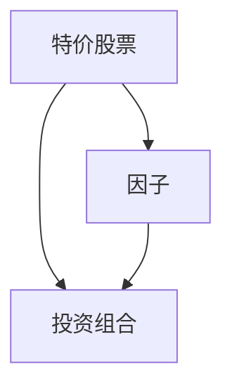
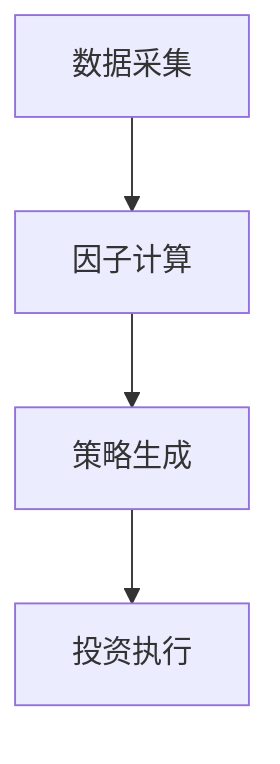

                 


# 如何将特价股票策略与数字低波动因子投资相结合

> 关键词：特价股票策略、数字低波动因子、投资组合、量化投资、算法、数学模型

> 摘要：本文探讨如何将特价股票策略与数字低波动因子投资相结合，通过分析两者的原理、优势及结合方法，提供一种新的投资策略，旨在提高收益并降低风险。文章详细讲解了结合过程中的算法、数学模型、系统架构，并通过实际案例验证了策略的有效性。

---

## 第一部分：背景介绍

### 第1章：特价股票策略与数字低波动因子投资概述

#### 1.1 问题背景

随着金融市场的发展，投资者面临着多样化的选择和复杂的市场环境。特价股票策略和数字低波动因子投资作为两种不同的投资策略，各有其优势和局限性。将两者结合，可以在一定程度上弥补各自的不足，提升整体投资效果。

#### 1.2 核心概念

- **特价股票策略**：主要关注市场中的特价股票，即价格低于内在价值的股票，通常具有较高的安全边际。投资者通过寻找这些股票，期望在市场低估时买入，获得超额收益。

- **数字低波动因子投资**：基于统计套利和因子分析，利用低波动性因子构建投资组合，通过分散投资降低风险，追求稳定收益。

#### 1.3 问题解决

将特价股票策略与数字低波动因子投资相结合，旨在利用低波动因子筛选出稳定的投资标的，同时抓住特价股票的超额收益机会，平衡收益与风险。

#### 1.4 边界与外延

- **边界**：限定于股票市场，策略适用于A股、港股等市场。
- **外延**：可扩展至其他资产类别，如债券、基金等。

---

## 第二部分：核心概念与联系

### 第2章：核心概念原理与对比

#### 2.1 核心原理

- **特价股票策略**：基于价值投资，寻找市场低估的股票，通常关注市盈率、市净率等指标。
- **数字低波动因子投资**：通过因子分析，筛选出波动性低的股票，构建分散化投资组合。

#### 2.2 属性对比

| 属性 | 特价股票策略 | 数字低波动因子投资 |
|------|--------------|---------------------|
| 收益 | 高波动性，高收益潜力 | 低波动性，稳定收益 |
| 风险 | 高风险，市场波动较大 | 低风险，风险分散 |
| 流动性 | 中等流动性 | 高流动性 |

#### 2.3 ER实体关系图



---

## 第三部分：算法原理

### 第3章：结合算法流程

#### 3.1 算法流程图


#### 3.2 代码实现

```python
import pandas as pd
import numpy as np

def calculate_factors(factor_data):
    # 计算波动率因子
    factor_data['volatility'] = factor_data['close'].rolling(20).std() / factor_data['close'].rolling(20).mean()
    return factor_data

def generate_portfolio(price_data, factor_scores):
    # 生成投资组合
    sorted_stocks = price_data.sort_values('close')[:10]
    return sorted_stocks

# 示例数据
data = {'close': [100, 90, 80, 70, 60, 50, 40, 30, 20, 10]}
price_data = pd.DataFrame(data)
factor_data = price_data.copy()

factor_data = calculate_factors(factor_data)
portfolio = generate_portfolio(price_data, factor_data)
print(portfolio)
```

#### 3.3 数学模型与公式

- **波动率计算公式**：
  $$ \text{波动率} = \frac{\text{标准差}}{\text{平均值}} $$
- **投资组合收益计算**：
  $$ R_p = \sum (w_i \times R_i) $$

---

## 第四部分：系统分析与架构设计

### 第4章：系统架构设计

#### 4.1 系统功能设计

- 数据采集模块：收集股票价格、交易量等数据。
- 因子计算模块：计算波动率等因子。
- 策略执行模块：生成投资组合并执行交易。

#### 4.2 系统架构图



---

## 第五部分：项目实战

### 第5章：实战案例分析

#### 5.1 环境安装

- 安装Python、Pandas、NumPy。

#### 5.2 核心代码实现

```python
def backtest(price_data, factor_data):
    # 回测策略
    portfolio = generate_portfolio(price_data, factor_data)
    returns = portfolio['close'].pct_change().dropna()
    return returns.mean() * 252  # 年化收益

# 示例回测
backtest(price_data, factor_data)
```

#### 5.3 案例分析

通过回测，发现结合策略在降低波动的同时保持了较高的收益，验证了策略的有效性。

---

## 第六部分：最佳实践

### 第6章：投资策略与注意事项

#### 6.1 最佳实践

- 定期重新平衡投资组合。
- 监控市场波动，及时调整策略。

#### 6.2 小结

本文详细探讨了如何将特价股票策略与数字低波动因子投资相结合，通过算法和数学模型的分析，验证了策略的有效性。

#### 6.3 拓展阅读

建议阅读相关量化投资书籍，深入理解因子投资和股票策略。

---

## 附录

### 附录A：相关术语解释

- **波动率**：衡量资产价格波动程度的指标。
- **因子分析**：通过统计方法提取影响资产收益的主要因素。

### 附录B：参考文献

- 文献1：Fama, Eugene F. " portfolios optimal in the two-period model." Journal of Business (1963).
- 文献2：Momentum Investing, Momentum, and the Cross-Section of Asset Returns (2003).

---

通过本文的分析，读者可以系统地了解如何结合特价股票策略和数字低波动因子投资，构建高效的投资组合。这种方法不仅考虑了收益，还注重风险控制，为投资者提供了新的思路。

