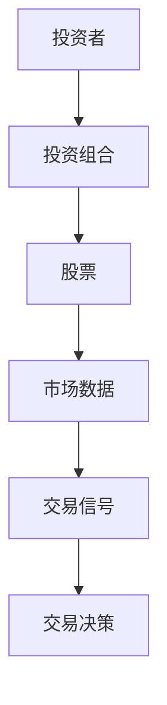
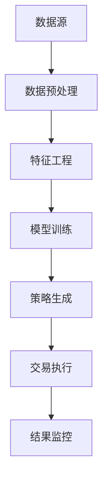

                 


# 如何将特价股票策略与机器学习资产配置相结合

## 关键词：特价股票、机器学习、资产配置、算法、金融投资、策略优化

## 摘要：本文探讨如何将特价股票策略与机器学习资产配置相结合，通过分析机器学习算法在股票数据中的应用，构建智能化的投资策略，优化资产配置，提高投资效率和收益。文章从背景、概念、算法、系统架构到实战案例，详细阐述了结合两者的方法和步骤，为读者提供全面的技术指导。

---

# 第一部分：特价股票策略与机器学习资产配置的背景与基础

## 第1章：特价股票策略概述

### 1.1 特价股票策略的定义与特点

#### 1.1.1 特价股票的定义
特价股票指的是市场价格低于其内在价值的股票。这些股票通常被市场低估，具有较大的上涨潜力。识别这些股票需要分析公司基本面、市场趋势和技术指标。

#### 1.1.2 特价股票的核心特点
- 低估值：市盈率、市净率等指标低于行业平均水平。
- 高股息率：部分特价股票提供较高的股息回报。
- 市场波动性：价格受市场情绪影响较大，存在反弹机会。

#### 1.1.3 特价股票与传统投资策略的区别
- 传统策略依赖长期趋势分析，而特价股票策略注重短期价格波动。
- 传统策略可能忽略市场波动，而特价股票策略利用市场低估的机会。

### 1.2 机器学习在金融领域的应用

#### 1.2.1 机器学习在金融中的核心作用
- 数据分析：处理海量金融数据，发现隐藏模式。
- 预测模型：预测股票价格走势和市场趋势。
- 风险管理：识别投资风险，优化资产配置。

#### 1.2.2 机器学习在资产配置中的优势
- 高效性：快速处理大量数据，提供实时反馈。
- 自适应性：根据市场变化自动调整策略。
- 精准性：通过复杂算法提高预测准确性。

### 1.3 特价股票策略与机器学习结合的意义

#### 1.3.1 提高投资效率的潜力
- 机器学习帮助快速筛选特价股票，节省时间和成本。
- 自动化分析工具提高决策效率。

#### 1.3.2 降低投资风险的可能性
- 利用机器学习模型预测市场波动，避免重大损失。
- 通过多样化投资降低风险。

#### 1.3.3 个性化投资策略的实现
- 根据投资者风险偏好定制投资方案。
- 实时监控市场变化，动态调整投资组合。

### 1.4 本书的核心目标与结构

#### 1.4.1 本书的核心目标
- 探讨机器学习在特价股票策略中的应用。
- 提供实际案例和系统设计，指导读者实现结合。

#### 1.4.2 本书的章节安排
- 第一部分：背景与基础。
- 第二部分：核心概念与联系。
- 第三部分：算法原理与实现。
- 第四部分：系统架构设计。
- 第五部分：项目实战。
- 第六部分：总结与展望。

---

# 第二部分：机器学习与资产配置的核心概念

## 第2章：机器学习在资产配置中的应用

### 2.1 机器学习的核心概念

#### 2.1.1 机器学习的基本原理
- 数据驱动：通过数据训练模型，使其具备预测能力。
- 模型训练：使用训练数据优化模型参数。
- 预测与决策：基于模型输出进行投资决策。

#### 2.1.2 机器学习的分类
- 监督学习：用于预测股票价格。
- 非监督学习：用于发现市场结构。
- 强化学习：用于动态调整投资策略。

#### 2.1.3 机器学习在金融中的应用领域
- 预测股票价格。
- 识别市场趋势。
- 管理投资组合风险。

### 2.2 特价股票策略中的机器学习应用

#### 2.2.1 特价股票识别的机器学习模型
- 使用回归分析预测股票价值。
- 通过聚类分析识别相似股票。

#### 2.2.2 机器学习在市场情绪分析中的应用
- 利用自然语言处理分析新闻和社交媒体情绪。
- 结合情绪指标优化投资策略。

#### 2.2.3 机器学习在风险控制中的应用
- 使用VaR模型评估投资风险。
- 通过压力测试优化投资组合。

### 2.3 核心概念的联系与对比

#### 2.3.1 机器学习模型的特征对比

| 模型类型 | 输入特征 | 输出结果 | 优点 | 缺点 |
|----------|----------|----------|------|------|
| 线性回归 | 市盈率、市净率 | 预测价格 | 简单易实现 | 无法捕捉非线性关系 |
| 支持向量机 | 历史价格、技术指标 | 分类结果 | 高准确性 | 参数敏感性高 |
| 随机森林 | 多特征数据 | 预测概率 | 抗过拟合 | 计算复杂 |
| 神经网络 | 图片、文本数据 | 预测值 | 高容量 | 需大量数据 |

#### 2.3.2 实体关系图（ER图）



---

## 第3章：机器学习算法的数学模型与公式

### 3.1 线性回归模型

#### 3.1.1 线性回归的数学公式
$$ y = \beta_0 + \beta_1x + \epsilon $$
其中，$y$ 是预测值，$\beta_0$ 是截距，$\beta_1$ 是回归系数，$x$ 是自变量，$\epsilon$ 是误差项。

#### 3.1.2 线性回归的实现步骤
1. 数据预处理：标准化特征。
2. 训练模型：最小二乘法优化参数。
3. 模型评估：计算R²值。

### 3.2 支持向量机（SVM）

#### 3.2.1 SVM的数学公式
$$ \text{目标函数} = \min_{w,b} \frac{1}{2}||w||^2 + C\sum_{i=1}^{n} \xi_i $$
约束条件：
$$ y_i(w \cdot x_i + b) \geq 1 - \xi_i $$
$$ \xi_i \geq 0 $$

#### 3.2.2 SVM的实现步骤
1. 数据映射：将数据映射到高维空间。
2. 确定超平面：最大化分类间隔。
3. 核函数选择：使用RBF核处理非线性问题。

### 3.3 随机森林

#### 3.3.1 随机森林的数学公式
$$ y = \sum_{i=1}^{n} \text{树模型} \cdot \text{权重} $$

#### 3.3.2 随机森林的实现步骤
1. 生成特征子集：随机选择特征。
2. 构建决策树：使用袋装法生成基模型。
3. 集成预测：计算所有树的预测结果。

---

## 第4章：系统架构设计

### 4.1 系统架构概述



### 4.2 系统功能设计

#### 4.2.1 数据采集模块
- 数据来源：股票数据库、API接口。
- 数据类型：历史价格、财务指标、市场情绪。

#### 4.2.2 特征工程模块
- 特征选择：筛选相关特征。
- 特征转换：标准化、归一化。

#### 4.2.3 模型训练模块
- 模型选择：回归、分类、聚类。
- 模型优化：交叉验证、超参数调优。

#### 4.2.4 策略执行模块
- 生成交易信号。
- 执行交易指令。

#### 4.2.5 结果监控模块
- 监控投资组合表现。
- 评估模型性能。

---

## 第5章：项目实战

### 5.1 环境安装

#### 5.1.1 安装Python环境
- 使用Anaconda安装Python 3.8以上版本。

#### 5.1.2 安装相关库
- `pip install numpy pandas scikit-learn`。

### 5.2 数据收集与处理

#### 5.2.1 数据来源
- 使用Yahoo Finance API获取股票数据。

#### 5.2.2 数据预处理
```python
import pandas as pd
import numpy as np

# 示例代码
data = pd.read_csv('stock.csv')
data['date'] = pd.to_datetime(data['date'])
data.set_index('date', inplace=True)
```

### 5.3 模型实现

#### 5.3.1 线性回归模型
```python
from sklearn.linear_model import LinearRegression

# 示例代码
model = LinearRegression()
model.fit(X_train, y_train)
y_pred = model.predict(X_test)
```

#### 5.3.2 支持向量机模型
```python
from sklearn.svm import SVC

# 示例代码
model = SVC(kernel='rb

