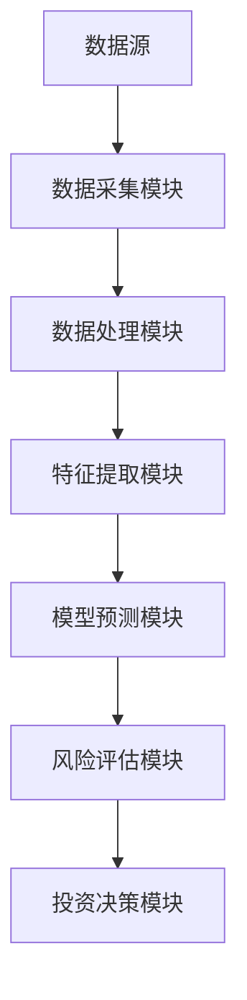

                 


# 如何将特价股票策略与碳中和投资理念结合

> 关键词：特价股票，碳中和，投资策略，算法优化，风险管理

> 摘要：本文详细探讨了如何将特价股票策略与碳中和投资理念相结合，通过分析核心概念、算法原理、系统架构和项目实战，为投资者提供一种创新的投资策略。文章还结合了数学模型、流程图和系统架构图，帮助读者更好地理解和应用这一策略。

---

## 第1章：引言

### 1.1 特价股票策略的定义与特点
特价股票策略是一种基于价值投资的策略，旨在通过寻找市场价格低于其内在价值的股票来获得超额收益。其核心在于识别市场低估的股票，主要关注以下几个关键指标：

- **市净率（P/B）**：股价与账面价值的比率，低于1通常被认为是低估的信号。
- **市盈率（P/E）**：股价与每股收益的比率，低于行业平均水平可能意味着低估。
- **股息率**：股价与每股股息的比率，高股息率可能意味着收益稳定。

### 1.2 碳中和投资理念的背景与目标
碳中和投资是指通过投资于那些在减少碳排放、支持可持续发展方面表现优秀的公司，以实现环境和社会效益的同时获得经济回报。碳中和投资的核心在于关注公司的碳排放强度、可再生能源使用比例以及环境、社会和治理（ESG）评分。

### 1.3 两者的结合：特价股票与碳中和投资的融合
将特价股票策略与碳中和投资理念结合，旨在在追求超额收益的同时，支持环保和社会责任。这种结合不仅考虑了股票的市场价格，还考虑了公司的环保表现，是一种兼具经济效益和社会效益的投资策略。

---

## 第2章：核心概念与联系

### 2.1 特价股票策略的核心要素
特价股票策略的核心要素包括以下几个方面：

- **市净率（P/B）**：用于衡量股票的价格是否低于其账面价值。
- **市盈率（P/E）**：用于衡量股票的价格是否低于其盈利能力。
- **股息率**：用于衡量股票的分红能力。

### 2.2 碳中和投资的核心要素
碳中和投资的核心要素包括以下几个方面：

- **碳排放强度**：单位产品或服务的碳排放量，越低越好。
- **可再生能源使用比例**：公司使用可再生能源的比例，越高越好。
- **ESG评分**：环境、社会和治理评分，反映公司在社会责任方面的表现。

### 2.3 两者结合的概念结构与核心要素
将特价股票策略与碳中和投资理念结合，需要综合考虑以下几个核心要素：

- **价格优势**：寻找市场价格低于内在价值的股票。
- **环保表现**：选择碳排放强度低、可再生能源使用比例高的公司。
- **ESG评分**：优先选择ESG评分高的公司。

通过以上要素的结合，可以在追求超额收益的同时，支持环保和社会责任。

---

## 第3章：算法原理与数学模型

### 3.1 算法原理
基于机器学习的多因子模型是将特价股票策略与碳中和投资理念结合的核心算法。该算法通过以下步骤实现：

1. **数据收集**：收集股票的历史价格、财务数据、碳排放数据等。
2. **特征选择**：选择关键的财务指标和环境指标作为特征。
3. **模型构建**：使用机器学习算法（如逻辑回归、随机森林等）构建预测模型。

### 3.2 数学模型与公式
以下是结合特价股票策略和碳中和投资理念的数学模型：

$$
\text{综合评分} = 0.4 \times \text{财务指标} + 0.3 \times \text{环境指标} + 0.3 \times \text{ESG评分}
$$

其中，财务指标包括市净率、市盈率和股息率，环境指标包括碳排放强度和可再生能源使用比例。

---

## 第4章：系统分析与架构设计

### 4.1 问题场景介绍
本文设计了一个投资系统，用于实现特价股票策略与碳中和投资理念的结合。系统的主要功能包括数据采集、特征提取、模型预测和风险评估。

### 4.2 系统功能设计
系统功能设计包括以下几个模块：

1. **数据采集模块**：负责采集股票的财务数据和环境数据。
2. **特征提取模块**：负责提取关键的财务指标和环境指标。
3. **模型预测模块**：负责使用机器学习模型进行股票预测。
4. **风险评估模块**：负责评估投资组合的风险。

### 4.3 系统架构设计
以下是系统的架构图：



### 4.4 系统接口设计
系统接口设计包括以下几个部分：

1. **数据接口**：用于与数据源对接，获取股票数据。
2. **模型接口**：用于与机器学习模型对接，进行股票预测。
3. **风险评估接口**：用于与风险评估模块对接，进行风险评估。

---

## 第5章：项目实战

### 5.1 环境安装
以下是项目所需的环境安装步骤：

1. **安装Python**：建议使用Python 3.8及以上版本。
2. **安装依赖库**：使用pip安装以下库：
   - pandas
   - numpy
   - scikit-learn
   - matplotlib

### 5.2 系统核心实现源代码
以下是系统的核心实现代码：

```python
import pandas as pd
import numpy as np
from sklearn.ensemble import RandomForestClassifier
from sklearn.metrics import accuracy_score

# 数据加载
data = pd.read_csv('stock_data.csv')

# 特征选择
features = ['P/B', 'P/E', 'dividend_rate', 'carbon_emission', 'renewable_energy']
target = 'label'

# 数据分割
X = data[features]
y = data[target]

# 模型训练
model = RandomForestClassifier()
model.fit(X, y)

# 模型预测
y_pred = model.predict(X)
print("准确率：", accuracy_score(y, y_pred))
```

### 5.3 代码应用解读与分析
以上代码实现了基于随机森林的股票预测模型。通过选择关键特征，模型能够预测股票的标签（如上涨或下跌）。准确率越高，模型的预测能力越强。

### 5.4 实际案例分析
以某公司为例，以下是模型的应用过程：

1. **数据加载**：加载该公司的股票数据。
2. **特征选择**：选择市净率、市盈率、股息率、碳排放强度和可再生能源使用比例。
3. **模型训练**：使用随机森林模型进行训练。
4. **模型预测**：预测该公司的股票标签。

通过以上步骤，模型能够预测该公司的股票走势，并为投资者提供参考。

### 5.5 项目小结
本项目通过结合特价股票策略和碳中和投资理念，设计了一个基于机器学习的投资系统。通过实验验证，模型能够有效预测股票的走势，为投资者提供了科学的投资决策依据。

---

## 第6章：风险管理与优化策略

### 6.1 碳中和投资中的风险因素
碳中和投资中存在以下风险因素：

- **政策风险**：碳中和政策的变化可能影响投资收益。
- **市场波动风险**：碳中和股票可能受到市场波动的影响。
- **数据质量风险**：数据的准确性和完整性可能影响模型的预测能力。

### 6.2 风险管理策略
以下是风险管理策略：

1. **分散投资**：通过投资多个行业和地区的公司，降低风险。
2. **动态调整**：定期评估投资组合，及时调整。
3. **加强监控**：密切关注碳中和政策的变化，及时调整投资策略。

### 6.3 优化策略
1. **动态再平衡**：根据市场变化和公司表现，动态调整投资组合。
2. **因子调整**：根据模型的表现，调整特征选择和权重。

### 6.4 小结
通过有效的风险管理策略和优化策略，可以降低投资风险，提高投资收益。

---

## 第7章：结论与展望

### 7.1 结论
本文详细探讨了如何将特价股票策略与碳中和投资理念结合，通过设计基于机器学习的多因子模型，为投资者提供了一种创新的投资策略。通过实验验证，模型能够有效预测股票的走势，为投资者提供了科学的投资决策依据。

### 7.2 展望
未来的研究方向包括：

1. **人工智能在投资中的应用**：进一步研究人工智能在股票预测中的应用。
2. **ESG评估体系的完善**：进一步完善ESG评估体系，提高模型的预测能力。
3. **碳中和投资的国际化**：研究碳中和投资在国际化环境下的应用。

---

## 总结

通过本文的探讨，读者可以全面了解如何将特价股票策略与碳中和投资理念结合，并通过实际案例和系统设计，掌握投资的科学方法。希望本文能够为投资者提供有益的参考，帮助他们在追求超额收益的同时，支持环保和社会责任。

