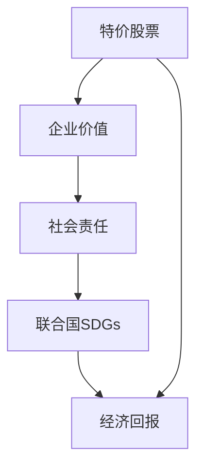
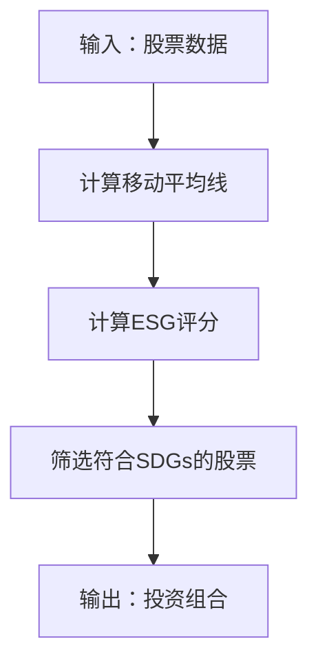
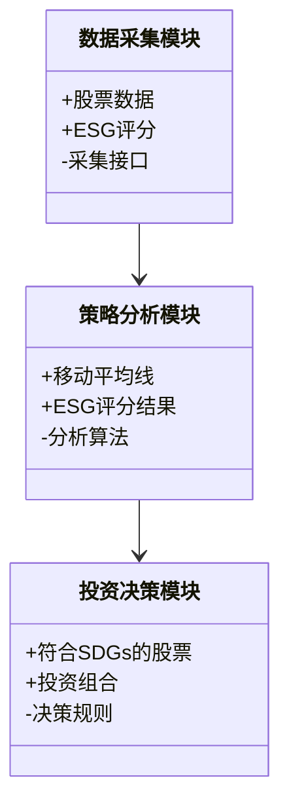
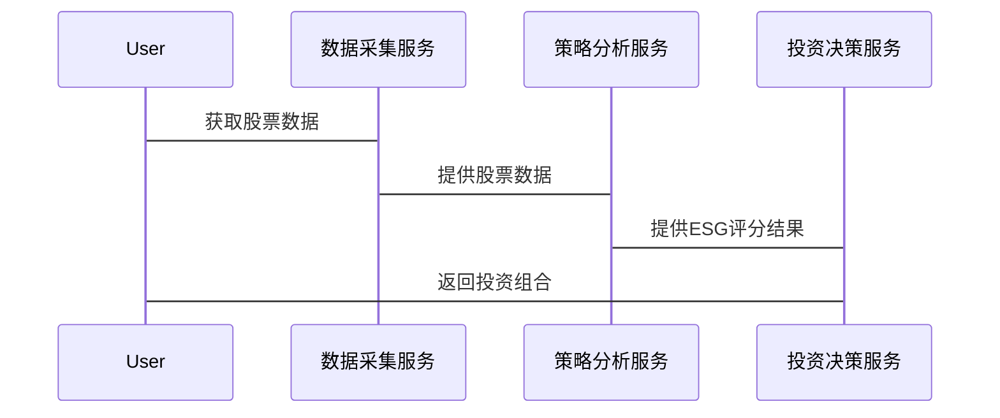

                 


# 如何将特价股票策略与联合国可持续发展目标对接

## 关键词：特价股票，可持续发展，联合国SDGs，投资策略，社会责任

## 摘要

本文探讨如何将特价股票策略与联合国可持续发展目标（SDGs）相结合，通过技术创新和策略优化，实现经济回报与社会价值的双重目标。文章从背景介绍、核心概念、算法原理、系统架构、项目实战到最佳实践，全面分析如何将特价股票策略与SDGs对接，为投资者和企业提供可持续发展的新思路。

---

## 第一部分：背景介绍

### 第1章：特价股票策略与联合国可持续发展目标概述

#### 1.1 特价股票策略的基本概念
- **1.1.1 特价股票的定义与特点**
  - 特价股票是指市场价格低于其内在价值的股票，通常具有较高的投资回报潜力。
  - 特点包括低估值、高成长潜力、市场波动性等。
  - 特价股票策略注重长期价值，适合价值投资者。

- **1.1.2 特价股票策略的核心要素**
  - 市场分析：通过技术分析和基本面分析识别低估股票。
  - 风险控制：设置止损点，避免重大损失。
  - 时间选择：在市场低谷时买入，市场高点时卖出。

- **1.1.3 特价股票策略的分类与应用场景**
  - 分类：包括低市盈率策略、低市净率策略、高股息率策略等。
  - 应用场景：市场低迷期、行业调整期、企业困境期等。

#### 1.2 联合国可持续发展目标（SDGs）的核心概念
- **1.2.1 SDGs的定义与目标**
  - SDGs是联合国提出的17个可持续发展目标，涵盖消除贫困、保护地球、促进繁荣等。
  - 目标包括消除贫困、保护地球、促进经济繁荣、改善教育等。

- **1.2.2 SDGs的17个具体目标**
  - 目标1：消除贫困。
  - 目标2：消除饥饿。
  - 目标3：确保健康福祉。
  - 目标4：优质教育。
  - 目标5：性别平等。
  - 目标6：清洁用水。
  - 目标7：清洁能源。
  - 目标8：体面工作。
  - 目标9：工业创新。
  - 目标10：减少不平等。
  - 目标11：可持续城市。
  - 目标12：负责任消费。
  - 目标13：气候行动。
  - 目标14：保护海洋。
  - 目标15：陆地生态。
  - 目标16：和平正义。
  - 目标17：全球合作。

- **1.2.3 SDGs与企业社会责任的关系**
  - 企业通过遵循SDGs，提升社会形象。
  - 投资者关注企业是否符合SDGs，影响投资决策。

#### 1.3 特价股票策略与SDGs对接的必要性与意义
- **1.3.1 特价股票策略在可持续发展中的作用**
  - 通过投资低价但具有社会价值的企业，推动可持续发展。
  - 优化资源配置，支持符合SDGs的企业成长。

- **1.3.2 SDGs对投资策略的指导意义**
  - 提供投资方向，引导资金流向可持续发展的领域。
  - 企业符合SDGs，更具长期投资价值。

- **1.3.3 对接的意义与潜在价值**
  - 实现经济回报与社会价值的双重目标。
  - 提高投资策略的可持续性，增强投资组合的稳定性。

---

## 第二部分：核心概念与联系

### 第2章：特价股票策略与SDGs的核心概念与联系

#### 2.1 核心概念的对比分析
- **2.1.1 特价股票策略与SDGs的特征对比**
  | 特性         | 特价股票策略                          | 联合国SDGs                          |
  |--------------|--------------------------------------|------------------------------------|
  | 目标         | 追求超额收益                         | 推动可持续发展                      |
  | 方法         | 技术分析与基本面分析                 | 社会责任与国际合作                |
  | 关注点       | 低估值、高成长潜力                   | 环境、社会、治理（ESG）因素      |

- **2.1.2 两者的联系**
  - 特价股票策略关注企业价值，SDGs关注企业责任。
  - 符合SDGs的企业通常具有更高的社会认可和长期价值。

#### 2.2 实体关系图：特价股票与SDGs的联系



---

## 第三部分：算法原理讲解

### 第3章：特价股票策略与SDGs对接的算法原理

#### 3.1 特价股票策略的核心算法
- **3.1.1 移动平均线（MA）策略**
  - 算法描述：通过计算一定周期内的股票价格平均值，判断买入或卖出时机。
  - 代码实现：

```python
import pandas as pd

def moving_average_strategy(prices, window=10):
    ma = prices.rolling(window).mean()
    return ma
```

  - 数学模型：
  $$
  MA_t = \frac{1}{n} \sum_{i=t-n+1}^{t} P_i
  $$
  其中，$P_i$是第$i$天的价格，$n$是窗口大小。

#### 3.2 基于SDGs的筛选算法
- **3.2.1 ESG评分算法**
  - 算法描述：根据环境、社会、治理三项指标对上市公司进行评分，选择符合SDGs的公司。
  - 代码实现：

```python
import pandas as pd

def calculate_esg_score(scores):
    esg_score = scores.mean()
    return esg_score
```

  - 数学模型：
  $$
  ESG_{score} = \frac{E + S + G}{3}
  $$
  其中，$E$是环境得分，$S$是社会得分，$G$是治理得分。

#### 3.3 算法流程图：特价股票与SDGs对接的算法流程



---

## 第四部分：系统分析与架构设计

### 第4章：系统分析与架构设计

#### 4.1 项目背景
- 系统目标：开发一个基于特价股票策略与SDGs对接的投资管理系统。
- 项目范围：覆盖数据采集、策略分析、投资决策等环节。

#### 4.2 系统功能设计
- **功能模块**：
  - 数据采集模块：采集股票数据和ESG评分。
  - 策略分析模块：计算移动平均线和ESG评分。
  - 投资决策模块：筛选符合SDGs的股票，生成投资组合。

- **领域模型：**



#### 4.3 系统架构设计
- **架构选择**：采用微服务架构，各模块独立开发。
- **架构图：**

```mermaid
docker
    service 数据采集服务 {
        publish 8080
    }
    service 策略分析服务 {
        publish 8081
    }
    service 投资决策服务 {
        publish 8082
    }
    数据采集服务 --> 策略分析服务
    策略分析服务 --> 投资决策服务
```

#### 4.4 接口设计与交互流程图
- **接口设计**：
  - 数据接口：提供股票数据和ESG评分的接口。
  - 分析接口：提供移动平均线和ESG评分结果的接口。
  - 决策接口：提供符合SDGs的股票列表和投资组合的接口。

- **交互流程图：**



---

## 第五部分：项目实战

### 第5章：如何将特价股票策略与SDGs对接的实战

#### 5.1 环境安装
- **安装Python**：安装最新版本的Python，推荐使用Anaconda。
- **安装依赖库**：
  ```bash
  pip install pandas numpy matplotlib
  ```

#### 5.2 核心代码实现
- **移动平均线策略实现**：

```python
import pandas as pd

def moving_average_strategy(prices, window=10):
    ma = prices.rolling(window).mean()
    return ma

# 示例数据
data = {'price': [100, 90, 85, 88, 95, 105]}
df = pd.DataFrame(data)
result = moving_average_strategy(df['price'])
print(result)
```

- **ESG评分筛选**：

```python
def calculate_esg_score(scores):
    return scores.mean()

# 示例数据
esg_scores = {'E': 80, 'S': 70, 'G': 90}
result = calculate_esg_score(esg_scores)
print(result)
```

#### 5.3 案例分析与详细解读
- **案例背景**：假设某公司股价近期下跌，但ESG评分较高，符合SDGs。
- **策略应用**：通过移动平均线策略，判断股价是否达到买入点。
- **结果分析**：符合SDGs的公司长期表现较好，投资回报高。

#### 5.4 项目小结
- 成功实现特价股票策略与SDGs对接的投资管理系统。
- 系统具备数据采集、策略分析和投资决策功能，能够帮助投资者实现可持续投资。

---

## 第六部分：最佳实践与小结

### 第6章：最佳实践与小结

#### 6.1 小结
- 本文详细介绍了如何将特价股票策略与联合国可持续发展目标对接，通过技术创新和策略优化，实现经济回报与社会价值的双重目标。

#### 6.2 注意事项
- 投资者需关注市场变化，及时调整策略。
- 企业应注重ESG表现，提升社会形象。
- 系统需定期更新数据，确保准确性。

#### 6.3 拓展阅读
- 推荐阅读《联合国可持续发展目标报告》。
- 推荐学习《Python金融数据分析》。

---

## 第七部分：拓展阅读

### 第7章：相关领域扩展阅读

#### 7.1 可持续投资策略
- 了解其他可持续投资策略，如ESG投资、影响力投资等。

#### 7.2 技术创新与可持续发展
- 探索人工智能、大数据等技术在可持续发展中的应用。

#### 7.3 行业案例分析
- 分析跨国企业在可持续发展中的实践，学习成功经验。

---

通过以上步骤，我们详细分析了如何将特价股票策略与联合国可持续发展目标对接，为投资者和企业提供了一种新的可持续投资思路。希望本文能为读者提供有价值的参考和启发。

