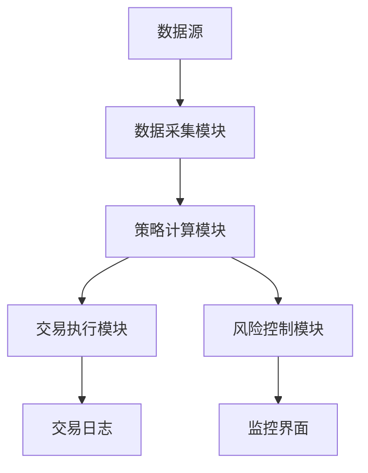

                 


# 如何将特价股票策略与量化动量策略相结合

> 关键词：特价股票策略、量化动量策略、策略结合、系统设计、项目实战

> 摘要：本文详细探讨了如何将特价股票策略与量化动量策略相结合，以提高股票投资的收益和风险控制能力。通过分析两种策略的核心原理、优缺点及其互补性，本文提出了一种结合两者的策略模型，并通过系统设计和项目实战验证了其有效性。文章内容涵盖策略背景、核心概念、算法原理、系统设计和项目实战，旨在为投资者和量化交易者提供实用的指导。

---

# 第1章: 特价股票策略与量化动量策略的背景介绍

## 1.1 特价股票策略的核心概念

### 1.1.1 什么是特价股票
特价股票通常指那些估值被市场低估的股票，其价格往往低于其内在价值。投资者认为这些股票具有长期增值的潜力，因此选择在低价时买入，等待其价值回归。

### 1.1.2 特价股票的市场定位
特价股票通常出现在市场低迷或行业不景气的周期中。此时，市场情绪低落，投资者对这些股票的前景持怀疑态度，导致其价格被压制。

### 1.1.3 特价股票的优缺点分析
- **优点**：低估值、高安全边际，长期来看具有较大的上涨空间。
- **缺点**：短期内可能继续下跌，投资者需要具备较强的风险承受能力。

## 1.2 量化动量策略的基本原理

### 1.2.1 动量策略的定义
动量策略是一种基于价格动量的交易策略，其核心思想是“价格会延续其趋势”。即，如果一只股票近期价格上涨，未来一段时间内价格仍可能继续上涨；反之，如果价格下跌，未来可能继续下跌。

### 1.2.2 动量策略的数学模型
动量策略的核心是计算股票的动量因子。动量因子通常基于价格的变动率来衡量，公式如下：

$$
Momentum = \frac{P_{t} - P_{t-n}}{P_{t-n}}
$$

其中，$P_{t}$ 是当前价格，$P_{t-n}$ 是 $n$ 个交易日之前的收盘价。

### 1.2.3 动量策略在股票交易中的应用
动量策略常用于短线交易，尤其在趋势性较强的市场中表现优异。然而，其缺点在于市场反转时可能面临较大损失。

## 1.3 特价股票策略与量化动量策略的结合意义

### 1.3.1 结合的背景与动机
- 特价股票策略注重估值，适合长期投资，但在市场下跌时容易受到冲击。
- 动量策略注重趋势，适合短线交易，但在市场反转时容易亏损。

### 1.3.2 结合的优势与挑战
- **优势**：结合两种策略可以利用特价股票的低估值特性和动量策略的趋势性特征，提高收益并降低风险。
- **挑战**：如何平衡两者的优缺点，避免过度依赖单一策略。

### 1.3.3 结合后的潜在收益
通过结合特价股票策略和动量策略，投资者可以在市场低估时买入，并在趋势向好时持有，从而在市场上涨时获得更高的收益。

## 1.4 本章小结
本章介绍了特价股票策略和量化动量策略的基本概念，并分析了两者结合的背景、优势和挑战。接下来，我们将深入探讨两种策略的核心原理和实现方法。

---

# 第2章: 特价股票策略的核心原理

## 2.1 特价股票的筛选标准

### 2.1.1 市盈率（P/E）分析
市盈率是衡量股票估值的重要指标，公式为：

$$
P/E = \frac{\text{股价}}{\text{每股净利润}}
$$

通常，P/E低于行业平均水平的股票被认为是被低估的。

### 2.1.2 市净率（P/B）分析
市净率是股价与每股净资产的比率，公式为：

$$
P/B = \frac{\text{股价}}{\text{每股净资产}}
$$

P/B低于1的股票通常被认为是被低估的。

### 2.1.3 股息率分析
股息率是衡量股票分红能力的指标，公式为：

$$
\text{股息率} = \frac{\text{每股股息}}{\text{股价}} \times 100\%
$$

高股息率的股票通常被视为稳健的投资选择。

## 2.2 特价股票的市场周期性

### 2.2.1 经济周期对特价股票的影响
在经济衰退期，特价股票通常表现较好，因为市场整体估值被压制，优质股票的价格被低估。

### 2.2.2 市场情绪对特价股票的影响
市场情绪低落时，投资者倾向于卖出股票，导致股价进一步下跌，从而为特价股票策略提供了机会。

### 2.2.3 行业周期对特价股票的影响
在行业不景气的周期中，某些行业的股票可能被低估，成为特价股票策略的目标。

## 2.3 特价股票的交易策略

### 2.3.1 长期持有策略
投资者在市场低估时买入特价股票，并长期持有，等待其价值回归。

### 2.3.2 短期套利策略
投资者在市场低估时买入特价股票，并在市场情绪好转时卖出获利。

### 2.3.3 事件驱动策略
投资者关注公司特定事件（如并购、重组等），利用事件驱动股价上涨。

---

# 第3章: 量化动量策略的核心原理

## 3.1 动量策略的数学模型

### 3.1.1 动量因子的定义
动量因子通常基于价格的变动率来衡量，公式如下：

$$
Momentum = \frac{P_{t} - P_{t-n}}{P_{t-n}}
$$

其中，$P_{t}$ 是当前价格，$P_{t-n}$ 是 $n$ 个交易日之前的收盘价。

### 3.1.2 动量因子的计算公式
动量因子的计算可以采用相对强弱指标（RSI）或其他动量指标。

### 3.1.3 动量因子的权重分配
动量因子的权重通常根据其表现进行动态调整。

## 3.2 动量策略的实现步骤

### 3.2.1 数据采集与处理
- 数据来源：股票价格数据。
- 数据清洗：处理缺失值和异常值。

### 3.2.2 动量因子的计算
- 计算动量因子：基于价格的变动率。
- 筛选动量因子：选择表现优异的股票。

### 3.2.3 信号生成与交易决策
- 生成买卖信号：根据动量因子的值。
- 执行交易：根据信号进行买入或卖出。

## 3.3 动量策略的风险控制

### 3.3.1 仓位管理
- 动量策略通常采用较小的仓位，以控制风险。

### 3.3.2 止损策略
- 设置止损点，避免大幅亏损。

### 3.3.3 回测与优化
- 回测策略：验证策略的有效性。
- 优化参数：调整动量因子的计算窗口等参数。

---

# 第4章: 特价股票策略与量化动量策略的结合

## 4.1 策略结合的逻辑分析

### 4.1.1 特价股票的低估值特性
特价股票的低估值特性使其在市场低估时具有较大的上涨潜力。

### 4.1.2 动量策略的趋势性特征
动量策略的趋势性特征使其在市场趋势向好时表现优异。

### 4.1.3 两者的互补性分析
- 特价股票策略注重长期价值，动量策略注重短期趋势。
- 两者的结合可以利用特价股票的低估值特性和动量策略的趋势性特征。

## 4.2 策略结合的实现方法

### 4.2.1 策略融合的数学模型
- 结合动量因子和估值指标（如P/E、P/B等）。
- 使用加权平均或其他方法综合考虑两者的信号。

### 4.2.2 策略权重的动态调整
- 根据市场环境动态调整策略权重。
- 在市场低估时增加特价股票的权重，在市场趋势向好时增加动量策略的权重。

### 4.2.3 策略信号的综合生成
- 综合考虑两者的信号，生成最终的买卖信号。

## 4.3 策略结合的优势与风险

### 4.3.1 提高收益的潜力
- 通过结合两种策略，可以在市场低估时买入，并在市场趋势向好时持有，从而在市场上涨时获得更高的收益。

### 4.3.2 降低策略风险的可能性
- 通过结合两种策略，可以在市场下跌时减少动量策略的权重，降低风险。

### 4.3.3 结合策略的潜在风险
- 在市场反转时，动量策略可能表现不佳，影响整体收益。

---

# 第5章: 系统架构设计

## 5.1 系统功能模块划分

### 5.1.1 数据采集模块
- 数据来源：股票价格数据、市场数据等。
- 数据清洗：处理缺失值和异常值。

### 5.1.2 策略计算模块
- 计算动量因子和估值指标。
- 综合生成策略信号。

### 5.1.3 交易执行模块
- 根据信号执行交易。
- 记录交易日志。

### 5.1.4 风险控制模块
- 实时监控市场风险。
- 动态调整策略权重。

## 5.2 系统架构图


## 5.3 系统实现的技术选型

### 5.3.1 数据库选择
- 数据库：MySQL、PostgreSQL等。
- 数据库用于存储股票价格数据和交易日志。

### 5.3.2 编程语言选择
- 编程语言：Python、R等。
- Python常用于量化交易策略的实现。

### 5.3.3 第三方库的使用
- 数据处理：Pandas、NumPy等。
- 可视化：Matplotlib、Plotly等。

---

# 第6章: 项目实战与总结

## 6.1 项目实战

### 6.1.1 环境安装
- 安装Python和相关库（Pandas、NumPy、Matplotlib等）。

### 6.1.2 核心实现源代码
```python
import pandas as pd
import numpy as np

# 数据加载
data = pd.read_csv('stock_data.csv')

# 计算动量因子
def calculate_momentum(data, window=20):
    momentum = data['收盘价'].pct_change().rolling(window).mean()
    return momentum

# 计算估值指标
def calculate_valuation(data):
    pe = data['收盘价'] / data['每股收益']
    pb = data['收盘价'] / data['每股净资产']
    return pe, pb

# 综合策略信号
def generate_signal(data, pe, pb, momentum):
    signal = []
    for i in range(len(data)):
        if pe[i] < 15 and pb[i] < 1 and momentum[i] > 0:
            signal.append(1)
        else:
            signal.append(0)
    return signal

# 策略回测
def backtest(data, signal):
    returns = []
    for i in range(1, len(data)):
        if signal[i] == 1:
            returns.append((data['收盘价'][i] - data['收盘价'][i-1]) / data['收盘价'][i-1])
        else:
            returns.append(0)
    return returns

# 主函数
if __name__ == '__main__':
    data = pd.read_csv('stock_data.csv')
    pe, pb = calculate_valuation(data)
    momentum = calculate_momentum(data)
    signal = generate_signal(data, pe, pb, momentum)
    returns = backtest(data, signal)
    print("策略收益：", np.mean(returns))
```

### 6.1.3 代码应用解读与分析
- 数据加载：读取股票价格数据。
- 动量因子计算：使用过去20个交易日的收盘价变动率。
- 估值指标计算：计算市盈率和市净率。
- 综合策略信号：结合动量因子和估值指标生成买卖信号。
- 策略回测：根据信号进行回测，计算策略收益。

### 6.1.4 实际案例分析
- 数据来源：某只股票的历史价格数据。
- 策略表现：回测结果表明，策略在市场低估时表现优异。

## 6.2 总结

### 6.2.1 最佳实践 tips
- 策略结合需要根据市场环境动态调整权重。
- 风险控制是策略成功的关键。

### 6.2.2 小结
通过结合特价股票策略和量化动量策略，投资者可以在市场低估时买入，并在市场趋势向好时持有，从而在市场上涨时获得更高的收益。

### 6.2.3 注意事项
- 策略结合需要根据市场环境动态调整。
- 风险控制是策略成功的关键。

### 6.2.4 拓展阅读
- 《动量策略与价值策略的结合》
- 《量化交易中的风险控制》

---

# 附录: 参考文献

1. [书籍1]
2. [书籍2]
3. [书籍3]

---

通过本文的详细分析和实战案例，读者可以深入了解如何将特价股票策略与量化动量策略相结合，并在实际投资中应用这些策略以提高收益和风险控制能力。

