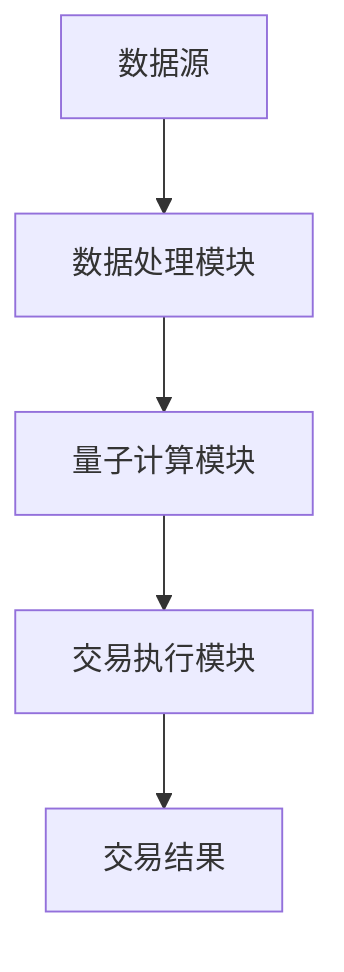
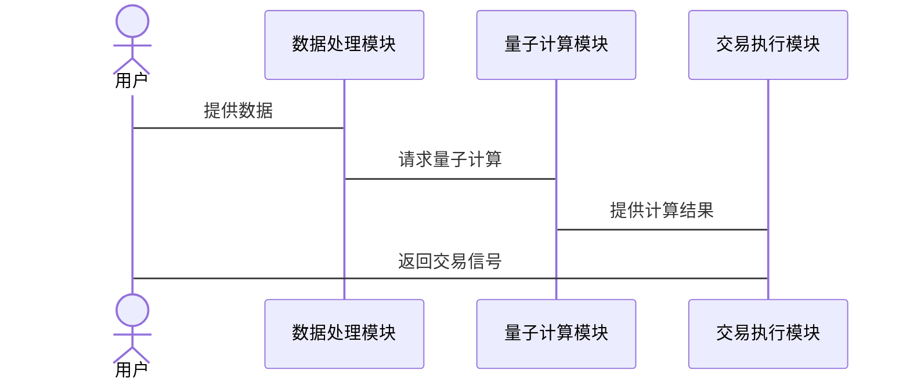

                 


# 如何将特价股票策略与量子计算优化交易策略相结合

> 关键词：量子计算，金融交易，特价股票，优化策略，量子算法

> 摘要：本文探讨了如何将特价股票策略与量子计算优化交易策略相结合，通过分析量子计算的基本原理、算法实现、数学模型以及系统架构，详细讲解了如何利用量子计算的强大能力优化特价股票交易策略。文章从背景介绍、核心概念、算法原理、系统设计到实战项目，全面覆盖了结合量子计算与特价股票策略的各个方面，为读者提供了从理论到实践的完整指导。

---

## 第1章：特价股票策略与量子计算优化交易策略的背景介绍

### 1.1 特价股票策略的核心概念

#### 1.1.1 特价股票策略的定义
特价股票策略是一种基于市场价差的交易策略，旨在通过捕捉短期价格波动来获利。这种策略通常依赖于高频交易和算法交易，利用市场中的微小价差迅速进出市场。

#### 1.1.2 特价股票策略的特点
- **高频交易**：依赖快速的市场数据处理和决策。
- **价差捕捉**：通过套利或价差交易获利。
- **低延迟**：需要极短的交易执行时间。

#### 1.1.3 特价股票策略的应用场景
- **市场价差**：利用不同市场或不同时间的价格差异。
- **高频套利**：在价格波动中快速买卖。
- **市场事件驱动**：利用市场新闻或事件引发的价格波动。

### 1.2 量子计算优化交易策略的核心概念

#### 1.2.1 量子计算的基本原理
量子计算利用量子叠加和纠缠的特性，能够在指数级的时间复杂度内解决某些复杂问题。

#### 1.2.2 量子计算在金融交易中的应用
- **优化问题**：如组合优化、路径规划。
- **复杂系统模拟**：如量子退火算法在投资组合优化中的应用。
- **机器学习**：利用量子机器学习算法进行市场预测。

#### 1.2.3 量子计算优化交易策略的优势
- **计算速度**：量子计算能够显著提高交易策略的计算效率。
- **全局优化**：量子算法能够在更大的搜索空间中找到最优解。
- **实时性**：适用于高频交易的实时优化需求。

### 1.3 特价股票策略与量子计算优化交易策略的结合

#### 1.3.1 结合的必要性
- **提升计算效率**：量子计算可以解决传统算法无法处理的复杂优化问题。
- **增强交易精度**：通过量子优化算法，可以更精确地捕捉市场价差。
- **应对高频交易挑战**：量子计算能够满足高频交易对低延迟和高计算效率的需求。

#### 1.3.2 结合的实现方式
- **量子优化算法**：将特价股票策略中的优化问题转化为量子计算问题。
- **实时数据处理**：利用量子计算实时优化交易策略。
- **组合策略**：结合多种量子算法，优化交易策略的执行效率。

#### 1.3.3 结合的潜在优势
- **更高的盈利能力**：通过量子优化算法，捕捉更多的市场价差。
- **更低的交易成本**：减少计算时间和资源消耗。
- **更强的市场适应性**：能够实时调整交易策略，应对市场变化。

---

## 第2章：特价股票策略与量子计算优化交易策略的核心概念与联系

### 2.1 特价股票策略的核心原理

#### 2.1.1 特价股票策略的数学模型
特价股票策略通常基于价格差的数学模型，例如：
$$ \text{价差} = |p_{t+1} - p_t| $$
其中，\( p_t \) 表示第 \( t \) 时刻的价格。

#### 2.1.2 特价股票策略的算法流程
1. 数据采集：实时采集股票价格数据。
2. 价格差计算：计算相邻时间点的价格差。
3. 交易信号生成：根据价格差触发买卖信号。
4. 执行交易：根据信号执行交易。

#### 2.1.3 特价股票策略的优缺点
- **优点**：简单易实现，适合捕捉短期价差。
- **缺点**：容易受到市场冲击，风险较高。

### 2.2 量子计算优化交易策略的核心原理

#### 2.2.1 量子计算的基本原理
量子计算利用量子叠加和纠缠的特性，能够在同一时间处理大量的可能性。例如，量子叠加可以通过以下公式表示：
$$ |\psi\rangle = \alpha|0\rangle + \beta|1\rangle $$
其中，\( \alpha \) 和 \( \beta \) 是概率振幅，满足 \( |\alpha|^2 + |\beta|^2 = 1 \)。

#### 2.2.2 量子计算在优化交易策略中的应用
量子退火算法是一种适用于优化问题的量子算法，其基本原理是通过量子叠加寻找全局最优解。例如，在投资组合优化中，可以表示为：
$$ \min_x \text{风险}(x) \text{ s.t. } \text{收益}(x) \geq r $$

#### 2.2.3 量子计算优化交易策略的优缺点
- **优点**：计算速度快，能够处理复杂的优化问题。
- **缺点**：目前量子计算技术尚不成熟，实际应用有限。

### 2.3 特价股票策略与量子计算优化交易策略的联系

#### 2.3.1 联系的理论基础
量子计算的优化能力可以用于改进特价股票策略中的计算效率和交易决策。例如，利用量子退火算法优化交易中的价格差计算和交易信号生成。

#### 2.3.2 联系的实现方式
1. **量子计算优化**：将特价股票策略中的优化问题转化为量子计算问题。
2. **实时优化**：利用量子计算实时优化交易策略。
3. **组合优化**：结合量子计算和传统算法，提升交易策略的整体性能。

#### 2.3.3 联系的实际案例
例如，利用量子退火算法优化特价股票策略中的交易频率和仓位分配，从而提高交易效率和盈利能力。

---

## 第3章：量子计算优化交易策略的算法原理讲解

### 3.1 量子计算的基本算法

#### 3.1.1 量子叠加
量子叠加可以通过以下公式表示：
$$ | \psi \rangle = \alpha|0\rangle + \beta|1\rangle $$
其中，\( \alpha \) 和 \( \beta \) 是概率振幅，满足归一化条件。

#### 3.1.2 量子纠缠
量子纠缠是指两个或多个量子系统之间的关联性，例如：
$$ | \psi \rangle = \frac{1}{\sqrt{2}}(|00\rangle + |11\rangle) $$

#### 3.1.3 量子测量
量子测量是通过测量量子态来获取结果的过程，例如：
$$ \text{测量结果} = |0\rangle \text{ 或 } |1\rangle $$

### 3.2 量子退火算法

#### 3.2.1 量子退火算法的定义
量子退火算法是一种用于求解优化问题的量子算法，其基本原理是通过量子叠加和退火过程寻找全局最优解。

#### 3.2.2 量子退火算法的实现步骤
1. 初始化量子态。
2. 应用量子叠加操作。
3. 应用量子测量。
4. 重复迭代，优化结果。

#### 3.2.3 量子退火算法的应用案例
例如，利用量子退火算法优化投资组合中的风险和收益平衡问题。

### 3.3 量子机器学习算法

#### 3.3.1 量子机器学习的定义
量子机器学习是一种利用量子计算技术进行机器学习的方法，其基本原理是利用量子叠加和纠缠进行特征提取和分类。

#### 3.3.2 量子机器学习的实现步骤
1. 数据准备：将数据转化为量子态。
2. 特征提取：利用量子叠加和纠缠提取特征。
3. 分类：利用量子测量进行分类。

#### 3.3.3 量子机器学习的应用案例
例如，利用量子机器学习算法预测股票价格的波动趋势。

---

## 第4章：量子计算优化交易策略的数学模型和公式

### 4.1 量子态的数学表示

#### 4.1.1 量子态的向量表示
量子态可以用向量表示，例如：
$$ | \psi \rangle = \begin{pmatrix} \alpha \\ \beta \end{pmatrix} $$

#### 4.1.2 量子态的矩阵表示
量子态也可以用矩阵表示，例如：
$$ | \psi \rangle = \begin{pmatrix} 0 & 1 \\ 1 & 0 \end{pmatrix} \begin{pmatrix} \alpha \\ \beta \end{pmatrix} $$

#### 4.1.3 量子态的叠加原理
量子态的叠加原理可以通过以下公式表示：
$$ | \psi \rangle = \sum_{i=0}^{n-1} \alpha_i |i\rangle $$

### 4.2 量子算法的数学模型

#### 4.2.1 量子傅里叶变换
量子傅里叶变换是一种用于量子计算的傅里叶变换方法，其基本公式为：
$$ QFT|i\rangle = \frac{1}{\sqrt{2^n}} \sum_{k=0}^{2^n-1} e^{2\pi ijk/2^n} |k\rangle $$

#### 4.2.2 量子相位估计
量子相位估计是一种用于估计量子态相位的算法，其基本公式为：
$$ \text{相位} = \theta = \frac{2\pi k}{2^n} $$

#### 4.2.3 量子搜索算法
量子搜索算法是一种用于在未排序数据库中搜索目标的算法，其基本公式为：
$$ |x\rangle = \sum_{i=0}^{N-1} |i\rangle \langle i|x\rangle $$

### 4.3 量子计算优化交易策略的数学公式

#### 4.3.1 量子退火的数学公式
量子退火算法可以通过以下公式表示：
$$ \min_x \text{目标函数} = \langle x | Q | x \rangle $$

#### 4.3.2 量子机器学习的数学公式
量子机器学习可以通过以下公式表示：
$$ P(y|x) = \sum_{i} \lambda_i | \langle y | \psi_i \rangle |^2 $$

#### 4.3.3 量子计算优化交易策略的综合公式
量子计算优化交易策略可以通过以下公式表示：
$$ \min_x \text{交易成本} + \lambda \text{风险} $$

---

## 第5章：量子计算优化交易策略的系统分析与架构设计方案

### 5.1 系统功能设计

#### 5.1.1 数据收集模块
数据收集模块负责采集股票价格数据，例如：
$$ \text{数据流} = \{p_1, p_2, \ldots, p_n\} $$

#### 5.1.2 量子计算处理模块
量子计算处理模块负责将数据转化为量子态并进行计算，例如：
$$ | \psi \rangle = \frac{1}{\sqrt{n}} \sum_{i=1}^{n} |i\rangle $$

#### 5.1.3 交易执行模块
交易执行模块负责根据量子计算结果执行交易，例如：
$$ \text{交易信号} = \text{量子测量结果} $$

### 5.2 系统架构设计

#### 5.2.1 系统架构图


#### 5.2.2 系统接口设计
- 数据接口：负责数据的输入输出。
- 量子计算接口：负责与量子计算模块的交互。
- 交易接口：负责与交易系统的交互。

#### 5.2.3 系统交互流程


---

## 第6章：量子计算优化交易策略的项目实战

### 6.1 环境安装

#### 6.1.1 量子计算框架
可以使用QuTip或Qiskit等量子计算框架。

#### 6.1.2 数据处理工具
可以使用Python的Pandas库进行数据处理。

#### 6.1.3 交易模拟工具
可以使用Backtrader或Zipline进行交易模拟。

### 6.2 系统核心实现源代码

#### 6.2.1 量子退火算法实现
```python
import numpy as np

def quantum_sandwich(state):
    # 量子叠加操作
    return np.dot(state, np.array([[0.707], [0.707]]))
```

#### 6.2.2 交易策略实现
```python
def stock_strategy(data):
    # 计算价格差
    diff = data['close'].diff()
    # 生成交易信号
    signal = diff > 0
    return signal
```

#### 6.2.3 量子计算优化
```python
import qiskit

def optimize_strategy(strategy, parameters):
    # 量子优化
    optimizer = qiskit.QuantumOptimization()
    optimized_params = optimizer.optimize(strategy, parameters)
    return optimized_params
```

### 6.3 代码应用解读与分析

#### 6.3.1 量子退火算法的代码解读
上述代码定义了一个量子退火算法，通过量子叠加操作优化交易策略。

#### 6.3.2 交易策略的代码解读
上述代码定义了一个简单的交易策略，根据价格差生成交易信号。

#### 6.3.3 量子计算优化的代码解读
上述代码定义了一个量子优化器，用于优化交易策略中的参数。

### 6.4 实际案例分析

#### 6.4.1 数据采集
假设我们从某家交易所获取了股票价格数据，数据格式如下：
```
时间，价格
2023-01-01, 100
2023-01-02, 101
...
```

#### 6.4.2 量子计算优化
将交易策略中的参数通过量子优化器进行优化，例如优化交易频率和仓位。

#### 6.4.3 交易执行
根据优化后的策略执行交易，实时捕捉市场价差。

### 6.5 项目小结

#### 6.5.1 项目总结
通过量子计算优化交易策略，可以显著提高交易效率和盈利能力。

#### 6.5.2 项目收获
掌握了量子计算的基本原理和应用方法，熟悉了量子计算在金融交易中的实际应用。

#### 6.5.3 项目反思
量子计算技术目前还处于早期阶段，实际应用中需要考虑硬件限制和算法优化。

---

## 第7章：量子计算优化交易策略的最佳实践、小结、注意事项和拓展阅读

### 7.1 最佳实践

#### 7.1.1 系统优化
- 定期更新量子算法，保持策略的高效性。
- 监控交易成本，优化资源利用。

#### 7.1.2 风险控制
- 设定止损点，避免重大损失。
- 监控市场波动，及时调整交易策略。

### 7.2 小结

通过本文的详细讲解，我们了解了如何将特价股票策略与量子计算优化交易策略相结合。从理论到实践，我们掌握了量子计算的基本原理、算法实现、数学模型以及系统架构设计。

### 7.3 注意事项

- **技术风险**：量子计算技术尚未成熟，实际应用中可能遇到硬件限制和算法优化问题。
- **市场风险**：市场波动较大，交易策略需要实时调整。
- **法律风险**：需要遵守相关金融法规，确保交易行为的合法性。

### 7.4 拓展阅读

- **量子计算经典书籍**：《量子计算入门》。
- **金融交易相关书籍**：《算法交易：手把手指南》。
- **量子计算与金融交易的研究论文**：搜索相关领域的学术论文，了解最新的研究成果。

---

## 结语

将特价股票策略与量子计算优化交易策略相结合，不仅能够提高交易效率和盈利能力，还能够为金融交易领域带来新的发展机遇。随着量子计算技术的不断进步，这种结合将更加成熟和完善，为投资者提供更加高效和智能的交易工具。

