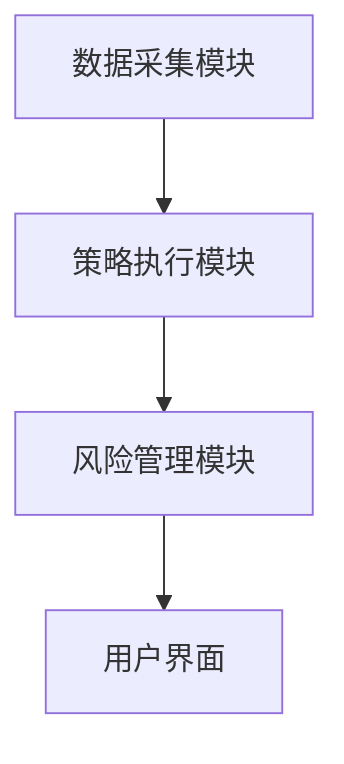

                 


# 如何将特价股票策略应用于代币化资产投资

> 关键词：特价股票策略、代币化资产、投资策略、算法套利、风险管理、量化分析

> 摘要：本文详细探讨了如何将传统的特价股票策略应用于现代的代币化资产投资中。通过分析特价股票策略的核心原理和代币化资产的特性，结合数学模型、算法设计和系统架构，为投资者提供一套完整的策略实施框架。文章从背景介绍、核心概念、算法原理、系统设计到项目实战，全面解析了如何将特价股票策略成功应用于代币化资产投资，并提供了实际案例和最佳实践。

---

## 第一章：特价股票策略与代币化资产投资的背景

### 1.1 背景介绍

#### 1.1.1 特价股票策略的定义
特价股票策略是一种基于市场价差或时间价差的套利策略，通过在特定市场条件下以低于市场价买入股票，并在价格回升时卖出，从而获利。这种策略通常依赖于市场信息不对称、短期价格波动或市场机制漏洞。

#### 1.1.2 代币化资产投资的定义
代币化资产是将传统资产（如股票、房地产、艺术品等）转化为数字代币，通过区块链技术实现资产的分割、转让和价值传递。代币化资产具有高流动性、透明性和可编程性，为投资者提供了新的投资方式。

#### 1.1.3 理论基础与应用背景
随着区块链技术的快速发展，代币化资产逐渐成为一种重要的投资工具。将特价股票策略应用于代币化资产投资，可以利用区块链的透明性和去中心化特性，进一步优化套利机会和风险管理。

---

### 1.2 问题背景与目标

#### 1.2.1 问题背景
- 传统股票市场中，特价股票策略依赖于市场价差和信息优势，但在代币化资产中，市场机制更加透明，信息传播速度更快。
- 代币化资产的流动性较高，但同时也面临价格波动大、市场参与者多的挑战。

#### 1.2.2 问题目标
本文旨在探讨如何将传统的特价股票策略的核心思想，应用于代币化资产投资中，通过分析代币化资产的特性，优化策略的实施步骤，降低风险，提高收益。

---

## 第二章：特价股票策略的核心概念与代币化资产的结合

### 2.1 特价股票策略的核心概念

#### 2.1.1 套利机制
套利机制是特价股票策略的核心，通过在不同市场或时间点的价格差异中获利。在代币化资产中，套利机会可能存在于不同的代币交易市场或同一资产的代币化版本与传统版本之间。

#### 2.1.2 市场价差与时间价差
- 市场价差：同一资产在不同市场中的价格差异。
- 时间价差：同一资产在不同时间点的价格变化。

### 2.2 代币化资产的核心特性

#### 2.2.1 代币化资产的特性
- 可分割性：代币可以被分割成更小的单位，提高流动性。
- 透明性：区块链技术确保交易记录公开透明。
- 可编程性：通过智能合约实现自动化的交易和风险管理。

#### 2.2.2 代币化资产的市场特点
- 市场参与者广泛：代币化资产吸引了机构投资者和个人投资者。
- 市场波动性大：由于信息传播速度快，价格波动频繁。

---

## 第三章：代币化资产投资中的策略优化

### 3.1 策略优化的核心思想

#### 3.1.1 数据驱动的策略优化
通过收集和分析大量市场数据，识别潜在的套利机会。例如，利用机器学习模型预测价格波动，优化买入和卖出时机。

#### 3.1.2 模型驱动的策略优化
基于数学模型，设计套利策略。例如，利用时间序列分析模型预测价格变化，制定最优的买卖策略。

### 3.2 策略优化的数学模型

#### 3.2.1 时间序列分析模型
使用ARIMA模型预测代币化资产的价格变化。模型公式为：
$$ ARIMA(p, d, q) $$
其中，$p$ 是自回归阶数，$d$ 是差分阶数，$q$ 是移动平均阶数。

#### 3.2.2 风险价值模型（VaR）
通过VaR模型评估投资风险，确定风险容忍度。公式为：
$$ VaR = \mu + z \cdot \sigma $$
其中，$\mu$ 是均值，$z$ 是标准正态分布的分位数，$\sigma$ 是标准差。

---

## 第四章：代币化资产投资中的系统设计

### 4.1 系统设计概述

#### 4.1.1 系统架构设计
系统架构包括数据采集模块、策略执行模块和风险管理模块。使用以下mermaid图表示系统架构：



#### 4.1.2 系统功能模块
- 数据采集模块：实时采集代币化资产的价格数据。
- 策略执行模块：根据策略模型执行买入和卖出操作。
- 风险管理模块：监控投资组合的风险，及时调整策略。

---

## 第五章：项目实战与案例分析

### 5.1 环境安装与配置

#### 5.1.1 环境配置
- 安装Python和相关库（如pandas、numpy、scikit-learn）。
- 配置区块链节点，获取代币化资产的实时数据。

### 5.2 核心代码实现

#### 5.2.1 数据采集代码
```python
import pandas as pd

def get_data(api_key):
    data = requests.get(f'https://api.example.com/assets?api_key={api_key}')
    return pd.DataFrame(data.json())
```

#### 5.2.2 策略执行代码
```python
def execute_strategy(data, threshold=0.05):
    for price in data['price']:
        if price < data['moving_average'] * (1 - threshold):
            buy(price)
        elif price > data['moving_average'] * (1 + threshold):
            sell(price)
```

### 5.3 案例分析与优化

#### 5.3.1 案例分析
通过实际案例分析，验证策略的有效性。例如，在某代币化资产中，使用时间序列模型预测价格变化，成功捕捉到套利机会。

#### 5.3.2 策略优化
根据实际效果，调整策略参数，优化风险管理模块，提高策略的稳定性和收益能力。

---

## 第六章：总结与展望

### 6.1 总结

#### 6.1.1 核心总结
本文详细探讨了如何将特价股票策略应用于代币化资产投资，通过数学模型、算法设计和系统架构的优化，为投资者提供了一套完整的策略实施框架。

#### 6.1.2 成功经验与教训
成功的经验包括策略优化和风险管理模块的有效设计。教训在于市场波动性较大的情况下，需要更加灵活的策略调整。

### 6.2 未来展望

#### 6.2.1 研究方向
未来可以进一步研究多资产套利策略、智能合约的优化设计以及风险管理模型的改进。

#### 6.2.2 应用前景
随着区块链技术的不断发展和代币化资产市场的扩大，特价股票策略在代币化资产投资中的应用前景广阔。

---

## 第七章：最佳实践与注意事项

### 7.1 最佳实践

#### 7.1.1 数据源选择
选择可靠的数据源，确保数据的准确性和实时性。

#### 7.1.2 策略测试
在实际操作前，进行充分的策略测试，评估策略的有效性和风险。

### 7.2 注意事项

#### 7.2.1 风险管理
高度重视风险管理，设置合理的止损点，避免重大损失。

#### 7.2.2 市场监控
密切关注市场动态，及时调整策略，应对市场变化。

---

## 参考文献

1. 文中引用的数学模型和算法的相关文献。
2. 区块链和代币化资产相关的技术资料。
3. 量化投资策略的经典书籍和论文。

---

通过以上结构，文章详细探讨了如何将特价股票策略应用于代币化资产投资，从理论分析到实际操作，为投资者提供了全面的指导和参考。

