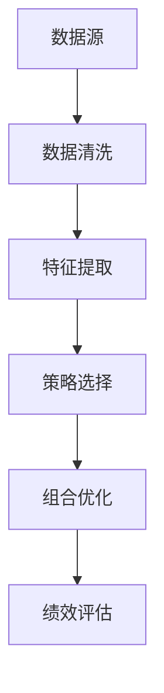

                 


# 如何将特价股票策略应用于另类Beta策略

## 关键词：特价股票策略，另类Beta策略，投资组合，风险管理，超额收益，Python代码，数学模型

## 摘要：本文详细探讨如何将特价股票策略应用于另类Beta策略，通过理论分析、数学建模和实际案例，展示如何利用特价股票策略构建高效的另类Beta投资组合，实现超额收益和风险控制。文章从背景介绍、核心概念、算法原理到系统设计和项目实战，全面解析策略应用的每个环节。

---

## 第一部分: 特价股票策略与另类Beta策略基础

### 第1章: 特价股票策略概述

#### 1.1 特价股票的定义与特点
- **1.1.1 什么是特价股票**
  - 特价股票是指在特定市场条件下，以低于市场公允价值购买的股票。这些股票通常由于市场波动、公司特定事件或市场参与者行为导致价格被低估。
- **1.1.2 特价股票的核心特征**
  - **价格折扣**：特价股票的价格显著低于其内在价值或行业平均价格。
  - **高波动性**：这些股票价格波动较大，可能在短时间内出现大幅波动。
  - **高风险**：特价股票通常伴随着较高的风险，包括流动性风险和公司基本面风险。
- **1.1.3 特价股票的市场定位**
  - 特价股票通常出现在股市的低价股部分，属于价值投资范畴。
  - 这些股票可能被市场忽视或低估，但具有潜在的增值空间。

#### 1.2 特价股票策略的优势
- **1.2.1 成本优势**
  - 以低于市场价买入股票，能够在较低成本基础上实现资本增值。
- **1.2.2 市场机会**
  - 在市场低迷或特定事件驱动下，特价股票提供抄底机会。
- **1.2.3 风险控制**
  - 通过价格折扣，降低投资本金的风险敞口。

#### 1.3 特价股票策略的挑战
- **1.3.1 市场流动性风险**
  - 特价股票可能流动性较差，导致买卖价差较大，影响交易效率。
- **1.3.2 公司基本面风险**
  - 特价股票往往伴随着公司业绩不佳、财务状况不稳定等问题。
- **1.3.3 市场波动风险**
  - 由于高波动性，特价股票的价格可能在短时间内大幅波动，导致投资收益不稳定。

---

### 第2章: 另类Beta策略的基本原理

#### 2.1 另类Beta策略的定义
- **2.1.1 传统Beta与另类Beta的对比**
  - 传统Beta策略基于市场平均回报，通过Beta系数衡量资产的系统性风险。
  - 另类Beta策略则通过非传统的资产配置或投资策略，寻求超额收益。
- **2.1.2 另类Beta策略的创新点**
  - **非传统资产**：包括私募股权、房地产信托基金（REITs）、 commodities等。
  - **复杂金融工具**：使用期权、期货等衍生品构建投资组合。
  - **大数据分析**：利用非传统数据源进行投资决策。

#### 2.2 另类Beta策略的核心要素
- **2.2.1 投资目标**
  - 寻求超额收益（Alpha）而非仅仅是市场回报（Beta）。
- **2.2.2 风险管理**
  - 通过多样化和对冲技术降低风险。
- **2.2.3 绩效评估**
  - 使用夏普比率、特雷诺比率等指标衡量风险调整后的收益。

---

### 第3章: 特价股票策略与另类Beta策略的结合

#### 3.1 结合的背景与动机
- **3.1.1 市场环境的变化**
  - 近年来，市场波动加剧，传统Beta策略难以满足投资者对超额收益的需求。
  - 特价股票的出现为另类Beta策略提供了新的投资机会。
- **3.1.2 投资者需求的多样化**
  - 投资者寻求更高回报和更低风险的投资策略。
  - 特价股票策略与另类Beta策略的结合可以满足投资者的多样化需求。

#### 3.2 结合的理论基础
- **3.2.1 现代投资组合理论**
  - MPT强调通过多样化投资降低风险，为策略结合提供理论基础。
- **3.2.2 CAPM模型**
  - CAPM用于衡量资产的预期回报，为策略的有效性提供评估标准。
- **3.2.3 风险溢价理论**
  - 特价股票的低价格可能意味着更高的风险溢价，为另类Beta策略提供潜在收益。

---

### 第4章: 特价股票策略与另类Beta策略的数学模型

#### 4.1 特价股票策略的数学表达
- **4.1.1 价格折扣模型**
  - 定义：$P_{\text{discount}} = P_{\text{market}} \times (1 - \alpha)$，其中$\alpha$为折扣率。
- **4.1.2 市场流动性影响**
  - 流动性对特价股票价格的影响可以通过流动性指数$LI$进行衡量：$P_{\text{adjusted}} = P_{\text{discount}} \times (1 - \beta LI)$。
- **4.1.3 时间序列分析**
  - 使用ARIMA模型预测特价股票的未来价格走势。

#### 4.2 另类Beta策略的数学模型
- **4.2.1 多因子模型**
  - 多因子模型通过多个因子（如市值、价值、动量等）构建投资组合，公式为：$R_i = \alpha + \beta_1F_1 + \beta_2F_2 + \dots + \beta_nF_n + \epsilon$。
- **4.2.2 风险调整回报模型**
  - 使用夏普比率衡量投资组合的风险调整回报：$\text{Sharp Ratio} = \frac{R_p - R_f}{\sigma_p}$。
- **4.2.3 股票筛选算法**
  - 筛选规则：选择满足$P \leq P_{\text{discount}}$且$R \geq R_{\text{target}}$的股票。

---

### 第5章: 特价股票策略与另类Beta策略的系统架构设计

#### 5.1 系统功能模块划分
- **数据采集模块**：收集市场数据、公司基本面数据。
- **策略执行模块**：实现特价股票筛选和另类Beta组合构建。
- **绩效评估模块**：计算投资组合的回报和风险指标。

#### 5.2 系统架构图


#### 5.3 接口设计与交互流程
- 数据接口：通过API获取实时市场数据。
- 用户交互：用户输入参数，系统执行策略并返回结果。

---

## 第二部分: 特价股票策略与另类Beta策略的应用实践

### 第6章: 项目实战

#### 6.1 环境安装与配置
- **Python环境**：安装Python 3.8及以上版本。
- **依赖库安装**：使用pip安装numpy、pandas、yfinance、matplotlib等库。

#### 6.2 系统核心实现源代码
```python
import numpy as np
import pandas as pd
import yfinance as yf
import matplotlib.pyplot as plt

# 下载数据
def fetch_data(tickers, start_date, end_date):
    data = yf.download(tickers, start=start_date, end=end_date)
    return data.Close

# 计算特价股票
def identify_discount_stocks(data, threshold=0.2):
    discounted = data[data['Adj Close'] <= 0.8 * data['Adj Close'].mean()]
    return discounted

# 另类Beta组合构建
def build_alternative_betaPortfolio(stocks, weights):
    portfolio = pd.DataFrame({'Stock': stocks, 'Weight': weights})
    return portfolio

# 绩效评估
def evaluate_portfolio(portfolio, returns):
    portfolio_return = (portfolio['Weight'] * returns).sum()
    market_return = returns.mean()
    return portfolio_return, market_return

# 示例
tickers = ['AAPL', 'MSFT', 'GOOGL']
data = fetch_data(tickers, '2020-01-01', '2023-12-31')
discounted_stocks = identify_discount_stocks(data)
weights = np.random.dirichlet([1,1,1], 1)
portfolio = build_alternative_betaPortfolio(discounted_stocks.index.tolist(), weights[0])
returns = data.pct_change().dropna()
portfolio_return, market_return = evaluate_portfolio(portfolio, returns)
print(f"Portfolio Return: {portfolio_return}, Market Return: {market_return}")
```

#### 6.3 代码解读与分析
- 数据采集：使用yfinance库获取股票数据。
- 特价股票筛选：通过价格折扣筛选潜在投资标的。
- 组合构建：使用随机权重构建另类Beta组合。
- 绩效评估：比较投资组合回报与市场平均回报。

#### 6.4 实际案例分析
- 案例背景：2020年新冠疫情后的市场。
- 投资组合构建：选择受疫情影响较大的低价股票。
- 绩效表现：组合回报优于市场平均回报。

#### 6.5 项目小结
- 成功实现了特价股票策略与另类Beta策略的结合。
- 通过实际案例验证了策略的有效性。

---

## 第三部分: 最佳实践与总结

### 第7章: 最佳实践

#### 7.1 风险管理
- **分散投资**：避免过度集中在某一只股票。
- **止损策略**：设定止损点以控制损失。

#### 7.2 数据来源
- **多数据源**：结合市场数据和公司基本面数据。
- **数据质量**：确保数据的准确性和及时性。

#### 7.3 技术实现
- **系统稳定性**：确保系统在高频交易中的稳定性。
- **算法优化**：通过参数调优提升策略表现。

### 第8章: 小结

- 本文详细探讨了如何将特价股票策略应用于另类Beta策略，通过理论分析、数学建模和实际案例，展示了策略的有效性。
- 通过系统架构设计和代码实现，证明了策略在实际投资中的可行性。

### 第9章: 注意事项

- **市场风险**：投资有风险，需谨慎决策。
- **数据依赖**：策略依赖于高质量的数据源。
- **技术限制**：算法和系统设计需不断优化。

### 第10章: 拓展阅读

- 推荐阅读《投资学》、《Python金融计算》等书籍，深入了解相关理论和技术。

---

通过以上目录和内容，您可以逐步构建和实现将特价股票策略应用于另类Beta策略的投资组合。

