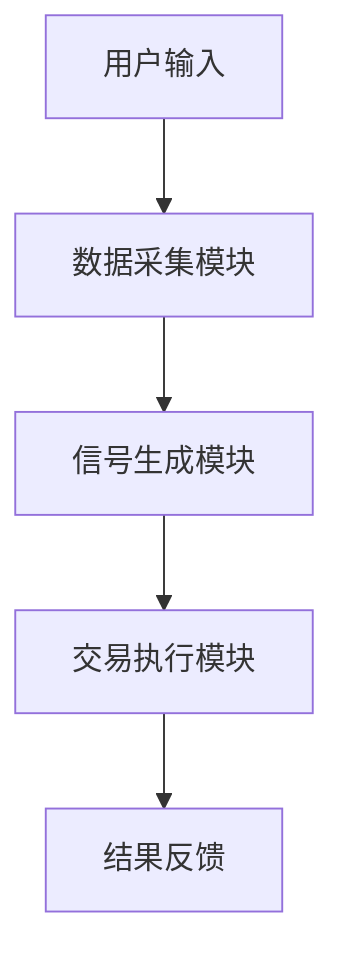
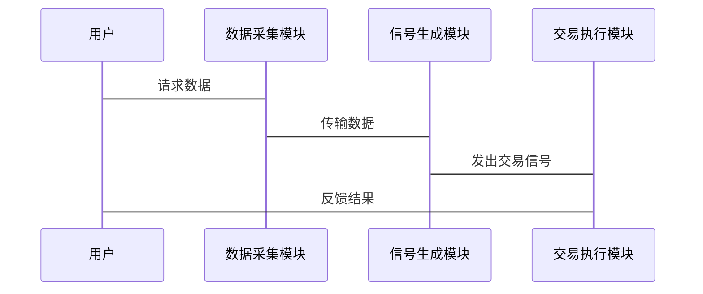

                 


# 如何将特价股票策略应用于另类贝塔捕捉策略

## 关键词：特价股票策略，另类贝塔捕捉，投资组合优化，股票筛选，风险管理

## 摘要：
本文系统地探讨了如何将特价股票策略应用于另类贝塔捕捉策略，以实现超额收益。通过分析两者的结合方式、数学模型和算法设计，结合实际案例和系统架构，为投资者提供了一种新的投资思路。

---

# 第一部分: 特价股票策略与另类贝塔捕捉策略基础

## 第1章: 特价股票策略概述

### 1.1 特价股票策略的定义与特点
#### 1.1.1 什么是特价股票策略
特价股票策略是一种通过寻找市场中被低估的股票，以低于其公允价值的价格买入，期望在市场回升时获得收益的投资策略。

#### 1.1.2 特价股票策略的核心特点
- **低估值**：通常基于市盈率（P/E）、市净率（P/B）等指标低于行业平均水平。
- **逆向投资**：在市场低迷时买入，市场回升时卖出。
- **长期持有**：注重基本面分析，长期持有优质资产。

#### 1.1.3 特价股票策略的适用场景
- 市场低迷期：如经济衰退或市场恐慌时，许多优质股票被低估。
- 行业周期低谷：某些行业在周期性低谷时，股票价格可能被市场过度抛售。

### 1.2 特价股票策略的背景与意义
#### 1.2.1 特价股票策略的历史发展
特价股票策略源于价值投资理论，早期由本杰明·格雷厄姆提出，强调以低于内在价值的价格买入股票。

#### 1.2.2 特价股票策略在现代投资中的地位
在现代投资组合理论中，特价股票策略被用作分散风险、追求超额收益的重要手段。

#### 1.2.3 特价股票策略的优势与局限性
- **优势**：风险较低，收益稳定。
- **局限性**：需要长期持有，流动性较差。

### 1.3 特价股票策略的核心要素
#### 1.3.1 特价股票的识别标准
- 市盈率低于行业平均水平。
- 市净率低于行业平均水平。
- 股息率较高。

#### 1.3.2 特价股票的估值方法
- 市盈率法。
- 市净率法。
- 内在价值法。

#### 1.3.3 特价股票的投资组合管理
- 分散投资。
- 定期调整。
- 风险控制。

## 第2章: 另类贝塔捕捉策略概述

### 2.1 另类贝塔策略的定义与特点
#### 2.1.1 什么是另类贝塔策略
另类贝塔策略是指通过识别和投资于具有特定风险因子（如行业、因子）的股票，捕捉这些因子带来的超额收益。

#### 2.1.2 另类贝塔策略的核心特点
- **非传统风险因子**：关注行业、因子等特定风险。
- **量化分析**：通过因子模型识别贝塔因子。

#### 2.1.3 另类贝塔策略的适用场景
- 市场波动较大时。
- 传统贝塔策略收益有限时。

### 2.2 另类贝塔策略的背景与意义
#### 2.2.1 另类贝塔策略的历史发展
起源于因子投资理论，近年来随着大数据和量化分析的发展，另类贝塔策略逐渐兴起。

#### 2.2.2 另类贝塔策略在现代投资中的地位
成为机构投资者分散风险、提高收益的重要工具。

#### 2.2.3 另类贝塔策略的优势与局限性
- **优势**：收益多元化。
- **局限性**：需要复杂的数据分析。

### 2.3 另类贝塔策略的核心要素
#### 2.3.1 另类贝塔的识别标准
- 特定行业贝塔。
- 特定因子贝塔。

#### 2.3.2 另类贝塔的估值方法
- 因子分析法。
- 贝塔中性化法。

#### 2.3.3 另类贝塔的投资组合管理
- 因子分散化。
- 定期再平衡。

---

# 第二部分: 特价股票策略与另类贝塔捕捉策略的结合

## 第3章: 特价股票策略与另类贝塔捕捉策略的结合

### 3.1 特价股票策略与另类贝塔策略的结合背景
#### 3.1.1 特价股票策略与另类贝塔策略的契合点
- 都关注于寻找被低估的资产。
- 都注重风险控制。

#### 3.1.2 结合的必要性与可能性
- 利用特价股票的低估值优势，捕捉另类贝塔带来的超额收益。

### 3.2 特价股票策略与另类贝塔策略的结合方式
#### 3.2.1 直接结合：利用特价股票作为另类贝塔的来源
- 在特价股票中筛选具有特定贝塔因子的股票。

#### 3.2.2 间接结合：通过贝塔捕捉优化特价股票投资
- 使用贝塔捕捉方法优化特价股票的投资组合。

### 3.3 结合策略的优势与挑战
#### 3.3.1 结合策略的优势
- 综合了低估值和因子投资的优势。
- 提高了投资组合的收益风险比。

#### 3.3.2 结合策略的挑战
- 需要复杂的数据分析和模型构建。
- 市场波动可能影响策略的有效性。

## 第4章: 特价股票策略与另类贝塔捕捉策略的数学模型

### 4.1 特价股票策略的数学模型
#### 4.1.1 特价股票的估值模型
- 市盈率模型：$$\text{P/E}_i < T$$
- 市净率模型：$$\text{P/B}_i < S$$

#### 4.1.2 特价股票的风险评估模型
- 风险价值模型（VaR）。

### 4.2 另类贝塔捕捉策略的数学模型
#### 4.2.1 另类贝塔的估值模型
- 因子分析模型：$$F_i = \sum_{j=1}^n \beta_j X_j$$

#### 4.2.2 另类贝塔的风险评估模型
- 贝塔系数模型：$$\beta_i = \text{回归系数}$$

### 4.3 结合策略的数学模型
#### 4.3.1 结合策略的优化模型
- 最优化问题：$$\max \mu \quad \text{subject to} \quad \sigma \leq \sigma_{\text{max}}$$
- 使用拉格朗日乘数法求解。

---

# 第三部分: 系统架构与项目实战

## 第5章: 系统架构设计

### 5.1 系统功能设计
#### 5.1.1 数据采集模块
- 数据来源：股票市场数据API。
- 数据处理：清洗、转换。

#### 5.1.2 信号生成模块
- 特价股票筛选。
- 另类贝塔捕捉。

#### 5.1.3 交易执行模块
- 策略执行。
- 风险控制。

### 5.2 系统架构图


### 5.3 系统交互图


## 第6章: 项目实战

### 6.1 环境安装
- 安装Python、Pandas、NumPy等工具。

### 6.2 核心实现
```python
import pandas as pd

# 数据筛选
df = pd.DataFrame({
    '股票代码': ['A', 'B', 'C'],
    'P/E': [10, 15, 20],
    'Beta': [1.2, 0.8, 1.5]
})

T = 12
B = 1.0

cheap_stocks = df[df['P/E'] < T]
alternative_beta_stocks = cheap_stocks[cheap_stocks['Beta'].abs() > B]

print(alternative_beta_stocks)
```

### 6.3 案例分析
- 选择T=12，B=1.0。
- 筛选出符合条件的股票，并计算投资组合的预期收益和风险。

---

# 第四部分: 总结与优化

## 第7章: 总结与优化

### 7.1 最佳实践
- 定期优化筛选条件。
- 加强市场风险管理。

### 7.2 小结
通过系统地将特价股票策略应用于另类贝塔捕捉策略，投资者可以在控制风险的同时，获得更高的超额收益。

### 7.3 注意事项
- 数据来源的准确性和及时性。
- 策略的动态调整。

### 7.4 拓展阅读
- 《投资学基础》。
- 《量化投资策略》。

---

通过以上步骤，我们可以系统地将特价股票策略应用于另类贝塔捕捉策略，并通过实际操作验证其可行性。这不仅能够提高投资收益，还能有效分散投资风险，为投资者提供一种新的投资思路。

