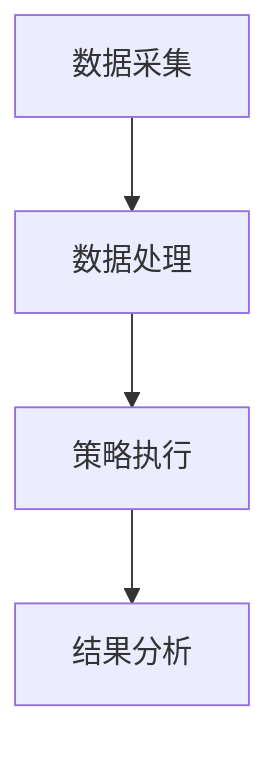
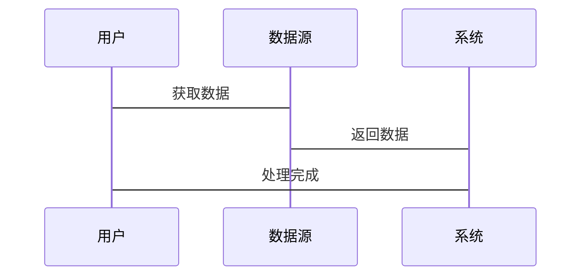

                 


# 如何将特价股票策略应用于商品期货投资

## 关键词

特价股票策略，商品期货，套利定价模型，时间序列分析，系统架构设计，Python代码实现

## 摘要

本文详细探讨如何将特价股票策略应用于商品期货投资。通过背景介绍、核心概念分析、算法设计、系统架构、项目实战和最佳实践，系统阐述特价股票策略在商品期货中的应用，帮助投资者有效利用价格波动获取收益。

## 第1章：特价股票策略概述

### 1.1 特价股票策略的定义与特点

#### 1.1.1 特价股票的定义

特价股票是指低于市场价的股票，通常在特定市场条件下出现，如公司重组、财务困境或市场波动。特价股票策略旨在利用这些价格差异，通过买入低价股票并在期货市场对冲或套利来获利。

#### 1.1.2 特价股票策略的核心要素

- 市场时机：识别低价股票出现的时间窗口。
- 风险评估：分析投资风险，包括市场波动、流动性风险等。
- 对冲策略：利用期货市场进行风险对冲，锁定利润。

#### 1.1.3 特价股票策略的优缺点对比

| 特性 | 优点 | 缺点 |
|------|------|------|
| 风险控制 | 有效对冲市场波动 | 需要较高的市场敏感度 |
| 收益潜力 | 高收益机会 | 市场波动大，风险高 |
| 操作复杂度 | 简单策略易操作 | 复杂策略需要专业技能 |

### 1.2 商品期货投资的基本概念

#### 1.2.1 商品期货市场的运作机制

商品期货市场通过标准化合约进行交易，参与者包括生产商、贸易商和投资者。市场机制确保价格发现和风险对冲，交易活动受监管机构监管。

#### 1.2.2 商品期货交易的基本原理

商品期货交易基于对未来价格的预测，投资者通过买入或卖出合约来对冲或投机价格变动。期货价格反映市场预期，受供需、宏观经济和地缘政治因素影响。

#### 1.2.3 商品期货市场的参与者与角色

- 交易商：参与买卖，进行套利或投机。
- 生产商：利用期货对冲价格波动风险。
- 投资者：通过期货投资多样化的资产组合。

## 第2章：特价股票策略与商品期货的关系

### 2.1 特价股票策略在商品期货中的应用场景

#### 2.1.1 套利机会的识别

套利机会存在于现货与期货价格差异，通过同时买入低价股票和卖出期货合约，利用价格收敛获利。

#### 2.1.2 市场波动的预测

分析历史价格波动，识别趋势和周期，预测未来价格走势，指导投资决策。

#### 2.1.3 风险对冲的策略

利用期货市场对冲股票价格波动风险，锁定部分收益，降低投资组合的整体波动性。

### 2.2 商品期货市场的价格波动分析

#### 2.2.1 影响商品期货价格的主要因素

- 宏观经济因素：通货膨胀、利率变化。
- 供需关系：生产量、消费量。
- 地缘政治：战争、政策变化影响供应。

#### 2.2.2 市场趋势的识别方法

通过技术分析（如移动平均线、MACD）和基本面分析（如公司财报、行业趋势）识别市场趋势。

#### 2.2.3 价格波动的周期性分析

分析价格波动的历史周期，识别周期性模式，预测未来价格走势。

## 第3章：特价股票策略的数学模型与算法

### 3.1 套利定价模型

#### 3.1.1 套利定价理论的概述

套利定价理论认为，资产的预期收益由其系统性风险决定，无套利机会的市场中，相同风险的资产应有相同预期收益。

#### 3.1.2 套利定价模型的数学表达

$$ E(r_i) = r_f + \beta_i (E(r_m) - r_f) $$

其中，\( E(r_i) \) 是资产i的预期收益，\( r_f \) 是无风险利率，\( \beta_i \) 是资产i的贝塔系数，\( E(r_m) \) 是市场预期收益。

#### 3.1.3 套利定价模型的应用实例

使用Python实现套利定价模型，计算资产的预期收益，并与实际收益对比，验证模型的有效性。

```python
import numpy as np
import pandas as pd

# 示例数据
returns = pd.DataFrame({'r1': [0.1, 0.2, 0.15], 'r2': [0.15, 0.1, 0.2]})
rf = 0.05
market_beta = [1.2, 0.8]

# 计算预期收益
expected_returns = rf + np.array(market_beta) * (returns.mean().values - rf)

print(expected_returns)
```

### 3.2 时间序列分析模型

#### 3.2.1 时间序列分析的基本概念

时间序列分析研究数据随时间的变化模式，常用模型包括ARIMA和GARCH。

#### 3.2.2 ARIMA模型的构建与应用

ARIMA（自回归积分移动平均）模型用于预测未来值。其结构为：

$$ ARIMA(p, d, q) $$

其中，p为自回归阶数，d为差分阶数，q为移动平均阶数。

#### 3.2.3 GARCH模型在风险管理中的应用

GARCH（广义自回归条件异方差）模型用于估计金融资产的波动性，公式为：

$$ \sigma_t^2 = a + b r_{t-1}^2 + c \sigma_{t-1}^2 $$

其中，\( \sigma_t^2 \) 是t时刻的波动性，\( r_{t-1} \) 是前一时刻的收益，a、b、c是参数。

### 3.3 算法实现与代码示例

#### 3.3.1 套利策略的算法实现

套利策略的步骤包括：识别价差、建立头寸、监控价差变化、平仓获利。使用Python实现：

```python
import pandas as pd
import numpy as np

# 示例数据
spot_prices = pd.Series([100, 105, 103, 108, 110])
future_prices = pd.Series([102, 107, 104, 109, 111])

# 计算价差
spread = future_prices - spot_prices

# 识别套利机会
mean_spread = spread.mean()
std_spread = spread.std()

# 执行套利
threshold = 2 * std_spread
entry_spread = spread[spread > threshold]
```

#### 3.3.2 时间序列预测的算法实现

使用ARIMA模型预测商品期货价格，代码如下：

```python
from statsmodels.tsa.arima_model import ARIMA

# 示例数据
data = pd.Series([100, 105, 103, 108, 110, 112])

# 拟合ARIMA模型
model = ARIMA(data, order=(1, 1, 1))
model_fit = model.fit()

# 预测未来值
forecast = model_fit.forecast(steps=5)
print(forecast)
```

## 第4章：系统设计与架构

### 4.1 系统架构设计

#### 4.1.1 系统功能模块划分

- 数据采集模块：收集股票和期货市场数据。
- 数据处理模块：清洗和预处理数据。
- 策略执行模块：实施特价股票策略。
- 结果分析模块：评估策略表现。

#### 4.1.2 系统架构图



#### 4.1.3 接口设计与交互流程图



## 第5章：项目实战

### 5.1 项目介绍

通过一个具体案例，展示如何在商品期货市场应用特价股票策略，从环境安装到策略实现，详细指导读者操作。

### 5.2 核心实现

#### 5.2.1 环境安装

安装必要的Python库，如pandas、numpy、statsmodels等。

```bash
pip install pandas numpy statsmodels
```

#### 5.2.2 数据获取

从数据源获取股票和期货市场数据，清洗数据，处理缺失值和异常值。

```python
import pandas as pd

data = pd.read_csv('data.csv')
data.dropna(inplace=True)
```

#### 5.2.3 策略实现

实现特价股票策略，包括识别套利机会、执行交易和监控风险。

```python
def execute_strategy(data):
    # 计算价差
    spread = data['future_price'] - data['spot_price']
    # 识别套利机会
    mean_spread = spread.mean()
    std_spread = spread.std()
    entry_spread = spread[spread > mean_spread + 2*std_spread]
    return entry_spread

# 执行策略
entry_points = execute_strategy(data)
```

#### 5.2.4 结果分析

分析策略的收益和风险，计算收益、风险指标（如VaR）并可视化结果。

```python
import matplotlib.pyplot as plt

returns.plot(kind='hist')
plt.show()
```

## 第6章：最佳实践

### 6.1 小结

总结特价股票策略在商品期货投资中的应用，强调策略的有效性和潜在风险。

### 6.2 注意事项

- 数据质量：确保数据准确可靠。
- 模型选择：根据市场情况选择合适模型。
- 风险管理：合理控制仓位，避免过度杠杆。

### 6.3 拓展阅读

推荐相关书籍和资源，供读者深入学习。

## 结语

通过本文的详细指导，读者可以系统地将特价股票策略应用于商品期货投资，利用数学模型和系统架构实现有效的投资策略。希望本文能为投资者提供有价值的参考，帮助他们在复杂的市场环境中获取稳健收益。

