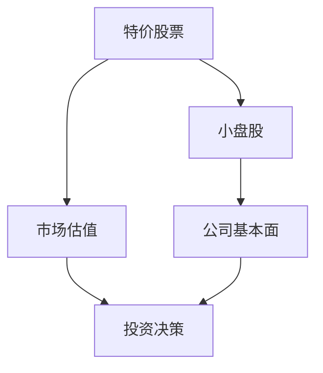
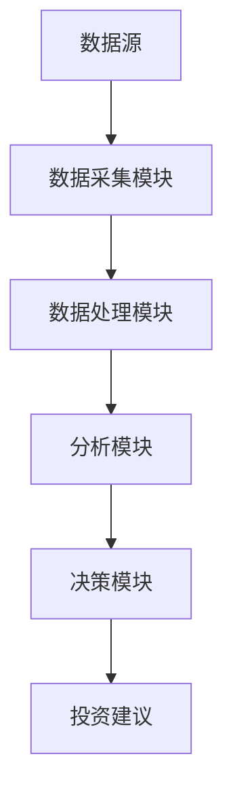

                 


# 如何将特价股票策略应用于小盘股投资

## 关键词：特价股票，小盘股，投资策略，数据分析，数学模型

## 摘要：  
本文详细探讨了如何将特价股票策略应用于小盘股投资。通过分析特价股票和小盘股的定义、特点及相互关系，结合数据分析与数学建模，提出了一个系统化的投资策略。文章内容包括背景介绍、核心概念、算法原理、系统架构、项目实战以及最佳实践等部分，旨在为投资者提供一套科学有效的投资方法。

---

# 目录

## 第1章 背景介绍

### 1.1 特价股票的定义与特点  
- **1.1.1 特价股票的定义**  
  特价股票是指价格低于其内在价值的股票，通常由于市场波动、公司困境或暂时性因素导致价格被低估。  
- **1.1.2 特价股票的特点**  
  - 价格低于市场均值  
  - 具有较高的潜在回报  
  - 风险较高，但机会成本较低  

### 1.2 小盘股的定义与特点  
- **1.2.1 小盘股的定义**  
  小盘股是指市值较小的公司股票，通常在30亿至50亿美元之间的公司。  
- **1.2.2 小盘股的特点**  
  - 流动性较低  
  - 市场波动性较大  
  - 高增长潜力  

### 1.3 特价股票策略与小盘股投资的结合  
- **1.3.1 理论基础**  
  - 价值投资理论：寻找被市场低估的股票  
  - 小盘股市场的独特性：高增长潜力与低估值并存  
- **1.3.2 应用场景**  
  - 经济低迷时期：小盘股可能因市场忽视而被低估  
  - 行业周期性：某些行业的小盘股可能因周期性波动而被低估  

---

## 第2章 核心概念与联系

### 2.1 特价股票与小盘股的比较  
- **2.1.1 特价股票与小盘股的异同**  
  | 特性         | 特价股票          | 小盘股          |  
  |--------------|-------------------|-----------------|  
  | 市值         | 不限              | 较小            |  
  | 流动性       | 较高              | 较低            |  
  | 风险         | 高                | 高              |  
  | 潜在回报     | 中高              | 高              |  

- **2.1.2 特价股票与小盘股的联系**  
  - 小盘股更容易出现低估情况  
  - 特价股票策略适用于小盘股的筛选  

### 2.2 数据驱动的决策  
- **2.2.1 数据的重要性**  
  - 市场数据：价格、成交量、市盈率等  
  - 公司数据：财务报表、管理团队、行业地位等  

### 2.3 实体关系图（ER图）  


---

## 第3章 算法原理

### 3.1 数据预处理  
- **3.1.1 数据清洗**  
  - 去除缺失值  
  - 处理异常值  

- **3.1.2 数据标准化**  
  - 对数值进行标准化处理，便于模型训练  

### 3.2 算法选择  
- **3.2.1 线性回归模型**  
  用于预测股票价格，公式如下：  
  $$ y = \beta_0 + \beta_1x + \epsilon $$  
  其中，$y$ 是目标变量（股票价格），$x$ 是自变量（如市盈率、市净率），$\beta_0$ 和 $\beta_1$ 是回归系数，$\epsilon$ 是误差项。  

- **3.2.2 K-均值聚类**  
  用于将股票分为不同的类别，公式如下：  
  $$ \text{距离} = \sqrt{(x_i - x_j)^2 + (y_i - y_j)^2} $$  
  其中，$x_i$ 和 $y_i$ 分别表示第 $i$ 只股票的市盈率和市净率。  

### 3.3 模型实现  
```python
import pandas as pd
import numpy as np
from sklearn.linear_model import LinearRegression

# 假设data是包含股票数据的DataFrame
# 特征变量：市盈率（P/E）、市净率（P/B）
X = data[['P/E', 'P/B']]
y = data['Price']

# 训练模型
model = LinearRegression()
model.fit(X, y)

# 预测价格
predicted_price = model.predict(X)
```

### 3.4 模型评估  
- **3.4.1 拟合度**  
  使用 $R^2$ 评估模型拟合程度：  
  $$ R^2 = 1 - \frac{\sum (y_i - \hat{y_i})^2}{\sum (y_i - \bar{y})^2} $$  

- **3.4.2 交叉验证**  
  使用 k折交叉验证评估模型的泛化能力。  

---

## 第4章 系统架构设计

### 4.1 系统功能设计  
- **数据采集模块**  
  - 从金融数据源获取股票数据  
- **数据处理模块**  
  - 清洗、标准化数据  
- **分析模块**  
  - 应用回归模型和聚类算法筛选特价股票  
- **决策模块**  
  - 根据分析结果生成投资建议  

### 4.2 系统架构图  


---

## 第5章 项目实战

### 5.1 实战背景  
- 选择某时间段内小盘股的数据，分析其价格波动情况。  

### 5.2 数据获取与处理  
```python
import pandas as pd
import numpy as np

# 假设data为小盘股数据
data = pd.read_csv('small_cap_stocks.csv')
data.head()
```

### 5.3 模型训练与预测  
```python
from sklearn.linear_model import LinearRegression

X = data[['P/E', 'P/B']]
y = data['Price']

model = LinearRegression()
model.fit(X, y)

predicted_prices = model.predict(X)
```

### 5.4 结果分析  
- 比较实际价格与预测价格，评估模型的准确性。  
- 识别低估的股票，作为投资目标。  

---

## 第6章 最佳实践与注意事项

### 6.1 最佳实践  
- 定期更新数据，保持模型的有效性  
- 结合技术分析，综合判断投资机会  

### 6.2 注意事项  
- 小盘股的流动性风险较高，需谨慎选择  
- 市场波动较大时，策略可能失效，需及时调整  

### 6.3 拓展阅读  
- 《价值投资入门》  
- 《小盘股投资策略》  

---

## 第7章 总结

本文详细探讨了如何将特价股票策略应用于小盘股投资，通过数据分析和数学建模，提出了一套系统化的投资方法。投资者可以根据本文的指导，结合实际情况，灵活运用该策略，提高投资收益。

