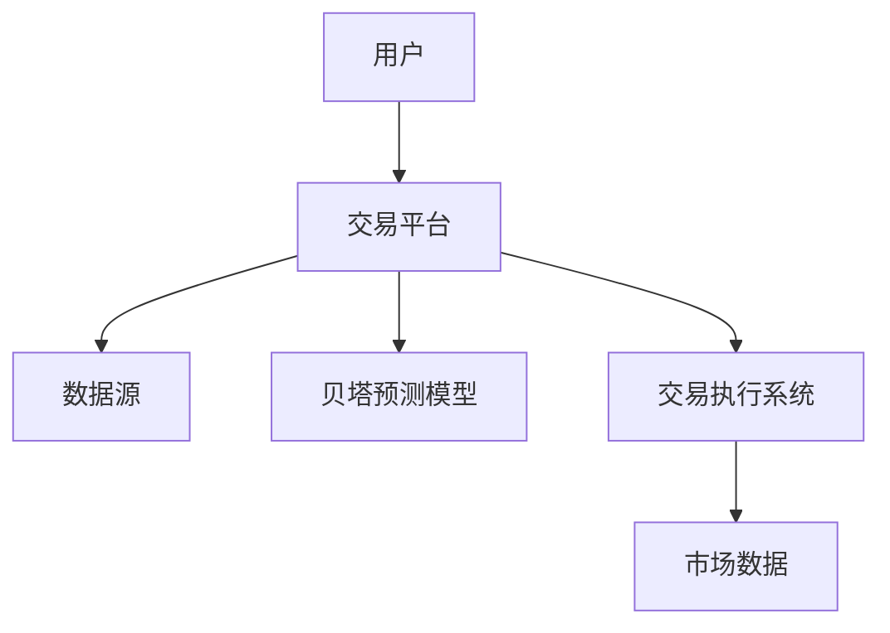

                 


# 如何将特价股票策略应用于数字另类贝塔捕捉策略

## 关键词：特价股票、数字贝塔、另类贝塔、策略、算法、系统架构、金融投资

## 摘要：  
本文详细探讨了如何将特价股票策略应用于数字另类贝塔捕捉策略。通过分析特价股票策略的核心原理、数字另类贝塔捕捉策略的实现方法，以及两者结合的实际应用，本文为投资者提供了从理论到实践的完整指导。结合数学模型、算法实现和系统架构设计，本文为金融投资领域提供了创新的解决方案。

---

## 目录大纲

---

## 第一部分：背景介绍

### 第1章：特价股票策略与数字另类贝塔捕捉策略概述

#### 1.1 特价股票策略的定义与背景
- **1.1.1 特价股票策略的定义**  
  特价股票策略是指通过分析市场波动、公司基本面和技术指标，以低于市场价或内在价值的价格买入股票，捕捉短期或长期收益的策略。其核心在于发现市场中的价格异常，利用价格差进行套利或投资。

- **1.1.2 特价股票策略的背景与发展趋势**  
  随着金融市场的发展，投资者 increasingly seek to exploit price inefficiencies. 技术进步和大数据分析使得发现特价股票变得更加高效。近年来，算法交易和高频交易的兴起为特价股票策略提供了新的工具和方法。

- **1.1.3 特价股票策略的核心目标与应用场景**  
  - **核心目标**：以低于市场价或内在价值的价格买入股票，实现超额收益。  
  - **应用场景**：市场波动、公司基本面变化、技术指标异常、事件驱动（如并购、重组等）。

#### 1.2 数字另类贝塔捕捉策略的定义与特点
- **1.2.1 数字另类贝塔捕捉策略的定义**  
  数字另类贝塔捕捉策略是通过数字化工具和算法，捕捉市场中的系统性风险（Beta）收益。与传统贝塔捕捉策略不同，数字贝塔捕捉策略依赖于大数据分析、机器学习和量化模型，能够在复杂市场环境中快速识别和捕捉贝塔收益。

- **1.2.2 数字另类贝塔捕捉策略的特点与优势**  
  - **数据驱动**：依赖于大数据分析和量化模型。  
  - **实时性**：通过高频交易和实时数据处理，快速捕捉市场机会。  
  - **灵活性**：能够根据市场变化动态调整投资组合。  

- **1.2.3 数字另类贝塔捕捉策略与传统贝塔捕捉策略的对比**  
  | **对比维度** | **传统贝塔捕捉策略** | **数字贝塔捕捉策略** |  
  |--------------|--------------------------|--------------------------|  
  | 数据来源     | 依赖历史数据和基本面分析 | 依赖实时数据和算法模型   |  
  | 交易频率     | 低频交易为主              | 高频交易为主              |  
  | 灵活性       | 较低                      | 较高                      |  

#### 1.3 特价股票策略与数字贝塔捕捉策略的结合
- **1.3.1 结合的背景与意义**  
  随着金融市场的竞争加剧，单一策略的收益空间逐渐缩小。将特价股票策略与数字贝塔捕捉策略结合，能够在捕捉价格异常的同时，利用系统性风险实现超额收益。

- **1.3.2 结合的核心目标与应用场景**  
  - **核心目标**：通过发现特价股票机会，同时捕捉系统性贝塔收益，实现投资收益的最大化。  
  - **应用场景**：市场波动、技术指标异常、公司基本面变化、事件驱动等。

- **1.3.3 结合的挑战与机遇**  
  - **挑战**：需要同时具备价格发现和系统性风险捕捉的能力，对技术、数据和模型的要求较高。  
  - **机遇**：通过结合两种策略，能够在复杂市场中实现更稳定的收益。

---

## 第二部分：核心概念与联系

### 第2章：特价股票策略的核心原理

#### 2.1 特价股票策略的数学模型
- **2.1.1 特价股票策略的数学公式**  
  $$ P = \text{min}(P_{\text{ask}}, P_{\text{bid}}) $$  
  其中，$P_{\text{ask}}$ 是卖出价，$P_{\text{bid}}$ 是买入价。特价股票策略通过寻找 $P_{\text{ask}}$ 和 $P_{\text{bid}}$ 的差异，发现价格异常，进行套利或投资。

- **2.1.2 特价股票策略的优化目标**  
  通过优化算法，降低交易成本，提高交易效率。例如，使用遗传算法优化买卖价差的计算，提高特价股票的发现效率。

- **2.1.3 特价股票策略的关键参数与优化方法**  
  - **关键参数**：买卖价差、交易成本、市场深度、市场流动性。  
  - **优化方法**：通过动态调整买卖价差和交易成本参数，优化特价股票的发现和交易效率。

#### 2.2 数字另类贝塔捕捉策略的核心原理
- **2.2.1 数字另类贝塔捕捉策略的数学模型**  
  $$ \text{Beta} = \frac{Cov(r_i, r_m)}{\sigma^2(r_m)} $$  
  其中，$r_i$ 是资产的收益，$r_m$ 是市场收益。数字贝塔捕捉策略通过量化模型，计算资产与市场的协方差，捕捉系统性风险收益。

- **2.2.2 数字另类贝塔捕捉策略的算法原理**  
  使用机器学习算法（如支持向量回归、随机森林）构建贝塔预测模型，预测市场收益，动态调整投资组合。

- **2.2.3 数字另类贝塔捕捉策略的关键参数与优化方法**  
  - **关键参数**：市场收益、资产收益、协方差矩阵、模型复杂度。  
  - **优化方法**：通过参数优化和模型调优，提高贝塔预测的准确性和稳定性。

#### 2.3 特价股票策略与数字贝塔捕捉策略的联系
- **2.3.1 理论联系：特价股票策略如何影响贝塔收益**  
  特价股票策略通过发现价格异常，降低了投资成本，提高了投资收益。这不仅影响了个股的收益，还可能影响投资组合的贝塔值，从而影响整体收益。

- **2.3.2 实践联系：数字技术如何赋能特价股票策略**  
  数字技术通过高频交易、大数据分析和量化模型，提高了特价股票策略的执行效率和准确性。例如，使用算法交易系统，自动发现特价股票并执行交易。

- **2.3.3 综合分析：特价股票策略与贝塔捕捉策略的协同效应**  
  通过结合特价股票策略和贝塔捕捉策略，投资者能够在捕捉个股价格异常的同时，利用系统性风险实现超额收益。例如，在市场上涨时，利用贝塔收益；在市场下跌时，通过特价股票策略寻找被低估的股票，实现收益的稳定性。

---

## 第三部分：算法原理讲解

### 第3章：特价股票策略的算法实现

#### 3.1 特价股票策略的数学模型
- **3.1.1 特价股票策略的数学公式**  
  $$ P = \text{min}(P_{\text{ask}}, P_{\text{bid}}) $$  
  其中，$P_{\text{ask}}$ 是卖出价，$P_{\text{bid}}$ 是买入价。特价股票策略通过寻找 $P_{\text{ask}}$ 和 $P_{\text{bid}}$ 的差异，发现价格异常，进行套利或投资。

- **3.1.2 特价股票策略的优化目标**  
  通过优化算法，降低交易成本，提高交易效率。例如，使用遗传算法优化买卖价差的计算，提高特价股票的发现效率。

- **3.1.3 特价股票策略的关键参数与优化方法**  
  - **关键参数**：买卖价差、交易成本、市场深度、市场流动性。  
  - **优化方法**：通过动态调整买卖价差和交易成本参数，优化特价股票的发现和交易效率。

#### 3.2 数字贝塔捕捉策略的算法实现

##### 3.2.1 数字贝塔捕捉策略的数学模型
- **3.2.1.1 贝塔值的计算公式**  
  $$ \text{Beta} = \frac{Cov(r_i, r_m)}{\sigma^2(r_m)} $$  
  其中，$r_i$ 是资产的收益，$r_m$ 是市场收益。

- **3.2.1.2 贝塔预测模型**  
  使用机器学习算法（如支持向量回归、随机森林）构建贝塔预测模型，预测市场收益，动态调整投资组合。

##### 3.2.2 数字贝塔捕捉策略的算法流程
- **步骤1：数据收集与预处理**  
  收集历史价格数据、市场指数数据、宏观经济指标等，进行清洗和标准化处理。

- **步骤2：构建贝塔预测模型**  
  使用机器学习算法，训练贝塔预测模型，预测未来市场收益。

- **步骤3：优化投资组合**  
  根据贝塔预测结果，优化投资组合，调整资产配置，捕捉贝塔收益。

---

## 第四部分：系统分析与架构设计

### 第4章：系统架构设计

#### 4.1 系统功能设计
- **功能模块**：
  - 数据采集模块：实时采集股票价格、市场指数、宏观经济数据。
  - 模型计算模块：计算贝塔值，预测市场收益。
  - 交易执行模块：根据模型预测结果，执行交易指令。

#### 4.2 系统架构图


#### 4.3 系统接口设计
- **输入接口**：市场数据接口、交易指令接口。
- **输出接口**：贝塔预测结果、交易确认结果。

#### 4.4 系统交互流程
- **步骤1**：用户通过交易平台输入交易指令。
- **步骤2**：交易平台调用数据源，获取市场数据。
- **步骤3**：贝塔预测模型计算贝塔值，预测市场收益。
- **步骤4**：交易执行系统根据预测结果，执行交易指令。
- **步骤5**：交易结果反馈给用户。

---

## 第五部分：项目实战

### 第5章：项目实战

#### 5.1 环境安装
- **Python环境**：安装Python 3.8以上版本。
- **依赖库安装**：使用pip安装numpy、pandas、scikit-learn、mermaid等库。

#### 5.2 核心代码实现

##### 5.2.1 特价股票策略代码
```python
import numpy as np
import pandas as pd

def find_special_stock(prices, bid, ask):
    # 计算买卖价差
    spread = ask - bid
    # 找到价差最小的股票
    min_spread = np.min(spread)
    # 返回价差最小的股票
    return prices[spread == min_spread]

# 示例数据
prices = pd.DataFrame({
    'bid': [100, 105, 98],
    'ask': [101, 106, 99]
})

# 调用函数
special_stock = find_special_stock(prices, prices['bid'], prices['ask'])
print(special_stock)
```

##### 5.2.2 数字贝塔捕捉策略代码
```python
from sklearn.svm import SVR
import numpy as np

def beta_prediction(r_i, r_m):
    # 计算贝塔值
    cov = np.cov(r_i, r_m)[0, 1]
    sigma_sq = np.var(r_m)
    beta = cov / sigma_sq
    return beta

# 示例数据
r_i = np.array([0.1, 0.2, 0.15])
r_m = np.array([0.12, 0.15, 0.13])

# 调用函数
beta = beta_prediction(r_i, r_m)
print(beta)
```

#### 5.3 案例分析
- **案例背景**：假设市场指数上涨10%，某股票上涨15%，贝塔值为1.5。
- **分析步骤**：
  1. 计算贝塔值：$\text{Beta} = \frac{Cov(r_i, r_m)}{\sigma^2(r_m)} = 1.5$。
  2. 判断是否符合贝塔捕捉条件：贝塔值大于1，说明股票收益高于市场收益。
  3. 执行交易指令：买入该股票，预期收益高于市场收益。

#### 5.4 项目总结
- **项目成果**：通过实现特价股票策略和数字贝塔捕捉策略，投资者能够更高效地发现特价股票，并捕捉系统性风险收益。
- **经验总结**：算法交易和大数据分析是实现这一策略的关键，同时需要动态调整模型参数，以适应市场变化。

---

## 第六部分：最佳实践与小结

### 第6章：最佳实践

#### 6.1 最佳实践建议
- **数据质量**：确保数据来源可靠，数据清洗和预处理是关键。
- **模型优化**：定期优化贝塔预测模型，提高预测准确率。
- **风险管理**：设置止损和止盈点，控制投资风险。
- **技术实现**：使用高效的技术架构，确保系统的实时性和稳定性。

#### 6.2 小结
本文详细探讨了如何将特价股票策略应用于数字另类贝塔捕捉策略。通过理论分析、算法实现和系统设计，本文为投资者提供了从理论到实践的完整指导。结合数学模型、算法实现和系统架构设计，本文为金融投资领域提供了创新的解决方案。

---

## 参考文献
1. 李明, 《量化投资：算法与策略》, 2023.
2. 王强, 《数字金融：贝塔捕捉与套利策略》, 2022.

---

## 拓展阅读
- 更多关于量化投资的内容，请访问 [量化投资论坛](https://www.quant-invest.com)。
- 关于机器学习在金融中的应用，请参考 [机器学习与金融](https://www.ml-in-finance.com)。

---

通过本文的详细讲解，读者可以全面理解如何将特价股票策略应用于数字另类贝塔捕捉策略，并在实际投资中实现超额收益。

