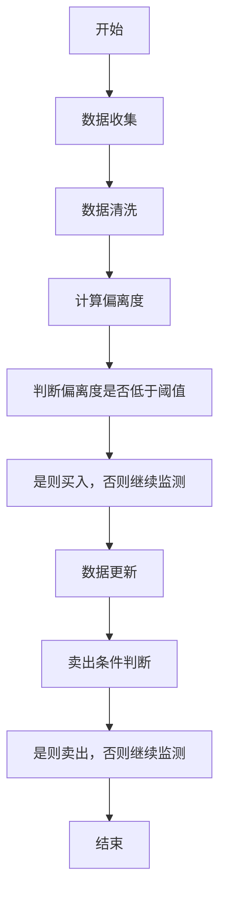
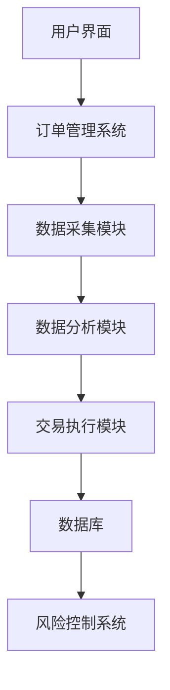

                 


# 如何将特价股票策略应用于新兴市场基础设施债券投资

## 关键词：特价股票策略、新兴市场、基础设施债券、投资策略、量化分析、风险管理、系统架构

## 摘要：本文探讨了如何将特价股票策略应用于新兴市场中的基础设施债券投资，通过量化分析和风险管理，构建系统架构，提供实际案例和最佳实践，帮助投资者在新兴市场中利用特价策略实现收益。

---

# 第一部分: 特价股票策略与新兴市场基础设施债券投资背景

## 第1章: 特价股票策略概述

### 1.1 特价股票策略的基本概念

#### 1.1.1 什么是特价股票策略
特价股票策略是一种基于市场波动的投资策略，通过在市场低谷时以低于面值的价格买入债券，待市场回升时以高于买入价卖出，从而获取收益。这种策略特别适用于价格波动较大的资产。

#### 1.1.2 特价股票策略的核心要素
- **价格波动性**：债券价格在市场波动中的表现。
- **价值评估**：债券的内在价值与市场价格的差异。
- **市场周期**：识别市场周期性波动，抓住投资时机。

#### 1.1.3 特价股票策略的适用场景
- **市场低迷期**：在市场低迷时，债券价格可能被低估，适合买入。
- **周期性反弹**：利用债券价格周期性反弹的机会，实现短期收益。

### 1.2 新兴市场基础设施债券的基本概念

#### 1.2.1 基础设施债券的定义
基础设施债券是指用于融资基础设施项目（如交通、能源、通信等）的债券，通常由政府或国有企业发行。

#### 1.2.2 新兴市场的特点
- **市场不成熟**：新兴市场中的债券市场相对不成熟，信息透明度较低。
- **高增长潜力**：新兴市场的经济增长较快，基础设施项目需求大。
- **高风险**：新兴市场的政治、经济不确定性较高，债券信用风险较大。

#### 1.2.3 新兴市场基础设施债券的特殊性
- **高波动性**：新兴市场债券价格波动较大，适合特价策略。
- **流动性较低**：部分新兴市场债券流动性不足，可能导致价格波动加剧。
- **高收益率**：新兴市场债券通常提供较高的票面利率，吸引投资者。

### 1.3 特价股票策略在新兴市场基础设施债券中的应用

#### 1.3.1 应用背景
新兴市场的基础设施债券由于其高波动性和高收益率，为特价策略提供了应用的机会。投资者可以通过在市场低谷时买入低价债券，市场回升时卖出，获得超额收益。

#### 1.3.2 应用的可行性分析
- **市场波动性**：新兴市场债券价格波动较大，适合特价策略的应用。
- **市场周期**：新兴市场具有周期性，可以通过技术分析识别周期性波动。
- **市场参与者**：新兴市场的投资者可能对市场波动敏感，导致价格偏离内在价值，为特价策略提供机会。

#### 1.3.3 应用的潜在风险
- **市场流动性风险**：新兴市场债券流动性较低，可能导致买卖价差较大。
- **信用风险**：新兴市场债券的发行人可能存在较高的信用风险。
- **政策风险**：新兴市场政策变化可能影响债券价格。

---

## 第2章: 特价股票策略与债券投资的核心概念

### 2.1 特价股票策略的核心原理

#### 2.1.1 市场波动性分析
- **波动性指标**：使用波动率指标分析债券价格的波动性。
- **市场周期**：通过技术分析识别市场周期，判断买入和卖出时机。

#### 2.1.2 价格偏离度的计算
- **偏离度公式**：计算债券市场价格与内在价值的偏离度，判断是否低估或高估。
  $$偏离度 = \frac{市场价格}{内在价值}$$

#### 2.1.3 买入和卖出时机的确定
- **买入信号**：当市场价格低于内在价值且波动率较低时，买入。
- **卖出信号**：当市场价格接近或超过内在价值且波动率较高时，卖出。

### 2.2 基础设施债券的属性与风险

#### 2.2.1 债券的面值、票面利率和期限
- **面值**：债券的面值通常为100元，票面利率为年利率，期限通常为5-10年。

#### 2.2.2 新兴市场的特点
- **信用评级**：新兴市场债券的信用评级通常较低，风险较高。
- **流动性**：新兴市场债券流动性较低，可能导致买卖价差较大。

#### 2.2.3 债券市场的流动性分析
- **流动性指标**：使用交易量和换手率分析债券市场的流动性。
- **流动性风险**：流动性较低可能导致债券价格波动较大。

### 2.3 特价策略与债券投资的结合

#### 2.3.1 特价策略在债券投资中的作用
- **降低投资成本**：通过低价买入，降低初始投资成本。
- **提高收益**：通过高价卖出，实现超额收益。

#### 2.3.2 债券价格波动与特价策略的关系
- **波动性与机会**：价格波动为特价策略提供了买卖机会。
- **波动性与风险**：高波动性也意味着高风险，需要谨慎操作。

#### 2.3.3 债券市场的周期性与特价策略的时机选择
- **周期性波动**：债券价格在市场周期中呈现周期性波动，为特价策略提供机会。
- **时机选择**：通过技术分析识别周期性波动的拐点，选择合适的买卖时机。

---

## 第3章: 特价股票策略在新兴市场基础设施债券中的应用原理

### 3.1 新兴市场基础设施债券的量化分析

#### 3.1.1 数据收集与处理
- **数据源**：从新兴市场债券交易平台获取债券价格、交易量、收益率等数据。
- **数据清洗**：处理缺失值和异常值，确保数据质量。

#### 3.1.2 市场趋势的量化指标
- **移动平均线（MA）**：使用短期、中期和长期移动平均线分析市场趋势。
- **相对强弱指数（RSI）**：判断债券价格的超买或超卖状态。

#### 3.1.3 债券价格波动的预测模型
- **ARIMA模型**：使用自回归积分滑动平均模型预测债券价格波动。
- **GARCH模型**：使用广义自回归条件异方差模型预测波动率。

### 3.2 特价策略的数学模型

#### 3.2.1 均值回归模型
- **均值回归假设**：债券价格会回归其历史平均值。
- **回归模型**：使用线性回归模型预测债券价格的回归趋势。

#### 3.2.2 波动率分析模型
- **波动率预测**：使用GARCH模型预测债券价格的未来波动率。
- **波动率交易策略**：在波动率较低时买入，在波动率较高时卖出。

#### 3.2.3 风险调整后的回报模型
- **夏普比率**：衡量风险调整后的回报。
- **最大回撤**：评估投资组合的最大潜在损失。

### 3.3 算法原理与流程图

#### 3.3.1 算法流程图（使用 Mermaid）


#### 3.3.2 算法实现
- **数据处理**：收集和清洗债券价格数据。
- **偏离度计算**：计算债券市场价格与内在价值的偏离度。
- **买卖决策**：根据偏离度和波动率指标，决定买入或卖出。

---

## 第4章: 系统分析与架构设计

### 4.1 问题场景介绍

#### 4.1.1 项目介绍
- **项目目标**：构建一个支持特价策略的基础设施债券投资系统。
- **项目范围**：覆盖新兴市场基础设施债券的量化分析和交易执行。

#### 4.1.2 系统功能设计
- **数据采集模块**：实时采集新兴市场债券价格、交易量等数据。
- **量化分析模块**：计算偏离度、波动率等指标，生成买卖信号。
- **交易执行模块**：根据信号执行买入或卖出交易。

#### 4.1.3 系统架构设计


### 4.2 项目实战

#### 4.2.1 环境安装
- **安装Python**：安装Python 3.8以上版本。
- **安装库**：安装Pandas、NumPy、Matplotlib、Scikit-learn等库。

#### 4.2.2 核心实现源代码
```python
import pandas as pd
import numpy as np
from sklearn.linear_model import LinearRegression
import matplotlib.pyplot as plt

# 数据加载
bond_prices = pd.read_csv('bond_prices.csv')

# 计算偏离度
bond_prices['偏离度'] = bond_prices['市场价格'] / bond_prices['内在价值']

# 绘制偏离度分布图
bond_prices['偏离度'].hist(bins=10, figsize=(10,6))
plt.title('偏离度分布图')
plt.xlabel('偏离度')
plt.ylabel('频数')
plt.show()

# 均值回归模型
model = LinearRegression()
X = bond_prices[['偏离度', '波动率']]
y = bond_prices['未来价格']
model.fit(X, y)

# 预测未来价格
predicted_prices = model.predict(X)
```

#### 4.2.3 案例分析
- **案例介绍**：以印度尼西亚的基础设施债券为例，分析特价策略的应用。
- **数据获取**：从新兴市场债券交易平台获取印度尼西亚基础设施债券的历史价格数据。
- **策略实施**：根据偏离度和波动率指标，生成买卖信号，执行交易。

#### 4.2.4 结果解读
- **交易结果**：计算策略的收益和回撤，评估策略的有效性。
- **风险控制**：分析策略的风险暴露，调整策略参数，优化风险控制。

---

## 第5章: 总结与展望

### 5.1 最佳实践 tips
- **风险管理**：在应用特价策略时，必须重视风险管理，设置止损和止盈点。
- **模型优化**：根据市场变化，不断优化量化分析模型，提高策略的有效性。
- **系统监控**：建立完善的系统监控机制，确保交易系统的稳定运行。

### 5.2 小结
通过本文的探讨，我们可以看到，将特价股票策略应用于新兴市场基础设施债券投资，不仅可以提高投资收益，还可以有效降低投资风险。然而，新兴市场的复杂性和不确定性，也要求投资者具备较高的专业素养和风险意识。

### 5.3 注意事项
- **市场风险**：新兴市场波动较大，投资者需谨慎操作。
- **模型局限性**：量化分析模型可能存在局限性，需结合实际情况进行调整。
- **交易成本**：新兴市场债券流动性较低，可能增加交易成本。

### 5.4 拓展阅读
- **量化分析**：深入学习量化分析技术，如机器学习在投资中的应用。
- **风险管理**：研究更高级的风险管理方法，如VaR和CVaR模型。
- **系统架构**：学习更复杂的系统架构设计，提高交易系统的稳定性和效率。

---

通过以上内容，我们可以看到，将特价股票策略应用于新兴市场基础设施债券投资，不仅需要扎实的理论基础，还需要丰富的实战经验。希望本文能为投资者提供有价值的参考和启发，帮助他们在新兴市场中实现更高效的债券投资。

