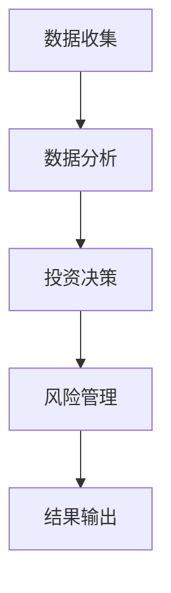

                 


# 如何将特价股票策略应用于新兴市场数字公共基础设施债券投资

## 关键词：特价股票策略、新兴市场、数字公共基础设施债券、投资策略、风险管理

## 摘要：本文探讨了如何将特价股票策略应用于新兴市场的数字公共基础设施债券投资。通过分析债券的基本特性和新兴市场的风险，结合定价模型和算法，提出了一套系统化的投资策略。文章从背景介绍、核心概念、算法原理、系统架构到项目实战，详细阐述了如何利用特价股票策略优化债券投资，帮助投资者在新兴市场中捕捉投资机会，同时降低风险。

---

# 第一部分：特价股票策略与新兴市场数字公共基础设施债券投资背景

## 第1章：特价股票策略概述

### 1.1 特价股票策略的定义与特点

#### 1.1.1 特价股票的定义
特价股票是指以低于面值的价格购买的股票。这种策略的核心在于等待股价回升至面值或更高时卖出，从而获利。

#### 1.1.2 特价股票的核心特点
- 低价买入：投资者以低于市场价或面值的价格购入股票。
- 高价卖出：在股价回升后卖出，实现收益。
- 风险较低：通常适用于价值被低估的股票。

#### 1.1.3 特价股票与普通股票的区别
| 特性 | 特价股票 | 普通股票 |
|------|----------|----------|
| 购买价格 | 低于面值或市场价 | 市场价 |
| 投资目标 | 等待股价回升 | 长期增值或分红 |
| 风险 | 较低 | 较高 |

---

### 1.2 新兴市场的特点与投资机会

#### 1.2.1 新兴市场的定义与范围
新兴市场是指那些经济增长迅速但尚未完全工业化的国家，如巴西、印度、中国等。

#### 1.2.2 新兴市场的投资优势
- 高增长潜力：新兴市场的经济增速通常高于发达市场。
- 估值较低：许多新兴市场的股票和债券价格相对较低。

#### 1.2.3 新兴市场的风险与挑战
- 政治风险：政策不稳定或政府更迭可能影响市场。
- 经济波动：新兴市场容易受到全球经济波动的影响。

---

### 1.3 数字公共基础设施债券的基本概念

#### 1.3.1 债券的基本定义
债券是债务工具，发行人承诺在特定时间内支付利息和本金。

#### 1.3.2 数字公共基础设施债券的定义
数字公共基础设施债券是指用于数字基础设施（如光纤网络、数据中心）建设的债券。

#### 1.3.3 数字公共基础设施债券的发行主体与用途
- 发行主体：政府或国有企业。
- 用途：数字基础设施建设，如5G网络、云计算设施。

---

## 第2章：特价股票策略在债券投资中的应用潜力

### 2.1 特价股票策略与债券投资的结合点

#### 2.1.1 特价股票策略的可转移性
- 投资者可以将特价股票的低价买入策略应用于债券投资。

#### 2.1.2 债券投资中的机会发现
- 低价债券可能隐藏着增值潜力。

#### 2.1.3 数字公共基础设施债券的特殊性
- 数字公共基础设施债券的发行规模较大，适合机构投资者。

---

### 2.2 特价股票策略在新兴市场的适用性

#### 2.2.1 新兴市场中债券投资的特点
- 利率较高：新兴市场债券的利率通常高于发达市场。
- 风险较高：新兴市场的经济波动较大。

#### 2.2.2 特价股票策略在新兴市场的可行性
- 低价买入：新兴市场债券的价格可能被低估。
- 高回报潜力：新兴市场的债券收益率较高。

#### 2.2.3 新兴市场中的风险控制
- 分散投资：通过投资不同地区的债券降低风险。

---

### 2.3 数字公共基础设施债券的风险评估

#### 2.3.1 信用风险
- 债券发行人违约的风险。

#### 2.3.2 利率风险
- 利率上升导致债券价格下跌的风险。

#### 2.3.3 市场风险
- 市场波动导致债券价格下跌的风险。

---

## 第3章：数字公共基础设施债券的特性与评估

### 3.1 数字公共基础设施债券的核心属性

#### 3.1.1 债券的信用评级
- 信用评级反映了债券的违约风险。

#### 3.1.2 债券的期限与利率
- 期限较长的债券利率较高。

#### 3.1.3 债券的发行规模与用途
- 数字公共基础设施债券的发行规模较大。

---

### 3.2 数字公共基础设施债券的风险评估

#### 3.2.1 信用风险
- 债券发行人是否具备偿债能力。

#### 3.2.2 利率风险
- 利率变动对债券价格的影响。

#### 3.2.3 市场风险
- 市场波动对债券价格的影响。

---

### 3.3 数字公共基础设施债券的定价模型

#### 3.3.1 债券定价的基本原理
- 债券价格由其未来现金流的现值决定。

#### 3.3.2 数字公共基础设施债券的特殊定价因素
- 项目收益的不确定性。

#### 3.3.3 市场情绪与债券价格的关系
- 市场情绪影响债券的买卖价格。

---

# 第二部分：特价股票策略应用于债券投资的算法与模型

## 第4章：特价股票策略的核心算法

### 4.1 特价股票策略的数学模型

#### 4.1.1 特价股票策略的简化模型
- 股票价格 = 股票面值 × 折扣率。

#### 4.1.2 特价股票策略的扩展模型
- 股票价格 = 股票面值 × 折扣率 × 市场情绪因子。

---

### 4.2 债券定价模型

#### 4.2.1 债券定价的基本公式
$$ 债券价格 = \sum_{t=1}^{n} \frac{C}{(1+r)^t} + \frac{F}{(1+r)^n} $$
其中：
- \( C \) 是每年的利息。
- \( F \) 是债券面值。
- \( r \) 是债券收益率。
- \( n \) 是债券期限。

#### 4.2.2 数字公共基础设施债券的特殊定价因素
- 项目收益的不确定性。

---

### 4.3 市场预测算法

#### 4.3.1 市场预测的步骤
1. 数据收集：收集债券的历史价格和市场数据。
2. 数据分析：使用统计方法分析数据。
3. 模型构建：建立预测模型。
4. 预测结果：输出预测结果。

---

## 第5章：数字公共基础设施债券投资的系统架构

### 5.1 系统功能设计

#### 5.1.1 数据收集模块
- 收集债券的市场数据和发行人信息。

#### 5.1.2 数据分析模块
- 使用统计方法分析数据。

#### 5.1.3 投资决策模块
- 根据分析结果制定投资策略。

#### 5.1.4 风险管理模块
- 监控市场风险并调整投资组合。

---

### 5.2 系统架构设计



---

## 第6章：项目实战

### 6.1 环境安装

#### 6.1.1 安装Python
- 使用Anaconda安装Python环境。

#### 6.1.2 安装必要的库
- 使用pip安装numpy、pandas、scikit-learn等库。

---

### 6.2 核心实现

#### 6.2.1 数据处理
```python
import pandas as pd
data = pd.read_csv('bond_data.csv')
```

#### 6.2.2 模型实现
```python
from sklearn.linear_model import LinearRegression
model = LinearRegression()
model.fit(X, y)
```

---

### 6.3 实际案例分析

#### 6.3.1 案例背景
- 新兴市场国家的数字公共基础设施债券。

#### 6.3.2 数据分析
- 使用历史数据预测债券价格。

#### 6.3.3 投资决策
- 根据模型预测结果制定投资策略。

---

## 第7章：总结与展望

### 7.1 总结
- 特价股票策略可以有效应用于数字公共基础设施债券投资。
- 投资者需要关注新兴市场的风险。

### 7.2 展望
- 进一步优化模型，提高预测精度。
- 探索更多新兴市场投资机会。

---

## 第8章：注意事项与最佳实践

### 8.1 投资者注意事项
- 保持对市场的敏感性。
- 定期调整投资组合。

### 8.2 最佳实践
- 结合多种策略进行投资。
- 密切关注发行人财务状况。

---

## 第9章：拓展阅读

### 9.1 相关书籍
- 《投资学基础》
- 《债券投资策略》

### 9.2 在线资源
- 金融分析网站
- 数据分析工具教程

---

通过以上步骤，您可以系统地将特价股票策略应用于新兴市场数字公共基础设施债券投资，从而在投资中获得更高的回报。

