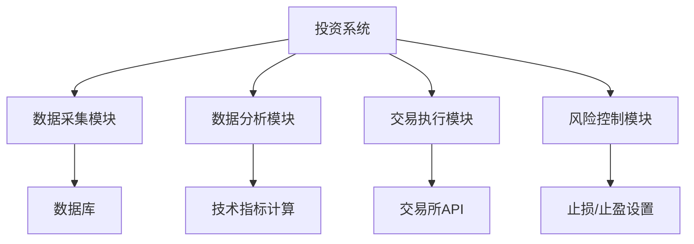

                 


```markdown
# 如何将特价股票策略应用于新兴市场数字公共服务代币投资

> 关键词：特价股票策略，数字代币，新兴市场，投资策略，区块链技术

> 摘要：本文将详细介绍如何将特价股票策略应用于新兴市场数字公共服务代币投资。通过对特价股票策略和数字代币的基本概念、核心原理、算法实现、系统架构、项目实战及最佳实践的全面分析，为投资者提供一套行之有效的投资方法。

---

## 第一部分：特价股票策略与新兴市场数字公共服务代币投资概述

### 第1章：特价股票策略的基本概念

#### 1.1 什么是特价股票策略
- **特价股票**：指价格低于其内在价值的股票，通常出现在市场低估或非理性下跌时。
- **策略特点**：长期持有、逆向投资、价值发现。
- **应用场景**：适用于市场波动大、信息不对称的环境，尤其适合新兴市场。

#### 1.2 数字代币的基本概念
- **数字代币**：基于区块链技术的加密货币，用于支付、投资和价值存储。
- **分类**：加密货币（比特币、以太坊）、实用代币（用于特定平台）、安全代币（代表资产所有权）。
- **特点**：去中心化、透明性、可分割性、全球流通。

#### 1.3 新兴市场的特点
- **新兴市场**：经济快速增长、市场规模小、市场流动性低、政策不确定性大。
- **投资机会**：高增长潜力、低估值、新兴技术应用广泛。
- **挑战**：政策风险、市场波动大、信息不透明。

---

### 第2章：特价股票策略与数字代币投资的核心概念

#### 2.1 特价股票策略的核心原理
- **市场分析**：通过技术分析和基本面分析判断市场趋势。
- **价值发现**：识别被市场低估的资产，等待价格回升。
- **风险控制**：设置止损点，避免重大损失。

#### 2.2 数字代币投资的核心原理
- **区块链技术**：确保代币的安全性和透明性。
- **市场流动性**：影响代币的价格波动和交易深度。
- **社区支持**：代币背后社区的活跃度和信任度影响其价值。

#### 2.3 特价股票策略与数字代币投资的结合
- **策略优势**：利用特价股票策略的长期价值发现，结合数字代币的高波动性和去中心化特性。
- **投资机会**：在新兴市场中，数字代币往往处于早期发展阶段，存在较大的价值发现空间。
- **风险控制**：通过分散投资、严格筛选项目和设置止损点来降低风险。

---

## 第二部分：特价股票策略在数字代币投资中的算法实现

### 第3章：技术分析与算法实现

#### 3.1 技术分析的核心算法
- **移动平均线（MA）**：用于判断价格趋势和支撑位。
- **相对强弱指数（RSI）**：用于判断超买超卖状态。
- **布林带（Bollinger Bands）**：用于判断价格波动范围。

#### 3.2 特价股票策略的算法实现
- **步骤1：数据采集**：获取目标数字代币的历史价格数据。
- **步骤2：计算技术指标**：应用MA、RSI等指标进行数据分析。
- **步骤3：识别投资机会**：当价格低于均线且RSI处于超卖状态时，触发买入信号。
- **步骤4：执行交易**：在特定价格点下单买入，并设置止损和止盈点。

#### 3.3 Python代码实现
```python
import pandas as pd
import numpy as np
import matplotlib.pyplot as plt

# 示例数据：比特币价格（假设）
data = {'日期': ['2023-01-01', '2023-01-02', '2023-01-03', '2023-01-04', '2023-01-05'],
        '价格': [40000, 41000, 39000, 42000, 40500]}
df = pd.DataFrame(data)

# 计算移动平均线（MA）
ma = df['价格'].rolling(window=2).mean()

# 计算相对强弱指数（RSI）
delta = df['价格'].diff()
delta = delta.fillna(0)
gain = delta.where(delta > 0, 0)
loss = delta.where(delta < 0, 0)

average_gain = gain.rolling(window=2).mean()
average_loss = loss.rolling(window=2).mean()
rsi = 100 - (100 - (average_gain / average_loss))

# 绘制图表
plt.figure(figsize=(10, 6))
plt.plot(df['日期'], df['价格'], label='价格')
plt.plot(df['日期'], ma, label='MA(2)')
plt.plot(df['日期'], rsi, label='RSI')
plt.legend()
plt.show()
```

#### 3.4 算法优化与改进
- **优化策略**：结合多个技术指标，如MACD、布林带等，提高策略的有效性。
- **机器学习应用**：利用回归分析或神经网络预测价格趋势，提升策略的智能化水平。

---

## 第三部分：系统架构与投资策略

### 第4章：系统架构设计

#### 4.1 投资系统的功能模块
- **数据采集模块**：实时获取数字代币的价格数据。
- **数据分析模块**：计算技术指标，识别投资机会。
- **交易执行模块**：根据策略结果执行买入或卖出指令。
- **风险控制模块**：监控市场变化，及时止损。

#### 4.2 系统架构图


#### 4.3 系统接口设计
- **数据接口**：与加密货币交易所的API对接，获取实时数据。
- **交易接口**：通过API发送交易指令。
- **监控接口**：实时监控市场变化，触发预警。

---

## 第四部分：项目实战与案例分析

### 第5章：环境安装与代码实现

#### 5.1 环境安装
- **安装Python**：确保Python 3.8或更高版本已安装。
- **安装必要的库**：`pandas`, `numpy`, `matplotlib`, `ccxt`（用于与交易所API交互）。

#### 5.2 核心代码实现
```python
import ccxt

# 连接交易所API（以币安为例）
exchange = ccxt.binance()

# 获取比特币价格数据
symbol = 'BTC/USDT'
ohlcv = exchange.fetch_ohlcv(symbol, '1d')

# 计算移动平均线
prices = [ohlcv[i][4] for i in range(len(ohlcv))]
ma = []
for i in range(len(prices)):
    if i >= 2:
        ma.append(sum(prices[i-2:i])/2)
    else:
        ma.append(0)

# 识别投资机会
investment_opportunity = False
for i in range(len(ma)):
    if ma[i] > 0 and rsi[i] < 30:
        investment_opportunity = True
        break

if investment_opportunity:
    print("买入信号：价格低于均线且RSI处于超卖状态")
else:
    print("未发现买入信号")
```

#### 5.3 案例分析
- **案例背景**：新兴市场中某数字代币的价格波动较大，适合应用特价股票策略。
- **策略执行**：在价格低于均线且RSI超卖时买入，设置止损点。
- **结果分析**：通过回测分析策略的有效性，优化参数以提高收益率。

---

## 第五部分：最佳实践与注意事项

### 第6章：投资策略的最佳实践

#### 6.1 小结
- 特价股票策略在新兴市场数字代币投资中具有较大的应用潜力。
- 通过技术分析和系统架构设计，可以有效识别投资机会并降低风险。

#### 6.2 注意事项
- **市场风险**：新兴市场波动较大，需谨慎选择投资项目。
- **政策风险**：关注相关政策变化，避免法律风险。
- **技术风险**：确保技术系统的稳定性和安全性。

#### 6.3 拓展阅读
- 《加密货币投资指南》
- 《技术分析实战技巧》
- 《区块链技术与金融创新》

---

## 第六部分：总结与展望

### 第7章：总结
- 本文详细介绍了如何将特价股票策略应用于新兴市场数字代币投资。
- 通过技术分析、系统设计和项目实战，为投资者提供了一套可行的投资方法。

### 第8章：未来展望
- 进一步研究机器学习在策略优化中的应用。
- 探索更多新兴市场中的投资机会。
- 提高系统的智能化和自动化水平。

---

## 结语

通过本文的学习，读者可以掌握将特价股票策略应用于新兴市场数字代币投资的方法，从理论到实践，全面了解如何在新兴市场中利用数字代币投资实现财富增长。希望本文能为投资者提供有价值的参考和启发。
```

