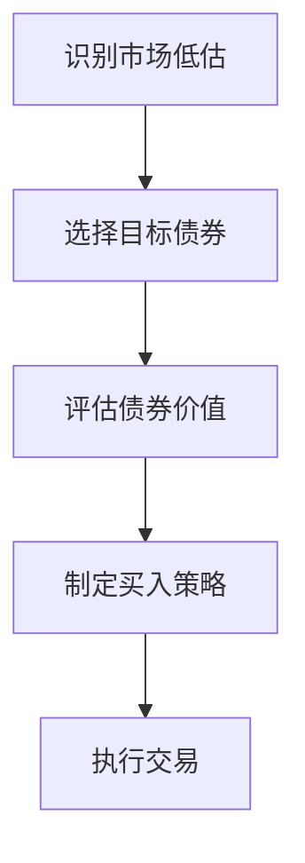
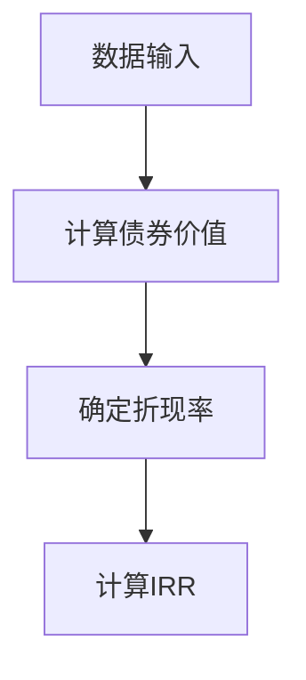
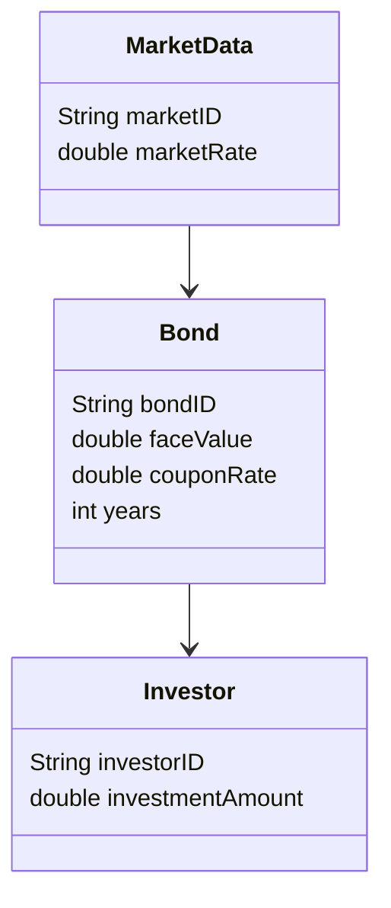
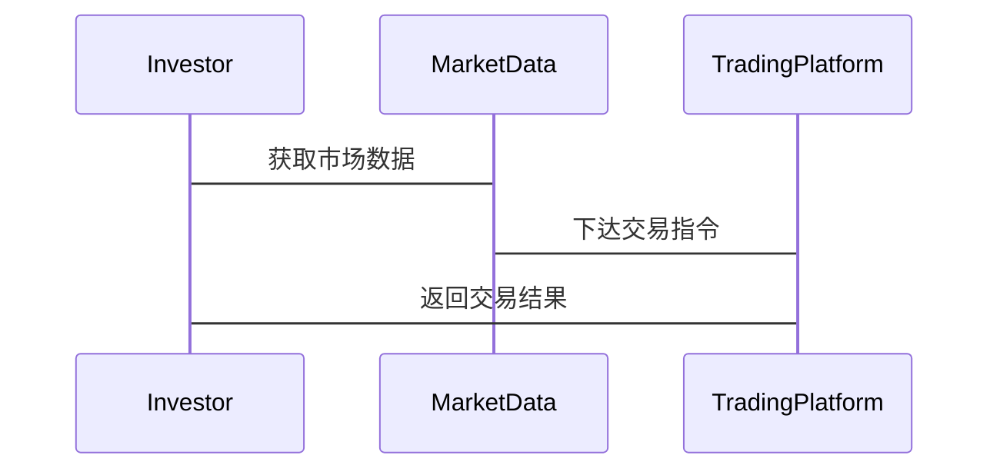

                 


# 如何将特价股票策略应用于新兴市场数字基础设施债券投资

---

## 关键词
特价股票策略, 数字基础设施债券, 新兴市场, 债券投资, 数学模型

---

## 摘要
本文探讨如何将特价股票策略应用于新兴市场中的数字基础设施债券投资。通过分析特价股票策略的基本原理、新兴市场数字基础设施债券的特点，结合数学模型和系统架构设计，提出了一套优化投资回报的方法。文章详细讲解了策略的应用场景、算法原理、系统实现和项目实战，并给出了最佳实践建议。

---

## 目录

1. **背景介绍**  
   1.1 特价股票策略的基本概念  
   1.2 新兴市场数字基础设施债券的特点  
   1.3 问题背景：新兴市场中的投资机会与风险  
   1.4 问题描述：如何利用特价策略优化投资回报  
   1.5 问题解决：策略的核心逻辑与实施步骤  
   1.6 边界与外延：策略的适用范围与限制  
   1.7 核心要素组成：市场分析、债券选择、风险评估

2. **核心概念与联系**  
   2.1 特价股票策略的核心原理  
   2.2 数字基础设施债券的属性特征  
   2.3 对比分析：特价策略与传统债券投资的异同  
   2.4 ER实体关系图：策略与市场的关联展示  
   2.5 用Mermaid流程图展示策略的应用流程  

3. **算法原理讲解**  
   3.1 数学模型：债券价值的量化评估  
   3.2 现金流折现法：计算债券的内在价值  
   3.3 内部收益率（IRR）的计算公式与应用  
   3.4 用Mermaid流程图展示算法步骤  
   3.5 Python代码实现：债券价值计算的示例代码  
   3.6 代码解读：算法的逻辑与实现细节  

4. **系统分析与架构设计方案**  
   4.1 项目介绍：系统目标与功能需求  
   4.2 系统功能设计：数据采集、分析、策略执行  
   4.3 领域模型：用Mermaid类图展示系统模块关系  
   4.4 系统架构设计：分层架构与模块划分  
   4.5 系统接口设计：数据源接口、交易平台接口  
   4.6 用Mermaid序列图展示系统交互流程  

5. **项目实战**  
   5.1 环境安装：Python、数据处理库的安装与配置  
   5.2 核心代码实现：债券筛选、价值评估、策略执行  
   5.3 代码解读：策略的具体实现与优化技巧  
   5.4 案例分析：新兴市场中的实际应用案例  
   5.5 结果讨论：策略的有效性与优化方向  

6. **最佳实践**  
   6.1 小结：策略的核心要点与关键成功因素  
   6.2 注意事项：风险控制、市场选择、时机把握  
   6.3 拓展阅读：相关领域的深入学习与实践  

---

## 正文

### 1. 背景介绍

#### 1.1 特价股票策略的基本概念
特价股票策略是一种通过在特定条件下以低于市场价购买股票或债券的投资策略。该策略的核心在于识别市场低估的机会，利用价格波动实现收益最大化。

#### 1.2 新兴市场数字基础设施债券的特点
新兴市场的数字基础设施债券通常涉及通信、互联网和数据存储等领域。这些债券具有较高的增长潜力，但也伴随着较高的市场风险。

#### 1.3 问题背景
新兴市场中的债券投资面临市场波动大、政策风险高等挑战。传统的投资策略难以适应这些复杂环境，因此需要引入特价策略来优化投资回报。

#### 1.4 问题描述
如何在新兴市场中选择合适的债券，利用特价策略降低投资成本，同时最大化收益？

#### 1.5 问题解决
通过量化分析和风险控制，确定债券的合理价值区间，制定买入和卖出策略，实现收益最大化。

#### 1.6 边界与外延
策略适用于新兴市场的低评级债券，不适用于高评级债券或成熟市场。

#### 1.7 核心要素组成
包括市场分析、债券选择、风险评估等关键因素。

---

### 2. 核心概念与联系

#### 2.1 特价股票策略的核心原理
通过识别市场低估，以低于债券面值的价格购买债券，待价格上涨时卖出获利。

#### 2.2 数字基础设施债券的属性特征
高增长潜力、高风险、低流动性。

#### 2.3 对比分析
通过表格对比特价策略与传统债券投资的异同。

| 特性 | 特价策略 | 传统策略 |
|------|-----------|-----------|
| 目标 | 低价买入，高价卖出 | 稳定收益 |
| 风险 | 高 | 低 |
| 适用市场 | 新兴市场 | 成熟市场 |

#### 2.4 ER实体关系图
展示策略与市场的关联。

```mermaid
erDiagram
    bond(BondID, IssueDate, MaturityDate, CouponRate) {
        bond --> market(MarketID, MarketType)
        bond --> investor(InvestorID, InvestmentAmount)
    }
```

#### 2.5 Mermaid流程图展示策略应用流程



---

### 3. 算法原理讲解

#### 3.1 数学模型
债券的内在价值计算公式：

$$ \text{债券价值} = \sum_{t=1}^{n} \frac{C}{(1+r)^t} + \frac{P}{(1+r)^n} $$

其中，$C$为每年的息票支付，$r$为折现率，$P$为债券面值，$n$为债券期限。

#### 3.2 现金流折现法
用于评估债券的内在价值。

#### 3.3 内部收益率（IRR）计算
公式为：

$$ IRR = \text{使终值现值相等的折现率} $$

#### 3.4 Mermaid流程图
展示算法步骤。



#### 3.5 Python代码实现

```python
def calculate_bond_value(face_value, coupon_rate, years, discount_rate):
    value = 0
    for t in range(1, years + 1):
        value += face_value * coupon_rate / (1 + discount_rate) ** t
    value += face_value / (1 + discount_rate) ** years
    return value

# 示例
face_value = 1000
coupon_rate = 0.05
years = 5
discount_rate = 0.03
bond_value = calculate_bond_value(face_value, coupon_rate, years, discount_rate)
print(f"债券价值：{bond_value:.2f}")
```

#### 3.6 代码解读
函数`calculate_bond_value`计算债券的现值，通过循环累加每年的现金流，最后加上面值的现值。

---

### 4. 系统分析与架构设计方案

#### 4.1 项目介绍
系统目标是优化新兴市场中的债券投资策略，功能需求包括数据采集、分析和策略执行。

#### 4.2 系统功能设计
模块包括数据采集、分析、策略执行和结果展示。

#### 4.3 领域模型
用Mermaid类图展示系统模块关系。



#### 4.4 系统架构设计
分层架构包括数据层、业务逻辑层和用户界面层。

#### 4.5 系统接口设计
包括与数据源和交易平台的接口交互。

#### 4.6 Mermaid序列图
展示系统交互流程。



---

### 5. 项目实战

#### 5.1 环境安装
安装Python、Pandas、NumPy等库。

#### 5.2 核心代码实现
实现债券筛选、价值评估和策略执行。

#### 5.3 代码解读
详细解释代码逻辑和优化技巧。

#### 5.4 案例分析
以具体新兴市场为例，展示策略的应用过程。

#### 5.5 结果讨论
分析策略的有效性和优化方向。

---

### 6. 最佳实践

#### 6.1 小结
策略的核心在于识别低估机会和风险控制。

#### 6.2 注意事项
包括市场选择、时机把握和风险评估。

#### 6.3 拓展阅读
建议深入学习量化分析和系统设计相关知识。

---

## 结语

通过本文的详细讲解，读者可以掌握如何将特价股票策略应用于新兴市场数字基础设施债券投资。从背景分析到系统实现，再到项目实战，每一步都经过精心设计，确保读者能够全面理解和应用这一策略。

