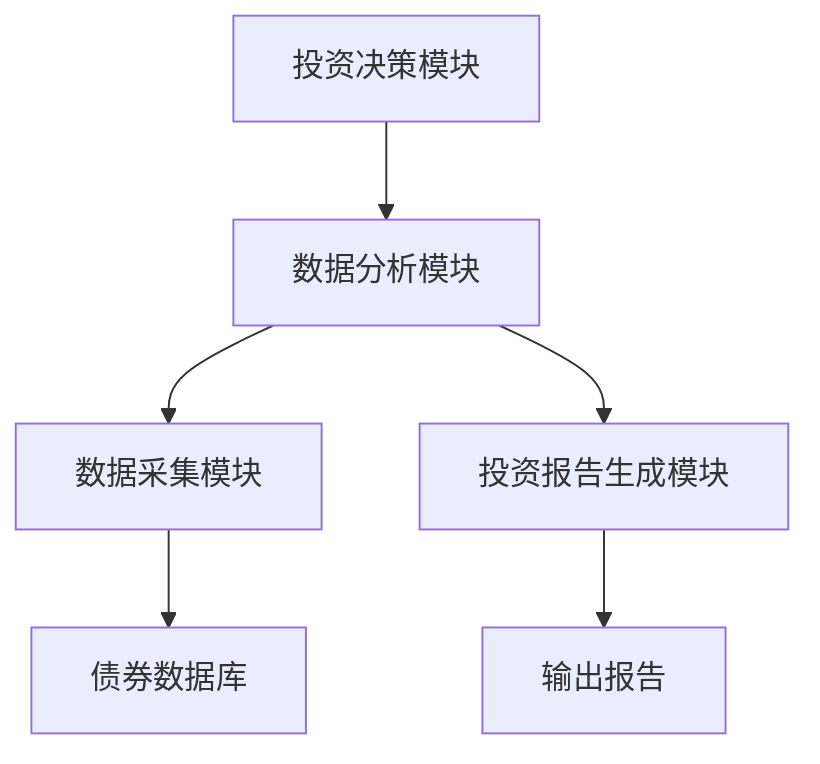

                 


# 如何将特价股票策略应用于新兴市场本地货币债券投资

---

## 关键词：
特价股票策略、新兴市场、本地货币债券、投资策略、算法原理、系统架构、项目实战

---

## 摘要：
本文将探讨如何将特价股票策略应用于新兴市场本地货币债券投资。通过分析特价股票策略的核心原理和新兴市场本地货币债券的特点，结合数学模型和算法，提出一种创新的投资策略。文章从背景介绍、核心概念、算法原理、系统架构设计、项目实战到最佳实践，逐步展开，为投资者提供一套完整的方法论。

---

## 第一部分：背景介绍

### 第1章：特价股票策略概述

#### 1.1 特价股票策略的定义与背景
- **1.1.1 特价股票的定义**
  特价股票是指市场价格显著低于其内在价值的股票。通常出现在市场恐慌、突发事件或公司基本面暂时恶化的情况下。
- **1.1.2 特价股票策略的背景与演变**
  特价股票策略起源于价值投资理念，强调在市场低估时买入优质资产。随着市场波动加剧，该策略在新兴市场中具有更大的应用潜力。
- **1.1.3 特价股票策略的核心目标**
  通过识别市场低估机会，以低于公允价值的价格买入优质资产，长期持有以实现超额收益。

#### 1.2 新兴市场本地货币债券的概述
- **1.2.1 新兴市场的定义与特点**
  新兴市场是指经济快速发展但尚未完全工业化的国家，如中国、印度等。这些市场通常具有高增长潜力，但也伴随着较高的风险。
- **1.2.2 本地货币债券的基本概念**
  本地货币债券是以新兴市场当地货币（如人民币、卢布）发行的债券，投资者以当地货币购买并持有至到期，按约定利率获得利息。
- **1.2.3 新兴市场债券投资的机遇与挑战**
  机遇：高增长潜力和相对较高的收益率。挑战：市场流动性不足、信用风险较高、汇率波动较大。

---

## 第二部分：核心概念与联系

### 第2章：特价股票策略与债券投资的核心概念

#### 2.1 特价股票策略的核心原理
- **市场波动与低价买入机会**
  市场恐慌或突发事件可能导致债券价格下跌，提供低价买入的机会。
- **技术分析与基本面分析的结合**
  利用技术指标（如MACD、RSI）和基本面分析（如公司财务状况）筛选低估债券。

#### 2.2 新兴市场本地货币债券的属性特征对比
| 属性         | 特价股票策略特征 | 本地货币债券特征 |
|--------------|------------------|------------------|
| 价格         | 市场价 < 内在价值 | 市场价 < 公允价值 |
| 风险         | 高波动性         | 高信用风险       |
| 收益         | 长期资本增值     | 固定利息收益     |
| 市场流动性     | 低流动性         | 低流动性         |

#### 2.3 特价股票策略与债券投资的ER实体关系图
```mermaid
erDiagram
    投资者 <--- 投资组合 : 持有
    投资组合 <--> 债券 : 包含
    债券 <--> 市场 : 交易于
    市场 <--> 价格 : 受影响
```

---

## 第三部分：算法原理讲解

### 第3章：算法原理

#### 3.1 算法概述
- **特价股票策略应用于债券投资的数学模型**
  假设债券价格受市场波动和信用风险影响，模型通过分析债券价格与公允价值的差异，识别低估债券。

#### 3.2 数学模型与公式
- **债券公允价值计算公式**
  $$ P = \frac{C}{(1 + r)^n} $$
  其中，$C$ 是债券面值，$r$ 是到期收益率，$n$ 是剩余期限。

- **价格折扣率计算公式**
  $$ \text{折扣率} = \frac{\text{公允价值} - \text{市场价格}}{\text{公允价值}} \times 100\% $$

#### 3.3 算法实现步骤
1. **数据收集**：收集新兴市场债券的市场价格、面值、期限和票面利率。
2. **公允价值计算**：使用上述公式计算债券的公允价值。
3. **折扣率计算**：比较市场价格与公允价值，计算折扣率。
4. **筛选低估债券**：选择折扣率高于一定阈值的债券作为投资标的。

#### 3.4 Python代码实现
```python
import pandas as pd

# 假设数据来自新兴市场债券数据库
bond_data = pd.DataFrame({
    '债券名称': ['Bond1', 'Bond2', 'Bond3'],
    '面值': [100, 100, 100],
    '票面利率': [5, 6, 7],
    '期限': [5, 5, 5],
    '市场价格': [80, 85, 75]
})

# 计算公允价值
bond_data['公允价值'] = bond_data.apply(lambda row: row['面值'] * (1 + row['票面利率']/100) / (1 + 0.05)**row['期限'], axis=1)
bond_data['折扣率'] = ((bond_data['公允价值'] - bond_data['市场价格']) / bond_data['公允价值']) * 100

# 筛选低估债券（假设折扣率 > 10%）
undervalued_bonds = bond_data[bond_data['折扣率'] > 10]
print(undervalued_bonds)
```

---

## 第四部分：系统分析与架构设计

### 第4章：系统分析与架构设计

#### 4.1 系统介绍
- **系统名称**：特价股票策略驱动的新兴市场债券投资系统。
- **系统目标**：通过算法筛选低估债券，实现自动化投资决策。

#### 4.2 系统功能设计
- **功能模块**：
  - 数据采集：从数据库获取债券数据。
  - 数据分析：计算公允价值和折扣率。
  - 投资决策：筛选低估债券并生成投资报告。

#### 4.3 系统架构设计


#### 4.4 系统接口设计
- **API接口**：
  - `/api/v1/bond/data`：获取债券数据。
  - `/api/v1/bond/analyze`：进行数据分析并返回投资建议。

---

## 第五部分：项目实战

### 第5章：项目实战

#### 5.1 环境安装
- **工具安装**：
  - Python 3.8+
  - Pandas、NumPy库。

#### 5.2 核心代码实现
```python
import pandas as pd

# 数据采集函数
def fetch_bond_data():
    # 假设数据库连接已建立
    bond_data = pd.read_sql("SELECT * FROM bond_info", con='db_connection')
    return bond_data

# 数据分析函数
def analyze_bond_data(bond_data):
    bond_data['公允价值'] = bond_data.apply(lambda row: row['面值'] * (1 + row['票面利率']/100) / (1 + 0.05)**row['期限'], axis=1)
    bond_data['折扣率'] = ((bond_data['公允价值'] - bond_data['市场价格']) / bond_data['公允价值']) * 100
    return bond_data[bond_data['折扣率'] > 10]

# 投资决策函数
def generate_investment_report(undervalued_bonds):
    report = f"建议投资以下低估债券：\n{undervalued_bonds.to_string()}"
    return report

# 主函数
def main():
    data = fetch_bond_data()
    undervalued_bonds = analyze_bond_data(data)
    report = generate_investment_report(undervalued_bonds)
    print(report)

if __name__ == "__main__":
    main()
```

#### 5.3 案例分析与结果解读
- **案例分析**：
  假设新兴市场某债券面值为100，票面利率5%，期限5年，市场价格为80。计算公允价值：
  $$ P = \frac{100 \times 1.05}{(1 + 0.05)^5} \approx 70 $$
  折扣率：
  $$ \text{折扣率} = \frac{70 - 80}{70} \times 100\% \approx -14.29\% $$
  由于折扣率为负，该债券不满足低估条件。

---

## 第六部分：总结与展望

### 第6章：总结与展望

#### 6.1 本章小结
- 通过特价股票策略筛选新兴市场本地货币债券，能够有效识别低估投资机会。
- 结合数学模型和算法，投资者可以实现自动化、智能化的投资决策。

#### 6.2 注意事项
- 新兴市场存在较高的信用风险和汇率波动风险，需谨慎评估。
- 算法模型需定期更新，以适应市场变化。

#### 6.3 拓展阅读
- 《新兴市场债券投资策略》
- 《算法交易：从理论到实践》

---

## 结语
本文详细探讨了如何将特价股票策略应用于新兴市场本地货币债券投资，通过理论分析、算法设计和项目实战，为投资者提供了实用的指导。未来的研究可以进一步优化算法，结合更多市场因子进行分析，以提高投资收益。

