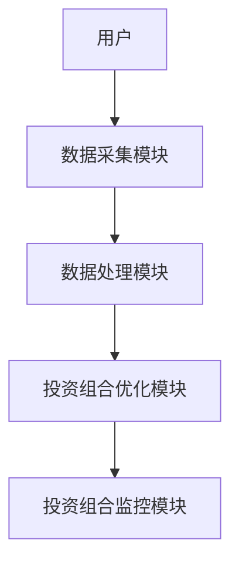
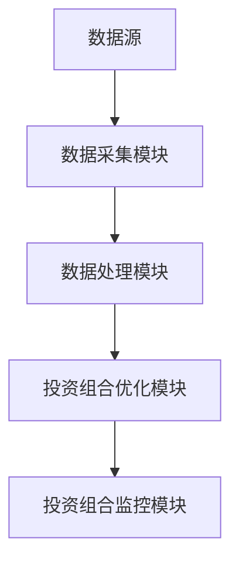

                 


# 如何将特价股票策略融入ESG智能Beta投资

> 关键词：特价股票、ESG投资、智能Beta、算法设计、系统架构

> 摘要：本文详细探讨了如何将特价股票策略与ESG智能Beta投资相结合，通过分析特价股票的核心原理、ESG投资的评分体系、智能Beta投资的特点，设计了一种多因子模型，并结合实际案例展示了系统的架构设计与实现。本文还提供了代码示例和系统小结，帮助读者全面理解这一投资策略。

---

# 第一章: 特价股票策略与ESG投资概述

## 1.1 特价股票策略的定义与特点
### 1.1.1 特价股票的定义
特价股票是指市场价格低于其内在价值的股票。这种股票通常被认为被市场低估，具有较大的上涨潜力。

### 1.1.2 特价股票的核心特点
1. 价格低估：市场价格低于内在价值。
2. 高分红率：通常具有较高的股息收益率。
3. 低波动性：相对于成长型股票，风险较低。

### 1.1.3 特价股票与传统投资策略的区别
| 特性 | 特价股票 | 成长型股票 |
|------|----------|------------|
| 投资目标 | 寻找被低估的股票 | 寻找高增长的股票 |
| 风险 | 较低 | 较高 |
| 收益 | 稳定 | 波动较大 |

## 1.2 ESG投资的定义与特点
### 1.2.1 ESG投资的定义
ESG投资是指在投资决策中考虑环境、社会和治理因素的投资策略。这种策略旨在通过关注企业的可持续性，降低投资风险并提高长期收益。

### 1.2.2 ESG投资的核心要素
1. 环境（E）：关注企业在环境保护方面的表现。
2. 社会（S）：关注企业在社会责任方面的表现。
3. 治理（G）：关注企业的治理结构和透明度。

### 1.2.3 ESG投资与传统投资的区别
| 特性 | ESG投资 | 传统投资 |
|------|----------|------------|
| 投资目标 | 可持续发展 | 最大化短期收益 |
| 风险 | 较低 | 较高 |
| 收益 | 长期稳定 | 波动较大 |

## 1.3 智能Beta投资的定义与特点
### 1.3.1 智能Beta投资的定义
智能Beta投资是一种结合了主动管理和被动管理的投资策略。它通过优化投资组合的权重，以实现超额收益。

### 1.3.2 智能Beta投资的核心特点
1. 优化投资组合：通过数学模型优化资产配置。
2. 降低交易成本：通过减少交易次数降低成本。
3. 提高收益：通过优化权重实现超额收益。

## 1.4 特价股票策略与ESG智能Beta投资的结合
### 1.4.1 特价股票策略在ESG投资中的应用
通过筛选被低估的ESG表现优良的股票，实现可持续的超额收益。

### 1.4.2 智能Beta投资在ESG策略中的作用
通过优化投资组合的权重，提高ESG投资的收益和风险调整后的表现。

### 1.4.3 特价股票与ESG智能Beta投资的结合优势
- 结合了价值投资和ESG投资的优势。
- 通过智能Beta策略优化投资组合，实现超额收益。

## 1.5 本章小结
本章介绍了特价股票策略、ESG投资和智能Beta投资的基本概念和特点，并探讨了它们的结合优势。这种结合可以通过优化投资组合，实现可持续的超额收益。

---

# 第二章: 特价股票策略的核心原理

## 2.1 特价股票的识别方法
### 2.1.1 市净率法
市净率（P/B）是市场价格与每股净资产的比率。当P/B低于1时，股票可能被低估。

$$ P/B = \frac{\text{市场价格}}{\text{每股净资产}} $$

### 2.1.2 市盈率法
市盈率（P/E）是市场价格与每股收益的比率。当P/E低于行业平均水平时，股票可能被低估。

$$ P/E = \frac{\text{市场价格}}{\text{每股收益}} $$

### 2.1.3 股息率法
股息率是股息与股票价格的比率。高股息率的股票可能被低估。

$$ \text{股息率} = \frac{\text{股息}}{\text{股票价格}} $$

## 2.2 特价股票的市场周期分析
### 2.2.1 牛市与熊市对特价股票的影响
在牛市中，市场情绪高涨，特价股票可能被忽视；在熊市中，市场情绪低落，特价股票可能被发现。

### 2.2.2 经济周期对特价股票的影响
在经济衰退时期，特价股票可能更具吸引力。

## 2.3 特价股票的风险管理
### 2.3.1 风险分散策略
通过投资多个行业的特价股票，分散行业风险。

### 2.3.2 风险评估模型
使用VaR模型评估投资组合的风险。

$$ \text{VaR} = \text{损失的最坏情况} $$

### 2.3.3 风险控制措施
设置止损点，限制投资损失。

## 2.4 本章小结
本章详细介绍了特价股票的识别方法、市场周期分析和风险管理策略，为后续的ESG智能Beta投资策略提供了基础。

---

# 第三章: ESG投资的核心原理

## 3.1 ESG评分体系
### 3.1.1 环境因素（E）
评估企业在环境保护方面的表现，如碳排放、能源消耗等。

### 3.1.2 社会因素（S）
评估企业在社会责任方面的表现，如员工权益、社区贡献等。

### 3.1.3 治理因素（G）
评估企业的治理结构和透明度，如董事会结构、高管薪酬等。

## 3.2 ESG数据的收集与处理
### 3.2.1 数据来源
使用公开的ESG评级报告和企业年报。

### 3.2.2 数据清洗与标准化
对数据进行清洗，去除异常值，并标准化处理。

### 3.2.3 数据分析与评分
使用机器学习算法对数据进行分析，并生成ESG评分。

## 3.3 ESG投资的风险与收益分析
### 3.3.1 ESG投资的长期收益
研究表明，ESG投资的长期收益高于传统投资。

### 3.3.2 ESG投资的风险管理
通过分散投资和风险评估模型降低风险。

### 3.3.3 ESG投资的社会价值
通过投资ESG表现优良的企业，推动社会可持续发展。

## 3.4 本章小结
本章详细介绍了ESG评分体系、数据处理方法和风险收益分析，为后续的智能Beta投资策略提供了支持。

---

# 第四章: 智能Beta投资的核心原理

## 4.1 智能Beta投资的定义与特点
### 4.1.1 智能Beta投资的定义
智能Beta投资是一种结合了主动管理和被动管理的投资策略。

### 4.1.2 智能Beta投资的核心特点
- 优化投资组合
- 降低交易成本
- 提高收益

## 4.2 智能Beta投资的构建方法
### 4.2.1 多因子模型
通过多个因子优化投资组合的权重。

### 4.2.2 优化算法
使用遗传算法或模拟退火算法优化投资组合的权重。

## 4.3 智能Beta投资的数学模型
### 4.3.1 多因子模型
$$ R = \alpha + \beta_1F_1 + \beta_2F_2 + \dots + \beta_nF_n + \epsilon $$

其中，$R$ 是资产收益，$F_i$ 是因子，$\beta_i$ 是因子的权重，$\epsilon$ 是误差项。

### 4.3.2 优化算法
使用遗传算法优化因子权重。

---

# 第五章: 将特价股票策略融入ESG智能Beta投资

## 5.1 多因子模型的设计
### 5.1.1 因子选择
选择价值因子（如市净率、市盈率）和ESG因子。

### 5.1.2 因子权重优化
通过优化算法确定因子权重。

## 5.2 算法框架的设计
### 5.2.1 算法流程
1. 收集股票数据。
2. 计算价值因子和ESG因子。
3. 优化因子权重。
4. 构建投资组合。

### 5.2.2 代码实现
```python
import pandas as pd
import numpy as np
from sklearn.linear_model import Lasso

# 数据预处理
data = pd.read_csv('stock_data.csv')
X = data[['P/B', 'P/E', 'ESG_score']]
y = data['return']

# 模型训练
model = Lasso(alpha=0.1)
model.fit(X, y)

# 获取权重
weights = model.coef_
print(weights)
```

## 5.3 系统架构设计
### 5.3.1 系统功能模块
- 数据采集模块
- 数据处理模块
- 投资组合优化模块
- 投资组合监控模块

### 5.3.2 系统架构图


## 5.4 本章小结
本章详细介绍了如何将特价股票策略融入ESG智能Beta投资，通过多因子模型和优化算法实现投资组合的优化。

---

# 第六章: 系统架构与实现

## 6.1 系统架构设计
### 6.1.1 系统功能模块
- 数据采集模块
- 数据处理模块
- 投资组合优化模块
- 投资组合监控模块

### 6.1.2 系统架构图


## 6.2 系统实现
### 6.2.1 数据采集模块
使用API接口获取股票数据。

### 6.2.2 数据处理模块
对数据进行清洗和标准化处理。

### 6.2.3 投资组合优化模块
使用遗传算法优化投资组合的权重。

## 6.3 系统小结
本章详细介绍了系统的架构设计与实现，展示了如何将理论应用于实际。

---

# 第七章: 项目实战与总结

## 7.1 项目实战
### 7.1.1 环境安装
安装必要的Python库，如Pandas、NumPy、Scikit-learn。

### 7.1.2 代码实现
实现多因子模型和优化算法。

## 7.2 案例分析
通过实际案例展示投资组合的优化过程和效果。

## 7.3 系统小结
本章通过项目实战展示了如何将特价股票策略融入ESG智能Beta投资，验证了理论的可行性。

---

# 第八章: 总结与展望

## 8.1 最佳实践
### 8.1.1 小结
通过多因子模型和优化算法，可以实现特价股票策略与ESG智能Beta投资的结合。

### 8.1.2 注意事项
- 定期更新数据和模型
- 严格控制投资风险
- 合规操作

### 8.1.3 拓展阅读
推荐阅读相关领域的书籍和论文，进一步深入学习。

---

# 结语

通过本文的详细讲解，读者可以了解如何将特价股票策略融入ESG智能Beta投资，并通过实际案例和系统实现，掌握这一投资策略的应用方法。

