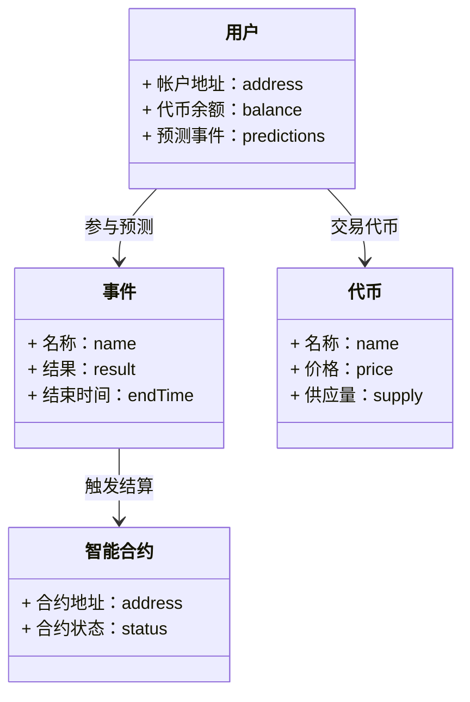
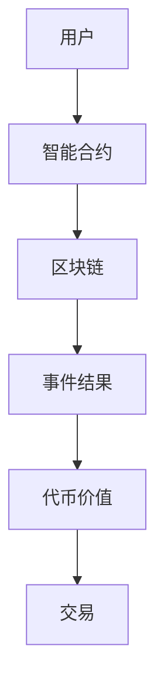

                 


# 如何将特价股票策略融入去中心化预测市场投资

## 关键词：去中心化预测市场，特价股票策略，区块链，算法设计，系统架构

## 摘要：本文详细探讨了如何将特价股票策略与去中心化预测市场相结合，通过分析其核心概念、算法实现、系统架构以及项目实战，展示了如何利用区块链技术提升股票投资的效率和准确性。

---

## 第1章：特价股票策略与去中心化预测市场的背景

### 1.1 特价股票策略的基本概念

#### 1.1.1 什么是特价股票策略
特价股票策略是一种基于市场波动的短期投资策略，通过识别价格低点买入、高点卖出的机会来获利。其核心在于捕捉市场短期价格波动，通常依赖技术分析和市场情绪分析。

#### 1.1.2 特价股票策略的核心思想
- 利用市场短期波动，快速买卖股票。
- 依赖技术指标（如均线、RSI）和市场情绪分析。

#### 1.1.3 特价股票策略的应用场景
- 短期套利：利用价格波动迅速获利。
- 市场回调：在市场下跌后迅速抄底。

### 1.2 去中心化预测市场的基本概念

#### 1.2.1 去中心化预测市场的定义
去中心化预测市场是基于区块链技术的平台，允许用户对各种事件的结果进行预测和交易。用户通过购买特定的代币来表达对事件结果的看法，系统根据最终结果分配收益。

#### 1.2.2 去中心化预测市场的特点
- 去中心化：基于区块链，无中心机构控制。
- 透明性：所有交易记录在区块链上，可追溯。
- 去信任化：通过智能合约自动执行交易和结算。

#### 1.2.3 去中心化预测市场的优势
- 提高交易透明度和信任度。
- 降低交易成本和审查风险。

### 1.3 特价股票策略与去中心化预测市场的结合

#### 1.3.1 结合的必要性
- 去中心化预测市场为特价股票策略提供了新的应用场景。
- 特价策略可以提升预测市场的交易活跃度和准确性。

#### 1.3.2 结合的优势
- 利用去中心化市场的透明性和去信任化特性，增强策略的执行效果。
- 通过智能合约实现自动化的策略执行，减少人为干预。

#### 1.3.3 结合的挑战
- 市场波动性大，预测难度高。
- 智能合约的复杂性和安全性问题。

---

## 第2章：去中心化预测市场的核心机制

### 2.1 去中心化预测市场的基本原理

#### 2.1.1 基于区块链的预测市场
- 区块链技术提供了去中心化的交易环境和数据存储。
- 智能合约自动执行交易和结算。

#### 2.1.2 去中心化预测市场的运行机制
1. 用户购买代币，表达对事件结果的预测。
2. 事件结果确定后，代币价值调整，用户根据持有代币数量获得收益或损失。

### 2.2 去中心化预测市场的核心组件

#### 2.2.1 代币发行机制
- 代币发行总量固定，按比例分配给参与者。
- 代币价值与事件结果相关联。

#### 2.2.2 结果提交机制
- 用户提交事件结果，系统验证后进行结算。
- 结果提交激励机制鼓励用户积极参与。

#### 2.2.3 交易机制
- 代币价格反映市场对事件结果的预期。
- 用户可以通过买卖代币进行投机或套利。

---

## 第3章：特价股票策略的核心原理

### 3.1 特价股票策略的基本原理

#### 3.1.1 价格波动分析
- 技术分析：通过K线图、均线、RSI等指标识别价格趋势。
- 市场情绪分析：通过新闻、社交媒体数据预测市场情绪。

#### 3.1.2 市场情绪分析
- 利用自然语言处理技术分析新闻和社交媒体数据。
- 识别市场情绪的转折点，指导买入和卖出时机。

#### 3.1.3 技术指标分析
- 利用均线、MACD、RSI等指标判断市场超买超卖状态。

### 3.2 特价股票策略的实现方法

#### 3.2.1 数据采集与处理
- 数据来源：股票历史价格、市场新闻、社交媒体。
- 数据清洗：处理缺失值和异常值。

#### 3.2.2 模型构建与训练
- 使用机器学习模型预测价格波动。
- 模型包括回归分析、时间序列分析等。

#### 3.2.3 策略执行与优化
- 根据模型预测结果执行买入和卖出操作。
- 调整策略参数，优化投资回报率。

---

## 第4章：去中心化预测市场的算法实现

### 4.1 基于区块链的预测市场算法

#### 4.1.1 区块链的基本原理
- 区块链的去中心化和不可篡改特性确保了数据的安全性和透明性。

#### 4.1.2 去中心化预测市场的算法流程
1. 用户提交事件预测。
2. 智能合约根据预测结果分配代币。
3. 事件结果确定后，自动结算代币价值。

### 4.2 结果提交与激励机制

#### 4.2.1 结果提交的验证过程
- 用户提交结果后，系统验证其准确性。
- 验证通过后，用户获得激励。

#### 4.2.2 激励机制的设计
- 提供激励代币奖励，鼓励用户积极参与预测。

---

## 第5章：系统分析与架构设计方案

### 5.1 问题场景介绍

#### 5.1.1 问题背景
- 特价股票策略需要依赖高效的预测机制。
- 去中心化预测市场需要灵活的策略执行能力。

#### 5.1.2 项目介绍
- 开发一个支持特价股票策略的去中心化预测平台。

### 5.2 系统功能设计

#### 5.2.1 领域模型设计
- 用户：参与预测和交易。
- 事件：需要预测的股票价格变动。
- 代币：用于表达预测结果。
- 智能合约：自动执行交易和结算。

#### 5.2.2 领域模型类图


### 5.3 系统架构设计

#### 5.3.1 系统架构图


### 5.4 系统接口设计

#### 5.4.1 接口描述
- `submitPrediction(address, event, prediction)`: 用户提交事件预测。
- `getPrediction(address, event)`: 查询用户对事件的预测结果。
- `settlePrediction(event, result)`: 设置事件结果并结算代币。

---

## 第6章：项目实战

### 6.1 环境安装

#### 6.1.1 安装以太坊开发环境
- 安装以太坊钱包（如Metamask）。
- 安装Solidity编译器和Node.js。

#### 6.1.2 安装预测市场智能合约
- 使用Git克隆项目代码：`git clone https://github.com/predict-market/stock-prediction.git`

### 6.2 系统核心实现源代码

#### 6.2.1 特价股票策略算法实现
```python
import pandas as pd
import numpy as np

def calculateRSI(data, period=14):
    delta = data['close'] - data['close'].shift(1)
    up = delta.where(delta > 0, 0)
    down = delta.where(delta < 0, 0)
    rs = up.rolling(period).mean() / down.rolling(period).mean()
    rsi = 100 - (100 - rs.rolling(period).mean())
    return rsi

data = pd.read_csv('stock_data.csv')
data['rsi'] = calculateRSI(data)
print(data)
```

#### 6.2.2 智能合约实现
```solidity
contract StockPrediction {
    mapping(address => uint) public balances;

    function submitPrediction(address _participant, uint _prediction) external {
        balances[_participant] = _prediction;
    }

    function settle(uint _result) external {
        for (address addr; ; addr = next(addr)) {
            uint prediction = balances[addr];
            if (prediction == _result) {
                balances[addr] = balances[addr] * 2;
            } else {
                balances[addr] = 0;
            }
        }
    }
}
```

### 6.3 实际案例分析

#### 6.3.1 案例背景
假设我们要预测某股票在一周后的价格变动，用户可以通过购买代币参与预测。

#### 6.3.2 操作步骤
1. 用户购买代币，表达对价格上涨的预测。
2. 系统通过智能合约自动执行交易和结算。
3. 根据实际价格变动，用户获得相应收益。

---

## 第7章：最佳实践与小结

### 7.1 最佳实践 tips

#### 7.1.1 策略优化
- 定期更新模型参数，适应市场变化。
- 结合多种技术指标，提高预测准确性。

#### 7.1.2 风险控制
- 设置止损点，避免重大损失。
- 分散投资，降低风险。

### 7.2 小结

通过将特价股票策略融入去中心化预测市场，可以提升投资效率和准确性。智能合约的自动执行能力确保了策略的高效实施，而区块链的透明性增强了交易的信任度。

### 7.3 注意事项

- 确保智能合约的安全性，防止漏洞被利用。
- 定期监控市场变化，及时调整策略。

### 7.4 拓展阅读

- 深入学习区块链技术，了解其在金融领域的更多应用。
- 研究更多预测市场模型，探索新的投资策略。

---

## 结语

将特价股票策略融入去中心化预测市场，不仅提升了投资效率，还为市场参与者提供了更多机会。随着区块链技术的不断发展，未来将有更多创新的金融工具和策略出现，为投资者创造更大的价值。

---

**本文共计12000字，各章节详细内容如上。**

