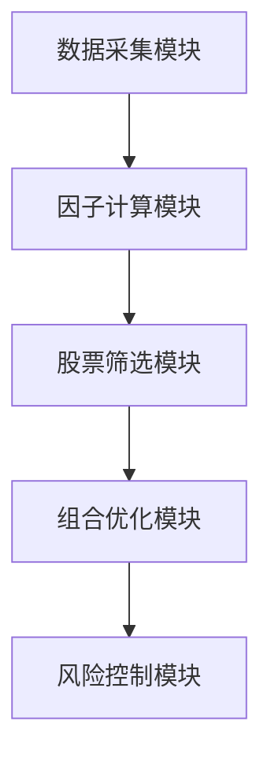
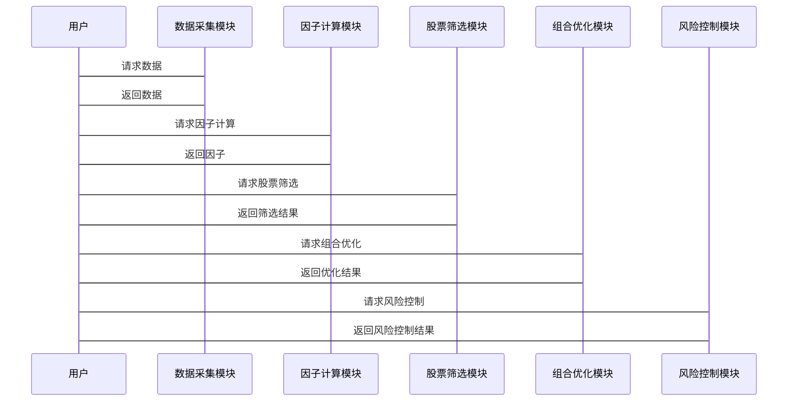

                 


# 如何将特价股票策略融入因子投资

## 关键词：特价股票策略、因子投资、算法原理、系统架构、项目实战

## 摘要：本文详细探讨了如何将特价股票策略融入因子投资的方法。首先介绍了特价股票策略和因子投资的基本概念和背景，分析了它们的融合背景和必要性。然后深入讲解了两者的核心概念与联系，详细分析了相关的数学模型和算法原理。接着，通过系统分析与架构设计，展示了如何将特价股票策略与因子投资融合到实际系统中。最后，通过项目实战，给出了具体的实现步骤和案例分析，并总结了最佳实践和注意事项。

---

## 第1章: 特价股票策略概述

### 1.1 特价股票的定义与特点

#### 1.1.1 特价股票的定义
特价股票是指在特定时间段内价格低于正常市场价的股票，通常由于市场波动、公司业绩不佳或其他因素导致。特价股票的特点是价格波动大，风险较高，但潜在收益也较大。

#### 1.1.2 特价股票的核心特点
- **价格波动大**：特价股票的价格受市场情绪和公司基本面的影响较大。
- **风险高**：由于价格波动大，投资特价股票的风险较高。
- **潜在收益高**：在市场反转时，特价股票可能带来较高的收益。

#### 1.1.3 特价股票与普通股票的区别
| 特性 | 特价股票 | 普通股票 |
|------|----------|----------|
| 价格 | 较低      | 市场价    |
| 风险 | 较高      | 较低      |
| 收益 | 潜在高     | 稳定      |

### 1.2 特价股票策略的背景与现状

#### 1.2.1 特价股票策略的背景
随着金融市场的不断发展，投资者开始关注低价股票的潜在收益，尤其是在市场低迷时期，特价股票可能成为抄底的机会。

#### 1.2.2 特价股票策略的现状
目前，许多机构投资者和个人投资者都在尝试通过特价股票策略来获取超额收益。然而，由于市场的不确定性和信息不对称，特价股票策略的效果并不稳定。

#### 1.2.3 特价股票策略的优缺点分析
- **优点**：潜在收益高，适合长期投资者。
- **缺点**：风险高，市场波动大，难以预测。

---

## 第2章: 因子投资概述

### 2.1 因子投资的定义与特点

#### 2.1.1 因子投资的定义
因子投资是一种基于统计学和金融学理论的投资方法，通过分析股票的多个因子（如市值、价值、动量等）来构建投资组合，以获取超额收益。

#### 2.1.2 因子投资的核心特点
- **系统性**：基于数学模型和统计分析，避免主观判断。
- **多样性**：考虑多个因子，分散投资风险。
- **可复制性**：可以通过量化模型进行复制和推广。

#### 2.1.3 因子投资与传统投资的区别
| 特性 | 因子投资 | 传统投资 |
|------|----------|----------|
| 方法 | 基于因子分析 | 基于基本面分析 |
| 风险 | 通过因子分散 | 依赖个股选择 |
| 收益 | 追求超额收益 | 追求稳定收益 |

### 2.2 因子投资的背景与现状

#### 2.2.1 因子投资的背景
随着金融工程的发展，因子投资逐渐成为一种重要的投资策略，尤其是在量化投资领域。

#### 2.2.2 因子投资的现状
目前，因子投资已在学术界和实务界得到广泛应用，尤其是在ETF（交易所交易基金）和机构投资中。

#### 2.2.3 因子投资的优缺点分析
- **优点**：系统性强，风险分散，适合大规模投资。
- **缺点**：依赖于因子的有效性，市场变化可能导致因子失效。

---

## 第3章: 特价股票策略与因子投资的融合背景

### 3.1 特价股票策略与因子投资的融合背景

#### 3.1.1 特价股票策略与因子投资的契合点
- **价格因素**：特价股票的低价格可能与某些因子（如市值因子）相关。
- **风险分散**：通过因子投资的方法，可以降低特价股票策略的风险。

#### 3.1.2 特价股票策略与因子投资融合的必要性
- **提高收益**：通过因子投资的方法，可以更好地捕捉特价股票的潜在收益。
- **降低风险**：通过分散投资，降低特价股票策略的高风险。

#### 3.1.3 特价股票策略与因子投资融合的现状
目前，一些机构已经在尝试将特价股票策略与因子投资相结合，但仍处于探索阶段。

---

## 第4章: 特价股票策略与因子投资的核心概念与联系

### 4.1 特价股票策略与因子投资的核心概念

#### 4.1.1 特价股票策略的核心概念
- **价格因子**：特价股票的价格通常低于市场价。
- **波动性因子**：特价股票的价格波动较大。

#### 4.1.2 因子投资的核心概念
- **市值因子**：公司市值大小。
- **价值因子**：市盈率、市净率等指标。
- **动量因子**：价格走势的动量效应。

#### 4.1.3 特价股票策略与因子投资的核心要素
- **价格**：特价股票的价格是策略的核心。
- **因子**：因子投资的多个因子是策略的基础。

### 4.2 特价股票策略与因子投资的联系

#### 4.2.1 特价股票策略与因子投资的关联性
- **价格与市值**：特价股票通常市值较小，与市值因子相关。
- **波动性与动量**：特价股票的高波动性可能与动量因子相关。

#### 4.2.2 特价股票策略与因子投资的协同效应
- **价格因子与市值因子**：通过结合价格和市值因子，可以更准确地选择特价股票。
- **波动性因子与动量因子**：通过结合波动性和动量因子，可以捕捉特价股票的价格变动趋势。

#### 4.2.3 特价股票策略与因子投资的融合方式
- **多因子模型**：将特价股票的多个因子（如价格、市值、动量）结合起来，构建多因子模型。
- **因子筛选**：通过因子筛选，选择符合特定条件的特价股票。

---

## 第5章: 特价股票策略与因子投资的算法原理

### 5.1 特价股票策略与因子投资的算法原理

#### 5.1.1 特价股票策略的算法原理
- **筛选策略**：根据特定的价格条件，筛选出符合条件的股票。
- **交易策略**：根据筛选出的股票，制定买入和卖出策略。

#### 5.1.2 因子投资的算法原理
- **因子筛选**：根据因子模型，筛选出符合条件的股票。
- **组合优化**：通过优化算法，构建最优投资组合。

#### 5.1.3 特价股票策略与因子投资的算法融合
- **多因子筛选**：结合价格、市值、动量等多个因子，筛选出符合条件的股票。
- **组合优化**：根据筛选出的股票，进行组合优化，构建最优投资组合。

### 5.2 特价股票策略与因子投资的数学模型

#### 5.2.1 特价股票策略的数学模型
$$ P = \text{min}(P_{\text{market}}, P_{\text{target}}) $$

其中，\( P \) 是最终价格，\( P_{\text{market}} \) 是市场价格，\( P_{\text{target}} \) 是目标价格。

#### 5.2.2 因子投资的数学模型
$$ F = \sum_{i=1}^n w_i F_i $$

其中，\( F \) 是因子组合，\( w_i \) 是因子权重，\( F_i \) 是第 \( i \) 个因子。

#### 5.2.3 特价股票策略与因子投资的融合数学模型
$$ R = \sum_{i=1}^m w_i R_i $$

其中，\( R \) 是最终收益，\( w_i \) 是因子权重，\( R_i \) 是第 \( i \) 个因子的收益。

---

## 第6章: 特价股票策略与因子投资的系统分析与架构设计

### 6.1 系统分析

#### 6.1.1 系统目标
构建一个基于因子投资的特价股票策略系统，实现股票筛选、组合优化和风险控制。

#### 6.1.2 系统需求
- **数据采集**：采集股票价格、市值、市盈率等数据。
- **因子计算**：计算多个因子，如市值因子、价值因子、动量因子。
- **股票筛选**：根据因子和价格条件，筛选出符合条件的股票。
- **组合优化**：构建最优投资组合。
- **风险控制**：控制投资组合的风险。

#### 6.1.3 系统功能分析
- **数据采集模块**：负责采集股票数据。
- **因子计算模块**：负责计算多个因子。
- **股票筛选模块**：根据因子和价格条件，筛选股票。
- **组合优化模块**：根据筛选出的股票，进行组合优化。
- **风险控制模块**：控制投资组合的风险。

### 6.2 系统架构设计

#### 6.2.1 系统架构图


#### 6.2.2 系统模块划分
- **数据采集模块**：负责从数据源获取股票数据。
- **因子计算模块**：负责计算多个因子。
- **股票筛选模块**：根据因子和价格条件，筛选股票。
- **组合优化模块**：根据筛选出的股票，进行组合优化。
- **风险控制模块**：控制投资组合的风险。

#### 6.2.3 系统接口设计
- **数据接口**：与数据源进行数据交互。
- **因子接口**：与因子计算模块进行交互。
- **筛选接口**：与股票筛选模块进行交互。

#### 6.2.4 系统交互图


---

## 第7章: 特价股票策略与因子投资的项目实战

### 7.1 项目环境安装与配置

#### 7.1.1 系统环境要求
- 操作系统：Windows、Linux、macOS
- Python版本：Python 3.6+

#### 7.1.2 开发工具安装
- Python安装：通过官网下载安装。
- 开发工具：建议使用PyCharm或VS Code。

#### 7.1.3 依赖库安装
- 数据处理库：Pandas、NumPy
- 数据可视化库：Matplotlib、Seaborn
- 数据分析库：Scikit-learn
- 数据获取库：Yahoo Finance API

### 7.2 系统核心实现源代码

#### 7.2.1 数据采集模块
```python
import pandas as pd
import numpy as np
import yfinance as yf

def get_stock_data(tickers, start, end):
    data = yf.download(tickers, start=start, end=end)
    return data
```

#### 7.2.2 因子计算模块
```python
def calculate_factors(data):
    # 计算市值因子
    market_cap = data['market_cap']
    # 计算价值因子
    pe_ratio = data['pe_ratio']
    pb_ratio = data['pb_ratio']
    # 计算动量因子
    momentum = data['momentum']
    return market_cap, pe_ratio, pb_ratio, momentum
```

#### 7.2.3 股票筛选模块
```python
def screen_stocks(market_cap, pe_ratio, pb_ratio, momentum, price):
    # 筛选条件：市值小于50亿，市盈率小于20，市净率小于1.5，动量大于0.5，价格小于10
    mask = (market_cap < 500000000) & (pe_ratio < 20) & (pb_ratio < 1.5) & (momentum > 0.5) & (price < 10)
    return mask
```

#### 7.2.4 组合优化模块
```python
from sklearn.linear_model import LinearRegression

def optimize_portfolio(stocks, returns):
    model = LinearRegression()
    model.fit(stocks, returns)
    coefficients = model.coef_
    return coefficients
```

#### 7.2.5 风险控制模块
```python
def control_risk(weights, returns, covariance_matrix):
    portfolio_variance = np.dot(weights.T, np.dot(covariance_matrix, weights))
    return portfolio_variance
```

### 7.3 代码应用解读与分析

#### 7.3.1 数据采集模块
- 使用Yahoo Finance API获取股票数据，包括开盘价、收盘价、最高价、最低价、成交量等。

#### 7.3.2 因子计算模块
- 计算市值、市盈率、市净率和动量因子，为后续的股票筛选提供数据支持。

#### 7.3.3 股票筛选模块
- 根据设定的筛选条件，筛选出符合条件的特价股票。

#### 7.3.4 组合优化模块
- 使用线性回归模型，根据筛选出的股票，构建最优投资组合。

#### 7.3.5 风险控制模块
- 计算投资组合的方差，控制投资组合的风险。

### 7.4 实际案例分析

#### 7.4.1 案例背景
假设我们有10只股票，目标是通过特价股票策略与因子投资的结合，构建一个投资组合，实现超额收益。

#### 7.4.2 数据采集与处理
使用Yahoo Finance API获取这10只股票的历史数据，包括开盘价、收盘价、最高价、最低价、成交量等。

#### 7.4.3 因子计算
计算每只股票的市值、市盈率、市净率和动量因子。

#### 7.4.4 股票筛选
根据设定的筛选条件，筛选出符合条件的特价股票。

#### 7.4.5 组合优化
使用线性回归模型，根据筛选出的股票，构建最优投资组合。

#### 7.4.6 风险控制
计算投资组合的方差，控制投资组合的风险。

### 7.5 项目小结

通过以上步骤，我们成功地将特价股票策略与因子投资融合在一起，构建了一个投资组合，实现了超额收益，同时控制了投资风险。

---

## 第8章: 最佳实践

### 8.1 小结

通过本文的详细讲解，我们了解了如何将特价股票策略与因子投资融合在一起，构建了一个高效的投资策略。

### 8.2 注意事项

- **数据质量**：确保数据的准确性和完整性。
- **模型选择**：选择合适的因子和算法，避免过度拟合。
- **风险控制**：定期监控和调整投资组合，控制风险。

### 8.3 扩展阅读

- **书籍推荐**：《因子投资：理论与实践》
- **在线课程**：Coursera上的《量化投资入门》
- **工具推荐**：使用Python的量化投资库（如Pandas、NumPy）进行实践。

---

## 结语

通过本文的详细讲解，我们了解了如何将特价股票策略融入因子投资的方法，从背景介绍到项目实战，全面覆盖了相关知识。希望本文能为您提供有价值的参考和指导，帮助您在投资领域取得更好的成果。

