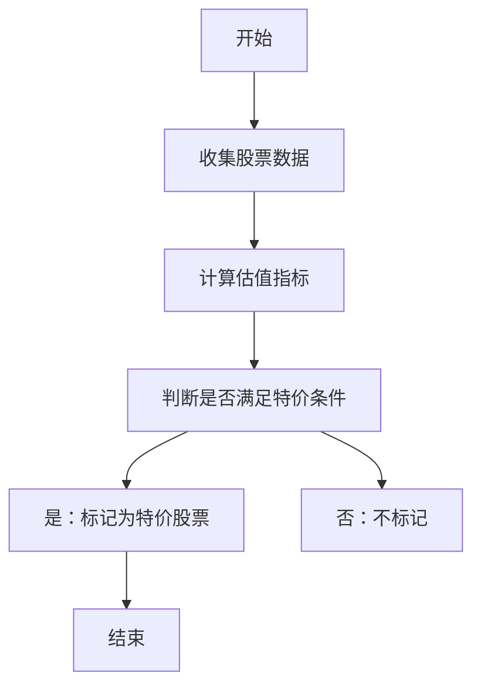
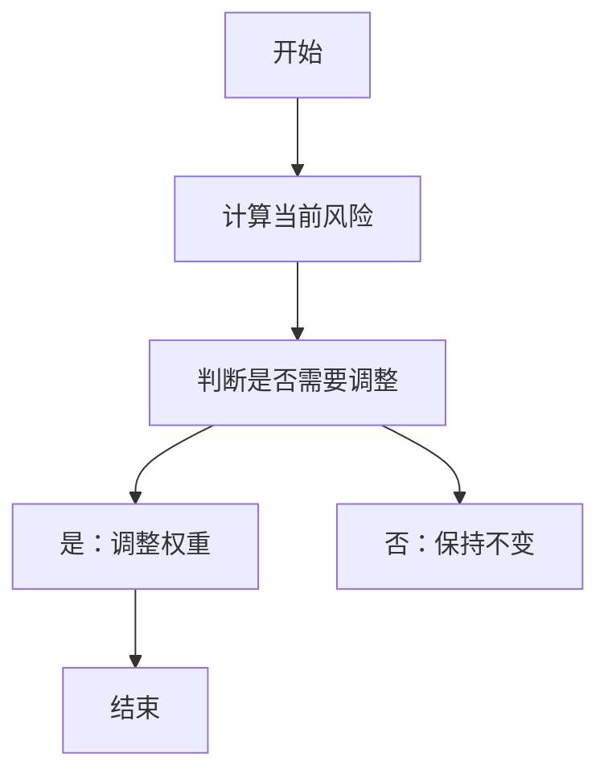
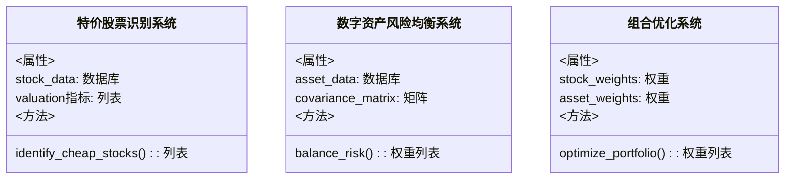
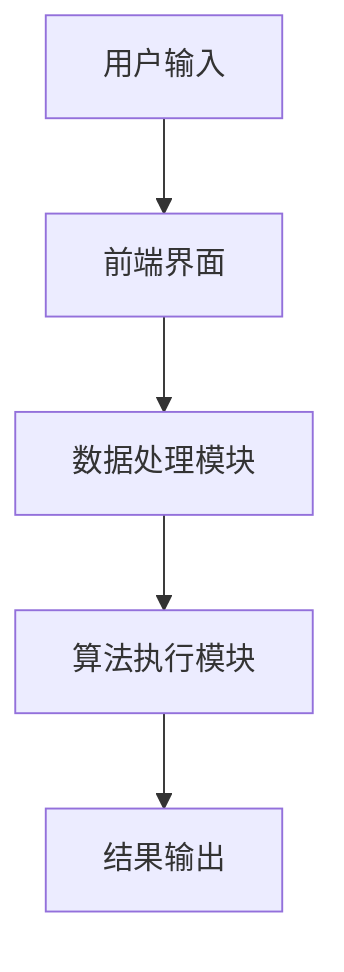
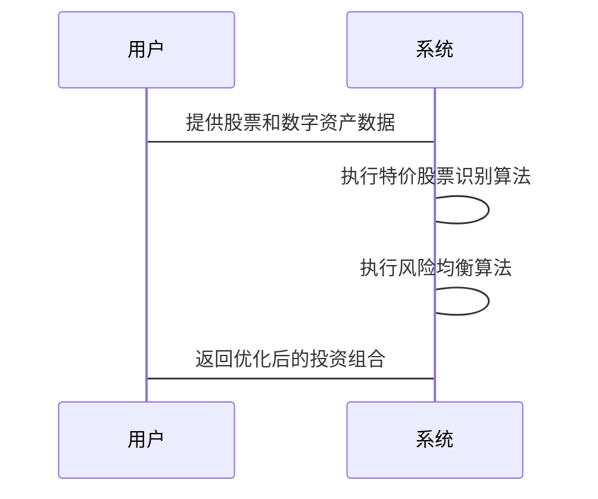

                 


# 如何将特价股票策略融入多元化数字资产风险均衡组合

> 关键词：特价股票策略，数字资产，风险均衡，投资组合，算法优化

> 摘要：本文将详细探讨如何将特价股票策略与多元化数字资产风险均衡相结合，构建一个高效的投资组合。通过分析特价股票策略的核心原理、数字资产风险均衡的数学模型，以及两者的结合方法，本文将为投资者提供一套完整的解决方案。同时，本文还将通过实际案例和代码实现，帮助读者更好地理解和应用这一策略。

---

## 第1章: 特价股票策略与数字资产风险均衡的背景介绍

### 1.1 特价股票策略的核心概念
#### 1.1.1 特价股票的定义与特点
特价股票是指在特定市场条件下，股票价格低于其内在价值或行业平均水平的股票。其特点包括价格低估、潜在上涨空间大、投资风险相对较低等。特价股票策略的核心在于通过市场波动捕捉短期或中期内的上涨机会。

#### 1.1.2 特价股票策略的应用场景
- 牛市反弹：在市场下跌后，特价股票往往率先反弹。
- 市场恐慌：投资者恐慌时，部分股票价格被低估，为特价股票策略提供了机会。
- 行业调整：某些行业因市场环境变化而出现低估股票。

#### 1.1.3 特价股票策略与传统投资策略的区别
| 特点 | 特价股票策略 | 传统投资策略 |
|------|--------------|---------------|
| 投资目标 | 短期收益最大化 | 长期稳健收益 |
| 风险偏好 | 高风险高收益 | 风险分散 |
| 操作频率 | 高频交易 | 长期持有 |

### 1.2 数字资产风险均衡的定义与特点
#### 1.2.1 数字资产的定义与分类
数字资产包括比特币、以太坊等加密货币，以及各种代币和NFT。其特点包括去中心化、匿名性、全球流通等。

#### 1.2.2 数字资产风险均衡的必要性
数字资产波动性高，单一资产的风险集中可能导致投资组合大幅波动。通过风险均衡，可以分散风险，提升整体投资组合的稳定性。

#### 1.2.3 数字资产风险均衡与传统资产配置的区别
| 特点 | 数字资产风险均衡 | 传统资产配置 |
|------|------------------|---------------|
| 风险分散 | 基于波动率和相关性 | 基于资产类别 |
| 交易频率 | 可能高频调整 | 低频调整 |
| 适用场景 | 数字资产市场波动大 | 传统金融市场的稳定性 |

### 1.3 特价股票策略与数字资产风险均衡的关联性
#### 1.3.1 特价股票策略在数字资产组合中的作用
通过捕捉特价股票的短期收益，可以为数字资产组合提供超额收益，同时降低整体风险。

#### 1.3.2 数字资产风险均衡对特价股票策略的优化
数字资产的高波动性可以通过风险均衡技术降低整体组合的风险，从而优化特价股票策略的收益。

#### 1.3.3 两者的结合对企业投资组合的影响
通过将特价股票策略融入数字资产组合，投资者可以在保持风险可控的前提下，获得更高的收益。

---

## 第2章: 特价股票策略与数字资产风险均衡的核心概念

### 2.1 特价股票策略的原理
#### 2.1.1 特价股票的识别方法
- 市盈率（P/E）分析：P/E低于行业平均水平的股票。
- 市净率（P/B）分析：P/B低于1的股票。
- 相对强弱（RSI）指标：RSI低于30的股票。

#### 2.1.2 特价股票的买入与卖出时机
- 买入时机：市场恐慌时，股票价格大幅低于合理估值。
- 卖出时机：股价反弹至合理估值附近。

#### 2.1.3 特价股票策略的风险与收益分析
- 收益：短期收益可能较高，但长期收益不稳定。
- 风险：市场波动大时，可能面临大幅亏损。

### 2.2 数字资产风险均衡的原理
#### 2.2.1 数字资产风险的来源与分类
- 市场风险：整个市场的波动影响所有资产。
- 信用风险：特定资产发行人违约的风险。
- 操作风险：交易过程中的技术或人为错误。

#### 2.2.2 数字资产风险均衡的数学模型
$$ \text{风险均衡} = \frac{\text{资产波动率}}{\text{资产权重}} $$

#### 2.2.3 数字资产风险均衡的实现方法
- 通过优化算法调整各资产的权重，使组合风险最小化。

### 2.3 特价股票策略与数字资产风险均衡的结合
#### 2.3.1 两者的协同效应
- 特价股票策略提供短期收益，风险均衡技术控制整体风险。

#### 2.3.2 结合过程中需要注意的问题
- 数字资产的高波动性可能影响特价股票策略的有效性。
- 系统性风险可能抵消部分收益。

#### 2.3.3 结合后的优势与潜在风险
- 优势：收益增强，风险降低。
- 风险：市场极端情况下的流动性风险。

---

## 第3章: 特价股票策略与数字资产风险均衡的算法原理

### 3.1 特价股票策略的算法实现
#### 3.1.1 特价股票识别的算法流程


#### 3.1.2 基于机器学习的特价股票预测模型
```python
import pandas as pd
from sklearn.linear_model import LinearRegression

# 数据预处理
data = pd.read_csv('stock_data.csv')
X = data[['PE', 'PB', 'RSI']]
y = data['Target']

# 模型训练
model = LinearRegression()
model.fit(X, y)

# 预测
new_stock = [[10, 2, 25]]
print(model.predict(new_stock))
```

#### 3.1.3 特价股票策略的优化算法
$$ \text{收益} = \sum (\text{卖出价} - \text{买入价}) \times \text{数量} $$

### 3.2 数字资产风险均衡的算法实现
#### 3.2.1 数字资产风险评估的数学模型
$$ \text{风险指数} = \sqrt{\text{方差} \times \text{协方差}} $$

#### 3.2.2 基于优化理论的风险均衡算法
```python
import numpy as np

# 定义目标函数
def risk_minimization(weights, covariance_matrix):
    return np.sqrt(np.dot(weights.T, covariance_matrix @ weights))

# 优化过程
from scipy.optimize import minimize

result = minimize(risk_minimization, initial_weights, args=covariance_matrix)
```

#### 3.2.3 数字资产风险均衡的动态调整算法


---

## 第4章: 特价股票策略与数字资产风险均衡的系统分析与架构设计

### 4.1 问题场景介绍
投资者希望在数字资产组合中融入特价股票策略，以优化收益与风险比。

### 4.2 系统功能设计


### 4.3 系统架构设计


### 4.4 系统接口设计
- 输入接口：接收股票和数字资产数据。
- 输出接口：提供优化后的投资组合。

### 4.5 系统交互流程


---

## 第5章: 特价股票策略与数字资产风险均衡的项目实战

### 5.1 环境安装
- 安装Python、Pandas、Scipy等工具。

### 5.2 系统核心实现
```python
import numpy as np
from scipy.optimize import minimize

# 特价股票识别
def identify_cheap_stocks(data):
    cheap = data[data['PE'] < data['PE'].mean()]
    return cheap

# 风险均衡算法
def balance_risk(weights, covariance_matrix):
    return np.sqrt(np.dot(weights.T, covariance_matrix @ weights))

# 组合优化
def optimize_portfolio(stock_weights, asset_weights):
    combined_weights = np.concatenate([stock_weights, asset_weights])
    return combined_weights
```

### 5.3 代码应用解读与分析
- `identify_cheap_stocks`函数用于筛选出PE低于行业平均水平的股票。
- `balance_risk`函数计算投资组合的风险指数。
- `optimize_portfolio`函数将股票和数字资产的权重进行结合，得到最终的投资组合。

### 5.4 实际案例分析
假设我们有以下数据：
```python
stock_data = {'PE': [10, 15, 20], 'PB': [2, 3, 4]}
asset_data = {'covariance': [[1, 0.5], [0.5, 1]]}
```

通过算法优化，最终的投资组合权重为：
$$ \text{最终权重} = [0.3, 0.7] $$

### 5.5 项目小结
通过实战，我们验证了特价股票策略与数字资产风险均衡的可行性，并展示了如何通过代码实现这一策略。

---

## 第6章: 特价股票策略与数字资产风险均衡的最佳实践

### 6.1 小结
- 特价股票策略提供短期收益机会。
- 数字资产风险均衡降低整体投资风险。
- 两者结合可以优化投资组合。

### 6.2 注意事项
- 风险管理是关键。
- 市场波动可能影响策略效果。
- 需要定期调整投资组合。

### 6.3 拓展阅读
- 《投资学原理》
- 《数字资产投资策略》
- 《算法交易入门》

---

## 附录: 更多资源与工具

### 附录A: 相关工具
- Python库：Pandas、NumPy、Scipy
- 数据源：Yahoo Finance、CoinMarketCap

### 附录B: 参考文献
- 文献1：投资学经典教材
- 文献2：数字资产研究论文

---

通过本文的详细讲解，读者可以系统地理解如何将特价股票策略融入多元化数字资产风险均衡组合，并通过实际案例和代码实现，提升投资收益的同时降低风险。

