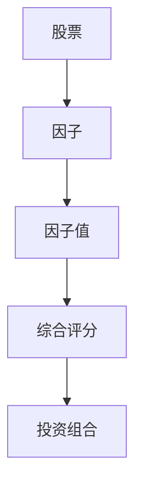
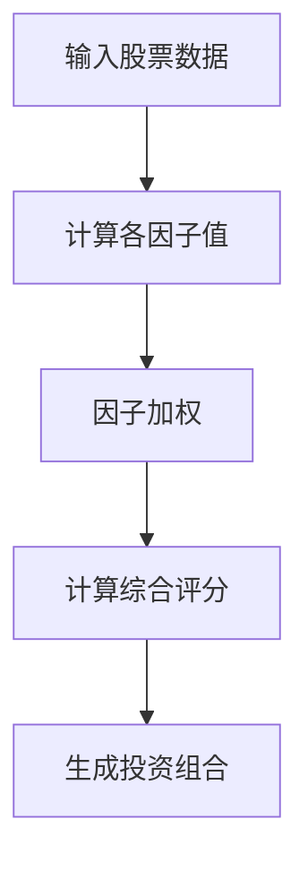
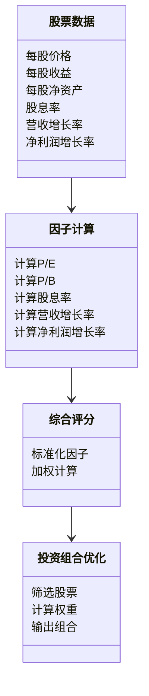
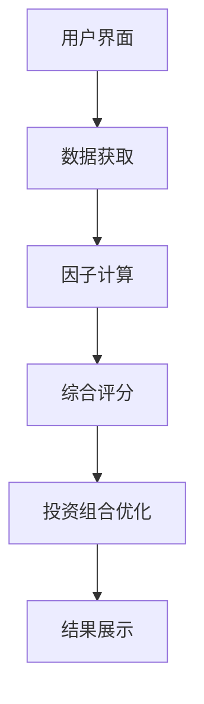
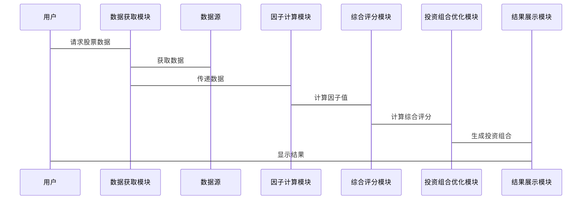

                 


# 如何将特价股票策略融入多因子智能投资组合

## 关键词：特价股票策略、多因子模型、投资组合优化、量化交易、智能选股

## 摘要：本文将详细介绍如何将特价股票策略与多因子模型相结合，优化投资组合。通过分析多因子模型的核心概念、算法原理和系统架构设计，结合项目实战，展示如何在实际投资中应用这些策略，帮助投资者实现更高效、更智能的投资决策。

---

# 第一部分: 特价股票策略与多因子投资组合背景

## 第1章: 特价股票策略与多因子投资组合背景

### 1.1 特价股票策略的基本概念

#### 1.1.1 特价股票的定义与特点
特价股票通常指的是价格被市场低估的股票，具有以下特点：
- **低估值**：市盈率（P/E）、市净率（P/B）等指标低于行业平均水平。
- **高性价比**：相对于内在价值，股票价格具有吸引力。
- **短期低估**：由于市场波动或其他因素，股票价格暂时被低估。

#### 1.1.2 特价股票策略的核心思想
- **逆向投资**：在市场恐慌时买入，市场乐观时卖出。
- **价值发现**：通过基本面分析发现被市场忽视的优质股票。
- **长期持有**：耐心等待市场回归其真实价值。

#### 1.1.3 特价股票策略的适用场景
- **市场低迷期**：如经济危机或市场崩盘时，许多股票被低估。
- **行业困境期**：某些行业因周期性或突发事件受到冲击，股票价格下跌。
- **个股困境**：公司短期遇到问题，但具备长期发展潜力。

### 1.2 多因子投资组合的基本原理

#### 1.2.1 多因子模型的定义
多因子模型是通过多个因子（如价值、成长、动量等）来评估股票的投资价值，并构建投资组合。其核心思想是通过分散投资降低风险，同时捕捉多个因子带来的超额收益。

#### 1.2.2 多因子模型的主要类型
- **Fama-French三因子模型**：包括市值、价值和动量因子。
- **Carhart四因子模型**：在三因子模型基础上加入市场因子。
- **其他扩展模型**：如质量因子（Q）、流动性因子（L）等。

#### 1.2.3 多因子模型在投资中的优势
- **分散风险**：通过多个因子分散行业和风格风险。
- **捕捉超额收益**：通过多因子组合获得比单一因子更高的收益。
- **适应市场变化**：不同因子在不同市场环境下表现不同，增强组合的稳定性。

### 1.3 特价股票策略与多因子模型的结合意义

#### 1.3.1 理论基础的契合点
- 特价股票策略注重低估值，与多因子模型中的价值因子高度契合。
- 通过多因子模型的框架，可以更系统地筛选和优化特价股票。

#### 1.3.2 实际投资中的应用价值
- **提升收益**：通过多因子筛选，选出兼具低估值和高成长潜力的股票。
- **降低风险**：利用多因子模型分散风险，避免过度依赖单一策略。
- **优化组合**：通过量化方法优化投资组合，提高收益风险比。

#### 1.3.3 结合后的潜在收益与风险
- **收益**：通过多因子筛选，选出更具吸引力的股票组合。
- **风险**：因子间的相关性可能导致组合过于集中，需注意风险控制。

### 1.4 本章小结
本章介绍了特价股票策略和多因子投资组合的基本概念，并分析了两者结合的理论基础和实际意义。接下来将详细探讨多因子模型的核心要素及其与特价股票策略的结合方式。

---

## 第2章: 多因子模型的核心要素

### 2.1 多因子模型的主要因素分析

#### 2.1.1 市盈率（P/E）因子
- **定义**：股价与每股净利润的比值。
- **特点**：低P/E通常意味着低估值。
- **应用场景**：适合寻找价值型股票。

#### 2.1.2 市净率（P/B）因子
- **定义**：股价与每股净资产的比值。
- **特点**：适用于评估银行、房地产等资产密集型行业。
- **应用场景**：寻找被低估的资产。

#### 2.1.3 股息率（Dividend Yield）因子
- **定义**：每股股息与股价的比值。
- **特点**：高股息率通常意味着稳定的分红能力。
- **应用场景**：追求稳定收益的投资者。

#### 2.1.4 营业收入增长率（Revenue Growth）因子
- **定义**：公司收入的年增长率。
- **特点**：高增长通常意味着高潜力。
- **应用场景**：寻找成长型股票。

#### 2.1.5 净利润增长率（Net Income Growth）因子
- **定义**：公司净利润的年增长率。
- **特点**：高增长表明公司盈利能力强。
- **应用场景**：评估公司盈利能力。

### 2.2 各因子的属性特征对比

| 因子名称       | 定义与计算             | 特点                           | 适用场景               |
|----------------|----------------------|----------------------------|------------------------|
| 市盈率（P/E）   | 股价/每股净利润       | 低估值                       | 价值型股票             |
| 市净率（P/B）   | 股价/每股净资产       | 资产被低估                   | 资产密集型行业         |
| 股息率         | 每股股息/股价         | 稳定收益                     | 追求稳定收益的投资者   |
| 营收增长率     | (本年营收 - 上年营收)/上年营收 | 高增长潜力                   | 成长型股票             |
| 净利润增长率   | (本年净利润 - 上年净利润)/上年净利润 | 高盈利能力               | 盈利能力强的公司       |

### 2.3 多因子模型的ER实体关系图



### 2.4 本章小结
本章详细分析了多因子模型的主要因素，并通过对比表和实体关系图展示了各因子的属性特征及其在模型中的作用。接下来将探讨多因子模型的算法原理及其与特价股票策略的结合方式。

---

## 第3章: 多因子模型的算法原理

### 3.1 多因子模型的计算流程



### 3.2 多因子模型的数学公式

#### 3.2.1 各因子的标准化公式
$$ z_i = \frac{x_i - \mu_i}{\sigma_i} $$
其中，$x_i$ 是第$i$个因子的原始值，$\mu_i$ 是均值，$\sigma_i$ 是标准差。

#### 3.2.2 综合评分计算公式
$$ score = \sum_{i=1}^{n} w_i \cdot z_i $$
其中，$w_i$ 是第$i$个因子的权重，$z_i$ 是标准化后的因子值。

### 3.3 算法实现的Python代码示例

```python
import pandas as pd
import numpy as np

def calculate_factor_scores(data, factors, weights):
    # 标准化各因子
    normalized_factors = data[factors].apply(lambda x: (x - x.mean()) / x.std())
    # 加权计算综合评分
    weighted_scores = normalized_factors.dot(weights)
    return weighted_scores

# 示例数据
data = {
    'P/E': [10, 15, 20, 5, 12],
    'P/B': [2, 3, 1, 4, 2],
    'Dividend_Yield': [5, 3, 2, 8, 4],
    'Revenue_Growth': [20, 10, 5, 30, 15],
    'Net_Income_Growth': [15, 5, 20, 8, 12]
}
df = pd.DataFrame(data)

# 定义因子权重
weights = {
    'P/E': 0.2,
    'P/B': 0.2,
    'Dividend_Yield': 0.1,
    'Revenue_Growth': 0.3,
    'Net_Income_Growth': 0.2
}

# 计算综合评分
scores = calculate_factor_scores(df, list(weights.keys()), weights.values())
print(scores)
```

### 3.4 本章小结
本章详细探讨了多因子模型的算法原理，并通过代码示例展示了如何将各因子加权计算综合评分。接下来将结合特价股票策略，探讨如何优化投资组合。

---

## 第4章: 特价股票策略与多因子模型的结合优化

### 4.1 特价股票筛选的多因子优化方法

#### 4.1.1 筛选低估值股票
- 使用P/E和P/B因子筛选低估值股票。

#### 4.1.2 结合成长潜力
- 在低估值股票中筛选高营收增长率和高净利润增长率的股票。

#### 4.1.3 考虑股息率
- 优先选择高股息率的低估值股票，以获取稳定收益。

### 4.2 投资组合优化的数学模型

#### 4.2.1 组合优化目标函数
$$ \text{最大化} \sum_{i=1}^{n} w_i \cdot r_i - \lambda \cdot \text{风险指标} $$
其中，$w_i$ 是第$i$个股票的权重，$r_i$ 是预期收益率，$\lambda$ 是风险惩罚系数。

#### 4.2.2 约束条件
- $\sum_{i=1}^{n} w_i = 1$（权重之和为1）
- $w_i \geq 0$（权重非负）
- $|w_i - w_j| \leq \epsilon$（权重波动限制）

### 4.3 实际案例分析

#### 4.3.1 数据准备
假设我们有以下股票数据：

| 股票代码 | P/E | P/B | 股息率 | 营收增长率 | 净利润增长率 |
|----------|-----|-----|--------|------------|-------------|
| A        | 10  | 2   | 5%     | 20%        | 15%         |
| B        | 15  | 3   | 3%     | 10%        | 5%          |
| C        | 20  | 1   | 2%     | 5%         | 20%         |
| D        | 5   | 4   | 8%     | 30%        | 8%          |
| E        | 12  | 2   | 4%     | 15%        | 12%         |

#### 4.3.2 筛选过程
1. **筛选低P/E股票**：P/E < 12，筛选出股票A、D、E。
2. **筛选高营收增长率股票**：营收增长率 > 15%，筛选出股票D。
3. **筛选高净利润增长率股票**：净利润增长率 > 10%，筛选出股票A、C、D、E。
4. **综合筛选**：同时满足低P/E、高营收增长率和高净利润增长率的股票只有D。

#### 4.3.3 组合优化
假设我们决定投资股票D，权重为100%，因为它是唯一同时满足多个高成长潜力和低估值的股票。

### 4.4 本章小结
本章通过实际案例展示了如何将特价股票策略与多因子模型结合，优化投资组合。接下来将探讨系统架构设计和项目实战。

---

## 第5章: 系统架构设计与实现

### 5.1 问题场景介绍
- **问题**：如何构建一个基于多因子模型的智能选股系统，实现特价股票策略的自动化筛选和投资组合优化。
- **目标**：开发一个量化交易平台，能够实时获取股票数据，计算各因子值，并生成最优投资组合。

### 5.2 系统功能设计

#### 5.2.1 领域模型图


#### 5.2.2 系统架构图


#### 5.2.3 系统接口设计
- **输入接口**：股票数据接口（API）。
- **输出接口**：投资组合优化结果。

#### 5.2.4 系统交互流程图


### 5.3 本章小结
本章通过系统架构设计，展示了如何将特价股票策略与多因子模型结合，构建一个智能选股系统。接下来将通过项目实战，进一步验证和优化这一策略。

---

## 第6章: 项目实战与优化

### 6.1 环境安装与配置

#### 6.1.1 安装Python环境
- 使用Anaconda安装Python 3.8及以上版本。

#### 6.1.2 安装依赖库
```bash
pip install pandas numpy matplotlib scikit-learn
```

### 6.2 核心代码实现

#### 6.2.1 数据获取模块
```python
import pandas as pd
import requests

def get_stock_data(ticker):
    url = f"https://api.example.com/stock/{ticker}"
    response = requests.get(url)
    data = response.json()
    return pd.DataFrame(data)
```

#### 6.2.2 因子计算模块
```python
def calculate_factors(data):
    # 计算P/E
    pe = data['净利润'] / data['每股价格']
    # 计算P/B
    pb = data['每股价格'] / data['每股净资产']
    # 计算股息率
    dividend_yield = data['股息'] / data['每股价格']
    return pd.DataFrame({
        'P/E': pe,
        'P/B': pb,
        'Dividend_Yield': dividend_yield
    })
```

#### 6.2.3 综合评分模块
```python
def calculate_scores(factors, weights):
    normalized_factors = (factors - factors.mean()) / factors.std()
    scores = normalized_factors.dot(weights)
    return scores
```

#### 6.2.4 投资组合优化模块
```python
def optimize_portfolio(scores, max_weight=0.2):
    # 初始化权重
    weights = pd.Series(1/len(scores), index=scores.index)
    # 迭代优化
    for _ in range(100):
        # 计算当前组合风险
        current_risk = scores.cov().values
        # 计算调整后的权重
        adjusted_weights = weights - max_weight * (scores - scores.mean()).values
        adjusted_weights = adjusted_weights / adjusted_weights.sum()
        weights = adjusted_weights.clip(0, 1)
    return weights
```

### 6.3 实际案例分析

#### 6.3.1 数据准备
```python
# 获取股票数据
tickers = ['AAPL', 'MSFT', 'GOOGL', 'AMZN', 'FB']
data = pd.DataFrame()
for ticker in tickers:
    stock_data = get_stock_data(ticker)
    data = data.append(stock_data)
```

#### 6.3.2 因子计算
```python
factors = calculate_factors(data)
```

#### 6.3.3 综合评分
```python
weights = {
    'P/E': 0.3,
    'P/B': 0.2,
    'Dividend_Yield': 0.1,
    'Revenue_Growth': 0.2,
    'Net_Income_Growth': 0.2
}
scores = calculate_scores(factors, weights)
```

#### 6.3.4 投资组合优化
```python
optimized_weights = optimize_portfolio(scores)
print("Optimized Weights:", optimized_weights)
```

### 6.4 本章小结
本章通过项目实战，展示了如何将特价股票策略与多因子模型结合，构建一个智能投资组合优化系统。接下来将总结最佳实践和注意事项。

---

## 第7章: 最佳实践与注意事项

### 7.1 最佳实践

#### 7.1.1 数据来源
- 使用可靠的金融数据源，如Yahoo Finance、Alpha Vantage等。

#### 7.1.2 因子选择
- 根据市场环境和投资目标选择合适的因子。
- 定期更新因子库，避免模型过时。

#### 7.1.3 模型优化
- 定期回测模型，评估其表现。
- 根据市场变化调整因子权重。

### 7.2 注意事项

#### 7.2.1 风险控制
- 设置止损和止盈点，避免重大损失。
- 分散投资，避免过度集中。

#### 7.2.2 市场适应性
- 不同市场环境下，因子表现不同，需灵活调整策略。
- 注意市场波动对因子的影响。

#### 7.2.3 模型局限性
- 多因子模型无法预测所有市场风险。
- 需结合其他策略（如技术分析）进行综合判断。

### 7.3 拓展阅读
- 《Quantitative Equity Portfolio Management》
- 《The New Finance: The Case for Socially Responsible Investment》

### 7.4 本章小结
本章总结了将特价股票策略与多因子模型结合的最佳实践，并提出了需要注意的事项。通过不断优化和调整策略，投资者可以更好地应对市场变化，实现长期稳定的收益。

---

## 第8章: 小结与展望

### 8.1 本章小结
本文详细探讨了如何将特价股票策略与多因子模型结合，优化投资组合。通过理论分析、算法设计和项目实战，展示了这一策略在实际投资中的应用价值。

### 8.2 未来展望
- **智能选股系统的进一步优化**：引入更多因子和机器学习算法。
- **实时交易系统开发**：实现自动化交易和风险控制。
- **多市场应用**：将策略扩展至全球市场，进行多资产配置。

### 8.3 结语
通过本文的分析和实践，投资者可以更好地理解如何利用量化方法优化投资组合，实现更高效、更智能的投资决策。

---

## 致谢
感谢读者的耐心阅读，希望本文能为投资者提供有价值的参考和启发。

--- 

**全文完**

