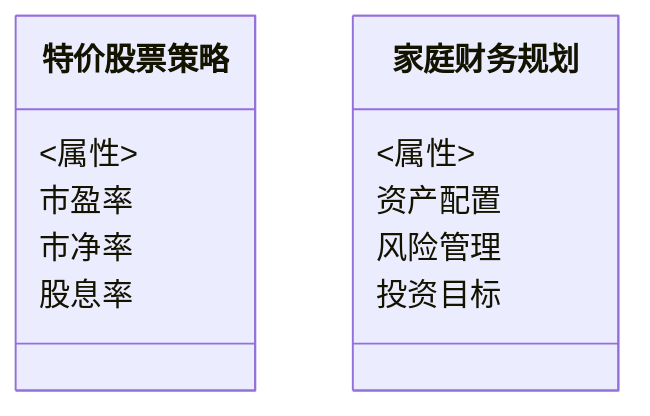

                 


# 如何将特价股票策略融入家庭财务规划

> 关键词：特价股票，家庭财务规划，投资策略，风险管理，财务优化

> 摘要：本文系统地探讨了如何将特价股票策略融入家庭财务规划，通过理论分析、算法原理、系统设计、实战应用和案例分析，详细阐述了特价股票策略在家庭财务规划中的应用方法，帮助读者在实际操作中优化财务结构，实现财富增值。

---

# 第一部分: 特价股票策略与家庭财务规划的背景与基础

# 第1章: 特价股票策略概述

## 1.1 特价股票的基本概念

### 1.1.1 什么是特价股票
特价股票是指市场价格低于其内在价值的股票，通常被认为是被市场低估的投资机会。这种策略的核心在于发现价格与价值的不匹配。

### 1.1.2 特价股票的特点与分类
特价股票的特点包括低市盈率、低市净率、高股息率等。常见的分类有周期性股票、困境反转向好股票、成长型低估股票等。

### 1.1.3 特价股票的投资价值
特价股票的投资价值在于其潜在的上涨空间和较高的安全边际，适合长期价值投资者。

## 1.2 家庭财务规划的基本概念

### 1.2.1 家庭财务规划的定义
家庭财务规划是指通过合理的资产配置和预算管理，实现家庭财务目标的过程。

### 1.2.2 家庭财务规划的核心要素
包括收入管理、支出控制、资产配置、风险管理、税务优化等。

### 1.2.3 特价股票在家庭财务规划中的地位
特价股票作为一种高性价比的投资工具，可以在家庭资产配置中占据重要地位，帮助实现长期财富增值。

## 1.3 特价股票策略与家庭财务规划的结合

### 1.3.1 结合的必要性
通过利用特价股票的低估值特性，优化家庭资产配置，提高整体投资收益。

### 1.3.2 结合的可能性
家庭财务规划的灵活性和可调整性为特价股票策略的应用提供了空间。

### 1.3.3 结合的边界与外延
需考虑家庭的财务状况、风险承受能力及投资目标，确保策略的适用性。

---

# 第2章: 特价股票策略的核心概念与联系

## 2.1 特价股票策略的核心原理

### 2.1.1 市场定价偏差的原理
市场定价偏差是特价股票存在的基础，投资者需识别并利用这种偏差。

### 2.1.2 价值发现的机制
通过基本面分析和估值指标，识别被低估的股票。

### 2.1.3 投资者心理与行为的影响
投资者心理偏差可能导致市场低估某些股票，为价值投资者提供机会。

## 2.2 特价股票与非特价股票的对比分析

### 2.2.1 属性特征对比表格
| 属性       | 特价股票                 | 非特价股票             |
|------------|--------------------------|-------------------------|
| 市盈率      | 低于行业平均水平         | 高于或等于行业平均水平  |
| 市净率      | 低于行业平均水平         | 高于或等于行业平均水平  |
| 股息率      | 较高                     | 较低                   |
| 风险        | 较低（价值稳定）         | 较高（波动性大）         |

### 2.2.2 市场表现对比分析
特价股票通常在市场低迷时表现不佳，但在市场复苏时有较大的反弹潜力。

### 2.2.3 风险收益比的差异
特价股票的风险收益比通常较高，适合长期投资者。

## 2.3 特价股票策略的ER实体关系图

```mermaid
er
actor: 投资者
entity: 特价股票
entity: 非特价股票
entity: 投资组合
```

---

# 第3章: 特价股票策略的算法原理

## 3.1 算法原理概述

### 3.1.1 数据收集与预处理
收集历史价格、财务指标等数据，并进行清洗和标准化。

### 3.1.2 股票估值模型的建立
使用市盈率、市净率等指标构建估值模型，计算股票的内在价值。

### 3.1.3 投资决策的逻辑
根据估值结果和市场趋势，决定是否买入、持有或卖出股票。

## 3.2 算法原理的Mermaid流程图

```mermaid
graph TD
A[开始] -> B[数据收集]
B -> C[数据清洗]
C -> D[建立估值模型]
D -> E[计算内在价值]
E -> F[市场趋势分析]
F -> G[投资决策]
G -> H[结束]
```

## 3.3 算法实现的Python源代码

```python
import pandas as pd
import numpy as np

# 数据收集与预处理
data = pd.read_csv('stock_data.csv')
data = data.dropna()

# 市盈率计算
data['PE'] = data['市盈率']
data['PB'] = data['市净率']

# 筛选特价股票
def is_cheap_stock(row):
    return row['PE'] < data['PE'].mean() and row['PB'] < data['PB'].mean()

data['is_cheap'] = data.apply(is_cheap_stock, axis=1)
cheap_stocks = data[data['is_cheap']]
```

---

# 第4章: 特价股票策略的数学模型与公式

## 4.1 市盈率与市净率的计算

### 市盈率公式
$$ PE = \frac{股票价格}{每股收益} $$

### 市净率公式
$$ PB = \frac{股票价格}{每股净资产} $$

## 4.2 投资组合优化的数学模型

### 马科维茨均值-方差模型
$$ \text{Minimize } \sigma^2 \text{ subject to } E(r) \geq \text{目标收益} $$

### 股票权重的优化公式
$$ w_i = \frac{E(r_i) / \sigma_i^2}{\sum w_j (E(r_j) / \sigma_j^2)} $$

---

# 第5章: 特价股票策略的系统架构与设计

## 5.1 项目介绍

### 项目目标
通过特价股票策略优化家庭财务结构，实现财富增值。

## 5.2 系统功能设计

### 领域模型Mermaid类图


### 系统架构Mermaid架构图
```mermaid
container 家庭财务系统 {
    component 数据采集模块 {
        数据源
    }
    component 估值模块 {
        市盈率计算
        市净率计算
    }
    component 投资决策模块 {
        策略应用
        投资组合优化
    }
}
```

---

# 第6章: 特价股票策略的实战应用与案例分析

## 6.1 项目实战

### 环境安装与配置
安装Python、Pandas、Numpy等工具。

### 核心实现源代码
```python
# 数据获取
import yfinance as yf
data = yf.download(tickers='AAPL', period='5y')

# 估值计算
data['PE'] = data['Close'] / data['Earnings Per Share']
```

## 6.2 实际案例分析

### 案例1：低估股票的选择
通过分析市盈率和市净率，选择具有低估特征的股票进行投资。

## 6.3 项目小结
总结实战经验，提出改进建议。

---

# 第7章: 风险管理与优化

## 7.1 风险管理的重要性

### 市场波动风险
通过分散投资降低风险。

### 公司基本面变化风险
定期评估和调整投资组合。

## 7.2 优化策略

### 分散投资
将资金分配到多个特价股票中，降低风险。

### 定期再平衡
根据市场变化和财务目标，定期调整投资组合。

---

# 第8章: 总结与展望

## 8.1 本文总结
总结全文内容，强调特价股票策略在家庭财务规划中的重要性。

## 8.2 未来展望
探讨未来可能的优化方向和新技术应用。

---

# 参考文献

## [1] 《投资学》
## [2] 《家庭财务管理实务》
## [3] Python数据处理与可视化

---

# 致谢

感谢读者的支持，感谢相关工具和技术的贡献者。

