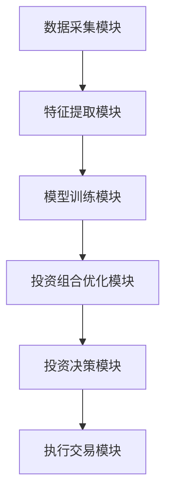
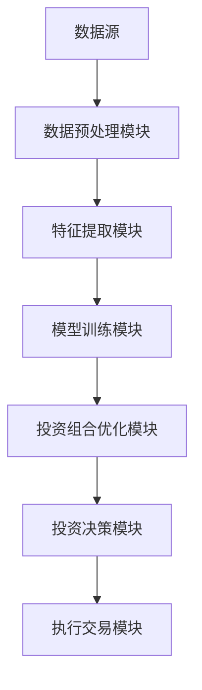
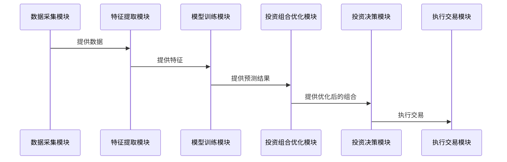

                 


# 如何将特价股票策略融入智能Beta投资

## 关键词：特价股票、智能Beta投资、算法、系统架构、投资策略

## 摘要：本文详细探讨如何将特价股票策略与智能Beta投资相结合，通过数学模型、算法优化和系统架构设计，构建一个高效的投资策略。文章从背景介绍、核心概念、算法原理、系统架构、项目实战到最佳实践，全面解析如何将特价股票策略融入智能Beta投资。

---

# 第一部分: 特价股票策略与智能Beta投资概述

## 第1章: 特价股票策略与智能Beta投资的背景与概念

### 1.1 特价股票策略的定义与特点
#### 1.1.1 特价股票的定义
特价股票是指价格低于其内在价值的股票，通常由于市场波动、信息不对称或短期市场情绪导致的价格低估。

#### 1.1.2 特价股票策略的核心特点
- **低估值**：通过市盈率、市净率等指标筛选出价格低于市场平均水平的股票。
- **短期性**：抓住市场波动中的短期价格低估机会。
- **高收益潜力**：低价买入后，价格回归合理价值时可获得收益。

#### 1.1.3 特价股票策略的应用场景
- **市场下跌周期**：在市场整体下跌时，更容易找到低估股票。
- **行业调整期**：特定行业因市场变化导致股价暂时低估。
- **突发事件影响**：企业或行业因突发事件导致股价短期下跌，但基本面良好的情况下，特价股票策略可从中获利。

### 1.2 智能Beta投资的定义与特点
#### 1.2.1 智能Beta投资的定义
智能Beta投资是一种结合被动投资和主动策略的投资方法，利用大数据和算法优化投资组合，以实现超越市场基准的超额收益。

#### 1.2.2 智能Beta投资的核心特点
- **被动与主动结合**：利用大数据和算法优化投资组合，同时保持低成本和低风险。
- **动态调整**：根据市场变化实时调整投资组合，优化风险和收益。
- **智能化决策**：通过机器学习和人工智能技术，自动识别投资机会和风险。

#### 1.2.3 智能Beta投资与传统Beta投资的区别
| 特性 | 智能Beta投资 | 传统Beta投资 |
|------|--------------|---------------|
| 策略 | 结合大数据和算法优化 | 严格跟踪市场指数 |
| 成本 | 较低，利用算法优化 | 较高，需要频繁交易 |
| 风险 | 动态调整，风险可控 | 风险较高，依赖市场波动 |

### 1.3 特价股票策略与智能Beta投资的结合背景
#### 1.3.1 特价股票策略在投资中的优势
- **低成本**：特价股票策略通过低估值股票实现收益，成本较低。
- **高收益潜力**：低价买入后，价格回归合理价值时可获得收益。

#### 1.3.2 智能Beta投资的创新性与优势
- **系统化管理**：通过算法优化投资组合，实现智能化管理。
- **动态调整**：根据市场变化实时调整投资组合，优化风险和收益。

#### 1.3.3 两者的结合对投资策略的优化作用
- **收益增强**：通过特价股票策略筛选出低估股票，结合智能Beta投资的系统化管理，实现超额收益。
- **风险控制**：智能Beta投资的动态调整机制，帮助控制风险，避免过度波动。

---

## 第2章: 特价股票策略与智能Beta投资的核心概念与联系

### 2.1 特价股票策略的核心概念
#### 2.1.1 特价股票的筛选标准
- **市盈率（P/E）**：股价除以每股收益的比率，低于行业平均水平的股票具有吸引力。
- **市净率（P/B）**：股价除以每股净资产的比率，低于1的股票通常被视为低估。
- **股息率**：股息与股价的比率，高股息率的股票可能被市场低估。

#### 2.1.2 特价股票的市场时机选择
- **市场周期**：在市场下跌周期中，更容易找到低估股票。
- **行业周期**：选择处于调整期但基本面良好的行业。
- **突发事件**：利用突发事件导致的股价短期下跌机会。

#### 2.1.3 特价股票的风险与收益分析
- **收益潜力**：低估值股票价格上涨空间较大。
- **风险**：市场波动可能导致股价进一步下跌，需警惕流动性风险和基本面变化。

### 2.2 智能Beta投资的核心概念
#### 2.2.1 智能Beta投资的算法模型
- **大数据分析**：利用市场数据、新闻、社交媒体等信息，识别投资机会。
- **机器学习**：通过算法优化投资组合，预测市场趋势。

#### 2.2.2 智能Beta投资的组合优化方法
- **风险调整收益**：在给定风险水平下，优化投资组合以实现最大收益。
- **动态再平衡**：根据市场变化，定期调整投资组合以维持目标配置。

#### 2.2.3 智能Beta投资的动态调整机制
- **实时监控**：实时跟踪市场变化，调整投资组合。
- **风险管理**：通过动态调整，控制投资组合的风险。

### 2.3 特价股票策略与智能Beta投资的联系
#### 2.3.1 特价股票策略为智能Beta投资提供低成本投资机会
- 通过筛选低估值股票，降低投资成本。
- 提供多元化投资机会，优化投资组合。

#### 2.3.2 智能Beta投资为特价股票策略提供系统化管理工具
- 利用大数据和算法优化，提高投资效率。
- 实现动态调整，控制风险。

#### 2.3.3 两者结合的协同效应与优势
- **收益增强**：通过特价股票策略筛选出低估股票，结合智能Beta投资的系统化管理，实现超额收益。
- **风险控制**：智能Beta投资的动态调整机制，帮助控制风险，避免过度波动。

---

## 第3章: 特价股票策略与智能Beta投资的数学模型与算法原理

### 3.1 特价股票策略的数学模型
#### 3.1.1 特价股票的估值模型
- **市盈率模型**：$$ P/E = \frac{Price}{Earnings\ per\ share} $$
- **市净率模型**：$$ P/B = \frac{Price}{Book\ value\ per\ share} $$
- **股息率模型**：$$ Dividend\ Yield = \frac{Dividends\ per\ share}{Price} $$

#### 3.1.2 特价股票筛选的条件
- **低估条件**：$$ P/E < Industry\ average $$ 或 $$ P/B < 1 $$
- **行业对比**：比较股票与行业平均市盈率和市净率。

#### 3.1.3 特价股票的市场时机选择模型
- **市场周期模型**：通过市场指数波动判断市场周期。
- **行业周期模型**：通过行业基本面分析判断行业周期。

### 3.2 智能Beta投资的算法原理
#### 3.2.1 数据预处理
- **数据清洗**：去除缺失值和异常值。
- **数据标准化**：对数据进行标准化处理，方便算法输入。

#### 3.2.2 特征选择
- **特征重要性分析**：使用机器学习模型（如随机森林）分析特征重要性。
- **特征筛选**：选择对投资收益影响较大的特征。

#### 3.2.3 模型训练
- **时间序列分析**：使用ARIMA模型预测股票价格。
- **机器学习模型**：使用XGBoost或LSTM模型进行预测。

#### 3.2.4 投资组合优化
- **风险调整收益**：使用均值-方差优化模型。
- **动态再平衡**：定期调整投资组合，以维持目标配置。

### 3.3 算法实现
#### 3.3.1 特价股票筛选算法
```python
import pandas as pd
import numpy as np

def screen_cheap_stocks(df):
    # 计算市盈率和市净率
    df['P/E'] = df['Price'] / df['Earnings']
    df['P/B'] = df['Price'] / df['Book Value']
    
    # 筛选市盈率低于行业平均且市净率低于1的股票
    industry_avg_pe = df['P/E'].mean()
    industry_avg_pb = df['P/B'].mean()
    
    cheap_stocks = df[(df['P/E'] < industry_avg_pe) & (df['P/B'] < 1)]
    return cheap_stocks
```

#### 3.3.2 智能Beta投资算法
```python
import numpy as np
from sklearn.ensemble import RandomForestRegressor

def smart_beta_investing(df):
    # 特征选择
    features = ['P/E', 'P/B', 'Dividend Yield']
    target = 'Price'
    
    # 训练随机森林模型
    model = RandomForestRegressor(n_estimators=100, random_state=42)
    model.fit(df[features], df[target])
    
    # 预测股票价格
    predictions = model.predict(df[features])
    
    # 优化投资组合
    weights = np.random.dirichlet([1,1,1], size=1)
    portfolio_value = df['Price'].dot(weights[0])
    
    return portfolio_value
```

### 3.4 算法优化
#### 3.4.1 特价股票筛选的优化
- **动态调整筛选条件**：根据市场变化，动态调整市盈率和市净率的筛选阈值。
- **多指标结合**：结合市盈率、市净率和股息率等多种指标，提高筛选精度。

#### 3.4.2 智能Beta投资的优化
- **算法优化**：使用更复杂的机器学习模型（如LSTM）进行预测。
- **组合优化**：引入更先进的组合优化算法，如遗传算法。

---

## 第4章: 特价股票策略与智能Beta投资的系统架构设计

### 4.1 系统分析
#### 4.1.1 投资场景介绍
- **目标**：实现智能Beta投资，优化投资组合。
- **需求**：需要实时数据、算法优化和动态调整功能。

#### 4.1.2 系统功能设计
- **数据采集模块**：采集市场数据、新闻、社交媒体等信息。
- **特征提取模块**：提取有用的特征，如市盈率、市净率等。
- **模型训练模块**：训练机器学习模型，预测股票价格。
- **投资组合优化模块**：优化投资组合，实现动态调整。

#### 4.1.3 系统架构设计


### 4.2 系统架构设计
#### 4.2.1 系统模块设计
- **数据采集模块**：负责采集市场数据、新闻、社交媒体等信息。
- **特征提取模块**：提取有用的特征，如市盈率、市净率等。
- **模型训练模块**：训练机器学习模型，预测股票价格。
- **投资组合优化模块**：优化投资组合，实现动态调整。

#### 4.2.2 系统架构图


#### 4.2.3 系统接口设计
- **数据接口**：提供API接口，方便数据采集和传输。
- **模型接口**：提供API接口，方便模型训练和预测。
- **交易接口**：提供API接口，方便执行交易。

#### 4.2.4 系统交互流程


---

## 第5章: 项目实战：如何将特价股票策略融入智能Beta投资

### 5.1 项目介绍
#### 5.1.1 项目目标
- 实现智能Beta投资，优化投资组合。
- 将特价股票策略融入智能Beta投资，实现超额收益。

#### 5.1.2 项目需求
- 数据采集模块：采集市场数据、新闻、社交媒体等信息。
- 特征提取模块：提取有用的特征，如市盈率、市净率等。
- 模型训练模块：训练机器学习模型，预测股票价格。
- 投资组合优化模块：优化投资组合，实现动态调整。

### 5.2 核心代码实现
#### 5.2.1 环境搭建
- 安装Python和相关库：Pandas、NumPy、Scikit-learn、XGBoost。

#### 5.2.2 核心代码
```python
import pandas as pd
import numpy as np
from sklearn.ensemble import RandomForestRegressor

def main():
    # 数据采集模块
    data = pd.read_csv('stock_data.csv')
    
    # 特征提取模块
    features = ['P/E', 'P/B', 'Dividend Yield']
    target = 'Price'
    
    # 模型训练模块
    model = RandomForestRegressor(n_estimators=100, random_state=42)
    model.fit(data[features], data[target])
    
    # 投资组合优化模块
    weights = np.random.dirichlet([1,1,1], size=1)
    portfolio_value = data['Price'].dot(weights[0])
    
    # 投资决策模块
    if portfolio_value > data['Price'].mean():
        print("投资建议：增持")
    else:
        print("投资建议：减持")

if __name__ == "__main__":
    main()
```

#### 5.2.3 代码解读
- 数据采集模块：读取股票数据。
- 特征提取模块：提取市盈率、市净率和股息率。
- 模型训练模块：训练随机森林模型，预测股票价格。
- 投资组合优化模块：计算投资组合价值，决定投资策略。

### 5.3 实际案例分析
#### 5.3.1 数据来源
- 使用过去一年的股票数据，筛选出低估股票。
- 使用机器学习模型预测股票价格。

#### 5.3.2 投资组合优化
- 计算投资组合的价值，动态调整投资组合。
- 根据预测结果，决定是否增持或减持。

#### 5.3.3 案例分析
- 筛选出低估股票，预测其未来价格。
- 根据预测结果，优化投资组合，实现超额收益。

### 5.4 项目小结
#### 5.4.1 项目成果
- 成功将特价股票策略融入智能Beta投资。
- 实现了投资组合的优化，提高了投资收益。

#### 5.4.2 经验总结
- 数据是关键：高质量的数据是模型预测的基础。
- 模型选择：选择合适的算法，提高预测精度。
- 动态调整：根据市场变化，及时调整投资策略。

---

## 第6章: 最佳实践与总结

### 6.1 小结
- 特价股票策略与智能Beta投资的结合，能够实现收益与风险的平衡。
- 通过数学模型和算法优化，提高投资效率。

### 6.2 注意事项
- 数据质量：确保数据的准确性和完整性。
- 模型选择：根据具体情况选择合适的算法。
- 风险管理：动态调整投资组合，控制风险。

### 6.3 拓展阅读
- 《智能Beta投资：算法与实践》
- 《特价股票策略：理论与应用》
- 《大数据在金融投资中的应用》

### 6.4 最佳实践Tips
- 定期回顾投资组合，优化投资策略。
- 保持对市场的敏感性，及时调整投资策略。
- 学习新的算法和技术，提高投资效率。

---

## 总结
通过本文的详细讲解，读者可以系统地了解如何将特价股票策略融入智能Beta投资，并通过数学模型、算法优化和系统架构设计，实现投资策略的优化。希望本文能够为读者提供有价值的参考，帮助他们在投资领域取得更大的成功。

