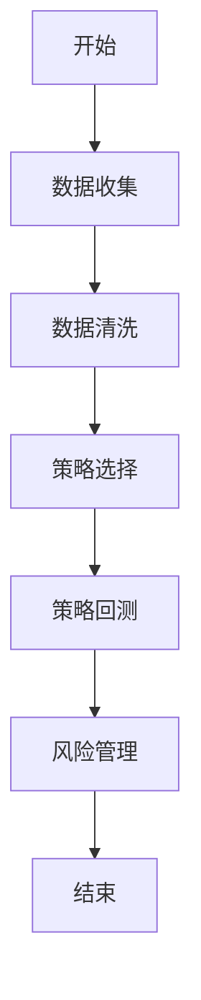
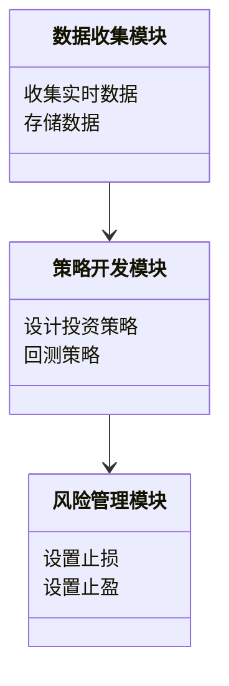
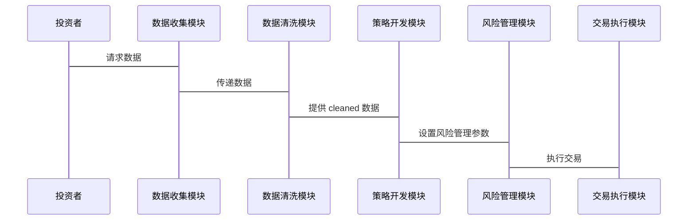

                 


# 如何建立特价股票投资的系统化流程

> 关键词：特价股票投资，系统化流程，套利机会，技术分析，风险管理，投资策略

> 摘要：本文将详细介绍如何系统化地进行特价股票投资，涵盖从核心概念到系统化流程构建、数学模型、系统架构设计、项目实战等多方面的内容，帮助投资者建立科学的投资流程，提高投资效率和成功率。

---

## 第1章: 特价股票投资的背景与概念

### 1.1 特价股票的定义与特征

#### 1.1.1 什么是特价股票
特价股票是指在特定时间点以低于市场价或内在价值购买的股票。这种股票通常出现在市场波动、信息不对称或市场参与者行为偏差的情况下。

#### 1.1.2 特价股票的市场特征
- **低估值**：股票价格显著低于其内在价值。
- **暂时性**：特价股票通常不会长期存在，因为市场会迅速调整价格。
- **机会性**：依赖于市场波动和投资者行为。

#### 1.1.3 特价股票的投资价值
- **高回报潜力**：以低价买入，高价卖出。
- **风险对冲**：通过套利机会降低市场风险。

### 1.2 系统化投资流程的必要性

#### 1.2.1 投资者行为的非理性
- **情绪化决策**：投资者常因贪婪或恐惧做出错误决策。
- **认知偏差**：过度自信或从众心理影响判断。

#### 1.2.2 系统化投资的优势
- **减少情绪干扰**：通过系统化流程避免情绪化决策。
- **提高效率**：系统化方法可快速识别机会并执行交易。
- **风险可控**：通过严格的风险管理降低投资损失。

#### 1.2.3 系统化流程的核心要素
- **数据收集与处理**：获取实时市场数据并进行清洗。
- **策略开发与优化**：设计并回测投资策略。
- **风险管理**：设定止损和止盈机制。

### 1.3 特价股票投资的基本原理

#### 1.3.1 市场定价机制
- **有效市场假说**：在有效市场中，资产价格反映所有可用信息。
- **市场套利**：通过套利机会在不同市场间获利。

#### 1.3.2 市场套利机会
- **跨市场套利**：利用不同市场间的价格差异。
- **时间套利**：利用价格在不同时间的波动。

#### 1.3.3 技术分析与基本面分析的结合
- **技术分析**：通过价格和成交量预测未来走势。
- **基本面分析**：通过公司财务数据评估内在价值。
- **结合应用**：技术分析用于短期判断，基本面分析用于长期评估。

### 1.4 本章小结
本章介绍了特价股票的基本概念、投资价值以及系统化投资的必要性，强调了系统化流程在投资中的重要性。

---

## 第2章: 特价股票投资的核心概念

### 2.1 套利机会的识别

#### 2.1.1 套利的基本原理
套利是指利用价格差异在不承担额外风险的情况下获利。

#### 2.1.2 常见的套利策略
- **跨市场套利**：在不同市场间 arbitrage。
- **跨期套利**：利用期货与现货价格差异。
- **事件套利**：利用公司事件（如并购）带来的价格波动。

#### 2.1.3 套利机会的来源
- **市场不一致**：不同市场或资产的价格差异。
- **信息不对称**：部分市场参与者掌握未公开信息。

### 2.2 市场有效性的分析

#### 2.2.1 市场有效性的定义
市场有效性指资产价格反映所有相关信息的程度。

#### 2.2.2 弱有效、强有效与半强有效的区别
- **弱有效市场**：价格反映历史信息。
- **半强有效市场**：价格反映公开信息。
- **强有效市场**：价格反映所有信息（包括内部信息）。

#### 2.2.3 市场有效性对投资策略的影响
- 在弱有效市场中，技术分析有效。
- 在半强有效市场中，基本面分析有效。
- 在强有效市场中，套利机会减少。

### 2.3 技术分析与基本面分析的对比

#### 2.3.1 技术分析的核心假设
- 价格反映市场情绪。
- 历史价格模式重复出现。

#### 2.3.2 基本面分析的核心假设
- 公司价值决定股价。
- 市场短期波动不影响长期价值。

#### 2.3.3 两种分析方法的优缺点
| 分析方法 | 优点 | 缺点 |
|----------|------|------|
| 技术分析 | 短期预测能力强 | 易受市场情绪影响 |
| 基本面分析 | 长期预测准确 | 需大量数据支持 |

### 2.4 本章小结
本章分析了套利机会、市场有效性和两种分析方法，为后续系统化流程的构建奠定了基础。

---

## 第3章: 系统化投资流程的构建

### 3.1 系统化流程的框架设计

#### 3.1.1 投资目标的设定
- 明确投资目标（如短期套利或长期增值）。
- 设定风险承受能力。

#### 3.1.2 数据收集与处理
- 数据来源：股票价格、成交量、财务报表等。
- 数据清洗：处理缺失值和异常值。

#### 3.1.3 策略开发与回测
- 策略设计：结合技术分析和基本面分析。
- 策略回测：使用历史数据验证策略的有效性。

#### 3.1.4 风险管理与优化
- 设定止损和止盈点。
- 调整策略参数以优化收益与风险比。

### 3.2 数据驱动的决策过程

#### 3.2.1 数据收集的渠道与方法
- 数据源：股票交易所、财经网站、API接口。
- 数据频率：实时数据或历史数据。

#### 3.2.2 数据清洗与预处理
- 去除缺失值。
- 标准化数据格式。

#### 3.2.3 数据分析与可视化
- 使用图表展示价格走势。
- 通过统计分析识别趋势和异常。

### 3.3 策略开发与优化

#### 3.3.1 策略的设计原则
- 简洁性：避免过度复杂的策略。
- 可重复性：策略应在不同市场条件下适用。

#### 3.3.2 策略的回测与验证
- 回测历史数据。
- 计算策略的收益和风险指标（如夏普比率）。

#### 3.3.3 策略的持续优化
- 根据市场变化调整策略。
- 使用机器学习优化策略参数。

### 3.4 系统化流程的实现工具

#### 3.4.1 数据处理工具
- Python的Pandas库。
- 数据库存储和查询。

#### 3.4.2 策略开发工具
- QuantLib：用于金融计算。
- Backtrader：用于回测和模拟交易。

#### 3.4.3 风险管理工具
- 设置止损和止盈的条件。
- 使用风险管理框架（如VaR）。

### 3.5 本章小结
本章详细描述了系统化投资流程的构建过程，包括目标设定、数据处理、策略开发和风险管理。

---

## 第4章: 特价股票投资的数学模型与算法

### 4.1 市场价差的数学建模

#### 4.1.1 价差的定义与计算
- 价差 = 股票A价格 - 股票B价格。

#### 4.1.2 套利机会的数学条件
- 当价差超过理论值时，存在套利机会。

#### 4.1.3 套利模型的构建
$$ \text{理论价差} = f(\text{资产特性}) $$
$$ \text{实际价差} = \text{市场价差} $$

### 4.2 技术分析中的数学模型

#### 4.2.1 移动平均线（MA）
- 短期MA：n=5,10。
- 长期MA：n=50,100。

#### 4.2.2 相对强弱指数（RSI）
- RSI = (100 × (N上升日 / N总日))。
- 当RSI <30时，超卖；当RSI >70时，超买。

### 4.3 基本面分析的数学模型

#### 4.3.1 市盈率（P/E）
$$ P/E = \frac{\text{股价}}{\text{每股收益}} $$

#### 4.3.2 市净率（P/B）
$$ P/B = \frac{\text{股价}}{\text{每股净资产}} $$

### 4.4 系统化投资的算法实现

#### 4.4.1 算法流程图


#### 4.4.2 算法实现代码
```python
def collect_data(tickers, start, end):
    # 收集数据
    pass

def clean_data(df):
    # 清洗数据
    pass

def backtest(strategy, data):
    # 策略回测
    pass

def manage_risk(positions, price):
    # 风险管理
    pass
```

### 4.5 本章小结
本章通过数学模型和算法，展示了如何系统化地识别套利机会和进行技术分析。

---

## 第5章: 系统分析与架构设计方案

### 5.1 问题场景介绍

#### 5.1.1 特价股票投资的场景
- 投资者希望在特定市场条件下进行特价股票投资。
- 需要快速识别套利机会并执行交易。

### 5.2 项目介绍

#### 5.2.1 项目目标
- 构建一个系统化投资平台。
- 提供套利机会识别和风险管理功能。

### 5.3 系统功能设计

#### 5.3.1 领域模型


#### 5.3.2 系统架构设计


### 5.4 系统接口设计

#### 5.4.1 数据接口
- 数据收集模块通过API接口获取实时数据。

#### 5.4.2 交易接口
- 风险管理模块通过API接口发送交易指令。

### 5.5 系统交互设计

#### 5.5.1 交互流程图


### 5.6 本章小结
本章通过系统分析和架构设计，展示了如何构建一个高效的系统化投资平台。

---

## 第6章: 项目实战

### 6.1 环境安装

#### 6.1.1 安装Python
```bash
python --version
pip install --upgrade pip
```

#### 6.1.2 安装依赖库
```bash
pip install pandas numpy matplotlib backtrader
```

### 6.2 系统核心实现源代码

#### 6.2.1 数据收集模块
```python
import pandas as pd
import requests

def collect_data(ticker):
    url = f"https://api.example.com/stock/{ticker}"
    response = requests.get(url)
    data = response.json()
    df = pd.DataFrame(data)
    return df
```

#### 6.2.2 策略开发模块
```python
from backtrader import Strategy

class MyStrategy(Strategy):
    def __init__(self):
        self.data = self.datas[0]

    def next(self):
        if self.data.close > self.data.sma(20):
            self.buy()
        elif self.data.close < self.data.sma(20):
            self.sell()
```

#### 6.2.3 风险管理模块
```python
def manage_risk(positions, price):
    for ticker in positions:
        if price[ticker] < positions[ticker]['entry_price'] * 0.95:
            positions[ticker]['stop_loss'] = True
```

### 6.3 代码应用解读与分析

#### 6.3.1 数据收集模块解读
- 通过API获取实时数据。
- 数据清洗后用于策略开发。

#### 6.3.2 策略开发模块解读
- 使用技术指标（如SMA）进行买卖决策。
- 策略回测结果显示收益和风险指标。

### 6.4 实际案例分析

#### 6.4.1 案例背景
- 投资者希望在特定市场条件下进行套利。

#### 6.4.2 案例分析
- 数据收集模块获取相关股票数据。
- 策略开发模块设计并回测套利策略。
- 风险管理模块设置止损和止盈。

### 6.5 项目小结
本章通过实际案例展示了系统化投资流程的实现，强调了代码实现和风险管理的重要性。

---

## 第7章: 扩展阅读与后续发展

### 7.1 扩展阅读

#### 7.1.1 机器学习在投资中的应用
- 使用机器学习模型预测股票价格。
- 通过深度学习分析市场情绪。

#### 7.1.2 风险管理的深入探讨
- 多因子模型。
- 压力测试。

### 7.2 后续发展

#### 7.2.1 系统优化方向
- 提高数据处理效率。
- 引入机器学习算法优化策略。

#### 7.2.2 技术进步带来的新机会
- 利用大数据和人工智能提升投资效率。

### 7.3 本章小结
本章提供了扩展阅读的方向和后续系统优化的建议，为读者进一步学习和实践提供了方向。

---

## 附录

### 附录A: 术语表
- **套利**：利用价格差异获利。
- **夏普比率**：衡量投资回报的风险调整后收益。

### 附录B: 工具与库
- **Pandas**：数据处理。
- **Backtrader**：回测工具。

### 附录C: 参考文献
- 《Python for Data Analysis》。
- 《Quantitative Equity Portfolio Management》。

---

**摘要**：本文通过系统化流程的构建，详细讲解了特价股票投资的核心概念、数学模型、系统架构设计和实际案例。通过理论与实践的结合，帮助投资者建立科学的投资流程，提高投资效率和成功率。

