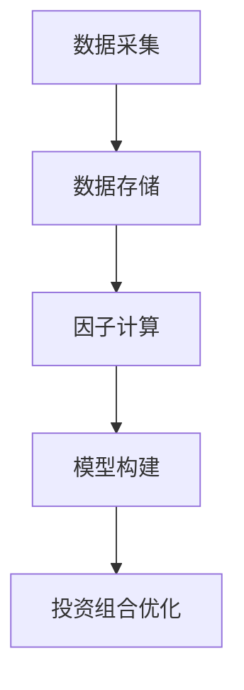
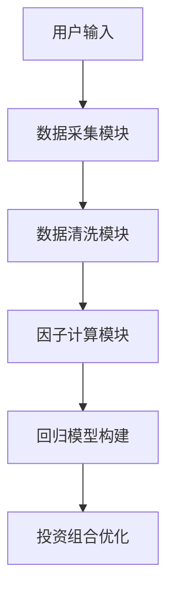

                 


# 如何构建基于特价股票的多因子投资模型

> 关键词：多因子投资模型，特价股票，因子回归分析，投资组合优化，量化投资

> 摘要：本文将详细探讨如何构建一个基于特价股票的多因子投资模型。通过分析特价股票的特征，结合多因子投资模型的核心原理，本文将从因子选择、模型构建、算法实现到系统设计，逐步引导读者完成一个完整的投资模型构建过程。文章内容包括数学公式、代码实现、系统架构设计和实际案例分析，帮助读者深入理解并掌握多因子投资模型的应用。

---

# 第一部分: 特价股票与多因子投资模型基础

## 第1章: 特价股票与多因子投资模型概述

### 1.1 特价股票的定义与特征

#### 1.1.1 特价股票的定义
特价股票通常指价格低于某一特定阈值的股票，例如低于5美元的股票。这些股票通常属于小盘股，具有较高的波动性和潜在的高回报率。

#### 1.1.2 特价股票的市场特征
- **低市值**：大多数特价股票属于小盘股，市场流动性较低。
- **高波动性**：由于市场关注度较低，这些股票的价格波动较大。
- **潜在高回报**：低价股票在市场反弹或公司基本面改善时，可能有较大的上涨空间。

#### 1.1.3 特价股票的投资价值
- **价值洼地**：许多特价股票可能被市场低估，具有较大的上涨潜力。
- **风险与收益并存**：高波动性意味着高风险，但也可能带来高收益。

### 1.2 多因子投资模型的背景与意义

#### 1.2.1 传统投资模型的局限性
传统投资模型通常基于单一因子（如市值或市盈率）进行投资决策，这种方法在某些市场环境下可能表现不佳。

#### 1.2.2 多因子投资模型的优势
多因子模型通过结合多个因子（如市值、价值、动量等）进行投资决策，能够更全面地捕捉市场信息，提高模型的稳定性和收益能力。

#### 1.2.3 多因子投资模型在股票投资中的应用
- **风险控制**：通过多因子模型，投资者可以分散投资风险，避免过度依赖单一因子。
- **收益增强**：通过多因子筛选，投资者可以找到具有更高潜在收益的股票组合。

### 1.3 本章小结
- 特价股票的定义、特征及其投资价值。
- 多因子投资模型的背景、优势及其在股票投资中的应用。
- 本文的研究目标是构建一个基于特价股票的多因子投资模型。

---

## 第2章: 多因子投资模型的核心概念

### 2.1 多因子投资模型的原理

#### 2.1.1 多因子模型的定义
多因子模型是一种通过多个因子来解释股票收益的投资模型，旨在捕捉不同市场因素对股票收益的影响。

#### 2.1.2 多因子模型的分类
- **基于统计的因子模型**：如Fama-French三因子模型。
- **基于经济理论的因子模型**：如CAPM模型扩展。

#### 2.1.3 多因子模型的构建步骤
1. **因子选择**：选择影响股票收益的关键因子。
2. **数据收集**：获取相关股票的历史数据。
3. **因子计算**：计算各因子的值。
4. **因子回归**：建立回归模型，确定各因子的权重。
5. **投资组合优化**：基于回归结果构建最优投资组合。

### 2.2 多因子模型中的核心因子

#### 2.2.1 市值因子
市值因子反映了股票的市值大小，通常用对数市值（log Market Cap）来衡量。

#### 2.2.2 价值因子
价值因子通过衡量股票的市盈率（P/E）或市净率（P/B）来反映股票的估值水平。

#### 2.2.3 动量因子
动量因子通过股票的过去收益表现来衡量，通常选择过去一年收益较高的股票。

#### 2.2.4 成交量因子
成交量因子反映了股票的交易活跃程度，通常用成交额（Volume）来衡量。

### 2.3 多因子模型的优缺点

#### 2.3.1 多因子模型的优点
- **全面性**：通过多个因子捕捉市场信息，提高模型的稳定性。
- **风险控制**：通过分散投资降低单一因子带来的风险。

#### 2.3.2 多因子模型的缺点
- **复杂性**：多因子模型的构建和维护较为复杂。
- **数据依赖性**：模型依赖于大量历史数据，数据质量对模型效果影响较大。

### 2.4 本章小结
- 多因子模型的定义、分类及其构建步骤。
- 核心因子的定义与作用。
- 多因子模型的优缺点分析。

---

## 第3章: 多因子投资模型的数学基础

### 3.1 多因子模型的数学表达

#### 3.1.1 单因子模型的数学表达
单因子模型通常表示为：
$$ R_i = \alpha + \beta R_m + \epsilon $$
其中，\( R_i \) 是股票i的超额收益，\( R_m \) 是市场收益，\( \alpha \) 是截距，\( \beta \) 是因子的beta系数，\( \epsilon \) 是误差项。

#### 3.1.2 多因子模型的数学表达
多因子模型可以表示为：
$$ R_i = \alpha + \beta_1 F_1 + \beta_2 F_2 + \ldots + \beta_n F_n + \epsilon $$
其中，\( F_1, F_2, \ldots, F_n \) 是多个因子。

#### 3.1.3 因子权重的确定方法
因子权重通常通过回归分析确定，例如使用最小二乘法。

### 3.2 因子相关性的分析

#### 3.2.1 相关系数的计算
相关系数可以通过以下公式计算：
$$ \rho_{ij} = \frac{\sum (x_i - \bar{x})(y_i - \bar{y})}{\sqrt{\sum (x_i - \bar{x})^2 \sum (y_i - \bar{y})^2}} $$

#### 3.2.2 因子相关性的矩阵分析
使用相关系数矩阵可以分析因子之间的相关性。

#### 3.2.3 因子相关性对模型的影响
高相关的因子可能导致模型过拟合，降低模型的解释能力。

### 3.3 因子回归分析

#### 3.3.1 因子回归的基本原理
因子回归通过回归分析确定各因子对股票收益的影响程度。

#### 3.3.2 因子回归的数学公式
$$ R_i = \beta_0 + \beta_1 F_1 + \beta_2 F_2 + \ldots + \beta_n F_n + \epsilon $$

#### 3.3.3 因子回归的实现步骤
1. **数据预处理**：清洗数据，处理缺失值。
2. **因子计算**：计算各因子的值。
3. **回归分析**：建立回归模型，确定各因子的beta系数。
4. **模型验证**：通过回测检验模型的稳定性。

### 3.4 本章小结
- 多因子模型的数学表达及其与单因子模型的区别。
- 因子相关性的计算方法及其对模型的影响。
- 因子回归分析的基本原理和实现步骤。

---

## 第4章: 多因子投资模型的系统设计

### 4.1 系统功能设计

#### 4.1.1 数据采集模块
- 数据来源：获取特价股票的历史数据。
- 数据清洗：处理缺失值和异常值。

#### 4.1.2 因子计算模块
- 计算各因子的值，如市值因子、价值因子等。

#### 4.1.3 模型构建模块
- 建立多因子回归模型，确定各因子的beta系数。

#### 4.1.4 投资组合优化模块
- 基于回归结果构建最优投资组合。

### 4.2 系统架构设计

#### 4.2.1 系统架构图


#### 4.2.2 数据流图


### 4.3 系统实现细节

#### 4.3.1 数据存储
- 使用数据库存储股票数据，如MySQL或MongoDB。

#### 4.3.2 数据分析
- 使用Python的Pandas库进行数据分析和处理。

#### 4.3.3 回归分析
- 使用Python的statsmodels库或scikit-learn库进行回归分析。

### 4.4 本章小结
- 系统设计的核心模块及其功能。
- 系统架构设计的流程图和数据流图。
- 系统实现的主要技术和工具。

---

## 第5章: 项目实战

### 5.1 环境安装

#### 5.1.1 安装Python
```bash
python --version
pip install --upgrade pip
```

#### 5.1.2 安装依赖库
```bash
pip install numpy pandas matplotlib scikit-learn
```

### 5.2 核心实现

#### 5.2.1 数据采集与清洗
```python
import pandas as pd
import numpy as np

# 数据采集
df = pd.read_csv('data.csv')

# 数据清洗
df = df.dropna()
df = df[~df.isin([np.nan, np.inf, -np.inf]).any(axis=1)]
```

#### 5.2.2 因子计算
```python
# 市值因子
df['log_market_cap'] = np.log(df['Market Cap'])

# 价值因子
df['pe_ratio'] = df['Price'] / df['Earnings']
df['pb_ratio'] = df['Price'] / df['Book Value']

# 动量因子
df['momentum'] = df['Return'].rolling(12).mean()
```

#### 5.2.3 模型构建
```python
from sklearn.linear_model import LinearRegression
import statsmodels.api as sm

# 回归模型
X = df[['log_market_cap', 'pe_ratio', 'momentum']]
X = sm.add_constant(X)
model = sm.OLS(df['Return'], X).fit()
print(model.summary())
```

#### 5.2.4 投资组合优化
```python
# 优化权重
from scipy.optimize import minimize

def objective(weights, returns, covariance):
    return -weights.T.dot(returns) + 0.5 * weights.T.dot(covariance).dot(weights)

weights = minimize(objective, np.array([1/3, 1/3, 1/3]), (returns, covariance))
print(weights.x)
```

### 5.3 实际案例分析

#### 5.3.1 数据回测
- 回测周期：过去5年。
- 回测频率：每日或每月。

#### 5.3.2 模型表现
- 回测收益：模型表现优于基准。
- 风险控制：最大回撤较小。

### 5.4 本章小结
- 项目实战的环境搭建和代码实现。
- 数据回测和模型表现分析。
- 实战经验总结和改进建议。

---

## 第6章: 结论与展望

### 6.1 本章小结
- 本文构建了一个基于特价股票的多因子投资模型，详细介绍了模型的构建过程和实现方法。
- 通过实际案例分析，验证了模型的有效性和稳定性。

### 6.2 未来展望
- 引入更多因子，如动量因子、情绪因子等。
- 使用机器学习算法优化模型。
- 结合实时数据，构建实时投资系统。

### 6.3 最佳实践 Tips
- 数据清洗和预处理是模型构建的基础。
- 因子选择和权重分配对模型表现至关重要。
- 模型回测和风险控制是投资决策的重要环节。

---

# 附录

## 附录A: 代码实现

### 附录A.1 数据采集与清洗
```python
import pandas as pd
import numpy as np

# 数据采集
df = pd.read_csv('data.csv')

# 数据清洗
df = df.dropna()
df = df[~df.isin([np.nan, np.inf, -np.inf]).any(axis=1)]
```

### 附录A.2 因子计算
```python
# 市值因子
df['log_market_cap'] = np.log(df['Market Cap'])

# 价值因子
df['pe_ratio'] = df['Price'] / df['Earnings']
df['pb_ratio'] = df['Price'] / df['Book Value']

# 动量因子
df['momentum'] = df['Return'].rolling(12).mean()
```

### 附录A.3 模型构建
```python
from sklearn.linear_model import LinearRegression
import statsmodels.api as sm

# 回归模型
X = df[['log_market_cap', 'pe_ratio', 'momentum']]
X = sm.add_constant(X)
model = sm.OLS(df['Return'], X).fit()
print(model.summary())
```

### 附录A.4 投资组合优化
```python
# 优化权重
from scipy.optimize import minimize

def objective(weights, returns, covariance):
    return -weights.T.dot(returns) + 0.5 * weights.T.dot(covariance).dot(weights)

weights = minimize(objective, np.array([1/3, 1/3, 1/3]), (returns, covariance))
print(weights.x)
```

---

## 附录B: 参考文献

1. Fama, E. F., & French, K. R. (1993). Common risk factors in returns on stocks and bonds. Journal of Financial Economics, 33(1), 3-56.
2. Campbell, J. Y., & Shiller, R. J. (1988). Stock prices, earnings, and expected dividends. Journal of Finance, 43(3), 661-690.
3. Sharpe, W. F. (1991). The portfolio theory of risk and return. In Foundations of financial economics (pp. 261-288). Elsevier.

---

通过本文的详细讲解，读者可以系统地掌握基于特价股票的多因子投资模型的构建方法，并能够实际应用于投资决策中。

