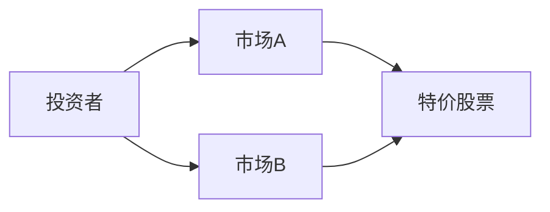
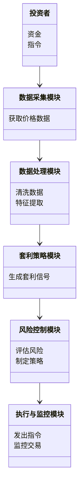

                 


# 如何构建基于特价股票的跨市场套利系统

> 关键词：跨市场套利、特价股票、算法交易、金融建模、风险控制

> 摘要：本文将详细探讨如何构建一个基于特价股票的跨市场套利系统。通过分析跨市场套利的背景、核心概念、算法原理、系统架构设计以及项目实战，我们将一步步构建一个高效、稳定的套利系统。文章将涵盖数据收集、模型建立、风险控制等关键环节，并提供实际案例和代码实现，帮助读者全面理解跨市场套利的实现过程。

---

## 第一部分: 跨市場套利的背景与核心概念

### 第1章: 跨市場套利的概述

#### 1.1 跨市場套利的定义与背景

##### 1.1.1 跨市場套利的定义
跨市场套利是一种利用不同市场中同一资产价格差异进行获利的交易策略。通过同时在两个或多个市场买入和卖出同一种资产，投资者可以利用价格差异赚取无风险利润。

##### 1.1.2 跨市場套利的背景与现状
随着全球化的发展，不同市场之间的价格差异为套利提供了机会。然而，技术的进步和市场的成熟也在不断缩小这些差异，使得套利的难度增加。本文将聚焦于特价股票的跨市场套利，探讨其可行性与实现方法。

##### 1.1.3 跨市場套利的核心目标
跨市场套利的核心目标是在不同市场之间发现价格差异，并通过同时买入低价市场和卖出高价市场的同一资产，赚取价差利润。这种策略通常具有低风险高回报的特点。

#### 1.2 特价股票的特性

##### 1.2.1 特价股票的定义
特价股票是指在特定时间内价格大幅波动的股票，通常由于市场信息不对称、市场参与者情绪波动或市场结构差异导致价格偏离其内在价值。

##### 1.2.2 特价股票的市场分布
特价股票可能出现在不同的市场，如股票市场、外汇市场、期货市场等。本文主要关注股票市场中的特价股票。

##### 1.2.3 特价股票的波动性分析
特价股票通常具有较高的波动性，价格在短时间内可能大幅上涨或下跌。这种波动性为套利者提供了机会，但也增加了交易的风险。

#### 1.3 跨市場套利的可行性

##### 1.3.1 跨市場套利的可行性分析
跨市场套利的可行性取决于市场之间的价格差异和交易成本。如果价格差异足以覆盖交易成本和风险，则套利是可行的。

##### 1.3.2 市场差异与套利机会
不同市场的价格差异可能由于信息延迟、监管差异、税收政策等因素产生。这些差异为套利者提供了机会。

##### 1.3.3 套利风险与收益平衡
套利者需要在收益和风险之间找到平衡点。较高的收益通常伴随着较高的风险，因此套利者需要制定合理的风险管理策略。

### 第2章: 跨市場套利的核心概念与联系

#### 2.1 跨市場套利的核心原理

##### 2.1.1 套利的基本原理
套利的基本原理是利用同一资产在不同市场之间的价格差异进行买卖，从而赚取价差利润。跨市场套利的核心在于发现和利用这些价格差异。

##### 2.1.2 跨市場套利的数学模型
跨市场套利的数学模型通常包括价格差异计算、风险评估和收益预测等部分。我们将在后续章节中详细探讨这些模型。

##### 2.1.3 跨市場套利的关键因素
跨市场套利的关键因素包括价格差异、交易成本、市场流动性、监管风险等。这些因素共同决定了套利的可行性和收益。

#### 2.2 特价股票与跨市场套利的关系

##### 2.2.1 特价股票在跨市场套利中的作用
特价股票是跨市场套利的重要标的资产。由于其价格波动性大，套利者可以在不同市场之间进行买卖，利用价格差异获利。

##### 2.2.2 特价股票的价格差异分析
特价股票的价格差异可能由于市场信息不对称、市场参与者情绪波动等因素产生。套利者需要准确识别这些差异，以制定套利策略。

##### 2.2.3 特价股票的套利机会识别
套利机会的识别需要结合市场数据和套利模型。我们将在后续章节中详细介绍如何识别和利用这些机会。

#### 2.3 跨市場套利的实体关系图



---

## 第二部分: 跨市場套利的算法原理

### 第3章: 跨市場套利算法的实现

#### 3.1 数据收集与预处理

##### 3.1.1 数据来源
跨市场套利需要收集不同市场中同一资产的价格数据。这些数据可以通过API接口、数据供应商或交易平台获取。

##### 3.1.2 数据清洗与标准化
数据清洗包括去除异常值、填补缺失值等。标准化则是将不同市场的价格数据转换为统一的单位或基准，以便比较。

##### 3.1.3 数据特征提取
从数据中提取有用的特征，如价格差异、波动率、交易量等，这些特征将用于套利模型的构建。

#### 3.2 套利机会识别算法

##### 3.2.1 价差计算
计算不同市场中同一资产的价格差异。如果价差超过交易成本，则存在套利机会。

##### 3.2.2 价差分析
通过统计分析和时间序列分析，识别价格差异的持续性和可预测性。这将帮助套利者制定交易策略。

##### 3.2.3 套利信号生成
根据价差分析结果，生成套利信号。套利信号包括买入低价市场和卖出高价市场的指令。

#### 3.3 风险控制算法

##### 3.3.1 风险评估模型
通过VaR（Value at Risk）等模型评估套利交易的风险。这将帮助套利者控制潜在的损失。

##### 3.3.2 风险控制策略
制定风险控制策略，如设置止损点、调整头寸规模等。这些策略将帮助套利者在风险可控的情况下进行交易。

##### 3.3.3 风险对冲机制
通过期货、期权等金融工具对冲套利交易的风险。这将减少市场波动对套利收益的影响。

### 第4章: 跨市場套利算法的数学模型

#### 4.1 套利价差计算公式

$$ \text{价差} = \text{价格}_A - \text{价格}_B $$

#### 4.2 均值回归模型

$$ \text{回归方程} = a + b \times \text{时间} $$

#### 4.3 风险控制模型

$$ \text{风险} = \sqrt{\sum (x_i - \mu)^2} $$

---

## 第三部分: 跨市場套利系统的架构设计

### 第5章: 跨市場套利系统的功能设计

#### 5.1 系统功能模块

##### 5.1.1 数据采集模块
数据采集模块负责从不同市场中获取同一资产的价格数据。这可以通过API接口或数据供应商实现。

##### 5.1.2 数据处理模块
数据处理模块对采集到的数据进行清洗、标准化和特征提取。这将为套利模型提供干净的数据输入。

##### 5.1.3 套利策略模块
套利策略模块基于数据处理模块的输出，生成套利信号。这包括买入和卖出指令的生成。

##### 5.1.4 风险控制模块
风险控制模块负责评估套利交易的风险，并制定相应的风险控制策略。这将确保套利交易在风险可控的情况下进行。

##### 5.1.5 执行与监控模块
执行与监控模块负责将套利信号发送到交易平台，并实时监控交易的执行情况。这将帮助套利者及时调整交易策略。

#### 5.2 系统功能设计的领域模型



---

## 第四部分: 项目实战

### 第6章: 跨市場套利系统的实现

#### 6.1 环境安装

##### 6.1.1 安装Python环境
我们需要安装Python 3.x及以上版本，并安装Jupyter Notebook或VS Code作为开发环境。

##### 6.1.2 安装必要的库
安装Pandas、NumPy、Matplotlib、Scikit-learn等库，用于数据处理和建模。

##### 6.1.3 安装交易API
选择一个支持多市场交易的API，如Interactive Brokers、Alpaca等。

#### 6.2 核心代码实现

##### 6.2.1 数据采集模块

```python
import pandas as pd
from pandas_datareader import DataReader

# 获取市场A和市场B的股票价格数据
data_A = DataReader('stock ticker A', 'yahoo', start='2023-01-01', end='2023-12-31')
data_B = DataReader('stock ticker B', 'yahoo', start='2023-01-01', end='2023-12-31')
```

##### 6.2.2 数据处理模块

```python
# 计算价差
spread = data_A['Adj Close'] - data_B['Adj Close']

# 填补缺失值
spread.fillna(method='ffill', inplace=True)

# 计算均值回归模型
import numpy as np
from sklearn.linear_model import LinearRegression

X = np.array(range(len(spread))).reshape(-1, 1)
y = spread.values
model = LinearRegression()
model.fit(X, y)
```

##### 6.2.3 套利策略模块

```python
# 生成套利信号
spread_forecast = model.predict(X)
spread_forecast = spread_forecast.reshape(-1)

# 当预测价差大于0时，生成买入信号
buy_signals = spread_forecast > 0
```

##### 6.2.4 风险控制模块

```python
# 计算风险价值（VaR）
import numpy as np

def calculate VaR(returns, confidence_level=0.95):
    return np.percentile(returns, 100 * (1 - confidence_level))

# 应用VaR模型
returns = spread.pct_change().dropna()
VaR = calculate VaR(returns)
```

#### 6.3 实际案例分析

##### 6.3.1 数据可视化

```python
import matplotlib.pyplot as plt

plt.plot(spread, label='实际价差')
plt.plot(spread_forecast, label='预测价差')
plt.xlabel('时间')
plt.ylabel('价差')
plt.legend()
plt.show()
```

##### 6.3.2 交易策略实现

```python
# 执行交易指令
from ibapi import *

# 假设我们使用Interactive Brokers API
# 发出买入市场A和卖出市场B的指令
```

#### 6.4 项目小结

##### 6.4.1 经验总结
- 数据清洗和特征提取是套利系统的核心步骤。
- 套利策略的准确性取决于模型的拟合度和市场的实际情况。
- 风险控制是套利交易的关键，需要实时监控和调整。

##### 6.4.2 注意事项
- 套利者需要遵守不同市场的监管规定。
- 交易成本和滑点可能影响套利收益，需要在策略中予以考虑。
- 市场波动和突发事件可能影响套利系统的稳定性，需要制定应急预案。

##### 6.4.3 拓展阅读
- 《算法交易：数学模型与实践》
- 《风险管理在金融投资中的应用》

---

## 第五部分: 总结与展望

### 第7章: 总结与展望

#### 7.1 总结
本文详细探讨了如何构建基于特价股票的跨市场套利系统。通过分析跨市场套利的背景、核心概念、算法原理和系统架构设计，我们为读者提供了一个全面的套利系统实现框架。文章还通过实际案例分析，展示了如何利用Python和相关库实现套利策略。

#### 7.2 展望
未来，随着技术的进步和市场的变化，跨市场套利将面临新的挑战和机遇。套利者需要不断优化套利模型，提高交易效率和风险控制能力。同时，随着人工智能和大数据技术的发展，跨市场套利将更加智能化和自动化。

---

## 参考文献

1. 股票交易与算法建模，《金融工程与风险管理》
2. 《Python金融建模与算法交易》
3. 《跨市场套利的理论与实践》

---

通过本文的详细讲解，读者可以系统地了解如何构建基于特价股票的跨市场套利系统，并通过实际案例掌握套利策略的实现方法。希望本文能为读者在金融建模和算法交易领域提供有价值的参考和指导。

