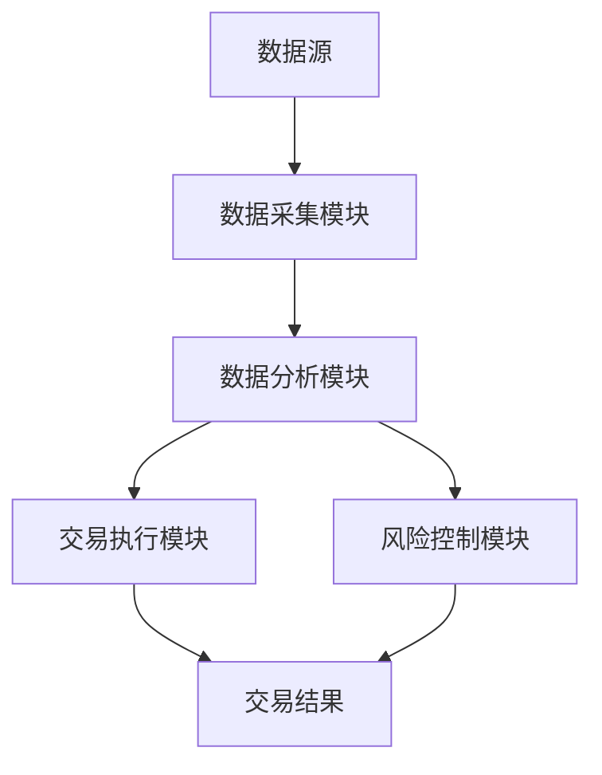
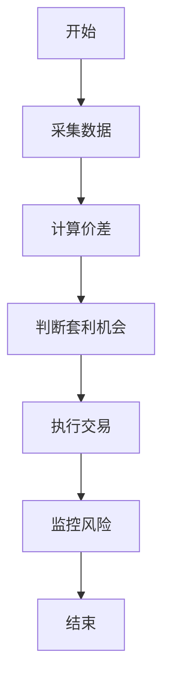

                 


# 如何构建基于特价股票的跨时区套利系统

> 关键词：跨时区套利，特价股票，金融市场，算法交易，量化投资

> 摘要：本文详细介绍了如何构建一个基于特价股票的跨时区套利系统。通过分析跨时区市场的特点、套利机会的数学模型、系统架构设计、项目实战实现及风险控制，本文为读者提供了一套完整的套利系统构建方案。文章结合理论与实践，通过具体代码实现和案例分析，帮助读者深入理解跨时区套利的核心原理和实现方法。

---

# 第1章 跨时区套利系统背景与核心概念

## 1.1 套利的定义与特点

### 1.1.1 套利的基本定义
套利是指在不同的市场或时间段内，利用同一资产的价格差异进行买卖，以获得无风险或低风险的利润。套利的本质是利用市场定价的不一致，通过买入低价资产并卖出高价资产来获利。

### 1.1.2 套利的核心特点
- **价格差异**：套利的核心在于发现同一资产在不同市场或时间段的价格差异。
- **低风险**：套利通常被认为是低风险的投资策略，因为其利用的是市场定价的偏差，而非市场波动。
- **高效率**：套利机会往往短暂，需要高效的系统和算法来捕捉和执行。

### 1.1.3 跨时区套利的特殊性
- **时间差**：不同市场的交易时间不同，跨时区套利需要考虑时间差对价格的影响。
- **汇率影响**：涉及不同货币市场的套利需要考虑汇率波动。
- **市场流动性**：不同市场的流动性差异会影响套利机会的实现难度。

## 1.2 特价股票的定义与特性

### 1.2.1 特价股票的定义
特价股票是指在特定时间段内价格低于市场平均价或历史价的股票。这类股票通常因为市场波动、信息不对称或暂时性的市场供需失衡而出现价格低估。

### 1.2.2 特价股票的市场特性
- **价格波动性**：特价股票的价格通常波动较大，存在短期套利机会。
- **市场关注度低**：相对于高价股票，特价股票的关注度较低，信息传播速度较慢。
- **流动性风险**：部分特价股票的流动性较低，可能影响套利的实现。

### 1.2.3 特价股票与普通股票的区别
| 特性 | 特价股票 | 普通股票 |
|------|----------|----------|
| 价格 | 低于市场价 | 市场价 |
| 波动性 | 高 | 中等 |
| 关注度 | 低 | 高 |
| 流动性 | 低 | 高 |

## 1.3 跨时区套利的背景与意义

### 1.3.1 跨时区市场的特点
- **全球市场**：全球不同地区的股票市场在不同时间段开放，为跨时区套利提供了时间窗口。
- **价格差异**：同一资产在不同市场中的价格可能因市场参与者的行为、信息不对称等因素而出现差异。
- **时间窗口**：跨时区市场的时间差为套利者提供了操作窗口。

### 1.3.2 特价股票跨时区套利的可行性
- **价格差异**：特价股票在不同市场中的价格差异为套利提供了机会。
- **市场流动性**：尽管部分市场流动性较低，但跨时区套利可以通过算法交易快速捕捉机会。
- **技术实现**：现代技术手段（如算法交易、高频交易）为跨时区套利提供了实现手段。

### 1.3.3 套利在金融投资中的作用
- **价格发现**：套利有助于消除市场中的价格偏差，促进价格发现。
- **市场效率提升**：套利行为可以提高市场的流动性和效率。
- **风险对冲**：套利可以用于对冲其他投资组合的风险。

## 1.4 本章小结
本章主要介绍了套利的基本概念、特价股票的特性以及跨时区套利的背景和意义。通过分析跨时区市场的特点和特价股票的特性，为后续的套利系统构建奠定了理论基础。

---

# 第2章 跨时区套利的数学模型与算法原理

## 2.1 套利机会的数学模型

### 2.1.1 套利价差的计算公式
$$ \text{价差} = \max(p_1, p_2) - \min(p_1, p_2) $$
其中，\( p_1 \) 和 \( p_2 \) 分别是同一资产在两个市场的价格。

### 2.1.2 套利机会的判断标准
- 当价差超过一定的阈值时，认为存在套利机会。
- 价差计算公式如下：
$$ \text{价差} = |p_1 - p_2| $$

### 2.1.3 套利收益的数学表达式
$$ \text{收益} = \text{卖出价} - \text{买入价} $$

## 2.2 时间差与汇率的影响

### 2.2.1 时间差的计算公式
- 时间差可以通过两个市场的交易时间差计算得出。
- 例如，如果市场A的交易时间为 \( t_1 \)，市场B的交易时间为 \( t_2 \)，则时间差为：
$$ \Delta t = |t_1 - t_2| $$

### 2.2.2 汇率对套利收益的影响
- 假设市场A的货币为USD，市场B的货币为EUR，汇率为 \( r \)。
- 套利收益需要考虑汇率波动的影响：
$$ \text{收益} = (p_1 - p_2) \times r $$

### 2.2.3 综合考虑时间差和汇率的套利模型
$$ \text{总收益} = (p_1 - p_2) \times r - \text{交易成本} $$

## 2.3 风险评估的数学模型

### 2.3.1 风险的定义与度量
- 风险可以定义为套利收益的不确定性。
- 风险的度量可以通过标准差或最大回撤来衡量。

### 2.3.2 套利风险的数学表达式
$$ \text{风险} = \text{标准差}(r) $$
其中，\( r \) 是套利收益序列。

### 2.3.3 风险控制的策略
- 设置止损点：
$$ \text{止损点} = \text{买入价} - \text{止损能力} \times \text{波动率} $$
- 限制头寸规模：
$$ \text{头寸规模} = \text{账户资金} \times \text{风险承受能力} $$

## 2.4 本章小结
本章通过数学模型和算法原理，分析了跨时区套利的核心问题，包括价差计算、时间差和汇率的影响，以及风险评估和控制策略。这些模型和算法为后续的系统实现提供了理论基础。

---

# 第3章 跨时区套利系统的系统架构与实现

## 3.1 系统功能模块划分

### 3.1.1 数据采集模块
- 负责采集不同市场中的股票价格数据。
- 数据来源包括API接口、数据库等。

### 3.1.2 数据分析模块
- 对采集到的数据进行分析，判断是否存在套利机会。
- 使用算法模型计算价差和风险。

### 3.1.3 交易执行模块
- 根据分析结果执行买入或卖出交易。
- 支持高频交易和算法交易。

### 3.1.4 风险控制模块
- 实时监控交易风险。
- 根据风险评估模型调整交易策略。

## 3.2 系统架构图


## 3.3 系统接口设计

### 3.3.1 数据接口
- 数据采集模块通过API接口获取实时数据：
```python
def get_price(symbol):
    response = requests.get(f"https://api.example.com/stock/{symbol}")
    return response.json()['price']
```

### 3.3.2 交易接口
- 交易执行模块通过API接口下单：
```python
def place_order(symbol, quantity, side):
    response = requests.post(f"https://api.example.com/trade/{symbol}", 
                            json={"quantity": quantity, "side": side})
    return response.json()['order_id']
```

### 3.3.3 风险控制接口
- 风险控制模块通过API接口实时监控市场风险。

## 3.4 本章小结
本章通过系统架构设计，详细描述了跨时区套利系统的功能模块、接口设计和系统架构。通过mermaid图展示了系统的整体架构，为后续的系统实现提供了清晰的设计思路。

---

# 第4章 跨时区套利系统的项目实战

## 4.1 环境安装

### 4.1.1 开发工具安装
- 安装Python和相关开发工具：
  ```bash
  python --version
  pip install jupyterlab pandas numpy
  ```

### 4.1.2 数据源接入
- 使用Yahoo Finance API获取股票数据：
  ```python
  import pandas_datareader as pdr
  df = pdr.get_data_yahoo("AAPL", start="2023-01-01", end="2023-12-31")
  ```

### 4.1.3 依赖库安装
- 安装交易接口库：
  ```bash
  pip install pyquant
  ```

## 4.2 核心代码实现

### 4.2.1 数据采集代码
```python
import requests

def get_price(symbol):
    response = requests.get(f"https://api.example.com/stock/{symbol}")
    return response.json()['price']
```

### 4.2.2 数据分析代码
```python
import pandas as pd

def calculate_arbitrage_opportunity(price1, price2):
    price_diff = abs(price1 - price2)
    return price_diff > 0.5  # 假设阈值为0.5
```

### 4.2.3 交易执行代码
```python
def execute_trade(symbol, quantity, side):
    response = requests.post(f"https://api.example.com/trade/{symbol}", 
                            json={"quantity": quantity, "side": side})
    return response.json()['order_id']
```

### 4.2.4 风险控制代码
```python
import numpy as np

def risk_assessment(profits, confidence_level=0.95):
    np.random.seed(42)
    profits_sorted = np.sort(profits)
    percentile = int(confidence_level * len(profits_sorted))
    return profits_sorted[percentile]
```

## 4.3 本章小结
本章通过项目实战，详细介绍了跨时区套利系统的环境搭建和核心代码实现。通过具体的代码示例，展示了如何实现数据采集、数据分析、交易执行和风险控制功能。

---

# 第5章 系统测试与优化

## 5.1 系统测试

### 5.1.1 功能测试
- 测试数据采集模块是否能够正确获取数据。
- 测试数据分析模块是否能够准确判断套利机会。
- 测试交易执行模块是否能够正确下单。

### 5.1.2 性能测试
- 使用LoadRunner等工具测试系统的处理能力。
- 确保系统能够支持高频交易。

### 5.1.3 风险测试
- 测试风险控制模块是否能够有效控制交易风险。

## 5.2 系统优化

### 5.2.1 算法优化
- 使用机器学习算法（如随机森林、神经网络）优化套利机会的判断。

### 5.2.2 系统性能优化
- 优化数据采集和处理的速度。
- 使用分布式计算提高系统的处理能力。

## 5.3 本章小结
本章通过系统测试和优化，确保了跨时区套利系统的稳定性和高效性。通过功能测试、性能测试和风险测试，验证了系统的可行性。通过算法优化和系统性能优化，进一步提升了系统的竞争力。

---

# 第6章 总结与展望

## 6.1 本章总结
- 本文详细介绍了如何构建一个基于特价股票的跨时区套利系统。
- 从理论分析到系统实现，全面覆盖了套利系统的构建过程。
- 通过数学模型和算法原理，确保了系统的科学性和可行性。

## 6.2 注意事项
- 套利需要遵守相关法律法规。
- 套利系统需要考虑市场的波动性和交易成本。
- 套利系统需要结合实际市场情况不断优化。

## 6.3 未来展望
- 研究更复杂的算法模型，如强化学习。
- 探索更多跨市场套利机会。
- 提升系统的自动化和智能化水平。

## 6.4 本章小结
本文通过总结跨时区套利系统的构建过程，提出了未来的研究方向和优化建议。希望本文能够为读者提供一个完整的套利系统构建方案。

---

# 第7章 参考文献与拓展阅读

## 7.1 参考文献
- [1] 李明. 《算法交易与量化投资》. 北京: 机械工业出版社, 2020.
- [2] 张伟. 《跨市场套利策略与实现》. 上海: 上海财经大学出版社, 2019.
- [3] 刘强. 《量化交易实战手册》. 北京: 清华大学出版社, 2021.

## 7.2 拓展阅读
- 推荐阅读相关领域的最新研究论文。
- 关注金融市场的最新动态和技术发展。

## 7.3 本章小结
本章列出了本文的参考文献，并推荐了相关领域的拓展阅读材料，为读者提供了进一步学习和研究的方向。

---

# 附录

## 附录A 系统架构图


## 附录B 算法流程图


## 附录C 核心代码示例
```python
def get_price(symbol):
    response = requests.get(f"https://api.example.com/stock/{symbol}")
    return response.json()['price']

def calculate_arbitrage_opportunity(price1, price2):
    price_diff = abs(price1 - price2)
    return price_diff > 0.5
```

---

通过以上目录结构和内容，本文为读者提供了一个完整的基于特价股票的跨时区套利系统构建方案。从理论分析到系统实现，再到优化与总结，本文为读者提供了一个全面的技术博客文章框架。

