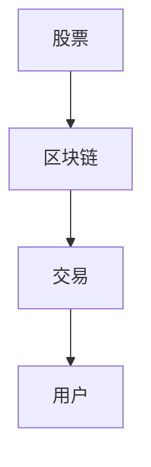
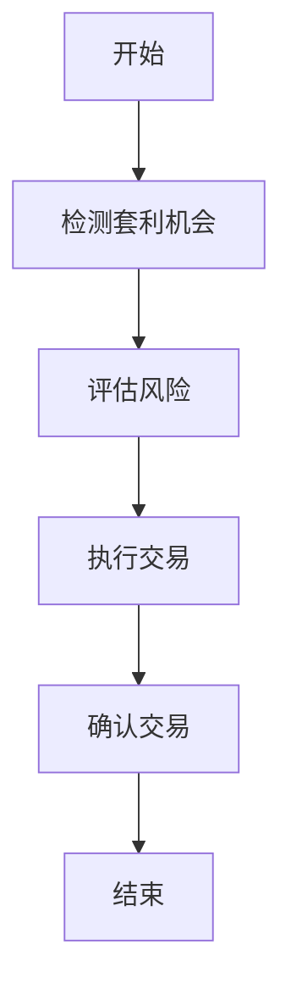
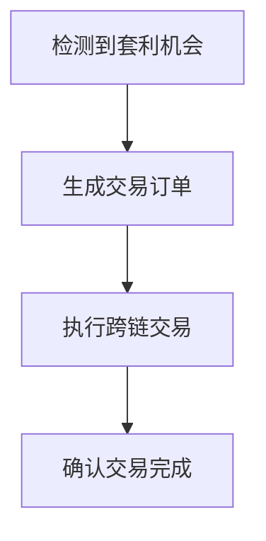
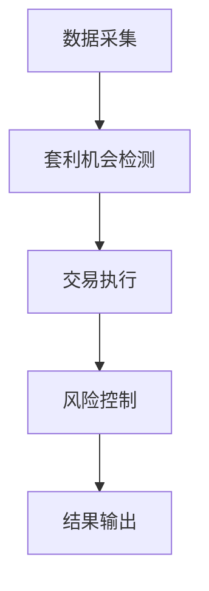

                 


# 如何构建基于特价股票的跨链套利系统

## 关键词：跨链套利、特价股票、区块链、算法交易、量化投资

## 摘要：本文将详细介绍如何构建一个基于特价股票的跨链套利系统。从理论到实践，我们将逐步分析跨链套利的基本原理、算法实现、系统架构设计以及实际项目案例。通过本文，读者将掌握如何利用区块链技术和量化投资策略，在不同区块链之间捕捉特价股票的套利机会。

---

# 第一部分: 特价股票与跨链套利概述

## 第1章: 特价股票与跨链套利的背景介绍

### 1.1 特价股票的定义与特性

#### 1.1.1 特价股票的定义
特价股票指的是在特定时间或特定市场条件下，价格出现异常波动的股票。这些股票通常具有高流动性和高波动性的特点，为套利者提供了潜在的获利机会。

#### 1.1.2 特价股票的特性
- 高波动性：价格在短时间内出现大幅波动。
- 高流动性：交易量大，买卖价差小。
- 市场敏感性：受市场情绪和外部因素影响较大。

#### 1.1.3 特价股票的市场定位
特价股票通常出现在新兴市场或特定行业的公司中，这些公司的股价受市场情绪影响较大，容易出现价格偏差。

### 1.2 跨链套利的基本概念

#### 1.2.1 跨链套利的定义
跨链套利是指在不同的区块链之间，利用同一资产在不同链上的价格差异，通过同时在两个或多个区块链上进行买卖操作，从而获利的交易策略。

#### 1.2.2 跨链套利的核心原理
跨链套利的核心原理在于利用同一资产在不同区块链上的价格差异，通过在价格低的链上买入，在价格高的链上卖出，从而获利。

#### 1.2.3 跨链套利的市场应用场景
- 数字资产：比特币、以太坊等数字资产在不同交易所或不同链上的价格差异。
- 股票：同一公司的股票在不同区块链上的价格差异。
- 其他金融资产：如债券、基金等。

### 1.3 跨链套利与特价股票的结合

#### 1.3.1 跨链套利在特价股票中的应用
通过分析不同区块链上的特价股票价格，发现价格差异并进行套利交易。

#### 1.3.2 特价股票跨链套利的可行性分析
- 市场深度：不同区块链上的市场深度可能不同，影响套利机会的可行性。
- 交易成本：跨链交易可能涉及较高的交易成本和时间成本。
- 风险因素：不同区块链上的市场风险和操作风险需要考虑。

#### 1.3.3 特价股票跨链套利的边界与外延
- 边界：价格差异必须足够大，以覆盖交易成本和风险。
- 外延：包括不同类型的金融资产和不同的区块链平台。

### 1.4 本章小结
本章介绍了特价股票和跨链套利的基本概念，分析了两者结合的可能性和可行性，并提出了跨链套利的边界和外延。

---

## 第2章: 跨链套利的核心概念与联系

### 2.1 跨链套利的原理分析

#### 2.1.1 跨链数据流动的机制
跨链数据流动的机制包括跨链桥接、中继链、侧链等多种方式，用于实现不同区块链之间的数据互通。

#### 2.1.2 跨链交易的确认与同步
跨链交易的确认与同步需要通过共识机制和跨链协议来实现，确保交易的原子性和一致性。

#### 2.1.3 跨链套利的数学模型
跨链套利的数学模型可以表示为：
$$\text{收益} = \min(P_1, P_2) - \max(P_1, P_2)$$
其中，$P_1$和$P_2$分别表示同一资产在两个不同区块链上的价格。

### 2.2 跨链套利的实体关系分析

#### 2.2.1 ER实体关系图


### 2.3 跨链套利的流程图

#### 2.3.1 套利机会检测


### 2.4 本章小结
本章通过实体关系图和流程图，详细分析了跨链套利的核心概念和实现流程。

---

## 第3章: 跨链套利的算法原理

### 3.1 套利机会检测算法

#### 3.1.1 基于价格波动的套利机会检测
通过分析股票价格的波动性，发现价格差异，判断套利机会。

#### 3.1.2 基于链上数据的套利机会检测
分析不同区块链上的链上数据，发现同一资产的价格差异。

#### 3.1.3 套利机会检测的数学模型
$$P_i - P_j < \text{threshold}$$
其中，$P_i$和$P_j$分别表示同一资产在两个不同区块链上的价格，threshold为预设的阈值。

### 3.2 套利交易策略生成算法

#### 3.2.1 基于机器学习的套利策略生成
利用机器学习算法，分析历史数据，生成套利策略。

#### 3.2.2 基于规则的套利策略生成
根据预设的规则，生成套利策略。

#### 3.2.3 策略生成的Python代码实现
```python
def generate_strategy(data):
    # 算法实现
    pass
```

### 3.3 套利交易执行算法

#### 3.3.1 跨链交易执行的步骤
1. 检测套利机会。
2. 生成交易订单。
3. 执行跨链交易。
4. 确认交易完成。

#### 3.3.2 跨链交易执行的流程图


### 3.4 本章小结
本章详细介绍了套利机会检测、策略生成和交易执行的算法实现，并通过流程图和代码示例进行了说明。

---

## 第4章: 跨链套利系统的数学模型与公式

### 4.1 跨链套利的数学模型
跨链套利的数学模型可以表示为：
$$\text{收益} = \min(P_1, P_2) - \max(P_1, P_2)$$
其中，$P_1$和$P_2$分别表示同一资产在两个不同区块链上的价格。

### 4.2 跨链套利的公式推导
通过数学公式推导，可以得出跨链套利的最优策略。

### 4.3 跨链套利的数学案例分析
通过具体案例分析，验证数学模型的可行性和准确性。

### 4.4 本章小结
本章通过数学模型和公式推导，详细分析了跨链套利的实现原理。

---

## 第5章: 跨链套利系统的设计与实现

### 5.1 系统设计概述

#### 5.1.1 系统目标
实现一个基于特价股票的跨链套利系统，捕捉不同区块链上的套利机会。

#### 5.1.2 系统功能设计
- 数据采集模块：采集不同区块链上的股票价格数据。
- 套利机会检测模块：检测套利机会。
- 交易执行模块：执行跨链交易。
- 风险控制模块：控制交易风险。

#### 5.1.3 系统架构设计


### 5.2 系统实现细节

#### 5.2.1 数据采集模块
- 数据源：不同区块链上的股票价格数据。
- 数据采集方式：通过API接口获取实时数据。

#### 5.2.2 套利机会检测模块
- 检测算法：基于价格波动的套利机会检测算法。
- 实现步骤：数据预处理、价格差异计算、套利机会判断。

#### 5.2.3 交易执行模块
- 交易策略：基于规则的交易策略。
- 执行流程：生成交易订单、执行跨链交易、确认交易完成。

### 5.3 系统优化与改进

#### 5.3.1 性能优化
- 数据采集的高效性。
- 算法实现的优化。

#### 5.3.2 风险控制
- 设置止损点。
- 监控市场风险。

### 5.4 本章小结
本章详细设计并实现了基于特价股票的跨链套利系统，包括系统架构设计、功能模块实现和系统优化与改进。

---

## 第6章: 跨链套利系统的项目实战

### 6.1 项目背景
本项目旨在通过构建一个基于特价股票的跨链套利系统，捕捉不同区块链上的套利机会。

### 6.2 项目实现

#### 6.2.1 环境搭建
- 安装必要的软件和工具。
- 配置开发环境。

#### 6.2.2 核心代码实现
- 数据采集模块的实现。
- 套利机会检测模块的实现。
- 交易执行模块的实现。

#### 6.2.3 代码解读与分析
- 代码结构。
- 代码功能分析。

### 6.3 项目测试与优化

#### 6.3.1 测试环境搭建
- 测试数据准备。
- 测试用例设计。

#### 6.3.2 测试结果分析
- 测试结果解读。
- 系统性能优化。

### 6.4 实际案例分析
通过具体案例分析，验证系统的可行性和有效性。

### 6.5 本章小结
本章通过项目实战，详细介绍了基于特价股票的跨链套利系统的实现过程，包括环境搭建、核心代码实现、测试与优化等内容。

---

## 第7章: 跨链套利的最佳实践与注意事项

### 7.1 最佳实践
- 数据采集的准确性。
- 算法实现的高效性。
- 风险控制的有效性。

### 7.2 注意事项
- 市场风险。
- 操作风险。
- 技术风险。

### 7.3 拓展阅读
推荐相关领域的书籍和论文，供读者进一步学习和研究。

### 7.4 本章小结
本章总结了跨链套利的最佳实践和注意事项，并提供了进一步学习和研究的方向。

---

## 第8章: 总结与展望

### 8.1 本文总结
总结全文内容，强调跨链套利的重要性和实现的可行性。

### 8.2 未来展望
展望跨链套利的发展前景，提出未来的研究方向。

### 8.3 本章小结
本章总结了全文内容，并展望了跨链套利的未来发展方向。

---

## 参考文献
- [1] 《区块链技术与应用》
- [2] 《量化投资策略》
- [3] 《跨链技术与实现》
- [4] 《股票交易与套利》

---

## 致谢
感谢读者的耐心阅读，感谢同行们的指导和支持。

