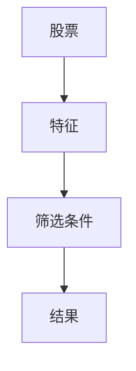
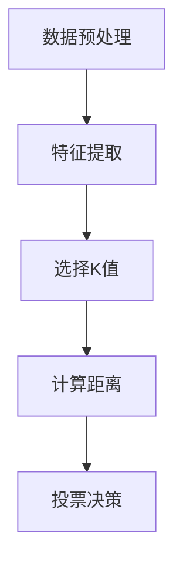
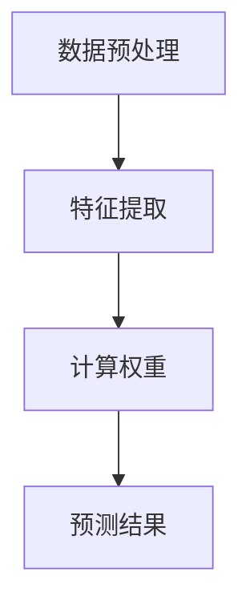

                 


# 如何构建高效的特价股票筛选模型

## 关键词：股票筛选、机器学习、数据分析、算法优化、金融模型

## 摘要：本文详细介绍了如何构建一个高效的特价股票筛选模型。从背景介绍、核心概念、算法原理到系统架构设计和项目实战，通过逐步分析和推理，结合实际案例，帮助读者掌握构建高效模型的技巧和方法。

---

# 第一部分: 特价股票筛选模型的背景与核心概念

## 第1章: 特价股票筛选问题背景

### 1.1 问题背景与目标

#### 1.1.1 什么是特价股票

特价股票是指在特定时间段内价格低于市场平均价，或者具有较高折扣的股票。这类股票通常在促销活动、市场波动或公司特定事件中出现。特价股票的筛选可以帮助投资者抓住短期投资机会，实现快速收益。

#### 1.1.2 特价股票筛选的必要性

- 投资者需要快速识别市场中的低价股票，以抓住投资机会。
- 通过模型筛选，可以减少人工筛选的时间和成本。
- 特价股票通常具有较高的波动性，模型可以帮助识别潜在的高回报股票。

#### 1.1.3 本项目的目标

本项目旨在构建一个高效的特价股票筛选模型，通过机器学习和数据分析技术，实现对股票数据的自动筛选和预测，帮助投资者快速找到潜在的特价股票。

### 1.2 数据来源与特征

#### 1.2.1 数据来源介绍

- 数据来源包括股票市场的历史数据、实时数据、公司财务数据等。
- 数据可以来源于金融数据提供商（如Yahoo Finance、Alpha Vantage）或爬取自金融网站。

#### 1.2.2 数据特征分析

- **开盘价（Opening Price）**：股票在交易日的开盘价格。
- **收盘价（Closing Price）**：股票在交易日的收盘价格。
- **最高价（High Price）**：交易日内的最高价格。
- **最低价（Low Price）**：交易日内的最低价格。
- **成交量（Volume）**：交易日内的交易量。
- **市盈率（P/E Ratio）**：股票价格与每股收益的比率。
- **市净率（P/B Ratio）**：股票价格与每股净资产的比率。
- **波动率（Volatility）**：股票价格的波动程度。

#### 1.2.3 数据预处理方法

- 数据清洗：去除缺失值、异常值。
- 数据标准化：对特征进行标准化处理，使其具有可比性。
- 数据分割：将数据分为训练集和测试集。

### 1.3 核心概念与联系

#### 1.3.1 数据特征与模型关系

数据特征直接影响模型的性能。选择合适的特征可以提高模型的准确性和效率。例如，成交量和波动率是影响股票价格的重要因素。

#### 1.3.2 模型类型与适用场景

- **分类模型**：用于预测股票是否为特价股票（二分类问题）。
- **回归模型**：用于预测股票的价格或折扣率（回归问题）。
- **聚类模型**：用于将股票按价格或特征进行分组，识别潜在的特价股票。

#### 1.3.3 评价指标与优化目标

- **准确率（Accuracy）**：分类模型的预测准确率。
- **召回率（Recall）**：模型识别正类的能力。
- **F1分数（F1 Score）**：综合准确率和召回率的指标。
- **均方误差（MSE）**：回归模型的预测误差。

## 第2章: 特价股票筛选的核心概念

### 2.1 数据特征与模型关系

数据特征与模型关系密切。例如，开盘价、收盘价和成交量是影响股票价格的重要特征。通过分析这些特征，模型可以更好地预测股票是否为特价股票。

### 2.2 核心概念属性对比

下表对比了不同模型的性能和适用场景：

| 模型类型 | 优点 | 缺点 | 适用场景 |
|----------|------|------|----------|
| K-近邻   | 高精度 | 计算复杂 | 小数据集 |
| 线性回归 | 简单高效 | 无法处理非线性关系 | 回归问题 |
| 随机森林 | 高准确性 | 计算资源消耗大 | 分类和回归问题 |

### 2.3 ER实体关系图



---

# 第二部分: 特价股票筛选模型的算法原理

## 第4章: 常用算法原理与流程图

### 4.1 K-近邻算法

#### 4.1.1 算法原理

K-近邻算法是一种基于实例的分类算法。通过计算待分类样本与训练集中样本的距离，选择距离最近的K个样本进行投票，最终确定待分类样本的类别。

#### 4.1.2 算法流程图



#### 4.1.3 Python实现示例

```python
from sklearn.neighbors import KNeighborsClassifier

# 数据预处理
X_train = ...  # 训练集特征
y_train = ...  # 训练集标签
X_test = ...    # 测试集特征

# 创建K-近邻模型
knn = KNeighborsClassifier(n_neighbors=3)

# 训练模型
knn.fit(X_train, y_train)

# 预测
y_pred = knn.predict(X_test)
```

### 4.2 线性回归算法

#### 4.2.1 算法原理

线性回归是一种用于回归问题的算法。通过最小化预测值与实际值之间的平方差之和，找到最佳拟合直线。

#### 4.2.2 算法流程图



#### 4.2.3 Python实现示例

```python
from sklearn.linear_model import LinearRegression

# 数据预处理
X_train = ...  # 训练集特征
y_train = ...  # 训练集标签
X_test = ...    # 测试集特征

# 创建线性回归模型
lr = LinearRegression()

# 训练模型
lr.fit(X_train, y_train)

# 预测
y_pred = lr.predict(X_test)
```

### 4.3 算法数学模型

#### K-近邻算法数学模型

$$ \text{距离} = \sqrt{(x_i - x_j)^2 + (y_i - y_j)^2} $$

#### 线性回归数学模型

$$ y = \beta_0 + \beta_1 x_1 + \beta_2 x_2 + ... + \beta_n x_n + \epsilon $$

---

# 第三部分: 特价股票筛选模型的系统分析与架构设计

## 第5章: 系统分析与架构设计方案

### 5.1 问题场景介绍

特价股票筛选系统需要处理大量的股票数据，快速识别潜在的特价股票。系统需要具备数据采集、处理、建模和预测功能。

### 5.2 系统功能设计

#### 5.2.1 数据预处理模块

- 数据清洗：去除缺失值和异常值。
- 数据标准化：对特征进行标准化处理。

#### 5.2.2 特征选择模块

- 通过相关性分析选择重要的特征。

#### 5.2.3 模型训练模块

- 使用训练数据训练模型。

#### 5.2.4 结果展示模块

- 展示筛选结果和预测结果。

### 5.3 系统架构设计


### 5.4 接口设计

- 数据接口：与数据源对接，获取股票数据。
- 模型接口：与前端或其它系统对接，提供筛选结果。

### 5.5 交互流程图


---

# 第四部分: 特价股票筛选模型的项目实战

## 第6章: 项目实战

### 6.1 环境配置

- 安装Python、Pandas、Scikit-learn等库。

### 6.2 核心实现

#### 6.2.1 数据加载与预处理

```python
import pandas as pd

# 加载数据
df = pd.read_csv('stock_data.csv')

# 数据清洗
df.dropna(inplace=True)
```

#### 6.2.2 特征选择

```python
# 选择特征
selected_features = ['开盘价', '收盘价', '成交量']
X = df[selected_features]
y = df['是否特价股票']
```

#### 6.2.3 模型训练与预测

```python
from sklearn.model_selection import train_test_split
from sklearn.metrics import accuracy_score

# 分割数据
X_train, X_test, y_train, y_test = train_test_split(X, y, test_size=0.2)

# 创建K-近邻模型
knn = KNeighborsClassifier(n_neighbors=3)

# 训练模型
knn.fit(X_train, y_train)

# 预测
y_pred = knn.predict(X_test)

# 评估
print(accuracy_score(y_test, y_pred))
```

### 6.3 实际案例分析

通过实际数据集训练模型，并分析预测结果，验证模型的有效性。

---

# 第五部分: 特价股票筛选模型的最佳实践与小结

## 第7章: 最佳实践

### 7.1 小结

- 本文详细介绍了如何构建高效的特价股票筛选模型。
- 通过机器学习和数据分析技术，可以有效提高股票筛选的效率和准确性。

### 7.2 注意事项

- 数据质量和特征选择对模型性能影响较大。
- 模型需要定期更新，以适应市场变化。

### 7.3 拓展阅读

- 《机器学习实战》
- 《金融数据分析与建模》

---

通过以上步骤，您可以构建一个高效的特价股票筛选模型，帮助投资者快速识别潜在的特价股票，抓住投资机会。

