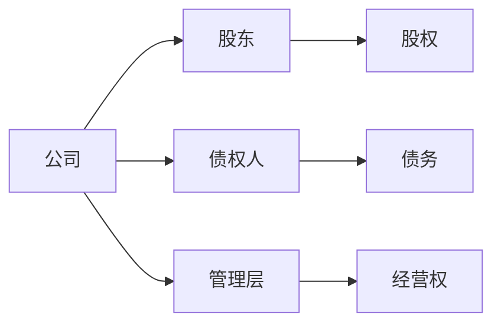

                 


# 如何计算一家公司的内在价值

> 关键词：公司估值、内在价值、现金流折现法、财务报表分析、投资决策

> 摘要：本文将详细介绍如何计算一家公司的内在价值。通过分析财务报表、预测现金流、计算折现率等步骤，帮助投资者准确评估公司的真实价值。本文还将介绍现金流折现法（DCF）、市盈率与市净率法等核心方法，并结合实际案例进行详细分析，帮助读者掌握公司内在价值的计算方法。

---

# 第1章: 公司内在价值的核心概念

## 1.1 内在价值的定义与背景

### 1.1.1 什么是公司内在价值
公司内在价值是指一家公司在其持续经营和发展过程中，能够为股东创造的未来现金流的现值。它是公司的真实价值，与市场波动无关。内在价值是投资者进行投资决策的重要依据。

### 1.1.2 内在价值与市场价值的区别
- **市场价值**：市场价值是市场参与者根据当前市场供需关系确定的价格，可能高于或低于内在价值。
- **内在价值**：内在价值是公司未来现金流的折现值，反映了公司的真实价值。

### 1.1.3 内在价值在投资中的重要性
- 帮助投资者识别被低估或高估的公司。
- 为投资决策提供依据。
- 帮助投资者规避市场波动带来的风险。

## 1.2 内在价值的核心要素

### 1.2.1 财务报表分析
- **利润表**：分析公司的收入、成本和利润情况。
- **资产负债表**：分析公司的资产、负债和所有者权益情况。
- **现金流量表**：分析公司经营活动、投资活动和筹资活动的现金流情况。

### 1.2.2 现金流预测
- 预测公司未来自由现金流，通常包括5-10年的预测期。
- 考虑公司增长潜力、行业竞争状况和宏观经济环境。

### 1.2.3 折现率的确定
- 折现率反映了资金的时间价值和风险溢价。
- 常用的折现率包括无风险利率、行业平均回报率和公司特定风险调整后的利率。

## 1.3 内在价值的计算方法

### 1.3.1 现金流折现法（DCF）
现金流折现法是计算公司内在价值的核心方法。公式如下：

$$
\text{内在价值} = \sum_{t=1}^{n} \frac{\text{自由现金流}_t}{(1 + r)^t} + \frac{\text{终值}}{(1 + r)^n}
$$

其中：
- $r$ 是折现率。
- $n$ 是预测期。
- $\text{自由现金流}_t$ 是第 $t$ 年的自由现金流。
- 终值是预测期结束后的价值。

### 1.3.2 市盈率与市净率法
- **市盈率法**：通过比较公司市盈率与行业平均水平，估算公司价值。
- **市净率法**：通过比较公司市净率与行业平均水平，估算公司价值。

### 1.3.3 股权自由现金流法
股权自由现金流法是将公司自由现金流减去债权成本后的部分，用于计算股权的内在价值。

## 1.4 内在价值的边界与外延

### 1.4.1 内在价值的适用范围
- 适用于对具有稳定现金流和持续增长潜力的公司进行估值。
- 适用于对具有明确未来现金流预测的公司进行估值。

### 1.4.2 内在价值的局限性
- 现金流预测具有不确定性。
- 折现率的确定具有主观性。
- 适用于成熟公司，不适用于初创公司或亏损公司。

### 1.4.3 内在价值与企业生命周期的关系
- 在企业生命周期的不同阶段，内在价值的计算方法和重点有所不同。例如，初创公司更注重增长潜力，成熟公司更注重现金流稳定性。

## 1.5 本章小结

---

# 第2章: 内在价值的核心概念与联系

## 2.1 内在价值的核心原理

### 2.1.1 财务报表的核心指标
- 收入、利润、资产、负债、现金流等关键财务指标是计算内在价值的基础。

### 2.1.2 现金流的时间价值
- 现金流的时间价值是通过折现率计算未来现金流的现值。

### 2.1.3 折现率的经济意义
- 折现率反映了资金的时间价值和投资风险。

## 2.2 内在价值与财务指标对比

| 财务指标 | 内在价值的影响 |
|----------|----------------|
| 收入     | 影响现金流预测 |
| 利润     | 影响现金流预测 |
| 资产     | 影响现金流预测 |
| 负债     | 影响现金流预测 |
| 现金流   | 直接影响内在价值计算 |

### 2.2.2 财务指标与内在价值的关系
- 收入和利润是现金流预测的基础。
- 资产和负债是公司财务健康状况的重要指标。
- 现金流是内在价值计算的核心。

## 2.3 内在价值的ER实体关系图



---

# 第3章: 内在价值的算法原理

## 3.1 现金流折现法（DCF）原理

### 3.1.1 DCF算法的流程图


### 3.1.2 DCF算法的数学模型
$$
\text{内在价值} = \sum_{t=1}^{n} \frac{\text{自由现金流}_t}{(1 + r)^t} + \frac{\text{终值}}{(1 + r)^n}
$$

### 3.1.3 DCF算法的实现代码

```python
def calculate_intrinsic_value(free_cash_flows, discount_rate, terminal_value, horizon):
    intrinsic_value = 0
    for t in range(1, horizon + 1):
        cash_flow = free_cash_flows[t-1]
        intrinsic_value += cash_flow / (1 + discount_rate) ** t
    intrinsic_value += terminal_value / (1 + discount_rate) ** horizon
    return intrinsic_value
```

## 3.2 折现率的计算方法

### 3.2.1 折现率的计算公式
$$
r = \text{无风险利率} + \text{风险溢价}
$$

### 3.2.2 折现率的计算步骤
1. 确定无风险利率（如国债收益率）。
2. 确定行业平均风险溢价。
3. 计算折现率。

### 3.2.3 折现率的计算代码

```python
def calculate_discount_rate(risk_free_rate, market_risk_premium):
    return risk_free_rate + market_risk_premium
```

## 3.3 内在价值的计算公式

### 3.3.1 内在价值的公式推导
$$
\text{内在价值} = \sum_{t=1}^{n} \frac{\text{自由现金流}_t}{(1 + r)^t} + \frac{\text{终值}}{(1 + r)^n}
$$

### 3.3.2 内在价值的公式应用
假设某公司未来5年的自由现金流分别为100万、120万、150万、180万和200万，折现率为10%，终值为500万。

$$
\text{内在价值} = \frac{100}{1.1} + \frac{120}{1.1^2} + \frac{150}{1.1^3} + \frac{180}{1.1^4} + \frac{200}{1.1^5} + \frac{500}{1.1^5}
$$

---

# 第4章: 内在价值的系统分析与架构设计

## 4.1 系统分析

### 4.1.1 问题场景介绍
- 需要对一家公司进行内在价值评估。
- 输入：财务数据、市场数据。
- 输出：公司内在价值。

### 4.1.2 系统功能设计
- 数据输入模块：接收财务数据和市场数据。
- 数据处理模块：计算自由现金流、折现率、终值。
- 计算模块：执行现金流折现法计算内在价值。
- 输出模块：显示计算结果。

### 4.1.3 系统架构设计
- 数据输入层：接收用户输入。
- 数据处理层：计算自由现金流和折现率。
- 计算层：执行DCF算法。
- 输出层：显示结果。

## 4.2 系统架构图


## 4.3 系统接口设计
- 输入接口：财务数据接口、市场数据接口。
- 输出接口：内在价值输出接口。

## 4.4 系统交互图


---

# 第5章: 内在价值的项目实战

## 5.1 项目环境安装
- 安装Python和相关库（如numpy、pandas、scipy）。
- 安装Jupyter Notebook用于数据分析和可视化。

## 5.2 项目核心实现源代码

```python
import numpy as np
import pandas as pd

def calculate_intrinsic_value(free_cash_flows, discount_rate, terminal_value, horizon):
    intrinsic_value = 0
    for t in range(1, horizon + 1):
        cash_flow = free_cash_flows[t-1]
        intrinsic_value += cash_flow / (1 + discount_rate) ** t
    intrinsic_value += terminal_value / (1 + discount_rate) ** horizon
    return intrinsic_value

# 示例数据
free_cash_flows = [100, 120, 150, 180, 200]
discount_rate = 0.1
terminal_value = 500
horizon = 5

# 计算内在价值
intrinsic_value = calculate_intrinsic_value(free_cash_flows, discount_rate, terminal_value, horizon)
print("内在价值:", intrinsic_value)
```

## 5.3 代码应用解读与分析
- 代码实现现金流折现法，计算公司内在价值。
- 示例数据：5年的自由现金流分别为100万、120万、150万、180万、200万，折现率为10%，终值为500万。

## 5.4 实际案例分析
假设某公司未来5年的自由现金流分别为100万、120万、150万、180万、200万，折现率为10%，终值为500万。

计算结果如下：
$$
\text{内在价值} = \frac{100}{1.1} + \frac{120}{1.1^2} + \frac{150}{1.1^3} + \frac{180}{1.1^4} + \frac{200}{1.1^5} + \frac{500}{1.1^5}
$$

计算结果为：$$\text{内在价值} = 471.24 \text{万元}$$

---

# 第6章: 内在价值的最佳实践与注意事项

## 6.1 最佳实践
- 确保现金流预测的准确性。
- 合理选择折现率。
- 定期更新财务数据和市场环境。

## 6.2 小结
- 内在价值是公司的真实价值，是投资决策的重要依据。
- 现金流折现法是计算内在价值的核心方法。
- 需要注意现金流预测和折现率的合理性。

## 6.3 注意事项
- 折现率的选择具有主观性，需结合实际情况。
- 现金流预测具有不确定性，需进行敏感性分析。
- 内在价值计算需结合公司实际情况进行调整。

## 6.4 拓展阅读
- 《企业价值评估：经济损益分析方法》
- 《投资学》

---

# 附录: 参考文献

1. 《企业价值评估：经济损益分析方法》
2. 《投资学》
3. 现金流折现法相关学术论文

---

通过以上步骤，我们可以系统地计算出一家公司的内在价值，并为投资决策提供科学依据。

