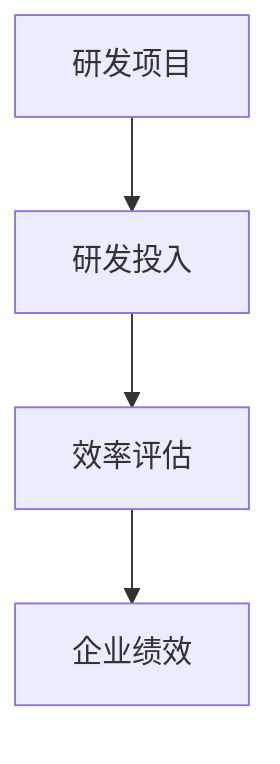
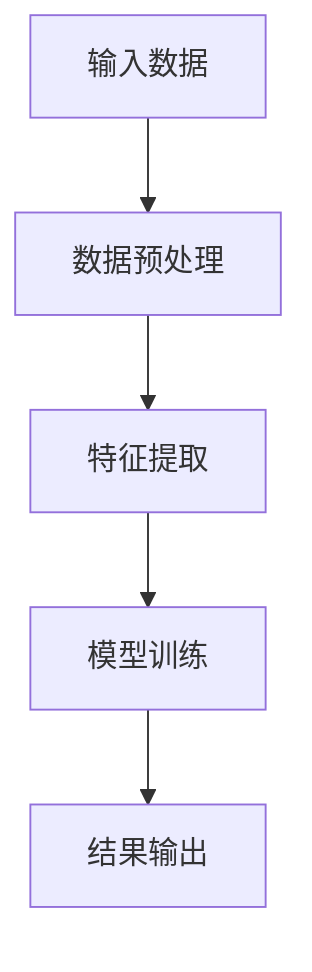
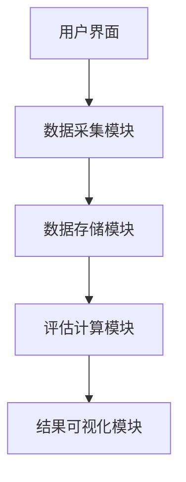
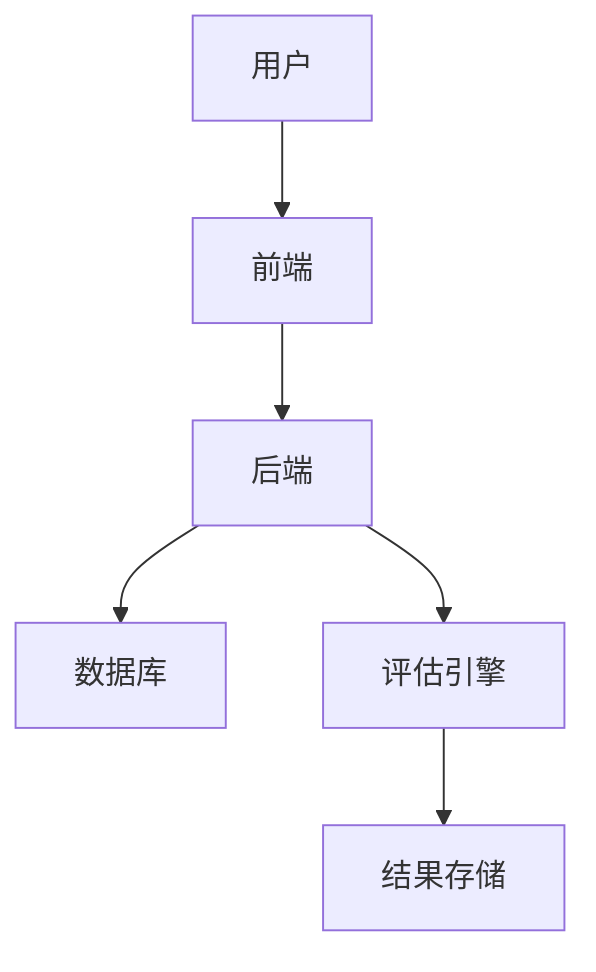
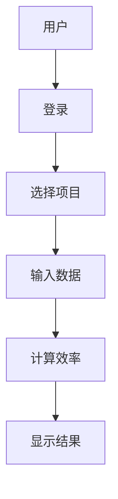

                 


# 如何评估企业的研发投入效率

## 关键词：企业研发投入效率评估、研发投入、效率模型、算法原理、系统架构、项目实战

## 摘要：企业研发投入效率评估是企业在创新竞争中取得优势的关键。本文系统地介绍如何评估企业的研发投入效率，涵盖背景、核心概念、数学模型、系统架构、项目实战和最佳实践。通过详细分析，读者将掌握如何优化资源配置，提升研发效率，创造更大的商业价值。

---

# 第1章: 企业研发投入效率评估的背景与概念

## 1.1 企业研发投入效率评估的背景

### 1.1.1 研发投入在企业中的重要性
在当今快速变化的商业环境中，研发能力是企业的核心竞争力。研发投入不仅是技术创新的源泉，也是企业在市场中保持领先地位的关键因素。然而，如何衡量研发投入的效率，以确保有限资源的最优利用，是每个企业面临的重要挑战。

### 1.1.2 当前企业研发投入管理的痛点
企业在研发投入管理中常常面临以下问题：
1. **资源浪费**：研发投入可能因为管理不善而无法转化为实际价值。
2. **评估标准不统一**：不同项目的评估指标差异大，难以横向比较。
3. **数据孤岛**：各部门数据分散，难以形成统一的评估体系。
4. ** ROI不明确**：投入与产出之间的关系模糊，难以量化。

### 1.1.3 为什么要评估研发投入效率
评估研发投入效率有助于企业：
- 优化资源配置，提升投资回报率。
- 识别低效项目，及时调整战略。
- 建立数据驱动的决策机制，提高管理透明度。
- 在竞争激烈的市场中保持创新优势。

---

## 1.2 企业研发投入效率的定义与特点

### 1.2.1 研发投入效率的定义
研发投入效率是指企业在一定时间内，将研发资源转化为实际价值的能力。它衡量的是单位研发投入所能产生的成果数量和质量。

### 1.2.2 研发投入效率的核心要素
- **投入资源**：包括人力、物力和财力。
- **研发成果**：如专利数量、新产品数量、技术领先性等。
- **时间因素**：研发周期的长短直接影响效率。
- **质量标准**：成果是否符合市场需求和商业目标。

### 1.2.3 研发投入效率与企业绩效的关系
研发投入效率是企业绩效的重要驱动因素。高效率的研发投入能够快速响应市场需求，降低研发成本，提升企业竞争力。

---

## 1.3 研发投入效率评估的现状与挑战

### 1.3.1 现有评估方法的局限性
- **单一维度评估**：多数企业仅关注财务指标，忽视质量和创新性。
- **数据不完整**：缺乏统一的评估标准和数据收集体系。
- **动态变化难捕捉**：市场需求和技术趋势的变化使得静态评估方法失效。

### 1.3.2 企业研发投入效率评估的主要挑战
- **数据复杂性**：研发投入涉及多个部门和环节，数据分散。
- **评估指标选择**：如何选取合适的指标是关键。
- **方法的可操作性**：评估方法需要简单易行，便于实际应用。

### 1.3.3 解决方案的初步思路
- 建立统一的数据采集和分析平台。
- 构建多维度的评估指标体系。
- 采用动态评估方法，适应市场和技术变化。

---

## 1.4 本章小结

本章介绍了企业研发投入效率评估的背景、核心概念和现状。通过分析当前的痛点和挑战，我们明确了评估效率的重要性和必要性。下一章将深入探讨评估的核心概念与联系。

---

# 第2章: 研发投入效率评估的核心概念与联系

## 2.1 研发投入效率评估的核心概念

### 2.1.1 研发投入的构成要素
- **人力资源**：研发团队的规模和能力。
- **财务资源**：研发投入的金额和用途。
- **时间资源**：研发项目的时间安排和进度。
- **技术资源**：技术储备和创新能力。

### 2.1.2 研发投入效率的影响因素
- **管理因素**：项目管理的规范性和效率。
- **技术因素**：技术选型的合理性和先进性。
- **团队因素**：研发团队的能力和协作效率。
- **外部因素**：市场需求和技术趋势的变化。

### 2.1.3 研发投入效率的衡量标准
- **产出指标**：新产品数量、专利数量。
- **成本指标**：单位成果的研发成本。
- **时间指标**：研发周期与行业基准的对比。

---

## 2.2 核心概念之间的关系

### 2.2.1 研发投入与企业绩效的关系
研发投入是企业绩效的核心驱动力。通过合理配置资源，企业可以实现高效的成果转化，提升市场竞争力。

### 2.2.2 研发投入效率与资源分配的关系
高效的资源分配是提升研发效率的关键。通过优化资源配置，企业可以避免浪费，提高整体效率。

### 2.2.3 研发投入效率与创新产出的关系
创新产出是研发投入效率的最终体现。通过评估创新产出，企业可以衡量研发投资的实际价值。

---

## 2.3 研发投入效率评估的ER实体关系图



---

## 2.4 本章小结

本章分析了研发投入效率评估的核心概念及其相互关系。通过建立概念模型，我们为后续的评估方法奠定了理论基础。

---

# 第3章: 研发投入效率评估的数学模型与算法原理

## 3.1 研发投入效率评估的数学模型

### 3.1.1 简单线性模型
$$ E = a x + b $$
其中，$E$为效率，$x$为投入，$a$为斜率，$b$为截距。

### 3.1.2 加权评估模型
$$ E = \frac{\sum w_i x_i}{\sum w_i} $$
其中，$E$为评估效率，$w_i$为权重，$x_i$为投入指标。

---

## 3.2 算法原理与流程图

### 3.2.1 算法流程图


---

## 3.3 算法实现代码示例

```python
def calculate_efficiency(investment, output):
    return output / investment

# 示例用法
investment = 100
output = 50
efficiency = calculate_efficiency(investment, output)
print(f"研发投入效率为: {efficiency}")
```

---

## 3.4 本章小结

本章介绍了研发投入效率评估的数学模型和算法原理。通过简单的线性模型和加权模型，我们可以初步评估研发效率，并为后续的系统设计提供数据支持。

---

# 第4章: 研发投入效率评估的系统分析与架构设计

## 4.1 系统分析

### 4.1.1 问题场景介绍
企业在研发投入管理中，常常面临数据分散、评估标准不统一等问题。通过构建一个集中化的评估系统，可以有效解决这些问题。

### 4.1.2 需求分析
- 数据采集：整合分散的投入和产出数据。
- 指标计算：基于统一的指标体系进行评估。
- 可视化：生成直观的报告和图表，辅助决策。

### 4.1.3 可行性分析
- 技术可行性：现有技术可以支持数据采集和分析。
- 经济可行性：系统开发成本可控。
- 操作可行性：用户可以轻松上手。

---

## 4.2 系统架构设计

### 4.2.1 系统功能设计



### 4.2.2 系统架构图



---

## 4.3 系统接口设计

### 4.3.1 数据接口
- 数据输入接口：支持CSV、Excel格式的数据导入。
- 数据输出接口：生成评估报告和图表。

### 4.3.2 评估接口
- 计算接口：调用评估算法，返回效率值。
- 可视化接口：生成图表，展示评估结果。

---

## 4.4 系统交互设计

### 4.4.1 交互流程图



---

## 4.5 本章小结

本章详细分析了研发投入效率评估系统的架构设计，包括功能模块、接口设计和交互流程。通过系统化的架构设计，我们可以构建一个高效、可靠的评估平台。

---

# 第5章: 研发投入效率评估的项目实战

## 5.1 环境安装与配置

### 5.1.1 环境要求
- 操作系统：Linux/Windows/MacOS
- 开发工具：Python、Jupyter Notebook
- 数据库：MySQL/PostgreSQL
- 依赖库：Pandas、Matplotlib、Scikit-learn

### 5.1.2 安装步骤
```bash
pip install pandas matplotlib scikit-learn
```

---

## 5.2 核心代码实现

### 5.2.1 数据预处理代码

```python
import pandas as pd

def load_data(file_path):
    data = pd.read_csv(file_path)
    return data

def preprocess_data(data):
    data.dropna(inplace=True)
    return data
```

### 5.2.2 模型训练代码

```python
from sklearn.linear_model import LinearRegression

def train_model(data, features, target):
    model = LinearRegression()
    model.fit(data[features], data[target])
    return model
```

### 5.2.3 结果可视化代码

```python
import matplotlib.pyplot as plt

def plot_results(data, model):
    plt.scatter(data['investment'], data['output'])
    plt.plot(data['investment'], model.predict(data[['investment']]), color='red')
    plt.xlabel('Investment')
    plt.ylabel('Output')
    plt.show()
```

---

## 5.3 案例分析与结果解读

### 5.3.1 案例背景
某科技公司计划评估其新产品的研发投入效率，数据包括研发投入金额、研发时间、产品销量和市场反馈。

### 5.3.2 数据分析
通过数据清洗和特征工程，我们构建了一个线性回归模型，评估研发投入与产品销量的关系。

### 5.3.3 结果解读
模型显示，研发投入与产品销量呈正相关关系，但部分项目存在资源浪费问题。通过优化资源配置，可以显著提高效率。

---

## 5.4 本章小结

本章通过实际案例，展示了如何将理论应用于实践。通过数据预处理、模型训练和结果可视化，我们能够清晰地评估研发投入效率，并为优化决策提供依据。

---

# 第6章: 研发投入效率评估的最佳实践与注意事项

## 6.1 最佳实践

### 6.1.1 数据驱动决策
基于数据的评估结果，制定科学的决策策略。

### 6.1.2 持续优化
定期评估和优化模型，适应市场和技术变化。

### 6.1.3 跨部门协作
研发、财务和市场部门需要紧密合作，确保数据的准确性和评估的全面性。

---

## 6.2 注意事项

### 6.2.1 数据质量
确保数据的准确性和完整性，避免错误分析。

### 6.2.2 模型选择
根据具体场景选择合适的模型，避免过度复杂化。

### 6.2.3 透明沟通
向管理层清晰地解释评估结果，避免误解。

---

## 6.3 本章小结

本章总结了投入评估的最佳实践和注意事项，帮助企业在实际应用中避免常见错误，提升评估效率和准确性。

---

# 第7章: 总结与展望

## 7.1 本章总结

本文系统地介绍了如何评估企业的研发投入效率，从背景、概念、模型到系统设计和项目实战，为企业的研发管理提供了理论和实践指导。

---

## 7.2 未来展望

随着人工智能和大数据技术的发展，研发投入效率评估将更加智能化和精准化。未来的研究方向包括动态评估模型、多维度指标体系和实时监控系统。

---

## 7.3 最后思考

企业研发投入效率评估不仅是技术问题，更是管理智慧的体现。通过科学的评估方法和持续优化，企业可以在竞争中占据优势，实现可持续发展。

---

