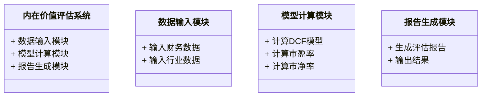
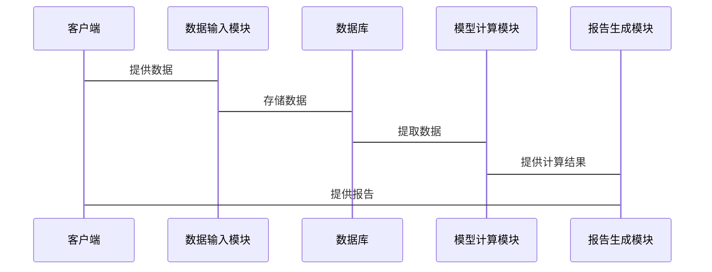

                 


```markdown
# 如何评估特价股票的内在价值

> 关键词：特价股票、内在价值、DCF模型、基本面分析、市盈率、市净率、贴现现金流

> 摘要：评估特价股票的内在价值是投资学中的一个重要课题。本文通过系统地分析内在价值的定义、评估方法及其与市场价值的关系，详细介绍了如何使用基本面分析、DCF模型、市盈率和市净率等方法来评估特价股票的内在价值。文章还通过实际案例分析，帮助读者理解如何在实际投资中应用这些方法，并提供了相关的数学公式和代码实现。

---

# 第一部分: 特价股票内在价值评估的背景与基础

## 第1章: 特价股票内在价值的基本概念

### 1.1 内在价值的定义与重要性

#### 1.1.1 什么是内在价值
内在价值是指一家公司在其持续经营的情况下，基于其财务状况、盈利能力和市场地位所具有的真实价值。它不依赖于市场的短期波动，而是反映了公司的基本面情况。

#### 1.1.2 内在价值与市场价值的关系
- **市场价值**：市场价值是股票在二级市场的价格，受市场情绪、宏观经济环境等多种因素影响。
- **内在价值**：内在价值是股票的“真实价值”，是公司未来现金流的现值。内在价值与市场价值可能会有偏差，当市场价值低于内在价值时，可能是投资的机会。

#### 1.1.3 评估内在价值的意义
评估内在价值可以帮助投资者识别被市场低估的股票，从而做出更明智的投资决策。

### 1.2 特价股票的特殊性

#### 1.2.1 特价股票的定义
特价股票通常指那些价格远低于其内在价值的股票，可能是由于市场误解、行业周期性或公司暂时的困境导致的。

#### 1.2.2 特价股票的特点
- **价格低估**：市场价格低于内在价值。
- **高分红率**：部分特价股票可能提供较高的股息收益率。
- **行业周期性**：可能处于行业的低谷期。

#### 1.2.3 特价股票的市场环境
- **宏观经济因素**：如经济衰退可能导致某些行业的股票价格被低估。
- **行业因素**：如能源行业的周期性波动。

### 1.3 内在价值评估的核心要素

#### 1.3.1 财务指标
- **收入与利润**：包括收入增长率、净利润率等。
- **资产负债表**：包括资产、负债和股东权益的情况。

#### 1.3.2 行业地位
- **市场占有率**：公司在行业中的地位。
- **竞争环境**：行业内的竞争情况。

#### 1.3.3 管理团队
- **管理能力**：管理团队的素质和战略能力。
- **公司治理**：公司治理结构的健康性。

#### 1.3.4 市场前景
- **行业增长潜力**：行业的未来发展前景。
- **市场需求**：产品或服务的市场需求情况。

## 1.4 本章小结
本章介绍了内在价值的定义及其与市场价值的关系，分析了特价股票的特点及其市场环境，并详细阐述了评估内在价值的核心要素。

---

# 第二部分: 内在价值评估的核心概念与联系

## 第2章: 内在价值评估的方法论

### 2.1 基本面分析法

#### 2.1.1 基本面分析的定义
基本面分析是通过对公司的财务状况、行业地位和市场前景等基本面因素进行分析，评估其内在价值的方法。

#### 2.1.2 基本面分析的核心步骤
1. **收集数据**：包括财务报表、行业报告等。
2. **分析财务状况**：评估公司的盈利能力、资产负债情况等。
3. **评估行业地位**：分析公司在行业中的竞争地位。
4. **预测未来表现**：基于历史数据和行业趋势，预测公司的未来盈利能力和现金流。

#### 2.1.3 基本面分析的优缺点
- **优点**：能够提供对公司内在价值的全面评估。
- **缺点**：依赖于准确的财务数据和合理的假设。

### 2.2 贴现现金流模型（DCF）

#### 2.2.1 DCF模型的定义
贴现现金流模型（DCF）是一种通过将公司未来的所有现金流折现到现值，以评估其内在价值的方法。

#### 2.2.2 DCF模型的计算公式
$$DCF = \frac{CF_1}{(1+r)^1} + \frac{CF_2}{(1+r)^2} + \dots + \frac{CF_n}{(1+r)^n} + \frac{TV}{(1+r)^n}$$
其中，$CF_i$ 是第i年的现金流，$r$ 是贴现率，$TV$ 是终值。

#### 2.2.3 DCF模型的应用步骤
1. **预测未来现金流**：包括自由现金流（FCFF）、股利现金流等。
2. **确定贴现率**：通常使用加权平均资本成本（WACC）。
3. **计算现值**：将未来现金流贴现到现值。
4. **计算终值**：假设公司未来稳定后的价值。
5. **总和**：将现值和终值相加，得到公司整体价值。

### 2.3 市盈率与市净率法

#### 2.3.1 市盈率法的定义
市盈率（P/E）是股票的市场价格除以每股收益（EPS）。

$$P/E = \frac{P}{EPS}$$

#### 2.3.2 市净率法的定义
市净率（P/B）是股票的市场价格除以每股净资产（BPS）。

$$P/B = \frac{P}{BPS}$$

#### 2.3.3 市盈率与市净率法的对比
- **市盈率**：适用于盈利稳定的公司，但受周期性影响较大。
- **市净率**：适用于净资产较多的公司，如银行、房地产等。

### 2.4 本章小结
本章介绍了基本面分析法和DCF模型等内在价值评估方法，并分析了市盈率与市净率法的优缺点。

---

# 第三部分: 内在价值评估的算法原理

## 第3章: DCF模型的数学模型与公式

### 3.1 现金流贴现法

#### 3.1.1 现金流贴现法的公式
$$DCF = \frac{CF_1}{(1+r)^1} + \frac{CF_2}{(1+r)^2} + \dots + \frac{CF_n}{(1+r)^n} + \frac{TV}{(1+r)^n}$$

#### 3.1.2 例：假设某公司未来5年的现金流分别为100、120、150、180、200万元，贴现率r=8%。

$$DCF = \frac{100}{1.08} + \frac{120}{1.08^2} + \frac{150}{1.08^3} + \frac{180}{1.08^4} + \frac{200}{1.08^5} + \frac{250}{1.08^5}$$

计算结果为现值约为470.5万元。

### 3.2 WACC模型

#### 3.2.1 WACC的计算公式
$$WACC = w_d \times k_d \times (1 - t) + w_e \times k_e$$
其中，$w_d$ 是债务比例，$k_d$ 是债务成本，$t$ 是税率，$w_e$ 是股权比例，$k_e$ 是股权成本。

### 3.3 股权自由现金流模型

#### 3.3.1 股权自由现金流模型的公式
$$FCFF = EBIT(1 - t) + Depreciation - Capital Expenditure$$

### 3.4 本章小结
本章详细介绍了DCF模型的数学公式，并通过实例展示了如何计算公司内在价值。

---

# 第四部分: 系统分析与架构设计方案

## 第4章: 内在价值评估系统的架构设计

### 4.1 问题场景介绍
评估特价股票的内在价值需要一个系统化的解决方案，包括数据收集、模型选择和结果分析。

### 4.2 项目介绍
构建一个内在价值评估系统，能够自动化地计算公司内在价值，并生成报告。

### 4.3 系统功能设计

#### 4.3.1 领域模型（Mermaid类图）


### 4.4 系统架构设计（Mermaid架构图）


### 4.5 系统接口设计
- **输入接口**：接收财务数据和行业数据。
- **输出接口**：生成评估报告。

### 4.6 系统交互设计（Mermaid序列图）


### 4.7 本章小结
本章通过系统架构设计，展示了如何构建一个内在价值评估系统，并使用Mermaid图展示了系统的各个模块和交互流程。

---

# 第五部分: 项目实战

## 第5章: 特价股票内在价值评估的实战案例

### 5.1 环境配置

#### 5.1.1 安装Python环境
```bash
python --version
pip install numpy pandas matplotlib
```

#### 5.1.2 安装其他依赖
```bash
pip install yfinance
```

### 5.2 核心实现

#### 5.2.1 数据获取
```python
import yfinance as yf
import pandas as pd
import numpy as np

# 下载苹果公司数据
apple = yf.Ticker("AAPL")
data = apple.history(period="max")
```

#### 5.2.2 DCF模型计算
```python
def calculate_dcf(free_cash_flow, discount_rate, terminal_value):
    dcf = 0
    for i in range(len(free_cash_flow)):
        dcf += free_cash_flow[i] / (1 + discount_rate) ** (i + 1)
    dcf += terminal_value / (1 + discount_rate) ** (len(free_cash_flow) + 1)
    return dcf

# 假设数据
free_cash_flow = [100, 120, 150, 180, 200]
discount_rate = 0.08
terminal_value = 250

dcf_value = calculate_dcf(free_cash_flow, discount_rate, terminal_value)
print(f"DCF Value: {dcf_value:.2f}")
```

### 5.3 案例分析

#### 5.3.1 案例选择
选择苹果公司作为案例，分析其内在价值。

#### 5.3.2 数据分析
分析苹果公司的财务数据，计算其DCF价值。

### 5.4 本章小结
本章通过实战案例，展示了如何使用Python代码计算公司内在价值，并对结果进行了分析。

---

# 第六部分: 总结与展望

## 第6章: 总结与展望

### 6.1 本章总结
本文详细介绍了如何评估特价股票的内在价值，包括基本概念、评估方法和实战案例。

### 6.2 最佳实践

#### 6.2.1 投资建议
- **长期视角**：关注公司的长期发展潜力。
- **分散投资**：避免过度集中。
- **持续学习**：关注行业动态和公司新闻。

#### 6.2.2 风险提示
- **市场波动**：市场波动可能影响股票价格。
- **模型假设**：DCF模型依赖于假设，需谨慎使用。

### 6.3 拓展阅读
- **书籍推荐**：《股票作手回忆录》、《投资学原理》。
- **工具推荐**：使用Excel、Python等工具进行数据分析。

### 6.4 本章小结
本章总结了全文内容，并提出了投资建议和风险提示。

---

# 结语

评估特价股票的内在价值是一项复杂但 rewarding的任务。通过系统地学习和实践，投资者可以更好地识别被低估的股票，并做出更明智的投资决策。

---

# 参考文献

1. 资料来源：https://www.yfinance.com
2. 股票估值方法：https://www.investopedia.com
3. Python金融分析库：https://pypi.org/project/yfinance/
```

