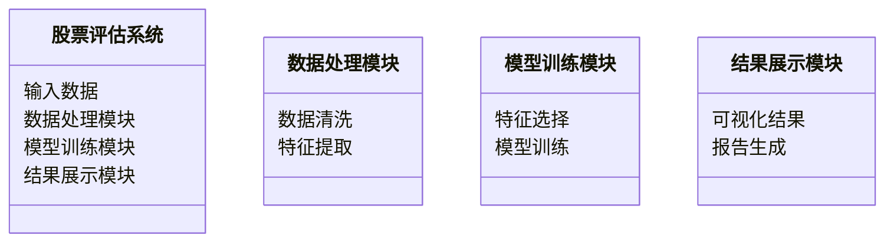
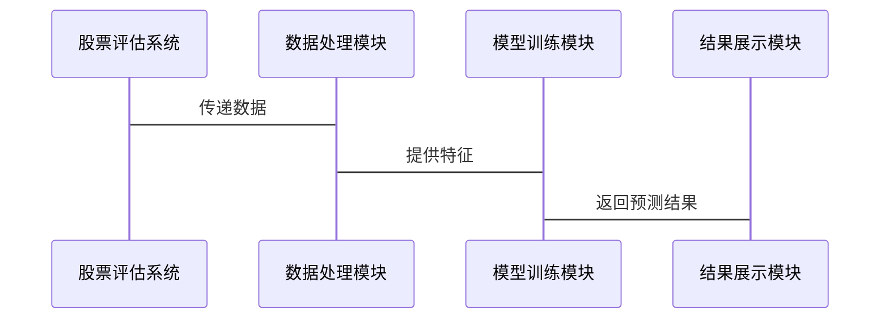

                 


# 如何评估特价股票的质量和持续性

> 关键词：特价股票、股票质量、持续性评估、基本面分析、技术分析、市场情绪、机器学习算法

> 摘要：本文将详细介绍如何评估特价股票的质量和持续性。通过分析股票的基本面、技术面和市场情绪，结合机器学习算法，提供一套系统化的评估方法。文章从背景介绍、核心概念、算法原理到系统架构和项目实战，全面解析特价股票的评估过程，帮助读者做出明智的投资决策。

---

## 第1章: 特价股票的基本概念与评估的重要性

### 1.1 特价股票的定义与特点
#### 1.1.1 特价股票的定义
特价股票是指在特定市场条件下，价格低于其内在价值或行业平均水平的股票。这些股票通常被认为具有被低估的潜力，吸引投资者关注。

#### 1.1.2 特价股票的特点
- **低估值**：市盈率、市净率等指标低于行业平均水平。
- **高潜力**：可能因市场反弹或公司基本面改善而上涨。
- **波动性**：价格波动较大，风险与收益并存。

#### 1.1.3 为什么需要评估特价股票的质量和持续性
评估特价股票的质量和持续性有助于投资者识别真正的投资机会，避免因短期波动或公司基本面问题而造成损失。

### 1.2 评估特价股票的背景与问题背景
#### 1.2.1 当前股票市场的现状
全球股市波动加剧，投资者需要更精准的工具和方法来评估股票质量。

#### 1.2.2 特价股票在市场中的地位
特价股票通常是市场中的“价值洼地”，但可能存在较高的投资风险。

#### 1.2.3 评估特价股票的重要性
通过科学的评估方法，投资者可以筛选出具有长期增长潜力的特价股票，提升投资回报率。

### 1.3 本书的目标与范围
#### 1.3.1 本书的目标
提供一套系统化的评估方法，帮助投资者识别高质量的特价股票。

#### 1.3.2 本书的适用范围
适用于个人投资者、机构投资者以及对股票投资感兴趣的学习者。

#### 1.3.3 本书的结构安排
从基本概念到算法原理，再到系统设计和实战案例，全面覆盖评估过程。

---

## 第2章: 特价股票质量评估的核心要素

### 2.1 特价股票质量评估的核心概念
#### 2.1.1 股票质量的定义
股票质量指的是股票的投资价值和成长潜力，通常通过基本面和技术面指标来衡量。

#### 2.1.2 股票质量的关键属性
- **基本面**：市盈率（P/E）、市净率（P/B）、股息率等。
- **技术面**：趋势线、成交量、移动平均线等。
- **市场情绪**：投资者情绪指数、市场波动率等。

#### 2.1.3 股票质量的评估维度
通过多维度分析，全面评估股票的质量和持续性潜力。

### 2.2 特价股票质量评估的模型与方法
#### 2.2.1 基本面分析
分析公司的财务状况，如收入、利润、负债等，评估其经营健康状况。

#### 2.2.2 技术分析
通过股票价格和成交量的历史数据，预测未来的价格走势。

#### 2.2.3 市场情绪分析
利用投资者情绪和市场趋势，判断股票的短期和长期走势。

### 2.3 特价股票质量评估的实体关系图

```mermaid
erDiagram
    customer[投资者] 
    stock[股票] 
    factor[评估因素]
    transaction[交易]
    customer --> stock : 评估
    stock --> factor : 受影响于
    factor --> transaction : 影响
```

---

## 第3章: 基于机器学习的特价股票质量评估

### 3.1 机器学习在股票评估中的应用
#### 3.1.1 机器学习算法的选择
常用的算法包括线性回归、随机森林和神经网络。

#### 3.1.2 数据预处理的重要性
- 数据清洗：处理缺失值、异常值。
- 特征提取：从基本面、技术面和市场情绪中提取特征。

### 3.2 评估模型的构建与优化
#### 3.2.1 数据预处理步骤
```python
# 示例代码：数据预处理
import pandas as pd
data = pd.read_csv('stock_data.csv')
data.dropna()  # 删除缺失值
data = data[ ['price', 'volume', 'PE', 'PB'] ]  # 提取特征
```

#### 3.2.2 机器学习模型的训练
```python
# 示例代码：随机森林模型训练
from sklearn.ensemble import RandomForestClassifier
model = RandomForestClassifier()
model.fit(X_train, y_train)
```

#### 3.2.3 模型评估与优化
使用混淆矩阵、精确率和召回率等指标评估模型性能，并进行超参数调优。

### 3.3 算法原理与数学模型
#### 3.3.1 线性回归模型
$$ y = \beta_0 + \beta_1x + \epsilon $$
其中，y为预测目标，x为自变量，ε为误差项。

#### 3.3.2 随机森林算法
随机森林是一种基于决策树的集成算法，通过投票机制进行预测。

---

## 第4章: 系统分析与架构设计方案

### 4.1 系统功能设计
#### 4.1.1 领域模型设计


### 4.2 系统架构设计


### 4.3 系统接口设计
定义数据输入、处理和输出的接口，确保模块间高效交互。

### 4.4 系统交互流程


---

## 第5章: 项目实战

### 5.1 环境安装与配置
安装Python、Pandas、Scikit-learn等库，并配置开发环境。

### 5.2 核心代码实现
```python
# 示例代码：股票数据处理与预测
import pandas as pd
from sklearn.model_selection import train_test_split
from sklearn.ensemble import RandomForestClassifier
from sklearn.metrics import accuracy_score

# 加载数据
data = pd.read_csv('stock_data.csv')

# 数据清洗
data.dropna()

# 特征选择
X = data[['PE', 'PB', 'volume']]
y = data['target']

# 划分训练集和测试集
X_train, X_test, y_train, y_test = train_test_split(X, y, test_size=0.2)

# 模型训练
model = RandomForestClassifier()
model.fit(X_train, y_train)

# 模型评估
y_pred = model.predict(X_test)
print("准确率:", accuracy_score(y_test, y_pred))
```

### 5.3 实际案例分析
分析具体股票数据，展示模型的应用效果和评估结果。

### 5.4 项目总结
总结项目经验，分析可能遇到的问题，并提出改进建议。

---

## 第6章: 最佳实践与注意事项

### 6.1 评估过程中的注意事项
- 数据质量：确保数据准确性和完整性。
- 模型选择：根据数据特点选择合适的算法。
- 风险管理：合理控制投资风险，避免过度依赖单一模型。

### 6.2 最佳实践 tips
- 结合基本面和技术面分析，提高评估准确性。
- 定期更新模型，适应市场变化。
- 分散投资，降低风险。

### 6.3 项目总结与展望
总结全文内容，展望未来的研究方向，鼓励读者深入学习和实践。

---

## 第7章: 扩展阅读与资源推荐

### 7.1 相关书籍
推荐几本经典的股票分析和机器学习书籍，供读者深入学习。

### 7.2 在线工具与资源
介绍常用的股票数据分析工具和平台，帮助读者获取数据和学习资源。

### 7.3 专业社区与论坛
推荐相关的投资和数据分析社区，方便读者交流和获取最新信息。

---

通过以上结构，您可以系统地评估特价股票的质量和持续性，结合理论与实践，做出更明智的投资决策。希望本文对您有所帮助！

