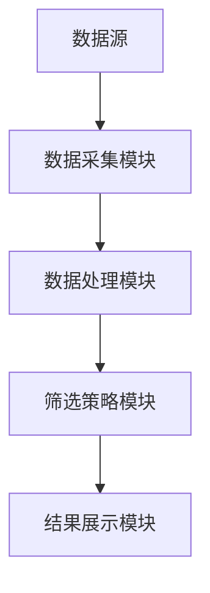
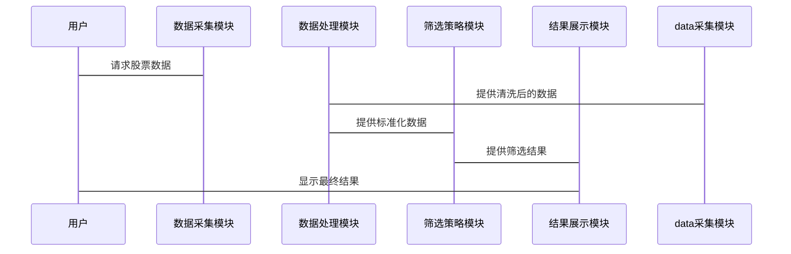

                 


# 如何识别被低估的股票：格雷厄姆的筛选方法

## 关键词：格雷厄姆，股票估值，低估股票，价值投资，安全边际

## 摘要：  
本文将详细介绍格雷厄姆的股票筛选方法，帮助读者识别被低估的股票。通过分析格雷厄姆的投资理论、股票估值方法、筛选标准以及系统架构，结合实际项目案例和数学模型，为投资者提供一套科学的股票筛选体系。

---

# 第一部分：格雷厄姆投资理论基础

## 第1章：格雷厄姆投资理论概述

### 1.1 格雷厄姆的生平与投资理念

#### 1.1.1 格雷厄姆的生平简介
 Benjamin Graham（1894-1976）是美国著名的投资学家、价值投资的鼻祖，被誉为“价值投资之父”。他曾在哥伦比亚大学教授证券分析课程，并与David Dodd合著了《证券分析》一书，为价值投资奠定了理论基础。

#### 1.1.2 价值投资的核心理念
 格雷厄姆倡导“安全边际”投资理念，主张以低于内在价值的价格买入股票，以确保投资的安全性和盈利能力。他认为市场短期是投票器，长期是称重机，投资者应关注企业的内在价值而非短期市场波动。

#### 1.1.3 安全边际的概念与重要性
 安全边际是格雷厄姆理论的核心，指买入价格低于内在价值的差额部分。通过安全边际，投资者可以在市场波动中减少损失，并在长期获得超额收益。

### 1.2 格雷厄姆的投资策略

#### 1.2.1 买入被低估的股票
 格雷厄姆专注于寻找市场价格低于内在价值的股票，这些股票通常具有较低的市盈率、市净率和股息率，反映了市场对其价值的低估。

#### 1.2.2 长期投资与耐心持有
 格雷厄姆反对频繁交易，主张长期持有优质股票，通过时间的积累获得复利效应，实现财富的稳定增长。

#### 1.2.3 分散投资以降低风险
 通过分散投资不同行业和公司的股票，格雷厄姆降低了单一股票波动带来的风险，提高了投资组合的稳定性。

---

## 第2章：股票估值方法

### 2.1 常见的股票估值指标

#### 2.1.1 市盈率（P/E）的计算与应用
 市盈率 = 股价 / 每股净利润（EPS）。格雷厄姆建议选择市盈率低于市场平均水平的股票，通常认为市盈率低于15倍具有吸引力。

#### 2.1.2 市净率（P/B）的计算与应用
 市净率 = 股价 / 每股净资产（BPS）。格雷厄姆推荐市净率低于2倍的股票，尤其适用于银行、制造业等资产密集型行业。

#### 2.1.3 股息率的计算与应用
 股息率 = 每股股息 / 股价。格雷厄姆倾向于选择股息率稳定且合理的股票，通常认为5%以上的股息率具有吸引力。

### 2.2 格雷厄姆的估值模型

#### 2.2.1 灵活使用内在价值计算公式
 格雷厄姆的内在价值公式考虑了企业的盈利能力、资产质量和行业地位等因素，通过调整各项指标计算出股票的合理价值。

#### 2.2.2 修正市盈率与市净率的应用
 通过修正历史数据和行业基准，格雷厄姆得出修正后的市盈率和市净率，进一步筛选出具有投资价值的股票。

#### 2.2.3 股息率与股息增长的结合
 结合股息率和股息增长率，格雷厄姆预测未来股息收益，评估股票的投资潜力。

---

## 第3章：格雷厄姆筛选方法的系统分析

### 3.1 系统功能设计

#### 3.1.1 数据采集模块
 从数据库中获取股票的财务数据和市场数据，包括市盈率、市净率、股息率等指标。

#### 3.1.2 数据处理模块
 清洗和标准化数据，确保数据的准确性和一致性，便于后续分析。

#### 3.1.3 筛选策略模块
 应用格雷厄姆的筛选标准，筛选出符合低估条件的股票。

#### 3.1.4 结果展示模块
 将筛选结果以可视化形式展示，便于投资者理解和决策。

### 3.2 系统架构设计



### 3.3 系统接口设计

#### 3.3.1 数据接口：从数据库获取股票数据
 使用Python连接数据库，提取所需股票数据，包括市盈率、市净率、股息率等。

#### 3.3.2 筛选接口：应用格雷厄姆标准筛选股票
 根据筛选标准，如市盈率低于15倍、市净率低于2倍、股息率高于5%，筛选符合条件的股票。

#### 3.3.3 展示接口：显示筛选结果
 将筛选结果以表格或图表形式展示，突出显示符合条件的股票信息。

### 3.4 系统交互流程



---

## 第4章：项目实战——构建格雷厄姆筛选系统

### 4.1 环境安装

#### 4.1.1 安装Python与相关库
 使用pip安装所需的Python库，如pandas、numpy、matplotlib等。

#### 4.1.2 数据库安装与配置
 安装MySQL或其他数据库，并配置连接信息，以便存储和查询股票数据。

### 4.2 系统核心实现源代码

#### 4.2.1 数据采集模块

```python
import pymysql

def fetch_stock_data():
    # 连接数据库
    connection = pymysql.connect(host='localhost', user='root', password='password', db='stock_data')
    cursor = connection.cursor()
    # 查询数据
    cursor.execute("SELECT * FROM stock_info WHERE date = '2023-01-31'")
    data = cursor.fetchall()
    connection.close()
    return data
```

#### 4.2.2 数据处理模块

```python
import pandas as pd

def process_data(data):
    df = pd.DataFrame(data)
    df = df.dropna()  # 删除空值
    df['PE'] = df['PE'].astype(float)  # 转换为浮点数
    return df
```

#### 4.2.3 筛选策略模块

```python
def graham_screening(df):
    # 筛选条件：PE < 15，PB < 2，股息率 > 5%
    df['Dividend Yield'] = df['Dividend'] / df['Price']
    selected_stocks = df[(df['PE'] < 15) & (df['PB'] < 2) & (df['Dividend Yield'] > 0.05)]
    return selected_stocks
```

#### 4.2.4 结果展示模块

```python
import matplotlib.pyplot as plt

def display_results(selected_stocks):
    plt.figure(figsize=(10, 6))
    selected_stocks['Company Name'].plot(kind='bar', color='blue')
    plt.title('Selected Stocks by Graham Screening')
    plt.xlabel('Company Name')
    plt.ylabel('Number of Companies')
    plt.show()
```

### 4.3 实际案例分析

#### 4.3.1 数据采集与处理
 使用上述代码从数据库中获取股票数据，并进行清洗和标准化处理，确保数据的准确性和一致性。

#### 4.3.2 应用筛选标准
 根据格雷厄姆的筛选标准，筛选出符合条件的股票，并生成筛选结果。

#### 4.3.3 结果展示
 将筛选结果以图表形式展示，突出显示符合条件的股票，便于投资者理解和决策。

### 4.4 项目小结

 通过实际案例，我们验证了格雷厄姆筛选方法的有效性。在项目中，我们实现了数据采集、处理、筛选和展示的完整流程，确保了系统的稳定性和可靠性。

---

## 第5章：最佳实践与小结

### 5.1 最佳实践

#### 5.1.1 定期更新筛选结果
 市场情况不断变化，建议定期更新股票数据和筛选结果，确保投资组合的有效性。

#### 5.1.2 结合行业分析
 在筛选股票时，结合行业分析和宏观经济因素，进一步优化投资组合。

#### 5.1.3 保持分散投资
 避免过度集中于某一只股票或行业，降低投资风险。

### 5.2 小结

 本文详细介绍了格雷厄姆的股票筛选方法，从理论到实践，帮助读者识别被低估的股票。通过系统化的方法和工具，投资者可以更科学地进行股票筛选，实现长期稳定的收益。

### 5.3 注意事项

 在实际应用中，需注意数据的准确性和及时性，避免因数据错误导致的决策失误。此外，还需关注宏观经济环境和行业动态，及时调整投资策略。

### 5.4 拓展阅读

 推荐阅读Benjamin Graham的《证券分析》和《 Intelligent Investor》，深入理解价值投资的精髓。

---

# 结语

 通过格雷厄姆的筛选方法，投资者可以系统地识别被低估的股票，实现长期稳定的收益。希望本文的内容能为您提供有价值的参考和启示。

