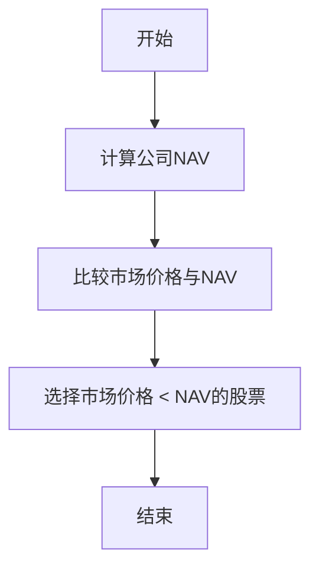
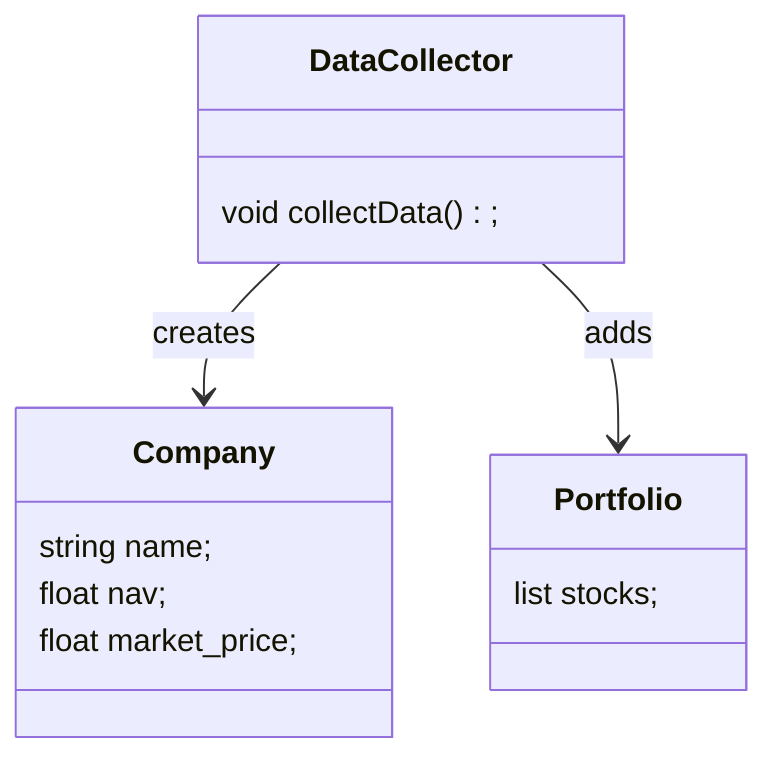

                 


# 如何运用格雷厄姆的净净股策略进行投资

> 关键词：格雷厄姆、净净股策略、价值投资、投资组合、安全边际

> 摘要：本文详细介绍了如何运用本杰明·格雷厄姆的净净股策略进行投资，从理论基础到实际操作，结合数学模型和系统架构设计，帮助读者全面理解并掌握这一投资策略。

---

# 第一部分: 本杰明·格雷厄姆与价值投资概述

## 第1章: 本杰明·格雷厄姆的生平与投资理念

### 1.1 本杰明·格雷厄姆的生平简介

本杰明·格雷厄姆（Benjamin Graham）是20世纪著名的投资学家，被誉为“价值投资之父”。他出生于1894年，曾在哥伦比亚大学教授证券分析课程，培养了包括沃伦·巴菲特在内的众多投资大师。格雷厄姆的投资理念奠定了价值投资的基础。

### 1.2 价值投资的核心理念

价值投资的核心思想是寻找市场上被低估的股票，即市场价格低于其内在价值的股票。格雷厄姆提出，投资者应关注公司的基本面，尤其是财务数据，以发现这些低估的投资机会。

### 1.3 防御性投资策略的提出

格雷厄姆强调防御性投资策略，即通过分散投资和选择具有安全边际的股票来降低风险。他认为，投资者应避免高风险的投资，而是选择那些具有稳定财务状况和良好前景的公司。

## 第2章: 净净股策略的背景与定义

### 2.1 什么是净净股

净净股是指市场价格低于其净资产价值（NAV）的股票。格雷厄姆认为，当市场价格低于NAV时，该股票具有投资价值，因为市场可能低估了公司的实际价值。

### 2.2 净净股策略的核心思想

净净股策略的核心思想是通过寻找市场价格低于NAV的股票，来实现长期稳定的收益。这种方法强调安全边际，即市场价格与内在价值之间的差距，以降低投资风险。

### 2.3 净净股策略与价值投资的关系

净净股策略是价值投资的一种具体应用。通过关注市场价格与NAV的差异，投资者可以找到被低估的股票，从而实现长期收益。

---

# 第二部分: 净净股策略的理论基础

## 第3章: 格雷厄姆的内在价值计算方法

### 3.1 内在价值的定义与计算公式

内在价值是指一家公司基于其财务状况和经营前景所具有的真实价值。格雷厄姆提出，内在价值可以通过对公司资产、负债和盈利能力的分析来估算。

$$ V = \frac{E}{(1 + r)^t} $$

其中，\( V \) 是内在价值，\( E \) 是预期收益，\( r \) 是折现率，\( t \) 是时间。

### 3.2 格雷厄姆的内在价值公式

格雷厄姆的内在价值公式强调了安全边际的重要性，即市场价格应远低于内在价值。

### 3.3 内在价值与市场价值的对比分析

市场价值是股票在市场上的交易价格，而内在价值是公司的真实价值。当市场价值低于内在价值时，股票具有投资价值。

## 第4章: 安全边际的数学模型

### 4.1 安全边际的定义

安全边际是指市场价格与内在价值之间的差距。格雷厄姆认为，安全边际越大，投资风险越小。

### 4.2 安全边际的计算公式

$$ S = V - P $$

其中，\( S \) 是安全边际，\( V \) 是内在价值，\( P \) 是市场价格。

### 4.3 安全边际与投资风险的关系

安全边际越大，投资风险越小。因此，投资者应选择具有较大安全边际的股票。

## 第5章: 市场先生理论与投资决策

### 5.1 市场先生的定义

市场先生是格雷厄姆提出的概念，代表市场的情绪和波动。市场先生可能会在短期内影响股票价格，但长期来看，价格会回归其内在价值。

### 5.2 市场先生与投资行为的关系

投资者应避免被市场先生的情绪所左右，而是应根据公司的基本面进行投资决策。

### 5.3 如何利用市场先生理论进行投资决策

投资者应关注市场先生的行为，当市场先生情绪低落时，可能是买入的机会；当市场先生情绪高涨时，可能是卖出的机会。

---

# 第三部分: 净净股策略的投资实战

## 第6章: 净净股筛选标准与流程

### 6.1 净净股的筛选标准

筛选净净股的步骤包括：

1. 计算公司的净资产价值（NAV）。
2. 比较市场价格与NAV的差异。
3. 选择市场价格低于NAV的股票。

### 6.2 净净股筛选的流程图



## 第7章: 净净股投资组合的构建

### 7.1 投资组合构建的原则

1. 分散投资：选择多个不同行业的净净股。
2. 长期持有：避免频繁交易。
3. 定期调整：根据市场变化进行调整。

### 7.2 投资组合构建的步骤

1. 确定投资目标和风险承受能力。
2. 选择具有安全边际的净净股。
3. 分散投资，降低风险。

### 7.3 投资组合的风险分散策略

通过选择不同行业的股票，可以降低投资组合的整体风险。

## 第8章: 净净股策略的实际案例分析

### 8.1 案例背景

假设某公司A的NAV为10元，市场价格为8元，具有较大的安全边际。

### 8.2 案例分析

根据净净股策略，公司A的市场价格低于NAV，具有投资价值。

### 8.3 投资建议

投资者可以考虑买入公司A的股票，长期持有，等待市场价格回归NAV。

---

# 第四部分: 净净股策略的系统分析与架构设计

## 第9章: 系统功能设计

### 9.1 系统功能模块

1. 数据采集模块：采集公司财务数据和股票价格。
2. 计算模块：计算NAV和安全边际。
3. 筛选模块：筛选出净净股。
4. 投资组合模块：构建投资组合。

### 9.2 系统功能设计的领域模型



## 第10章: 系统架构设计

### 10.1 系统架构图


---

# 第五部分: 净净股策略的项目实战

## 第11章: 项目实战

### 11.1 环境安装

安装Python和相关库：

```bash
pip install pandas numpy matplotlib
```

### 11.2 核心代码实现

```python
import pandas as pd
import numpy as np

def calculate_nav(company_data):
    return company_data['assets'] / company_data['liabilities']

def calculate_margin(nav, price):
    return nav - price

data = pd.read_csv('company_data.csv')
data['nav'] = data.apply(calculate_nav, axis=1)
data['margin'] = data.apply(lambda x: calculate_margin(x['nav'], x['price']), axis=1)
net_net_stocks = data[data['margin'] > 0]
```

### 11.3 代码解读与分析

上述代码读取公司数据，计算NAV和安全边际，筛选出净净股。

### 11.4 案例分析

假设公司数据如下：

| 公司名称 | 资产 | 负债 | 价格 |
|----------|------|------|------|
| A        | 100  | 50   | 80   |

计算结果：

NAV = 100 / 50 = 2
安全边际 = 2 - 80 = -78（负值，说明市场价格高于NAV，不满足净净股条件）

---

# 第六部分: 净净股策略的最佳实践

## 第12章: 最佳实践

### 12.1 小结

净净股策略是一种有效的投资策略，通过筛选市场价格低于NAV的股票，实现长期稳定的收益。

### 12.2 注意事项

1. 需要定期调整投资组合。
2. 需要注意公司的财务状况变化。
3. 需要结合其他投资策略。

### 12.3 拓展阅读

推荐阅读《证券分析》（Benjamin Graham & David Dodd）。

---

# 结语

通过本文的详细介绍，读者可以全面了解如何运用格雷厄姆的净净股策略进行投资。从理论基础到实际操作，结合数学模型和系统架构设计，帮助读者掌握这一投资策略，并在实际投资中取得成功。

