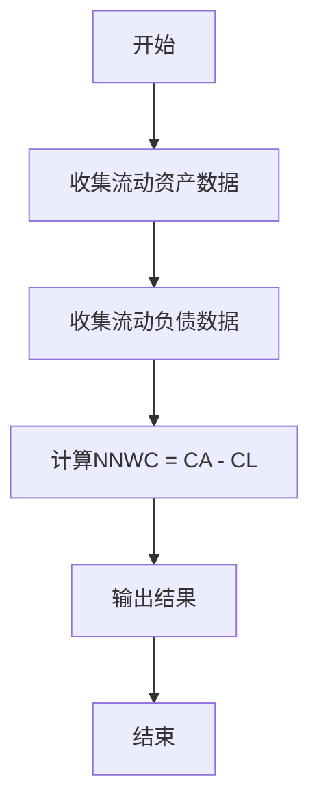
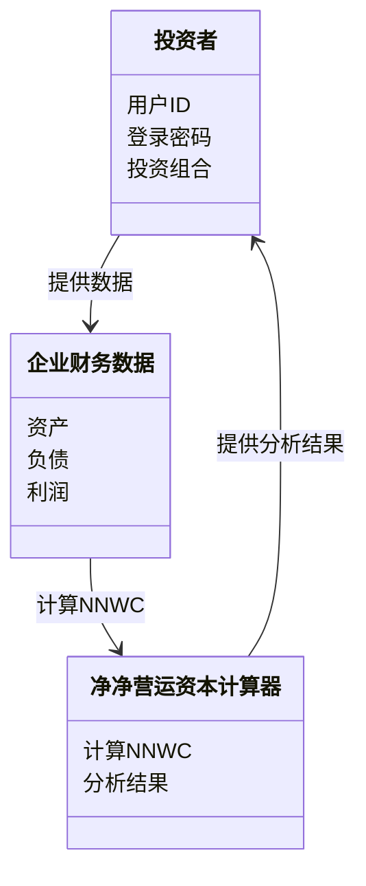
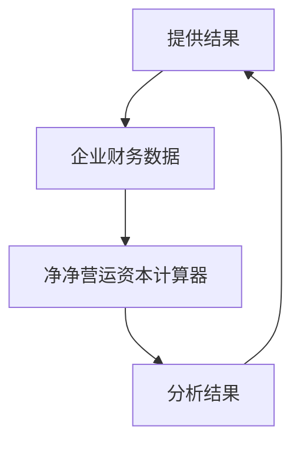

                 


# 如何运用格雷厄姆的净净营运资本策略

> 关键词：格雷厄姆，净净营运资本，投资策略，企业估值，价值投资

> 摘要：本文深入探讨了如何运用格雷厄姆的净净营运资本策略进行企业估值和投资决策。通过详细分析净净营运资本的定义、计算方法及其在投资策略中的应用，本文旨在帮助投资者更好地理解和应用这一经典策略。结合实例分析、数学公式和系统设计，本文为读者提供了从理论到实践的完整指南。

---

## 第一部分：格雷厄姆的净净营运资本策略概述

### 第1章：净净营运资本的基本概念

#### 1.1 净净营运资本的定义与计算公式

##### 1.1.1 净净营运资本的定义
净净营运资本（Net Net Working Capital，NNWC）是企业的一项重要财务指标，用于衡量企业流动资产与流动负债之间的差额。它反映了企业在短期内的偿债能力和运营效率。

公式表示为：
$$
\text{NNWC} = \text{流动资产} - \text{流动负债}
$$

其中，流动资产包括现金、应收账款、存货等，流动负债包括应付账款、短期借款等。

##### 1.1.2 净净营运资本的计算公式
NNWC的具体计算公式如下：
$$
\text{NNWC} = \text{流动资产} - \text{流动负债}
$$

例如，假设某公司流动资产为500万元，流动负债为300万元，则：
$$
\text{NNWC} = 500 - 300 = 200 \text{万元}
$$

##### 1.1.3 净净营运资本的属性特征对比表格
以下是对净净营运资本与其他相关指标的对比分析：

| 指标         | 定义                                   | 计算公式                          |
|--------------|--------------------------------------|----------------------------------|
| 流动资产     | 企业短期内可变现的资产               | 现金 + 应收账款 + 存货等         |
| 流动负债     | 企业短期内需偿还的债务               | 应付账款 + 短期借款等            |
| 净净营运资本 | 流动资产与流动负债的差额             | 流动资产 - 流动负债              |

##### 1.1.4 净净营运资本的ER实体关系图
以下是净净营运资本的ER实体关系图：

```mermaid
er
actor 流动资产 {
    id: 流动资产ID
    name: 资产名称
    value: 资产价值
}
actor 流动负债 {
    id: 流动负债ID
    name: 负债名称
    value: 负债价值
}
actor 净净营运资本 {
    id: NNWC_ID
    value: NNWC 值
    date: 计算日期
}
relation 流动资产与净净营运资本的关系 {
    flow_asset_id: 流动资产ID
    net_net_id: NNWC_ID
}
relation 流动负债与净净营运资本的关系 {
    flow_liability_id: 流动负债ID
    net_net_id: NNWC_ID
}
```

#### 1.2 格雷厄姆的投资理念

##### 1.2.1 格雷厄姆的价值投资理论
格雷厄姆是价值投资的鼻祖，他认为市场先生（市场情绪）往往会导致股票价格偏离其内在价值。投资者应关注企业的基本面，寻找被市场低估的投资标的。

##### 1.2.2 净净营运资本在格雷厄姆策略中的地位
在格雷厄姆的估值体系中，净净营运资本是评估企业内在价值的重要组成部分。他认为，企业的真实价值可以通过其资产、负债和盈利能力来衡量，而净净营运资本是衡量流动资产与流动负债差额的重要指标。

##### 1.2.3 格雷厄姆投资策略的核心要素
格雷厄姆的投资策略主要包括以下几点：
1. **安全边际**：以低于内在价值的价格买入股票。
2. **低市盈率**：选择市盈率低于市场平均水平的股票。
3. **稳健的财务状况**：企业应具有较强的流动资产和较低的负债。

#### 1.3 净净营运资本与其他估值方法的对比

##### 1.3.1 市盈率法的优缺点
- **优点**：简单易用，能够反映企业的盈利能力。
- **缺点**：无法反映企业的实际价值，容易受市场情绪影响。

##### 1.3.2 市净率法的优缺点
- **优点**：适用于金融和制造业等资产密集型行业。
- **缺点**：忽略企业的盈利能力，无法全面反映企业价值。

##### 1.3.3 净净营运资本法的独特优势
- **优势**：能够准确衡量企业的流动资产与流动负债，反映企业的短期偿债能力和运营效率。

---

### 第2章：净净营运资本的数学模型与公式

#### 2.1 净净营运资本的数学表达式

##### 2.1.1 净净营运资本的公式推导
NNWC的计算公式为：
$$
\text{NNWC} = \text{流动资产} - \text{流动负债}
$$

其中，流动资产和流动负债的具体构成如下：
- **流动资产**：现金、应收账款、存货等。
- **流动负债**：应付账款、短期借款等。

##### 2.1.2 净净营运资本的变量定义
| 变量名称      | 定义               | 符号表示 |
|---------------|--------------------|----------|
| 流动资产      | 企业短期内可变现的资产 | CA       |
| 流动负债      | 企业短期内需偿还的债务 | CL       |
| 净净营运资本  | 流动资产减去流动负债   | NNWC     |

##### 2.1.3 净净营运资本的计算流程图
以下是NNWC的计算流程图：



##### 2.1.4 净净营运资本的计算实例
假设某公司2022年的财务数据如下：
- 流动资产：800万元
- 流动负债：500万元

则：
$$
\text{NNWC} = 800 - 500 = 300 \text{万元}
$$

---

### 第3章：净净营运资本的算法原理

#### 3.1 净净营运资本的计算流程

##### 3.1.1 数据收集与预处理
投资者需要收集目标公司的流动资产和流动负债数据，确保数据的准确性和完整性。

##### 3.1.2 核心公式应用
使用NNWC的计算公式：
$$
\text{NNWC} = \text{流动资产} - \text{流动负债}
$$

##### 3.1.3 结果验证与调整
对计算结果进行验证，确保其符合企业的实际情况。如果发现异常值，需要进行调整。

#### 3.2 净净营运资本的算法实现

##### 3.2.1 算法步骤分解
1. 收集流动资产和流动负债数据。
2. 计算NNWC。
3. 输出结果。

##### 3.2.2 算法流程图
以下是NNWC算法的流程图：


##### 3.2.3 算法实现的Python代码
以下是NNWC算法的Python实现：

```python
# 净净营运资本计算函数
def calculate_nnwc(current_assets, current_liabilities):
    return current_assets - current_liabilities

# 示例数据
current_assets = 800  # 单位：万元
current_liabilities = 500  # 单位：万元

# 计算净净营运资本
nnwc = calculate_nnwc(current_assets, current_liabilities)
print(f"净净营运资本为：{nnwc} 万元")
```

---

### 第4章：净净营运资本的系统分析与架构设计

#### 4.1 问题场景介绍

##### 4.1.1 投资者面临的估值挑战
投资者在进行股票投资时，常常面临如何准确评估企业内在价值的挑战。市场波动和情绪往往会影响股票价格，导致投资者难以找到被低估的投资标的。

##### 4.1.2 净净营运资本在估值中的作用
净净营运资本能够帮助投资者衡量企业的流动资产与流动负债，反映企业的短期偿债能力和运营效率。通过分析企业的NNWC，投资者可以更好地评估其内在价值。

##### 4.1.3 系统设计的目标与范围
本系统旨在通过净净营运资本的计算和分析，帮助投资者快速、准确地评估企业的内在价值，从而做出明智的投资决策。

#### 4.2 系统功能设计

##### 4.2.1 领域模型设计
以下是系统的领域模型设计：



##### 4.2.2 系统架构设计
以下是系统的架构设计：



---

### 第5章：项目实战

#### 5.1 环境安装与配置
为了运行以下代码，您需要安装Python和必要的库。

#### 5.2 系统核心实现源代码

##### 5.2.1 净净营运资本计算器
以下是NNWC计算器的Python代码：

```python
def calculate_nnwc(current_assets, current_liabilities):
    return current_assets - current_liabilities

current_assets = 800  # 单位：万元
current_liabilities = 500  # 单位：万元
nnwc = calculate_nnwc(current_assets, current_liabilities)
print(f"净净营运资本为：{nnwc} 万元")
```

##### 5.2.2 实例分析与代码解读
假设某公司2022年的财务数据如下：
- 流动资产：800万元
- 流动负债：500万元

运行代码后，输出结果为：
```
净净营运资本为：300 万元
```

##### 5.2.3 代码应用解读与分析
通过上述代码，投资者可以快速计算出企业的净净营运资本，从而评估其内在价值。

---

### 第6章：总结与展望

#### 6.1 本章总结
本文详细探讨了如何运用格雷厄姆的净净营运资本策略进行企业估值和投资决策。通过理论分析、公式推导和代码实现，本文为投资者提供了一个从理论到实践的完整指南。

#### 6.2 注意事项
投资者在实际应用中应注意以下几点：
- 确保数据的准确性和完整性。
- 结合其他估值方法进行综合分析。
- 考虑市场环境和宏观经济因素。

#### 6.3 拓展阅读
- 格雷厄姆的其他投资策略。
- 其他估值方法的深入探讨。

#### 6.4 问题与思考
- 净净营运资本在不同行业中的适用性如何？
- 如何结合其他指标（如ROE、ROA）进行综合评估？

---

通过本文的学习，读者可以更好地理解格雷厄姆的净净营运资本策略，并在实际投资中灵活运用这一经典方法。希望本文能为投资者提供有价值的参考和指导。

