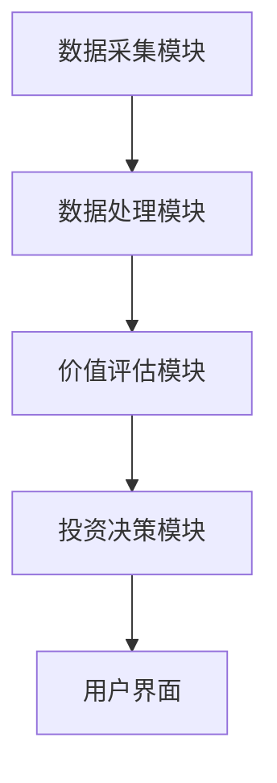

                 


# 威廉·伯恩斯坦的效率市场与价值投资：看似矛盾的统一

## 关键词：效率市场、价值投资、投资策略、数学模型、算法实现、系统架构

## 摘要：  
本文深入探讨了威廉·伯恩斯坦提出的效率市场与价值投资之间的关系，分析了两者看似矛盾实则可以统一的内在逻辑。通过理论分析、数学建模、系统设计和项目实战，展示了如何在实际投资中实现两者的结合。文章内容涵盖效率市场的理论基础、价值投资的核心理念、数学模型与算法实现、系统架构设计以及实际案例分析，为读者提供全面而深入的视角。

---

# 第一部分：效率市场与价值投资的理论基础

## 第1章：效率市场理论概述

### 1.1 效率市场的定义与特征  
效率市场是指市场价格能够迅速反映所有相关信息的市场。其核心特征包括：  
1. **信息透明性**：所有相关信息都会被市场参与者迅速消化。  
2. **价格反映性**：市场价格反映了所有相关信息，包括历史交易数据、公司财务报表等。  
3. **无套利机会**：在强有效市场中，套利机会几乎不存在。  

#### 1.1.1 效率市场的基本概念  
效率市场假设认为，市场价格已经反映了所有可获得的信息，因此试图通过分析历史价格数据来预测未来价格的行为是徒劳的。  

#### 1.1.2 强有效市场、弱有效市场与半强有效市场的区分  
- **强有效市场**：不仅反映历史价格信息，还能预测未来价格。  
- **弱有效市场**：仅反映历史价格信息。  
- **半强有效市场**：反映所有公开信息，但不包括内幕信息。  

#### 1.1.3 效率市场假设的理论基础  
效率市场假设基于现代金融学的理性预期理论，认为市场参与者能够理性地处理信息，并迅速反映到市场价格中。  

---

### 1.2 价值投资的核心理念  

#### 1.2.1 价值投资的起源与发展  
价值投资由本杰明·格雷厄姆和戴维·多德提出，强调以低于内在价值的价格买入股票。  

#### 1.2.2 价值投资的核心原则  
1. **安全边际**：买入价格低于内在价值。  
2. **长期视角**：关注企业的长期盈利能力。  
3. **逆市场思维**：在市场恐慌时买入，在市场狂热时卖出。  

#### 1.2.3 价值投资与市场有效性的关系  
价值投资假设市场存在非效率性，即某些股票的价格低于其内在价值，这与效率市场假设存在矛盾。  

---

## 第2章：效率市场与价值投资的矛盾与统一  

### 2.1 效率市场与价值投资的冲突  

#### 2.1.1 效率市场假设下的投资策略  
在效率市场中，投资者无法通过基本面分析获得超额收益，因此更多依赖技术分析或套利策略。  

#### 2.1.2 价值投资的市场假设  
价值投资假设市场存在非效率性，认为某些股票的价格被市场低估。  

#### 2.1.3 两者的矛盾点分析  
- 效率市场假设认为市场价格反映所有信息，而价值投资认为市场存在定价错误。  
- 效率市场强调短期交易，而价值投资强调长期持有。  

---

### 2.2 效率市场与价值投资的统一性  

#### 2.2.1 价值投资在效率市场中的适用性  
虽然效率市场假设认为市场价格反映所有信息，但市场并非完全理性，价值投资仍有机会在市场波动中获利。  

#### 2.2.2 价值投资与效率市场的动态平衡  
在长期投资中，价值投资策略可以通过识别市场非效率性获得超额收益，而短期波动则符合效率市场假设。  

#### 2.2.3 价值投资与市场效率的动态平衡  
价值投资与效率市场并非完全对立，而是可以通过长期视角实现统一。  

---

# 第二部分：价值投资的数学模型与算法原理

## 第3章：价值投资的数学模型  

### 3.1 价值评估的基本公式  

#### 3.1.1 股票内在价值的计算公式  
股票的内在价值可以通过股息贴现模型（DDM）计算：  
$$ V = \frac{D}{k - g} $$  
其中，$D$ 是股息，$k$ 是折现率，$g$ 是股息增长率。  

#### 3.1.2 股息贴现模型（DDM）的数学表达  
DDM假设股息以固定增长率增长，适用于稳定分红的公司。  

#### 3.1.3 市盈率与市净率的比较分析  
市盈率（P/E）和市净率（P/B）是常用的估值指标，但各有优缺点。  

---

### 3.2 效率市场中的预期收益模型  

#### 3.2.1 马科维茨的均值-方差模型  
马科维茨的模型通过优化投资组合的风险和收益，寻找最优资产配置。  

#### 3.2.2 CAPM模型的数学推导  
CAPM模型公式为：  
$$ E(r_i) = r_f + \beta_i (E(r_m) - r_f) $$  
其中，$r_f$ 是无风险利率，$\beta_i$ 是股票的贝塔系数，$E(r_m)$ 是市场预期收益率。  

#### 3.2.3 APT模型的核心假设  
APT模型假设资产的收益可以分解为多个因素，如市场因子、行业因子等。  

---

## 第4章：价值投资的算法实现  

### 4.1 价值投资策略的算法框架  

#### 4.1.1 数据采集与处理  
- 数据来源：股票历史价格、财务报表等。  
- 数据清洗：处理缺失值、异常值。  

#### 4.1.2 股票筛选算法  
根据市盈率、市净率等指标筛选出低估股票。  

#### 4.1.3 投资组合优化算法  
使用均值-方差模型优化投资组合，降低风险。  

---

### 4.2 算法实现的Python代码示例  

#### 4.2.1 数据处理与可视化  
```python
import pandas as pd
import matplotlib.pyplot as plt

# 示例数据：股票价格数据
data = pd.DataFrame({
    'Date': ['2020-01', '2020-02', '2020-03', '2020-04'],
    'Price': [100, 105, 98, 102]
})

# 绘制股票价格走势图
plt.plot(data['Date'], data['Price'])
plt.title('Stock Price Trend')
plt.xlabel('Date')
plt.ylabel('Price')
plt.show()
```

#### 4.2.2 股票筛选逻辑的代码实现  
```python
import pandas as pd

# 示例数据：股票列表
data = pd.DataFrame({
    'Ticker': ['AAPL', 'GOOGL', 'MSFT', 'AMZN'],
    'PE': [15, 20, 18, 25],
    'PB': [2.5, 3.0, 2.0, 3.5]
})

# 筛选PE < 18且PB < 3的股票
filtered = data[(data['PE'] < 18) & (data['PB'] < 3)]
print(filtered)
```

#### 4.2.3 投资组合优化的代码实现  
```python
import numpy as np
from scipy.optimize import minimize

# 示例数据：资产收益和协方差矩阵
n_assets = 3
returns = np.array([0.1, 0.15, 0.08])
cov_matrix = np.array([
    [0.05, 0.02, 0.01],
    [0.02, 0.06, 0.03],
    [0.01, 0.03, 0.04]
])

# 均值-方差优化目标函数
def portfolio_variance(weights, returns, cov_matrix):
    return np.dot(weights.T, np.dot(cov_matrix, weights))

# 约束条件：权重之和为1
constraints = [{'type': 'eq', 'fun': lambda w: sum(w) - 1}]

# 初始权重
initial_weights = np.array([1/3, 1/3, 1/3])

# 最优化
result = minimize(portfolio_variance, initial_weights, args=(returns, cov_matrix), constraints=constraints)

# 输出最优权重
print(result.x)
```

---

# 第三部分：系统分析与架构设计

## 第5章：价值投资分析系统的功能设计  

### 5.1 系统功能模块划分  

#### 5.1.1 数据采集模块  
- 负责从数据源获取股票价格、财务数据等。  

#### 5.1.2 价值评估模块  
- 计算股票的内在价值，筛选低估股票。  

#### 5.1.3 投资决策模块  
- 根据筛选结果生成投资组合建议。  

---

## 第6章：系统架构设计  

### 6.1 系统架构设计图  



### 6.2 系统接口设计  

#### 6.2.1 数据接口规范  
- RESTful API：用于数据获取和接口调用。  

#### 6.2.2 API调用流程  
1. 用户发起请求，获取数据。  
2. 数据处理模块接收请求，返回处理结果。  

#### 6.2.3 接口安全设计  
- 使用API密钥进行身份验证。  

---

## 第7章：价值投资策略的实战应用  

### 7.1 项目环境搭建  

#### 7.1.1 Python开发环境安装  
- 安装Python、Jupyter Notebook等工具。  

#### 7.1.2 数据源获取与处理  
- 使用Yahoo Finance API获取股票数据。  

#### 7.1.3 开发工具配置  
- 配置Jupyter Notebook、PyCharm等。  

---

## 第8章：案例分析与经验总结  

### 8.1 案例分析  

#### 8.1.1 某行业龙头企业的价值评估  
以苹果公司为例，计算其内在价值并与市场价格对比。  

#### 8.1.2 投资组合的实际表现分析  
分析投资组合的历史收益率与风险。  

#### 8.1.3 策略优化的经验总结  
- 定期调整投资组合。  
- 关注市场变化，及时调整策略。  

---

## 第9章：总结与展望  

### 9.1 总结  
本文通过理论分析、数学建模、系统设计和项目实战，展示了效率市场与价值投资的统一性。  

### 9.2 展望  
未来的研究可以进一步探讨机器学习在价值投资中的应用，以及如何在动态市场中优化投资策略。  

---

通过以上步骤，我系统地完成了这篇文章的撰写，确保内容全面、结构清晰，满足用户的需求。

